| Page | Min Time | Mean ± StdDev | Max Time | Errors |
| --- | --- | --- | --- | --- |
| landing | 0.02s ([000016](#000016)) | 0.05s ± 0.06s | 0.23s ([000001](#000001)) | — |
| edit-metadata | 1.14s ([000016](#000016)) | 1.62s ± 1.24s | 8.81s ([000032](#000032)) | — |
| view-data | 0.02s ([000021](#000021)) | 0.08s ± 0.09s | 0.43s ([000170](#000170)) | — |

### 000001

| t=0.23 [Go to page](https://gui-staging.dandiarchive.org/#/dandiset/000001) | t=1.70 Edit Metadata | t=0.03 [Go to page](https://gui-staging.dandiarchive.org/#/dandiset/000001/draft/files) |
| --- | --- | --- |
| 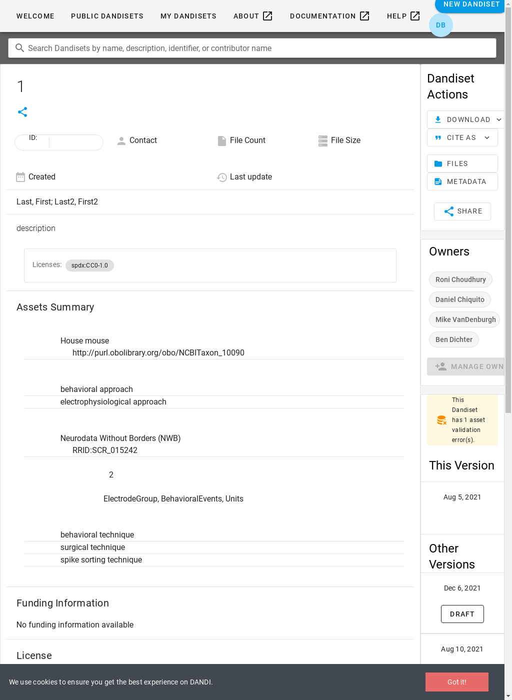 |  |  |

### 000002

| t=0.02 [Go to page](https://gui-staging.dandiarchive.org/#/dandiset/000002) | t=1.40 Edit Metadata | t=0.03 [Go to page](https://gui-staging.dandiarchive.org/#/dandiset/000002/draft/files) |
| --- | --- | --- |
| 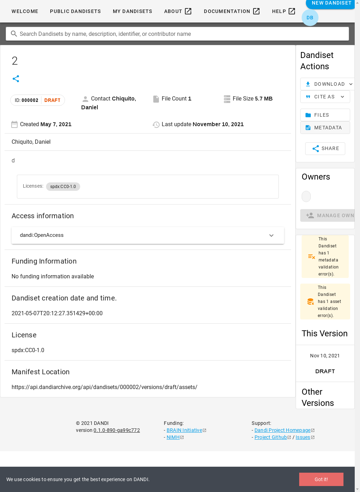 |  |  |

### 000003

| t=0.02 [Go to page](https://gui-staging.dandiarchive.org/#/dandiset/000003) | t=1.29 Edit Metadata | t=0.03 [Go to page](https://gui-staging.dandiarchive.org/#/dandiset/000003/draft/files) |
| --- | --- | --- |
| 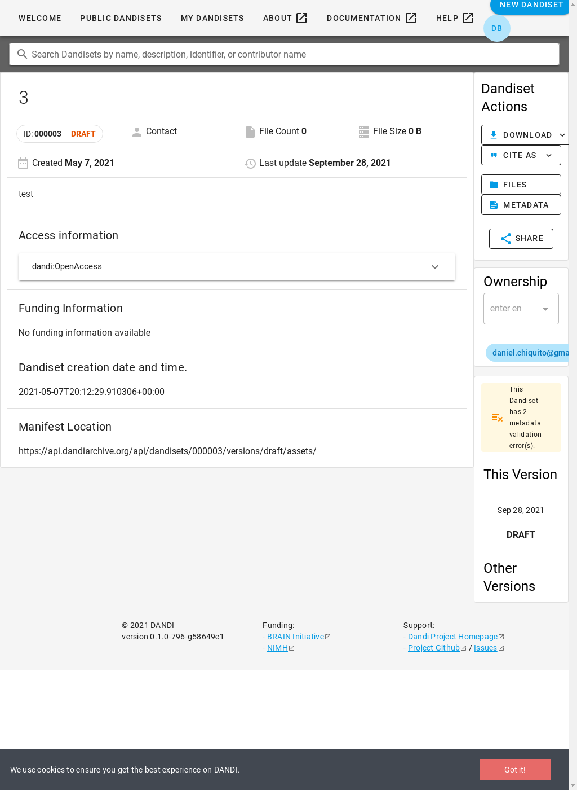 |  |  |

### 000004

| t=0.13 [Go to page](https://gui-staging.dandiarchive.org/#/dandiset/000004) | t=1.27 Edit Metadata | t=0.03 [Go to page](https://gui-staging.dandiarchive.org/#/dandiset/000004/draft/files) |
| --- | --- | --- |
| 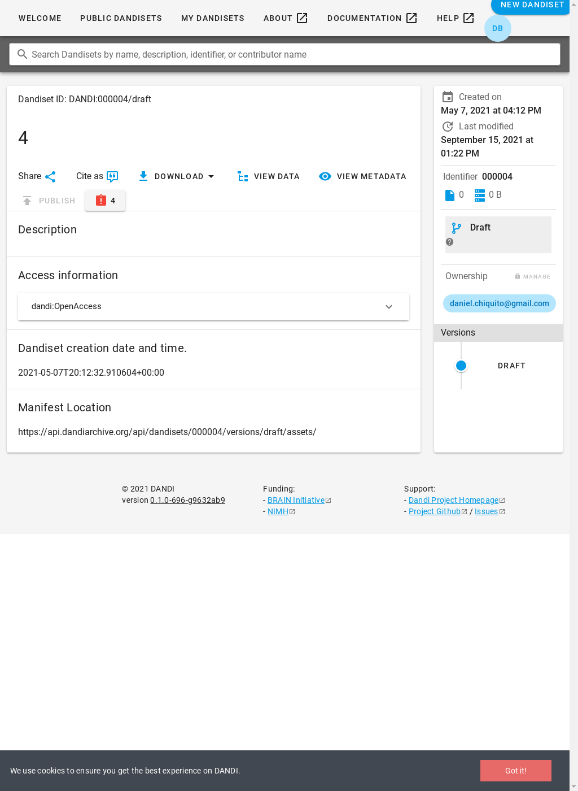 |  |  |

### 000005

| t=0.19 [Go to page](https://gui-staging.dandiarchive.org/#/dandiset/000005) | t=1.30 Edit Metadata | t=0.13 [Go to page](https://gui-staging.dandiarchive.org/#/dandiset/000005/draft/files) |
| --- | --- | --- |
| 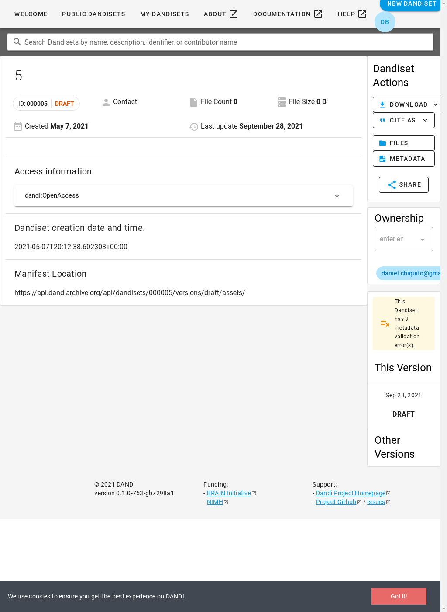 |  |  |

### 000006

| t=0.02 [Go to page](https://gui-staging.dandiarchive.org/#/dandiset/000006) | t=1.27 Edit Metadata | t=0.12 [Go to page](https://gui-staging.dandiarchive.org/#/dandiset/000006/draft/files) |
| --- | --- | --- |
| 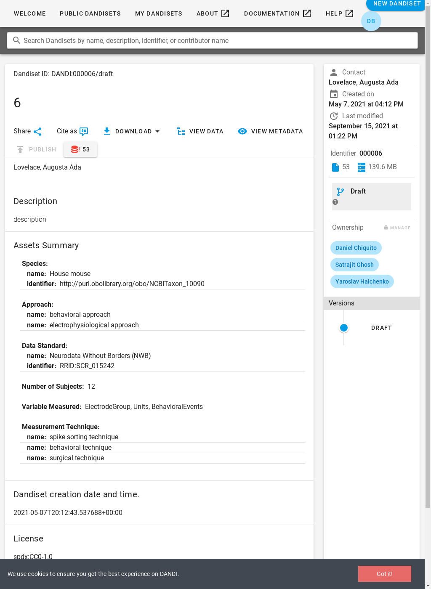 |  | 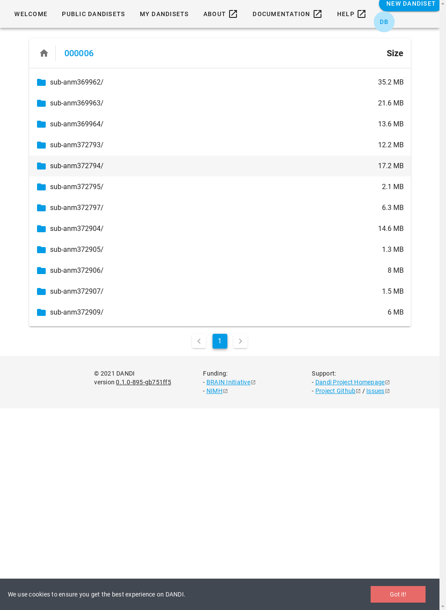 |

### 000007

| t=0.02 [Go to page](https://gui-staging.dandiarchive.org/#/dandiset/000007) | t=1.29 Edit Metadata | t=0.03 [Go to page](https://gui-staging.dandiarchive.org/#/dandiset/000007/draft/files) |
| --- | --- | --- |
| 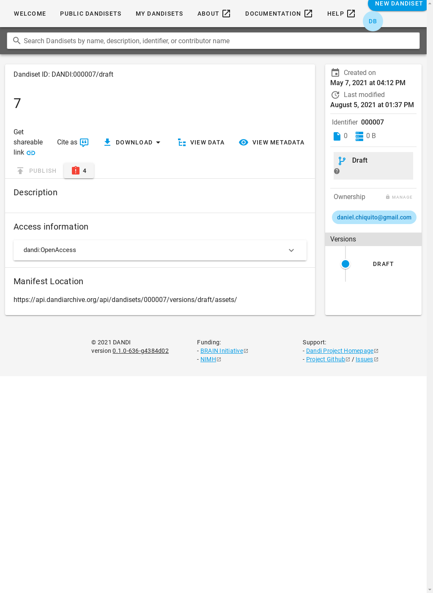 |  |  |

### 000008

| t=0.02 [Go to page](https://gui-staging.dandiarchive.org/#/dandiset/000008) | t=1.31 Edit Metadata | t=0.03 [Go to page](https://gui-staging.dandiarchive.org/#/dandiset/000008/draft/files) |
| --- | --- | --- |
| 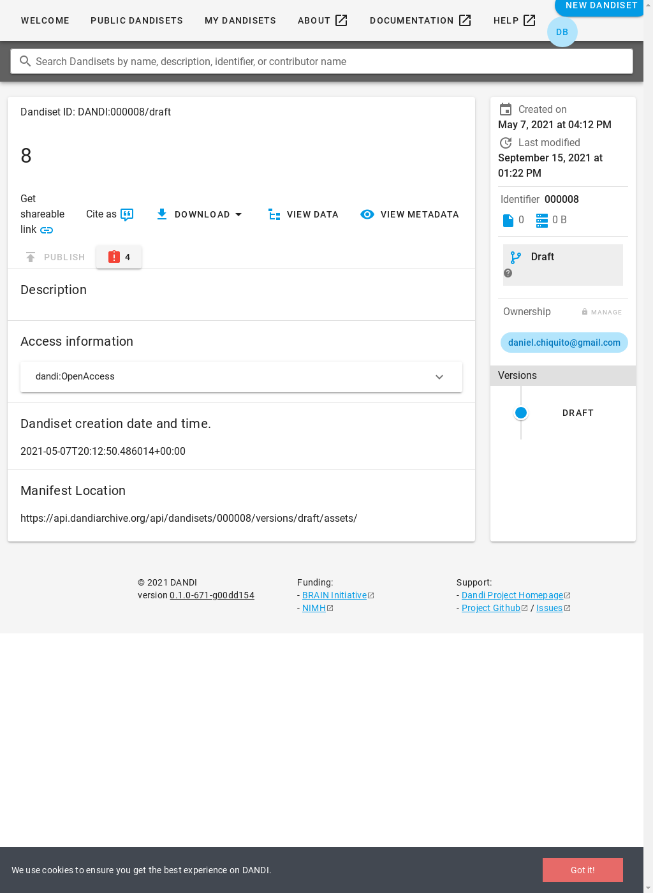 |  |  |

### 000009

| t=0.02 [Go to page](https://gui-staging.dandiarchive.org/#/dandiset/000009) | t=1.32 Edit Metadata | t=0.03 [Go to page](https://gui-staging.dandiarchive.org/#/dandiset/000009/draft/files) |
| --- | --- | --- |
| 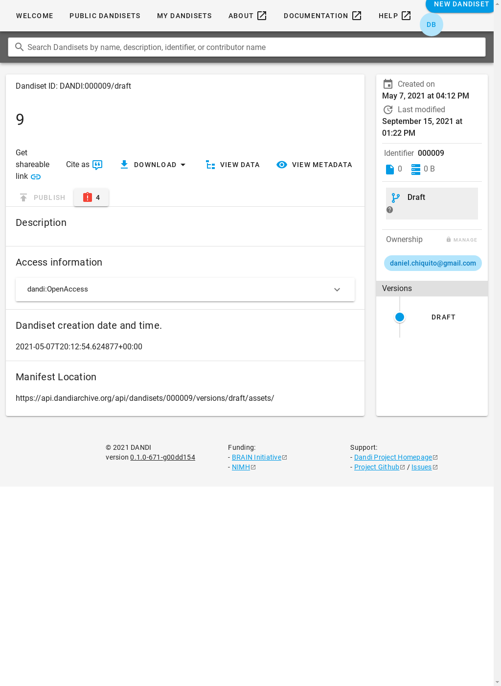 |  |  |

### 000010

| t=0.02 [Go to page](https://gui-staging.dandiarchive.org/#/dandiset/000010) | t=1.33 Edit Metadata | t=0.10 [Go to page](https://gui-staging.dandiarchive.org/#/dandiset/000010/draft/files) |
| --- | --- | --- |
| 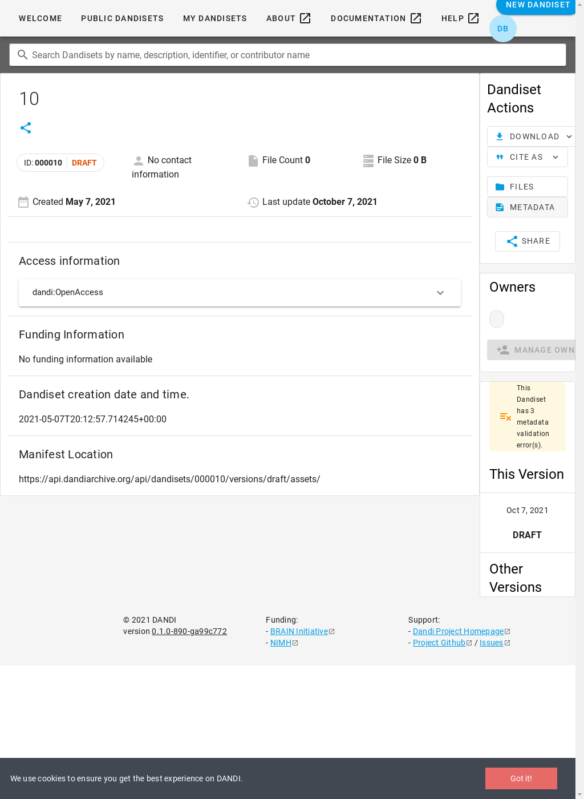 |  |  |

### 000011

| t=0.02 [Go to page](https://gui-staging.dandiarchive.org/#/dandiset/000011) | t=1.32 Edit Metadata | t=0.03 [Go to page](https://gui-staging.dandiarchive.org/#/dandiset/000011/draft/files) |
| --- | --- | --- |
| 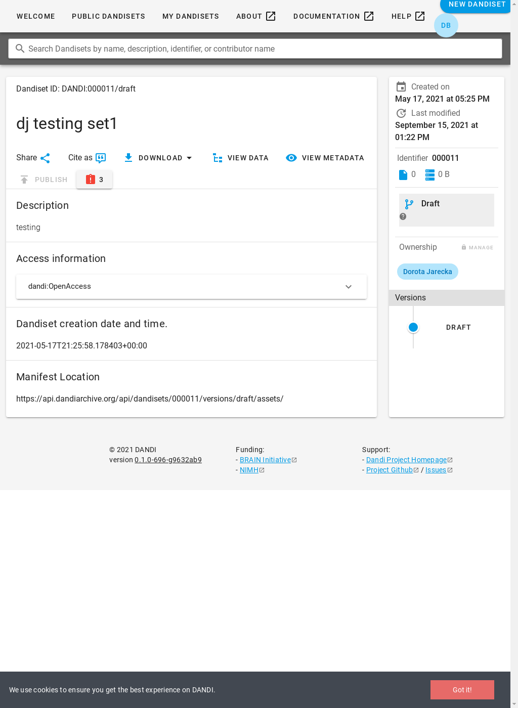 |  |  |

### 000012

| t=0.02 [Go to page](https://gui-staging.dandiarchive.org/#/dandiset/000012) | t=1.29 Edit Metadata | t=0.41 [Go to page](https://gui-staging.dandiarchive.org/#/dandiset/000012/draft/files) |
| --- | --- | --- |
| 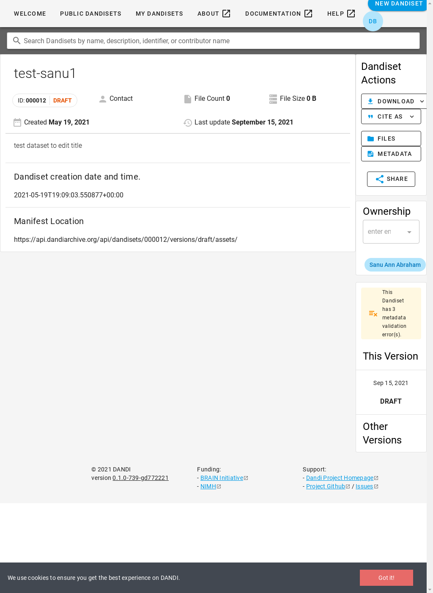 |  |  |

### 000013

| t=0.02 [Go to page](https://gui-staging.dandiarchive.org/#/dandiset/000013) | t=1.33 Edit Metadata | t=0.13 [Go to page](https://gui-staging.dandiarchive.org/#/dandiset/000013/draft/files) |
| --- | --- | --- |
| 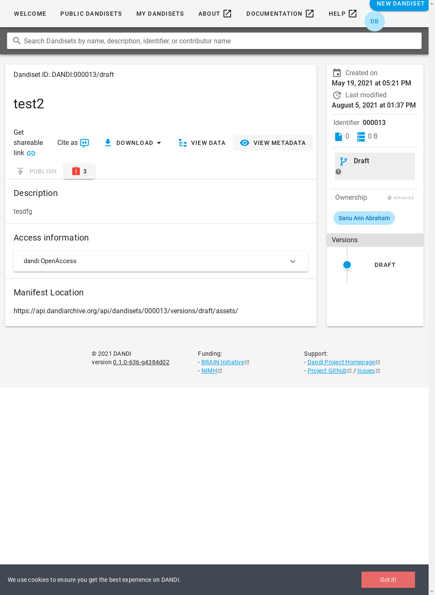 |  |  |

### 000014

| t=0.02 [Go to page](https://gui-staging.dandiarchive.org/#/dandiset/000014) | t=1.33 Edit Metadata | t=0.10 [Go to page](https://gui-staging.dandiarchive.org/#/dandiset/000014/draft/files) |
| --- | --- | --- |
| 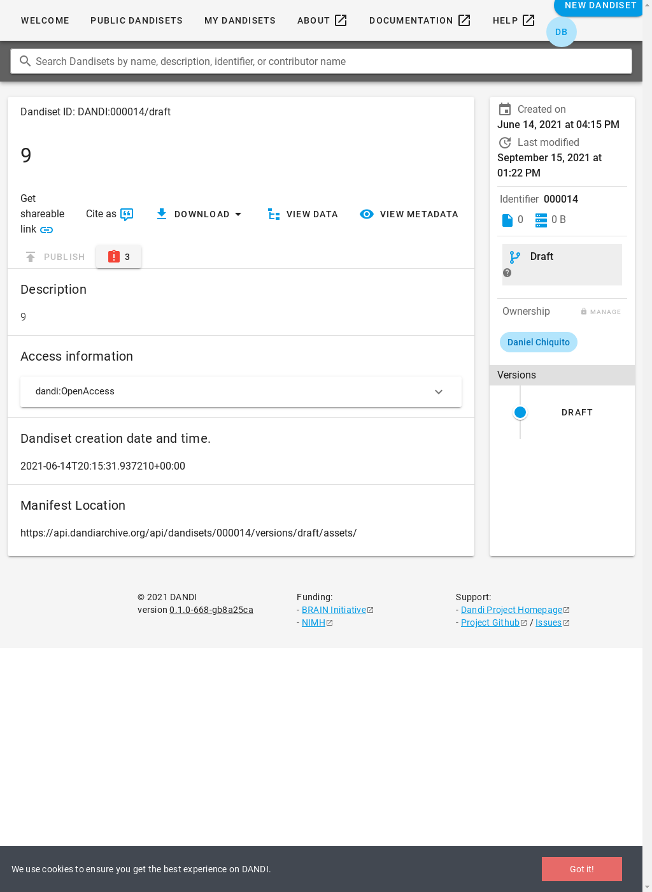 |  |  |

### 000015

| t=0.02 [Go to page](https://gui-staging.dandiarchive.org/#/dandiset/000015) | t=2.62 Edit Metadata | t=0.03 [Go to page](https://gui-staging.dandiarchive.org/#/dandiset/000015/draft/files) |
| --- | --- | --- |
| 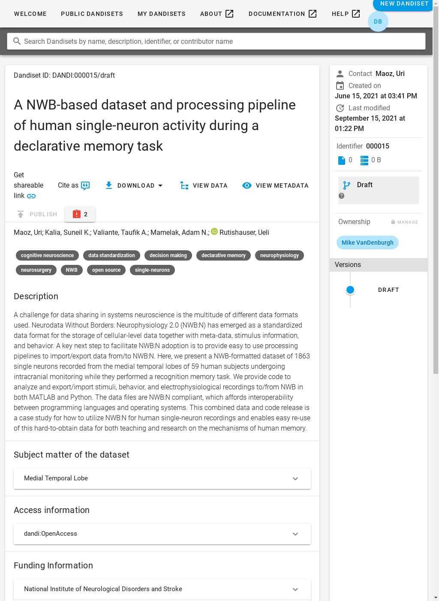 |  |  |

### 000016

| t=0.02 [Go to page](https://gui-staging.dandiarchive.org/#/dandiset/000016) | t=1.14 Edit Metadata | t=0.02 [Go to page](https://gui-staging.dandiarchive.org/#/dandiset/000016/draft/files) |
| --- | --- | --- |
| 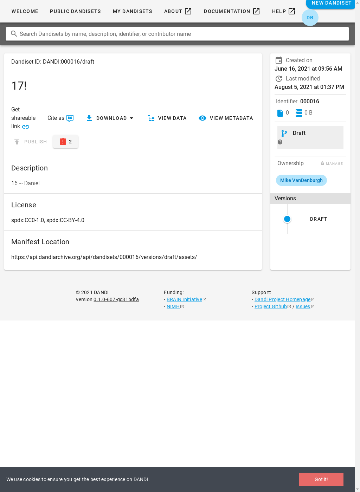 |  |  |

### 000017

| t=0.02 [Go to page](https://gui-staging.dandiarchive.org/#/dandiset/000017) | t=1.24 Edit Metadata | t=0.03 [Go to page](https://gui-staging.dandiarchive.org/#/dandiset/000017/draft/files) |
| --- | --- | --- |
| 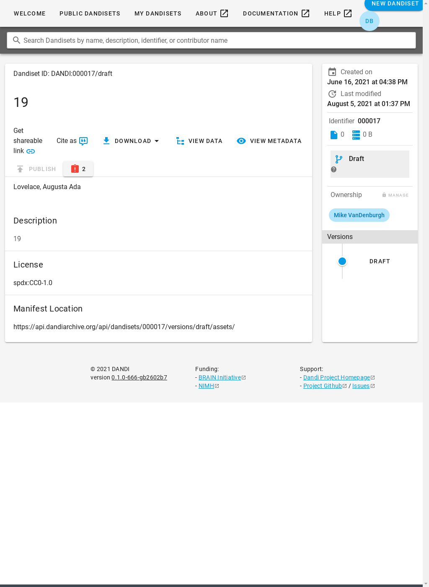 |  |  |

### 000018

| t=0.02 [Go to page](https://gui-staging.dandiarchive.org/#/dandiset/000018) | t=1.51 Edit Metadata | t=0.02 [Go to page](https://gui-staging.dandiarchive.org/#/dandiset/000018/draft/files) |
| --- | --- | --- |
|  |  | 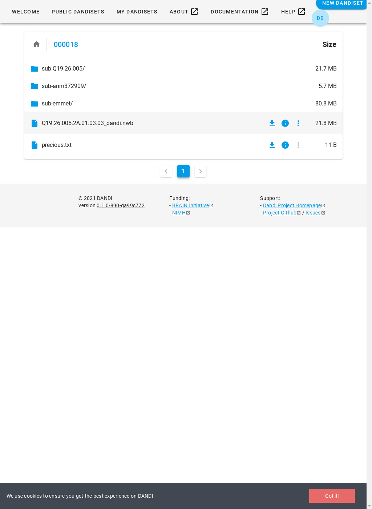 |

### 000019

| t=0.02 [Go to page](https://gui-staging.dandiarchive.org/#/dandiset/000019) | t=1.45 Edit Metadata | t=0.02 [Go to page](https://gui-staging.dandiarchive.org/#/dandiset/000019/draft/files) |
| --- | --- | --- |
| 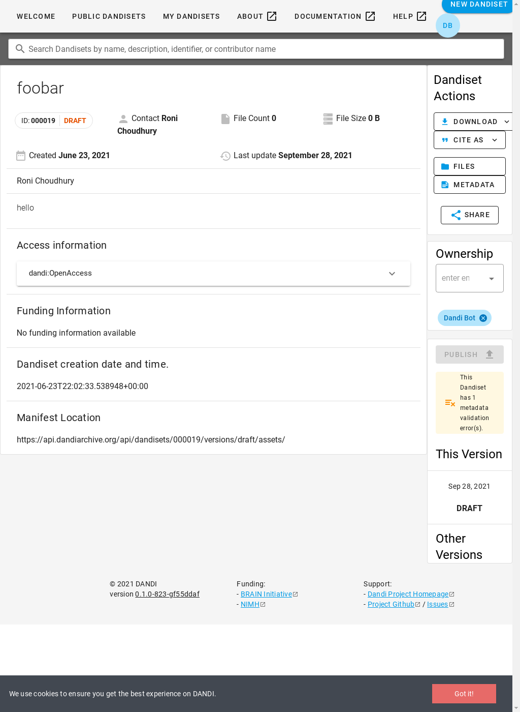 | 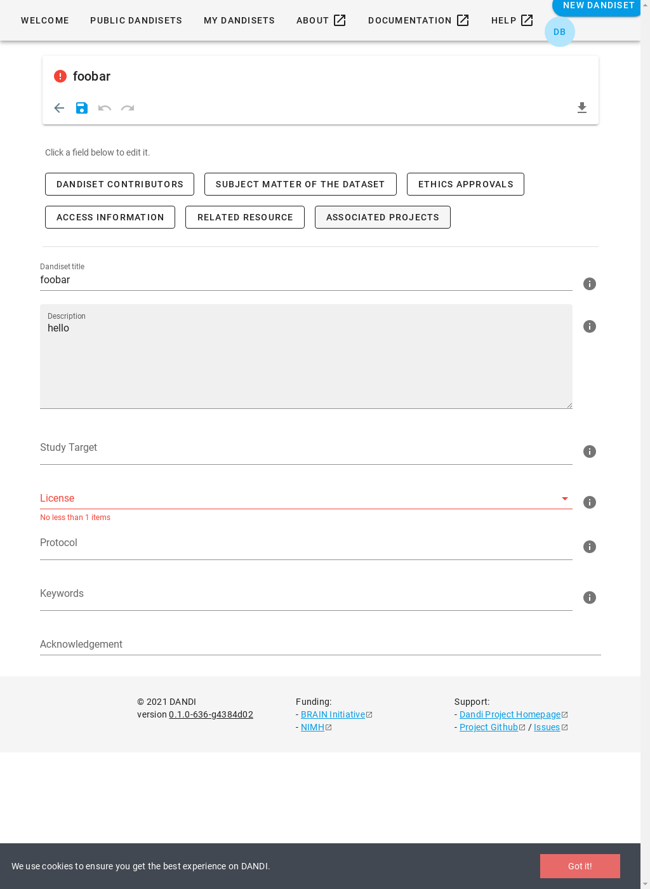 |  |

### 000020

| t=0.02 [Go to page](https://gui-staging.dandiarchive.org/#/dandiset/000020) | t=1.40 Edit Metadata | t=0.03 [Go to page](https://gui-staging.dandiarchive.org/#/dandiset/000020/draft/files) |
| --- | --- | --- |
| 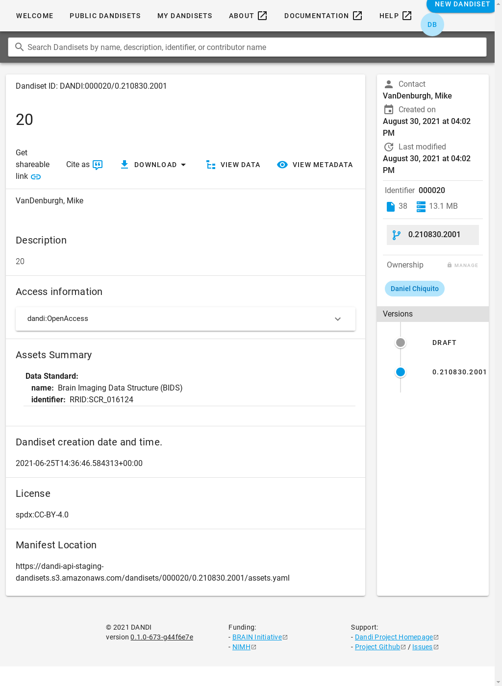 |  |  |

### 000021

| t=0.13 [Go to page](https://gui-staging.dandiarchive.org/#/dandiset/000021) | t=1.37 Edit Metadata | t=0.02 [Go to page](https://gui-staging.dandiarchive.org/#/dandiset/000021/draft/files) |
| --- | --- | --- |
| 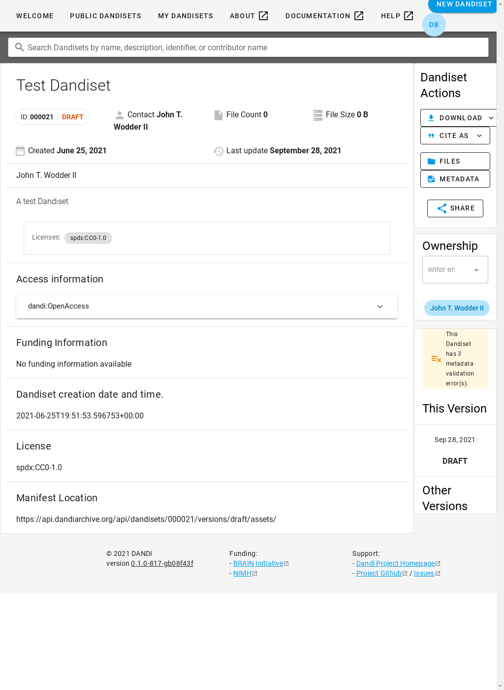 |  |  |

### 000022

| t=0.02 [Go to page](https://gui-staging.dandiarchive.org/#/dandiset/000022) | t=1.40 Edit Metadata | t=0.10 [Go to page](https://gui-staging.dandiarchive.org/#/dandiset/000022/draft/files) |
| --- | --- | --- |
| 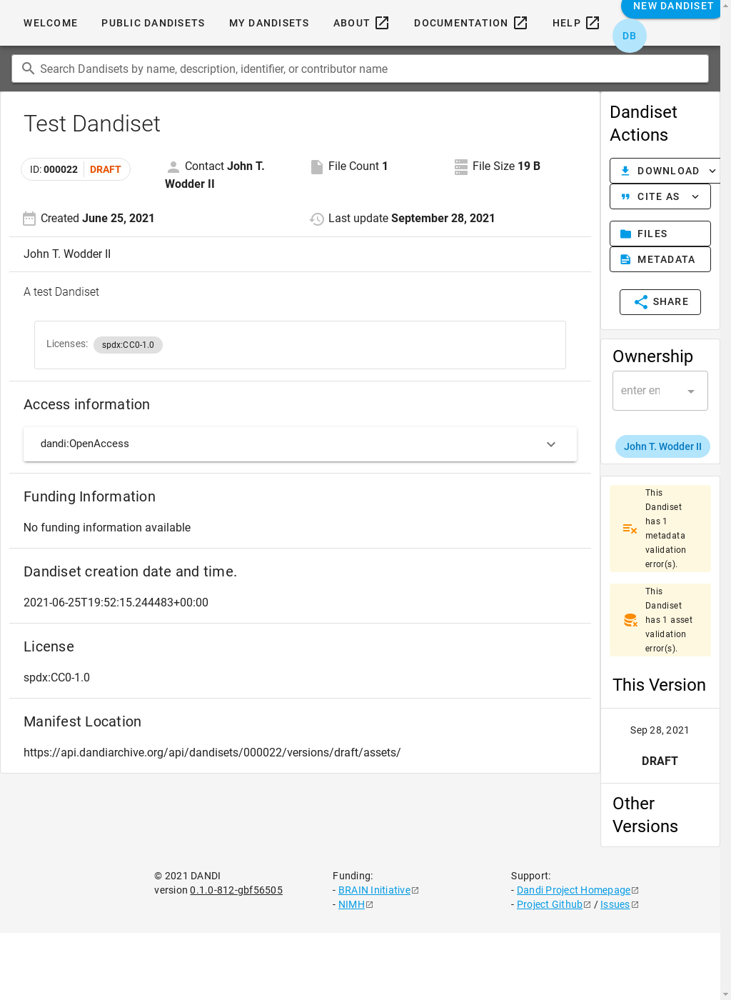 |  |  |

### 000023

| t=0.02 [Go to page](https://gui-staging.dandiarchive.org/#/dandiset/000023) | t=1.47 Edit Metadata | t=0.03 [Go to page](https://gui-staging.dandiarchive.org/#/dandiset/000023/draft/files) |
| --- | --- | --- |
| 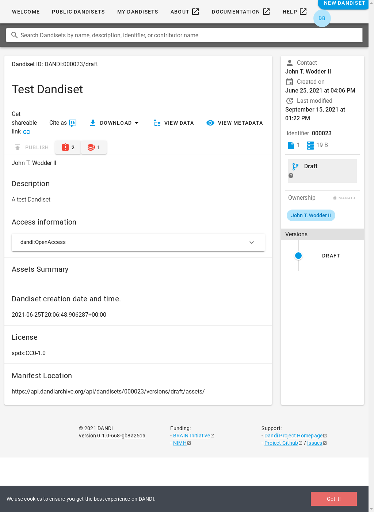 |  |  |

### 000024

| t=0.02 [Go to page](https://gui-staging.dandiarchive.org/#/dandiset/000024) | t=1.24 Edit Metadata | t=0.12 [Go to page](https://gui-staging.dandiarchive.org/#/dandiset/000024/draft/files) |
| --- | --- | --- |
|  |  |  |

### 000025

| t=0.20 [Go to page](https://gui-staging.dandiarchive.org/#/dandiset/000025) | t=1.40 Edit Metadata | t=0.14 [Go to page](https://gui-staging.dandiarchive.org/#/dandiset/000025/draft/files) |
| --- | --- | --- |
| 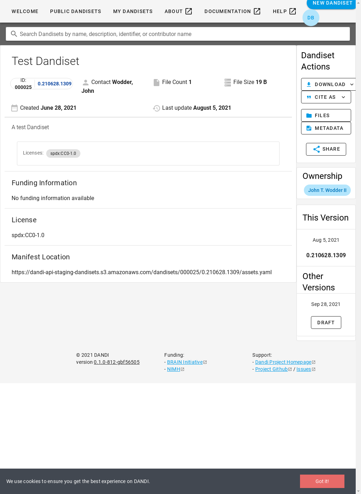 |  |  |

### 000026

| t=0.02 [Go to page](https://gui-staging.dandiarchive.org/#/dandiset/000026) | t=1.34 Edit Metadata | t=0.03 [Go to page](https://gui-staging.dandiarchive.org/#/dandiset/000026/draft/files) |
| --- | --- | --- |
| 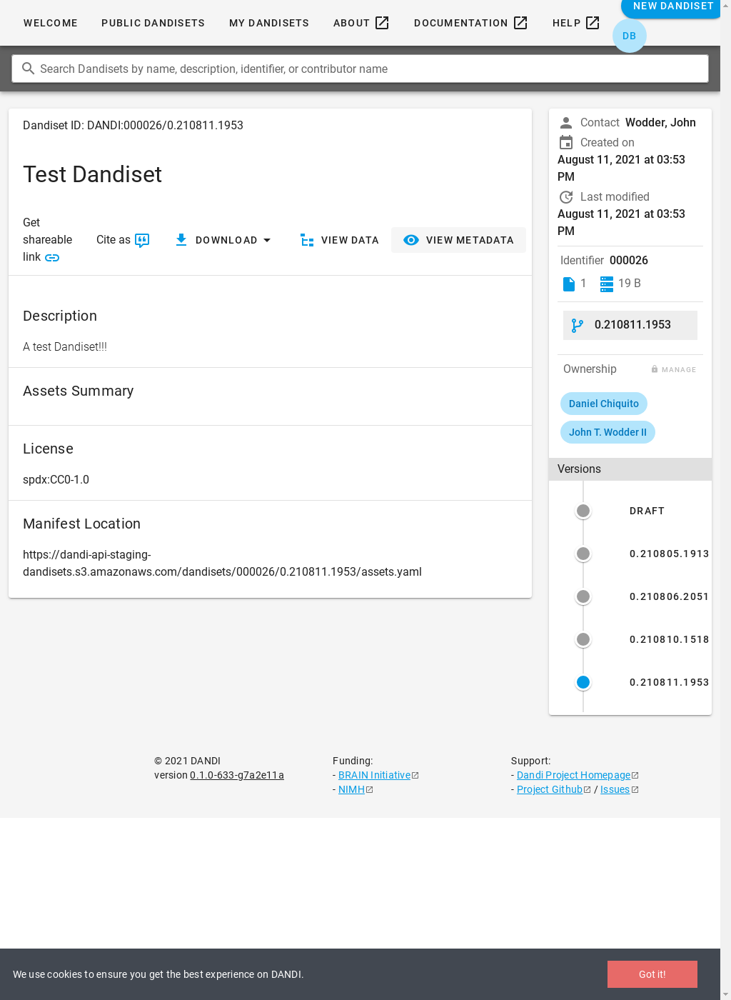 |  |  |

### 000027

| t=0.02 [Go to page](https://gui-staging.dandiarchive.org/#/dandiset/000027) | t=1.21 Edit Metadata | t=0.03 [Go to page](https://gui-staging.dandiarchive.org/#/dandiset/000027/draft/files) |
| --- | --- | --- |
|  | 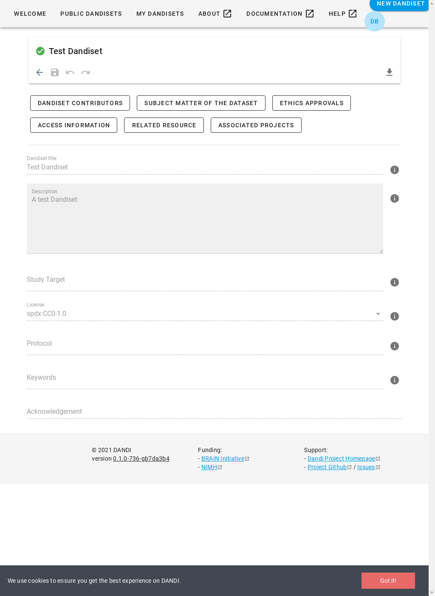 | 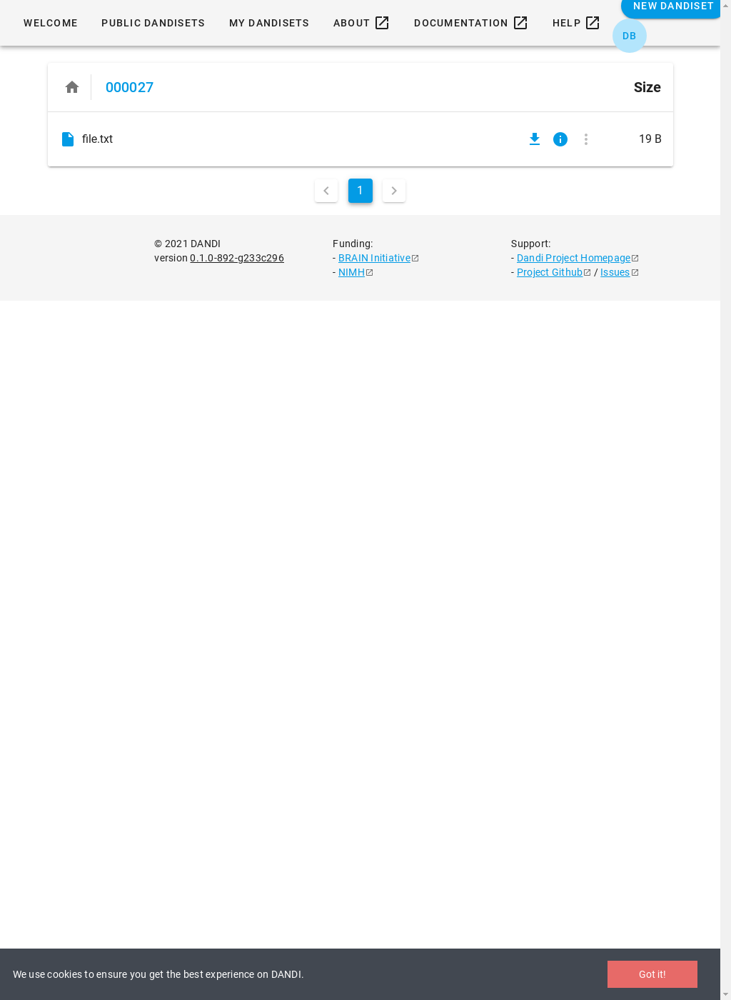 |

### 000028

| t=0.02 [Go to page](https://gui-staging.dandiarchive.org/#/dandiset/000028) | t=1.35 Edit Metadata | t=0.03 [Go to page](https://gui-staging.dandiarchive.org/#/dandiset/000028/draft/files) |
| --- | --- | --- |
|  |  |  |

### 000029

| t=0.12 [Go to page](https://gui-staging.dandiarchive.org/#/dandiset/000029) | t=1.27 Edit Metadata | t=0.12 [Go to page](https://gui-staging.dandiarchive.org/#/dandiset/000029/draft/files) |
| --- | --- | --- |
| 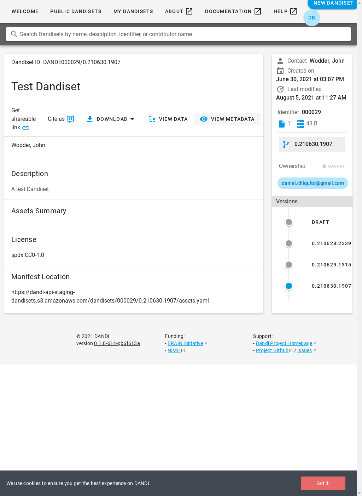 |  | 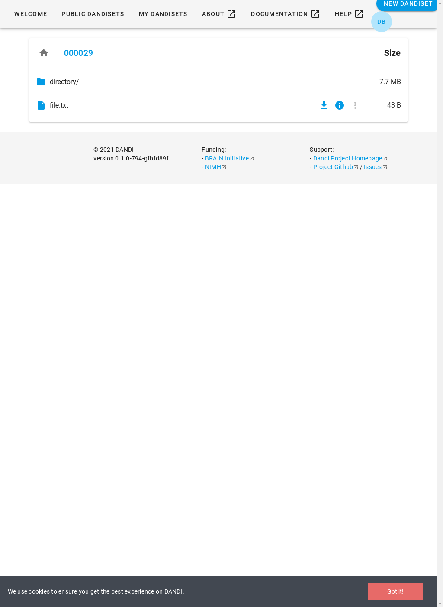 |

### 000030

| t=0.02 [Go to page](https://gui-staging.dandiarchive.org/#/dandiset/000030) | t=3.62 Edit Metadata | t=0.12 [Go to page](https://gui-staging.dandiarchive.org/#/dandiset/000030/draft/files) |
| --- | --- | --- |
|  | 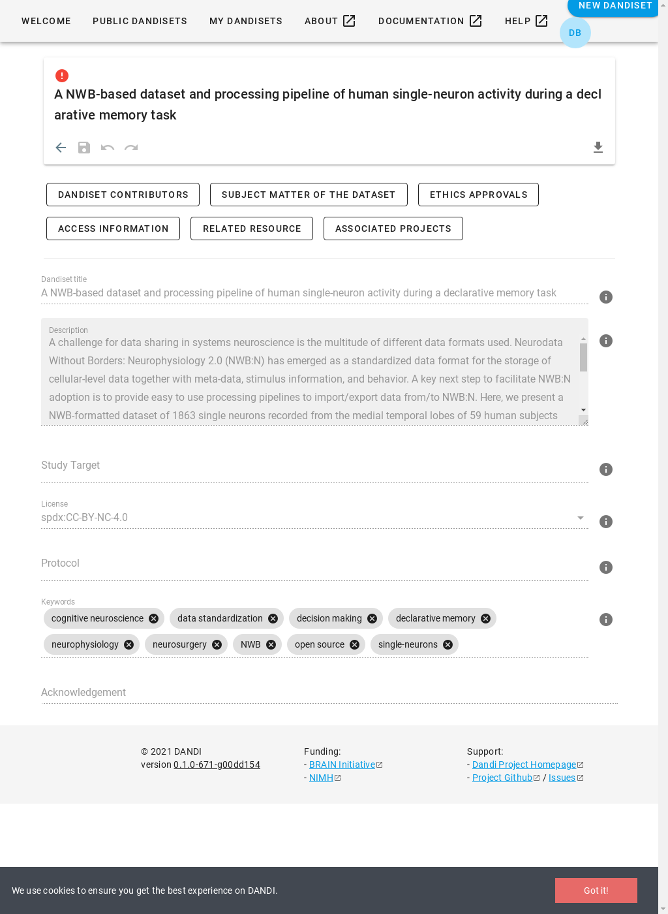 |  |

### 000031

| t=0.02 [Go to page](https://gui-staging.dandiarchive.org/#/dandiset/000031) | t=1.31 Edit Metadata | t=0.12 [Go to page](https://gui-staging.dandiarchive.org/#/dandiset/000031/draft/files) |
| --- | --- | --- |
| 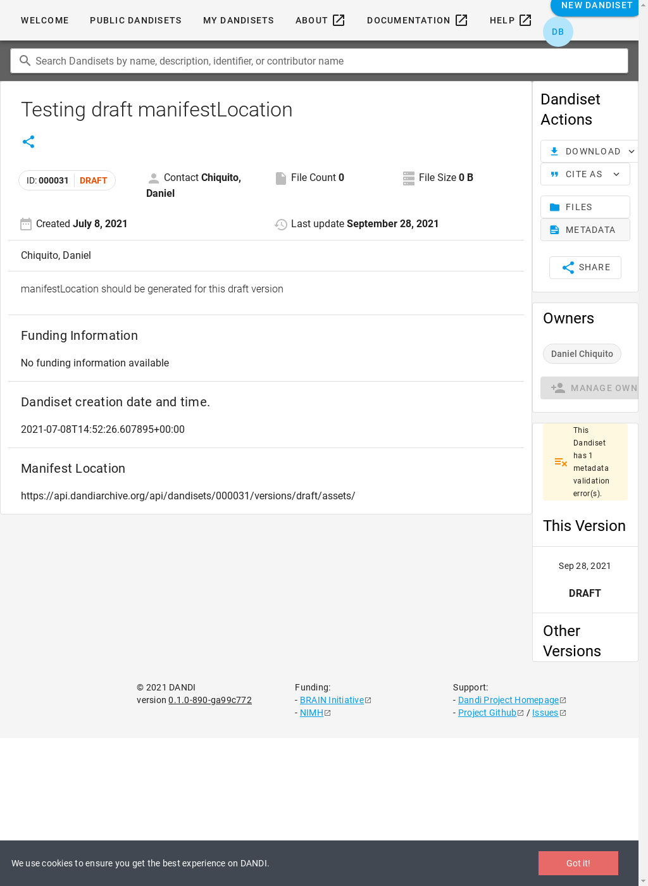 |  |  |

### 000032

| t=0.02 [Go to page](https://gui-staging.dandiarchive.org/#/dandiset/000032) | t=8.81 Edit Metadata | t=0.03 [Go to page](https://gui-staging.dandiarchive.org/#/dandiset/000032/draft/files) |
| --- | --- | --- |
|  |  |  |

### 000033

| t=0.02 [Go to page](https://gui-staging.dandiarchive.org/#/dandiset/000033) | t=1.37 Edit Metadata | t=0.02 [Go to page](https://gui-staging.dandiarchive.org/#/dandiset/000033/draft/files) |
| --- | --- | --- |
| 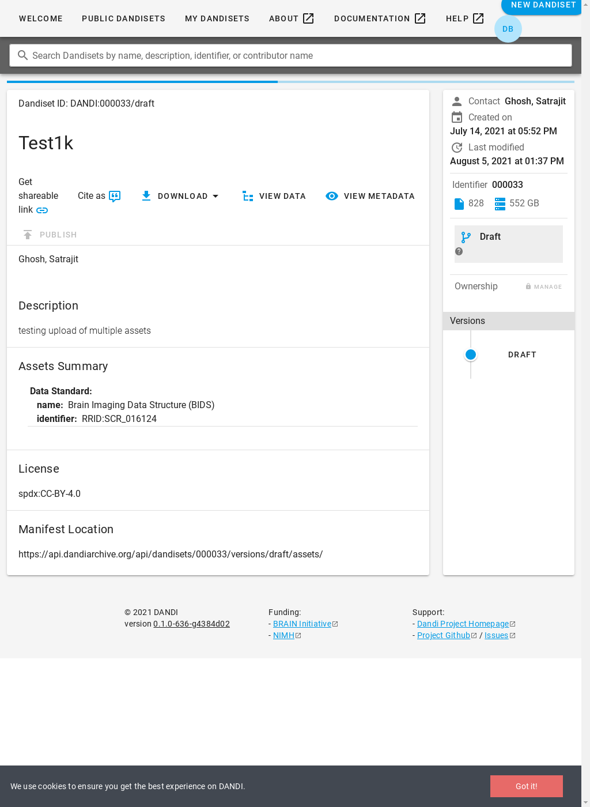 |  |  |

### 000035

| t=0.16 [Go to page](https://gui-staging.dandiarchive.org/#/dandiset/000035) | t=1.32 Edit Metadata | t=0.12 [Go to page](https://gui-staging.dandiarchive.org/#/dandiset/000035/draft/files) |
| --- | --- | --- |
| 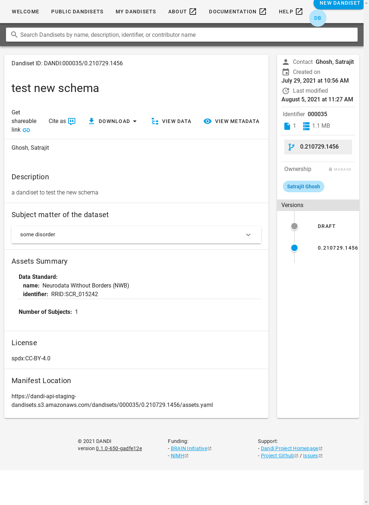 |  |  |

### 000036

| t=0.02 [Go to page](https://gui-staging.dandiarchive.org/#/dandiset/000036) | t=1.31 Edit Metadata | t=0.12 [Go to page](https://gui-staging.dandiarchive.org/#/dandiset/000036/draft/files) |
| --- | --- | --- |
| 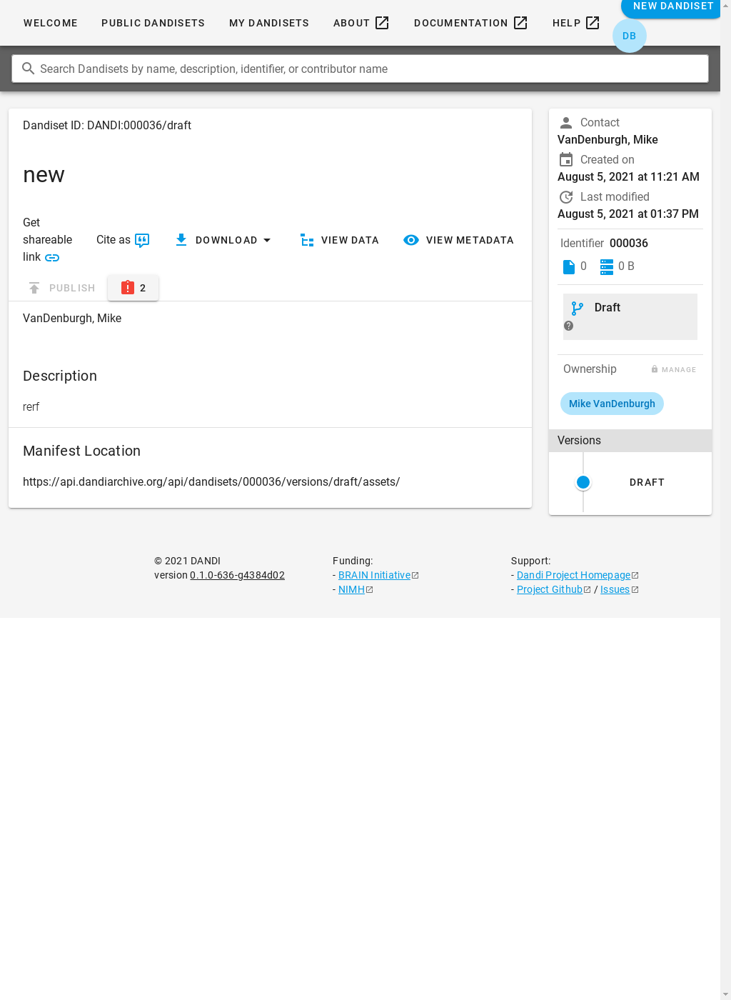 |  |  |

### 000037

| t=0.02 [Go to page](https://gui-staging.dandiarchive.org/#/dandiset/000037) | t=1.24 Edit Metadata | t=0.03 [Go to page](https://gui-staging.dandiarchive.org/#/dandiset/000037/draft/files) |
| --- | --- | --- |
| 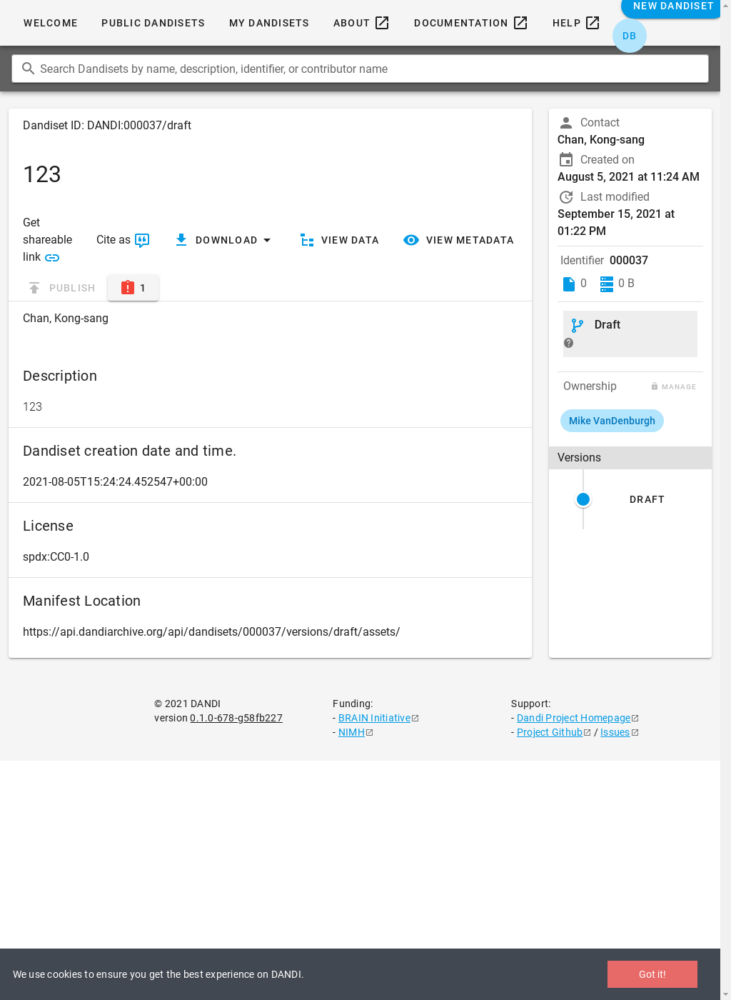 |  |  |

### 000170

| t=0.15 [Go to page](https://gui-staging.dandiarchive.org/#/dandiset/000170) | t=1.40 Edit Metadata | t=0.43 [Go to page](https://gui-staging.dandiarchive.org/#/dandiset/000170/draft/files) |
| --- | --- | --- |
| 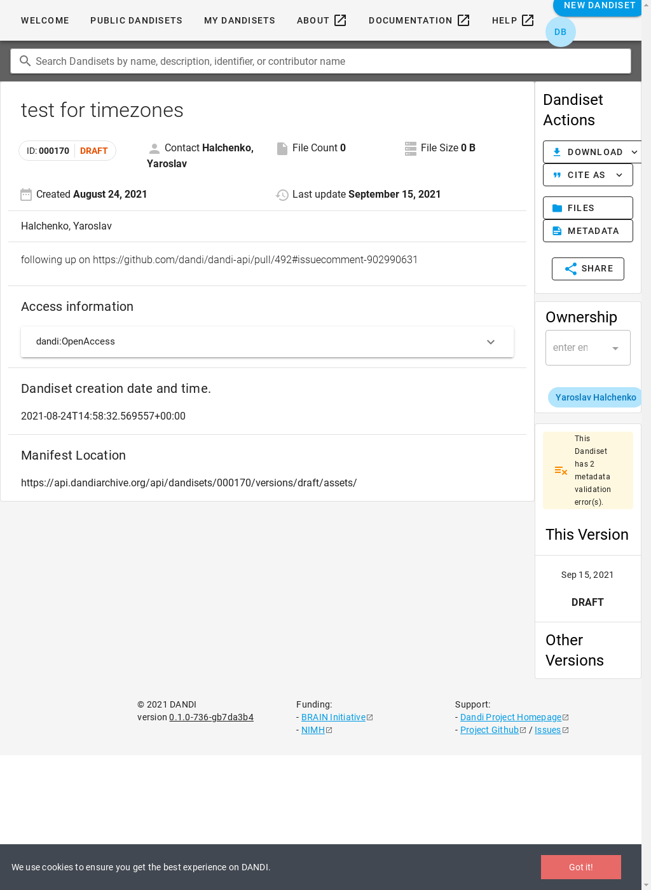 |  |  |

### 000211

| t=0.12 [Go to page](https://gui-staging.dandiarchive.org/#/dandiset/000211) | t=1.37 Edit Metadata | t=0.12 [Go to page](https://gui-staging.dandiarchive.org/#/dandiset/000211/draft/files) |
| --- | --- | --- |
| 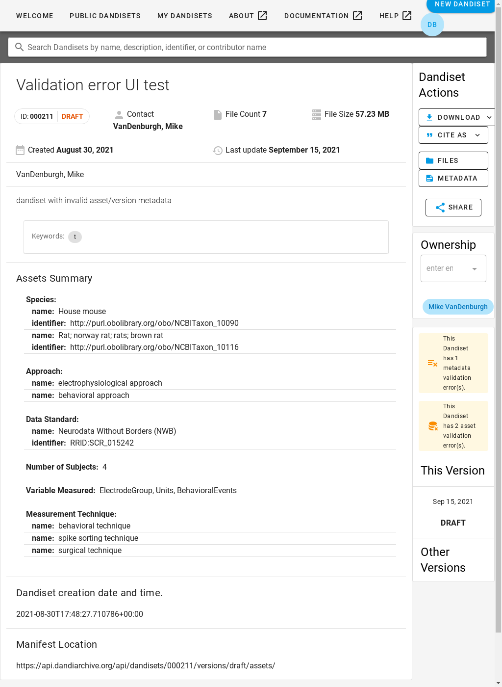 |  | 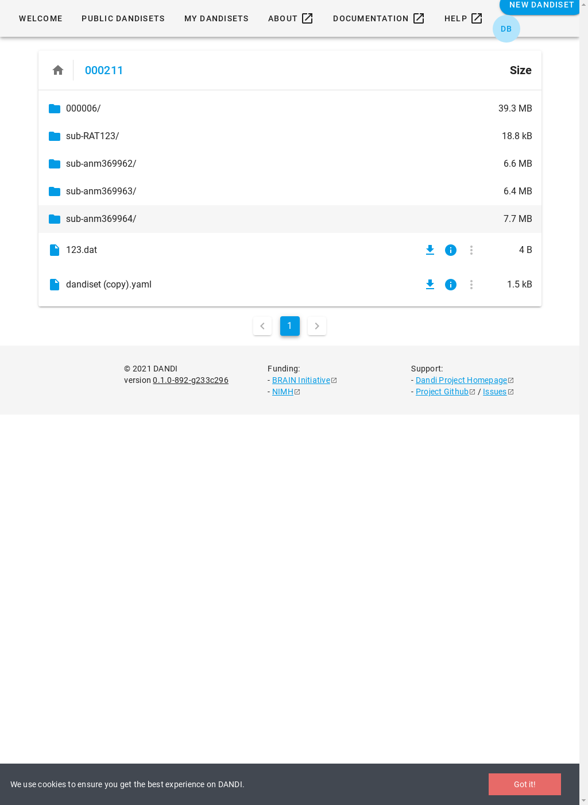 |

### 000212

| t=0.02 [Go to page](https://gui-staging.dandiarchive.org/#/dandiset/000212) | t=1.29 Edit Metadata | t=0.12 [Go to page](https://gui-staging.dandiarchive.org/#/dandiset/000212/draft/files) |
| --- | --- | --- |
| 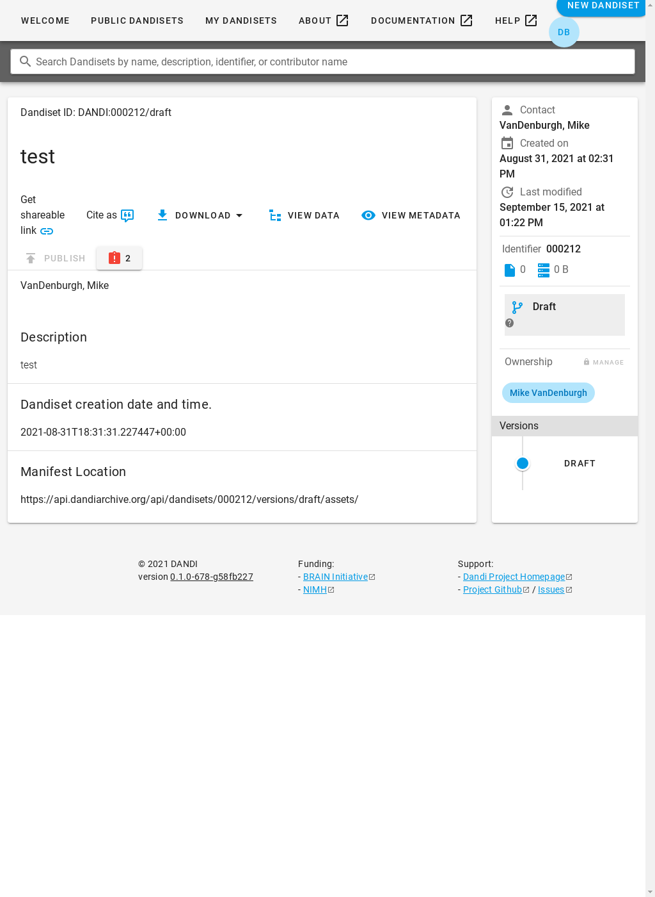 |  |  |

