| Page | Min Time | Mean ± StdDev | Max Time | Errors |
| --- | --- | --- | --- | --- |
| landing | — | — | — | [000001](#000001), [000002](#000002), [000003](#000003), [000004](#000004), [000005](#000005), [000006](#000006), [000007](#000007), [000008](#000008), [000009](#000009), [000010](#000010), [000011](#000011), [000012](#000012), [000013](#000013), [000014](#000014), [000015](#000015), [000016](#000016), [000017](#000017), [000018](#000018), [000019](#000019), [000020](#000020), [000021](#000021), [000022](#000022), [000023](#000023), [000024](#000024), [000025](#000025), [000026](#000026), [000027](#000027), [000028](#000028), [000029](#000029), [000030](#000030), [000031](#000031), [000032](#000032), [000033](#000033), [000035](#000035), [000036](#000036), [000037](#000037), [000170](#000170), [000211](#000211), [000212](#000212), [000221](#000221), [000222](#000222), [100238](#100238), [100239](#100239), [100268](#100268), [100273](#100273), [100274](#100274), [100275](#100275), [100276](#100276), [100277](#100277), [100278](#100278), [100279](#100279), [100280](#100280), [100285](#100285), [100338](#100338), [100354](#100354), [100358](#100358), [100362](#100362), [100389](#100389), [100455](#100455), [100463](#100463), [100464](#100464), [100467](#100467), [100507](#100507), [100576](#100576), [100604](#100604), [100605](#100605), [100653](#100653), [100676](#100676), [100731](#100731), [100760](#100760), [100773](#100773), [100774](#100774), [100775](#100775), [100776](#100776), [100777](#100777), [100778](#100778), [100779](#100779), [100780](#100780), [100781](#100781), [100782](#100782), [100783](#100783), [100784](#100784), [100785](#100785), [100786](#100786), [100787](#100787), [100788](#100788), [100789](#100789), [100790](#100790), [100791](#100791), [100792](#100792), [100793](#100793), [100794](#100794), [100795](#100795), [100796](#100796), [100830](#100830), [100851](#100851), [200003](#200003), [200004](#200004), [200005](#200005), [200006](#200006), [200007](#200007), [200008](#200008), [200009](#200009), [200010](#200010), [200011](#200011), [200012](#200012), [200013](#200013), [200015](#200015), [200016](#200016), [200017](#200017), [200018](#200018), [200019](#200019), [200020](#200020), [200021](#200021), [200022](#200022), [200023](#200023), [200024](#200024), [200025](#200025), [200026](#200026), [200027](#200027), [200028](#200028), [200029](#200029), [200030](#200030), [200031](#200031), [200032](#200032), [200033](#200033), [200034](#200034), [200035](#200035), [200036](#200036), [200037](#200037), [200038](#200038), [200039](#200039), [200040](#200040), [200041](#200041), [200042](#200042), [200043](#200043), [200044](#200044), [200045](#200045), [200046](#200046), [200047](#200047), [200048](#200048), [200049](#200049), [200050](#200050), [200051](#200051), [200052](#200052), [200053](#200053), [200054](#200054), [200055](#200055), [200056](#200056), [200057](#200057), [200058](#200058), [200059](#200059), [200060](#200060), [200061](#200061), [200063](#200063), [200064](#200064), [200065](#200065), [200066](#200066), [200067](#200067), [200068](#200068), [200069](#200069), [200070](#200070), [200071](#200071), [200072](#200072), [200105](#200105), [200106](#200106), [200107](#200107), [200108](#200108), [200109](#200109), [200110](#200110), [200111](#200111), [200112](#200112), [200113](#200113), [200114](#200114), [200115](#200115), [200116](#200116), [200117](#200117), [200118](#200118), [200119](#200119), [200120](#200120), [200121](#200121), [200122](#200122), [200123](#200123), [200124](#200124), [200125](#200125), [200126](#200126), [200127](#200127), [200128](#200128), [200129](#200129), [200130](#200130), [200131](#200131), [200132](#200132), [200133](#200133), [200134](#200134), [200135](#200135), [200136](#200136), [200137](#200137), [200138](#200138), [200139](#200139), [200140](#200140), [200141](#200141) |
| edit-metadata | — | — | — | [000001](#000001), [000002](#000002), [000003](#000003), [000004](#000004), [000005](#000005), [000006](#000006), [000007](#000007), [000008](#000008), [000009](#000009), [000010](#000010), [000011](#000011), [000012](#000012), [000013](#000013), [000014](#000014), [000015](#000015), [000016](#000016), [000017](#000017), [000018](#000018), [000019](#000019), [000020](#000020), [000021](#000021), [000022](#000022), [000023](#000023), [000024](#000024), [000025](#000025), [000026](#000026), [000027](#000027), [000028](#000028), [000029](#000029), [000030](#000030), [000031](#000031), [000032](#000032), [000033](#000033), [000035](#000035), [000036](#000036), [000037](#000037), [000170](#000170), [000211](#000211), [000212](#000212), [000221](#000221), [000222](#000222), [100238](#100238), [100239](#100239), [100268](#100268), [100273](#100273), [100274](#100274), [100275](#100275), [100276](#100276), [100277](#100277), [100278](#100278), [100279](#100279), [100280](#100280), [100285](#100285), [100338](#100338), [100354](#100354), [100358](#100358), [100362](#100362), [100389](#100389), [100455](#100455), [100463](#100463), [100464](#100464), [100467](#100467), [100507](#100507), [100576](#100576), [100604](#100604), [100605](#100605), [100653](#100653), [100676](#100676), [100731](#100731), [100760](#100760), [100773](#100773), [100774](#100774), [100775](#100775), [100776](#100776), [100777](#100777), [100778](#100778), [100779](#100779), [100780](#100780), [100781](#100781), [100782](#100782), [100783](#100783), [100784](#100784), [100785](#100785), [100786](#100786), [100787](#100787), [100788](#100788), [100789](#100789), [100790](#100790), [100791](#100791), [100792](#100792), [100793](#100793), [100794](#100794), [100795](#100795), [100796](#100796), [100830](#100830), [100851](#100851), [200003](#200003), [200004](#200004), [200005](#200005), [200006](#200006), [200007](#200007), [200008](#200008), [200009](#200009), [200010](#200010), [200011](#200011), [200012](#200012), [200013](#200013), [200015](#200015), [200016](#200016), [200017](#200017), [200018](#200018), [200019](#200019), [200020](#200020), [200021](#200021), [200022](#200022), [200023](#200023), [200024](#200024), [200025](#200025), [200026](#200026), [200027](#200027), [200028](#200028), [200029](#200029), [200030](#200030), [200031](#200031), [200032](#200032), [200033](#200033), [200034](#200034), [200035](#200035), [200036](#200036), [200037](#200037), [200038](#200038), [200039](#200039), [200040](#200040), [200041](#200041), [200042](#200042), [200043](#200043), [200044](#200044), [200045](#200045), [200046](#200046), [200047](#200047), [200048](#200048), [200049](#200049), [200050](#200050), [200051](#200051), [200052](#200052), [200053](#200053), [200054](#200054), [200055](#200055), [200056](#200056), [200057](#200057), [200058](#200058), [200059](#200059), [200060](#200060), [200061](#200061), [200063](#200063), [200064](#200064), [200065](#200065), [200066](#200066), [200067](#200067), [200068](#200068), [200069](#200069), [200070](#200070), [200071](#200071), [200072](#200072), [200105](#200105), [200106](#200106), [200107](#200107), [200108](#200108), [200109](#200109), [200110](#200110), [200111](#200111), [200112](#200112), [200113](#200113), [200114](#200114), [200115](#200115), [200116](#200116), [200117](#200117), [200118](#200118), [200119](#200119), [200120](#200120), [200121](#200121), [200122](#200122), [200123](#200123), [200124](#200124), [200125](#200125), [200126](#200126), [200127](#200127), [200128](#200128), [200129](#200129), [200130](#200130), [200131](#200131), [200132](#200132), [200133](#200133), [200134](#200134), [200135](#200135), [200136](#200136), [200137](#200137), [200138](#200138), [200139](#200139), [200140](#200140), [200141](#200141) |
| view-data | — | — | — | [000001](#000001), [000002](#000002), [000003](#000003), [000004](#000004), [000005](#000005), [000006](#000006), [000007](#000007), [000008](#000008), [000009](#000009), [000010](#000010), [000011](#000011), [000012](#000012), [000013](#000013), [000014](#000014), [000015](#000015), [000016](#000016), [000017](#000017), [000018](#000018), [000019](#000019), [000020](#000020), [000021](#000021), [000022](#000022), [000023](#000023), [000024](#000024), [000025](#000025), [000026](#000026), [000027](#000027), [000028](#000028), [000029](#000029), [000030](#000030), [000031](#000031), [000032](#000032), [000033](#000033), [000035](#000035), [000036](#000036), [000037](#000037), [000170](#000170), [000211](#000211), [000212](#000212), [000221](#000221), [000222](#000222), [100238](#100238), [100239](#100239), [100268](#100268), [100273](#100273), [100274](#100274), [100275](#100275), [100276](#100276), [100277](#100277), [100278](#100278), [100279](#100279), [100280](#100280), [100285](#100285), [100338](#100338), [100354](#100354), [100358](#100358), [100362](#100362), [100389](#100389), [100455](#100455), [100463](#100463), [100464](#100464), [100467](#100467), [100507](#100507), [100576](#100576), [100604](#100604), [100605](#100605), [100653](#100653), [100676](#100676), [100731](#100731), [100760](#100760), [100773](#100773), [100774](#100774), [100775](#100775), [100776](#100776), [100777](#100777), [100778](#100778), [100779](#100779), [100780](#100780), [100781](#100781), [100782](#100782), [100783](#100783), [100784](#100784), [100785](#100785), [100786](#100786), [100787](#100787), [100788](#100788), [100789](#100789), [100790](#100790), [100791](#100791), [100792](#100792), [100793](#100793), [100794](#100794), [100795](#100795), [100796](#100796), [100830](#100830), [100851](#100851), [200003](#200003), [200004](#200004), [200005](#200005), [200006](#200006), [200007](#200007), [200008](#200008), [200009](#200009), [200010](#200010), [200011](#200011), [200012](#200012), [200013](#200013), [200015](#200015), [200016](#200016), [200017](#200017), [200018](#200018), [200019](#200019), [200020](#200020), [200021](#200021), [200022](#200022), [200023](#200023), [200024](#200024), [200025](#200025), [200026](#200026), [200027](#200027), [200028](#200028), [200029](#200029), [200030](#200030), [200031](#200031), [200032](#200032), [200033](#200033), [200034](#200034), [200035](#200035), [200036](#200036), [200037](#200037), [200038](#200038), [200039](#200039), [200040](#200040), [200041](#200041), [200042](#200042), [200043](#200043), [200044](#200044), [200045](#200045), [200046](#200046), [200047](#200047), [200048](#200048), [200049](#200049), [200050](#200050), [200051](#200051), [200052](#200052), [200053](#200053), [200054](#200054), [200055](#200055), [200056](#200056), [200057](#200057), [200058](#200058), [200059](#200059), [200060](#200060), [200061](#200061), [200063](#200063), [200064](#200064), [200065](#200065), [200066](#200066), [200067](#200067), [200068](#200068), [200069](#200069), [200070](#200070), [200071](#200071), [200072](#200072), [200105](#200105), [200106](#200106), [200107](#200107), [200108](#200108), [200109](#200109), [200110](#200110), [200111](#200111), [200112](#200112), [200113](#200113), [200114](#200114), [200115](#200115), [200116](#200116), [200117](#200117), [200118](#200118), [200119](#200119), [200120](#200120), [200121](#200121), [200122](#200122), [200123](#200123), [200124](#200124), [200125](#200125), [200126](#200126), [200127](#200127), [200128](#200128), [200129](#200129), [200130](#200130), [200131](#200131), [200132](#200132), [200133](#200133), [200134](#200134), [200135](#200135), [200136](#200136), [200137](#200137), [200138](#200138), [200139](#200139), [200140](#200140), [200141](#200141) |

### 000001

| t=[See below] [Go to page](https://gui-staging.dandiarchive.org/#/dandiset/000001) | t=[See below] Edit Metadata | t=[See below] [Go to page](https://gui-staging.dandiarchive.org/#/dandiset/000001/draft/files) |
| --- | --- | --- |
|  |  |  |

#### Error Messages
<pre>Message: unknown error: Chrome failed to start: exited abnormally
  (unknown error: DevToolsActivePort file doesn't exist)
  (The process started from chrome location /usr/bin/chromium is no longer running, so ChromeDriver is assuming that Chrome has crashed.)
  (Driver info: chromedriver=73.0.3683.75,platform=Linux 4.19.0-0.bpo.9-amd64 x86_64)</pre>
<pre>Message: unknown error: Chrome failed to start: exited abnormally
  (unknown error: DevToolsActivePort file doesn't exist)
  (The process started from chrome location /usr/bin/chromium is no longer running, so ChromeDriver is assuming that Chrome has crashed.)
  (Driver info: chromedriver=73.0.3683.75,platform=Linux 4.19.0-0.bpo.9-amd64 x86_64)</pre>
<pre>Message: unknown error: Chrome failed to start: exited abnormally
  (unknown error: DevToolsActivePort file doesn't exist)
  (The process started from chrome location /usr/bin/chromium is no longer running, so ChromeDriver is assuming that Chrome has crashed.)
  (Driver info: chromedriver=73.0.3683.75,platform=Linux 4.19.0-0.bpo.9-amd64 x86_64)</pre>
### 000002

| t=[See below] [Go to page](https://gui-staging.dandiarchive.org/#/dandiset/000002) | t=[See below] Edit Metadata | t=[See below] [Go to page](https://gui-staging.dandiarchive.org/#/dandiset/000002/draft/files) |
| --- | --- | --- |
|  |  |  |

#### Error Messages
<pre>Message: unknown error: Chrome failed to start: exited abnormally
  (unknown error: DevToolsActivePort file doesn't exist)
  (The process started from chrome location /usr/bin/chromium is no longer running, so ChromeDriver is assuming that Chrome has crashed.)
  (Driver info: chromedriver=73.0.3683.75,platform=Linux 4.19.0-0.bpo.9-amd64 x86_64)</pre>
<pre>Message: unknown error: Chrome failed to start: exited abnormally
  (unknown error: DevToolsActivePort file doesn't exist)
  (The process started from chrome location /usr/bin/chromium is no longer running, so ChromeDriver is assuming that Chrome has crashed.)
  (Driver info: chromedriver=73.0.3683.75,platform=Linux 4.19.0-0.bpo.9-amd64 x86_64)</pre>
<pre>Message: unknown error: Chrome failed to start: exited abnormally
  (unknown error: DevToolsActivePort file doesn't exist)
  (The process started from chrome location /usr/bin/chromium is no longer running, so ChromeDriver is assuming that Chrome has crashed.)
  (Driver info: chromedriver=73.0.3683.75,platform=Linux 4.19.0-0.bpo.9-amd64 x86_64)</pre>
### 000003

| t=[See below] [Go to page](https://gui-staging.dandiarchive.org/#/dandiset/000003) | t=[See below] Edit Metadata | t=[See below] [Go to page](https://gui-staging.dandiarchive.org/#/dandiset/000003/draft/files) |
| --- | --- | --- |
| 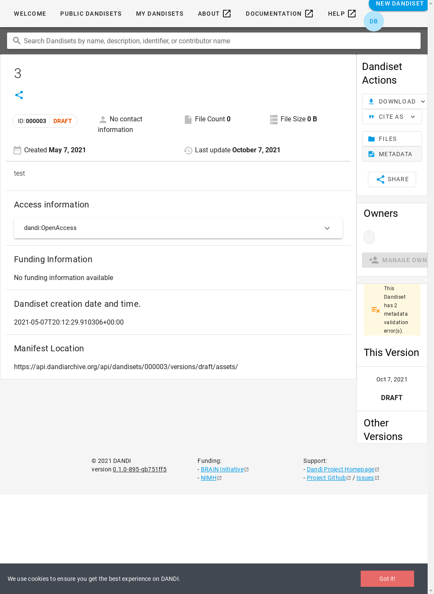 |  |  |

#### Error Messages
<pre>Message: unknown error: Chrome failed to start: exited abnormally
  (unknown error: DevToolsActivePort file doesn't exist)
  (The process started from chrome location /usr/bin/chromium is no longer running, so ChromeDriver is assuming that Chrome has crashed.)
  (Driver info: chromedriver=73.0.3683.75,platform=Linux 4.19.0-0.bpo.9-amd64 x86_64)</pre>
<pre>Message: unknown error: Chrome failed to start: exited abnormally
  (unknown error: DevToolsActivePort file doesn't exist)
  (The process started from chrome location /usr/bin/chromium is no longer running, so ChromeDriver is assuming that Chrome has crashed.)
  (Driver info: chromedriver=73.0.3683.75,platform=Linux 4.19.0-0.bpo.9-amd64 x86_64)</pre>
<pre>Message: unknown error: Chrome failed to start: exited abnormally
  (unknown error: Devtools port number file contents &lt;&gt; were in an unexpected format)
  (The process started from chrome location /usr/bin/chromium is no longer running, so ChromeDriver is assuming that Chrome has crashed.)
  (Driver info: chromedriver=73.0.3683.75,platform=Linux 4.19.0-0.bpo.9-amd64 x86_64)</pre>
### 000004

| t=[See below] [Go to page](https://gui-staging.dandiarchive.org/#/dandiset/000004) | t=[See below] Edit Metadata | t=[See below] [Go to page](https://gui-staging.dandiarchive.org/#/dandiset/000004/draft/files) |
| --- | --- | --- |
| 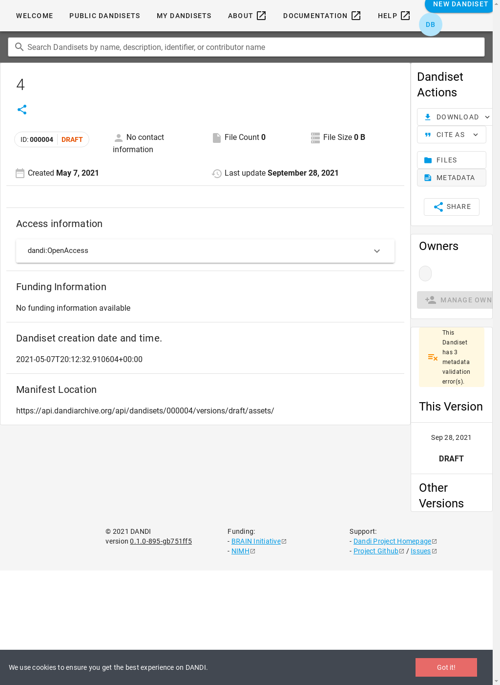 |  |  |

#### Error Messages
<pre>Message: unknown error: Chrome failed to start: exited abnormally
  (unknown error: DevToolsActivePort file doesn't exist)
  (The process started from chrome location /usr/bin/chromium is no longer running, so ChromeDriver is assuming that Chrome has crashed.)
  (Driver info: chromedriver=73.0.3683.75,platform=Linux 4.19.0-0.bpo.9-amd64 x86_64)</pre>
<pre>Message: unknown error: Chrome failed to start: exited abnormally
  (unknown error: DevToolsActivePort file doesn't exist)
  (The process started from chrome location /usr/bin/chromium is no longer running, so ChromeDriver is assuming that Chrome has crashed.)
  (Driver info: chromedriver=73.0.3683.75,platform=Linux 4.19.0-0.bpo.9-amd64 x86_64)</pre>
<pre>Message: unknown error: Chrome failed to start: exited abnormally
  (unknown error: DevToolsActivePort file doesn't exist)
  (The process started from chrome location /usr/bin/chromium is no longer running, so ChromeDriver is assuming that Chrome has crashed.)
  (Driver info: chromedriver=73.0.3683.75,platform=Linux 4.19.0-0.bpo.9-amd64 x86_64)</pre>
### 000005

| t=[See below] [Go to page](https://gui-staging.dandiarchive.org/#/dandiset/000005) | t=[See below] Edit Metadata | t=[See below] [Go to page](https://gui-staging.dandiarchive.org/#/dandiset/000005/draft/files) |
| --- | --- | --- |
|  |  |  |

#### Error Messages
<pre>Message: unknown error: Chrome failed to start: exited abnormally
  (unknown error: DevToolsActivePort file doesn't exist)
  (The process started from chrome location /usr/bin/chromium is no longer running, so ChromeDriver is assuming that Chrome has crashed.)
  (Driver info: chromedriver=73.0.3683.75,platform=Linux 4.19.0-0.bpo.9-amd64 x86_64)</pre>
<pre>Message: unknown error: Chrome failed to start: exited abnormally
  (unknown error: DevToolsActivePort file doesn't exist)
  (The process started from chrome location /usr/bin/chromium is no longer running, so ChromeDriver is assuming that Chrome has crashed.)
  (Driver info: chromedriver=73.0.3683.75,platform=Linux 4.19.0-0.bpo.9-amd64 x86_64)</pre>
<pre>Message: unknown error: Chrome failed to start: exited abnormally
  (unknown error: DevToolsActivePort file doesn't exist)
  (The process started from chrome location /usr/bin/chromium is no longer running, so ChromeDriver is assuming that Chrome has crashed.)
  (Driver info: chromedriver=73.0.3683.75,platform=Linux 4.19.0-0.bpo.9-amd64 x86_64)</pre>
### 000006

| t=[See below] [Go to page](https://gui-staging.dandiarchive.org/#/dandiset/000006) | t=[See below] Edit Metadata | t=[See below] [Go to page](https://gui-staging.dandiarchive.org/#/dandiset/000006/draft/files) |
| --- | --- | --- |
|  |  |  |

#### Error Messages
<pre>Message: unknown error: Chrome failed to start: exited abnormally
  (unknown error: Devtools port number file contents &lt;&gt; were in an unexpected format)
  (The process started from chrome location /usr/bin/chromium is no longer running, so ChromeDriver is assuming that Chrome has crashed.)
  (Driver info: chromedriver=73.0.3683.75,platform=Linux 4.19.0-0.bpo.9-amd64 x86_64)</pre>
<pre>Message: unknown error: Chrome failed to start: exited abnormally
  (unknown error: Devtools port number file contents &lt;&gt; were in an unexpected format)
  (The process started from chrome location /usr/bin/chromium is no longer running, so ChromeDriver is assuming that Chrome has crashed.)
  (Driver info: chromedriver=73.0.3683.75,platform=Linux 4.19.0-0.bpo.9-amd64 x86_64)</pre>
<pre>Message: unknown error: Chrome failed to start: exited abnormally
  (unknown error: DevToolsActivePort file doesn't exist)
  (The process started from chrome location /usr/bin/chromium is no longer running, so ChromeDriver is assuming that Chrome has crashed.)
  (Driver info: chromedriver=73.0.3683.75,platform=Linux 4.19.0-0.bpo.9-amd64 x86_64)</pre>
### 000007

| t=[See below] [Go to page](https://gui-staging.dandiarchive.org/#/dandiset/000007) | t=[See below] Edit Metadata | t=[See below] [Go to page](https://gui-staging.dandiarchive.org/#/dandiset/000007/draft/files) |
| --- | --- | --- |
|  |  |  |

#### Error Messages
<pre>Message: unknown error: Chrome failed to start: exited abnormally
  (unknown error: DevToolsActivePort file doesn't exist)
  (The process started from chrome location /usr/bin/chromium is no longer running, so ChromeDriver is assuming that Chrome has crashed.)
  (Driver info: chromedriver=73.0.3683.75,platform=Linux 4.19.0-0.bpo.9-amd64 x86_64)</pre>
<pre>Message: unknown error: Chrome failed to start: exited abnormally
  (unknown error: DevToolsActivePort file doesn't exist)
  (The process started from chrome location /usr/bin/chromium is no longer running, so ChromeDriver is assuming that Chrome has crashed.)
  (Driver info: chromedriver=73.0.3683.75,platform=Linux 4.19.0-0.bpo.9-amd64 x86_64)</pre>
<pre>Message: unknown error: Chrome failed to start: exited abnormally
  (unknown error: DevToolsActivePort file doesn't exist)
  (The process started from chrome location /usr/bin/chromium is no longer running, so ChromeDriver is assuming that Chrome has crashed.)
  (Driver info: chromedriver=73.0.3683.75,platform=Linux 4.19.0-0.bpo.9-amd64 x86_64)</pre>
### 000008

| t=[See below] [Go to page](https://gui-staging.dandiarchive.org/#/dandiset/000008) | t=[See below] Edit Metadata | t=[See below] [Go to page](https://gui-staging.dandiarchive.org/#/dandiset/000008/draft/files) |
| --- | --- | --- |
|  |  |  |

#### Error Messages
<pre>Message: unknown error: Chrome failed to start: exited abnormally
  (unknown error: DevToolsActivePort file doesn't exist)
  (The process started from chrome location /usr/bin/chromium is no longer running, so ChromeDriver is assuming that Chrome has crashed.)
  (Driver info: chromedriver=73.0.3683.75,platform=Linux 4.19.0-0.bpo.9-amd64 x86_64)</pre>
<pre>Message: unknown error: Chrome failed to start: exited abnormally
  (unknown error: DevToolsActivePort file doesn't exist)
  (The process started from chrome location /usr/bin/chromium is no longer running, so ChromeDriver is assuming that Chrome has crashed.)
  (Driver info: chromedriver=73.0.3683.75,platform=Linux 4.19.0-0.bpo.9-amd64 x86_64)</pre>
<pre>Message: unknown error: Chrome failed to start: exited abnormally
  (unknown error: DevToolsActivePort file doesn't exist)
  (The process started from chrome location /usr/bin/chromium is no longer running, so ChromeDriver is assuming that Chrome has crashed.)
  (Driver info: chromedriver=73.0.3683.75,platform=Linux 4.19.0-0.bpo.9-amd64 x86_64)</pre>
### 000009

| t=[See below] [Go to page](https://gui-staging.dandiarchive.org/#/dandiset/000009) | t=[See below] Edit Metadata | t=[See below] [Go to page](https://gui-staging.dandiarchive.org/#/dandiset/000009/draft/files) |
| --- | --- | --- |
|  |  |  |

#### Error Messages
<pre>Message: unknown error: Chrome failed to start: exited abnormally
  (unknown error: DevToolsActivePort file doesn't exist)
  (The process started from chrome location /usr/bin/chromium is no longer running, so ChromeDriver is assuming that Chrome has crashed.)
  (Driver info: chromedriver=73.0.3683.75,platform=Linux 4.19.0-0.bpo.9-amd64 x86_64)</pre>
<pre>Message: unknown error: Chrome failed to start: exited abnormally
  (unknown error: Devtools port number file contents &lt;&gt; were in an unexpected format)
  (The process started from chrome location /usr/bin/chromium is no longer running, so ChromeDriver is assuming that Chrome has crashed.)
  (Driver info: chromedriver=73.0.3683.75,platform=Linux 4.19.0-0.bpo.9-amd64 x86_64)</pre>
<pre>Message: unknown error: Chrome failed to start: exited abnormally
  (unknown error: DevToolsActivePort file doesn't exist)
  (The process started from chrome location /usr/bin/chromium is no longer running, so ChromeDriver is assuming that Chrome has crashed.)
  (Driver info: chromedriver=73.0.3683.75,platform=Linux 4.19.0-0.bpo.9-amd64 x86_64)</pre>
### 000010

| t=[See below] [Go to page](https://gui-staging.dandiarchive.org/#/dandiset/000010) | t=[See below] Edit Metadata | t=[See below] [Go to page](https://gui-staging.dandiarchive.org/#/dandiset/000010/draft/files) |
| --- | --- | --- |
|  |  |  |

#### Error Messages
<pre>Message: unknown error: Chrome failed to start: exited abnormally
  (unknown error: DevToolsActivePort file doesn't exist)
  (The process started from chrome location /usr/bin/chromium is no longer running, so ChromeDriver is assuming that Chrome has crashed.)
  (Driver info: chromedriver=73.0.3683.75,platform=Linux 4.19.0-0.bpo.9-amd64 x86_64)</pre>
<pre>Message: unknown error: Chrome failed to start: exited abnormally
  (unknown error: DevToolsActivePort file doesn't exist)
  (The process started from chrome location /usr/bin/chromium is no longer running, so ChromeDriver is assuming that Chrome has crashed.)
  (Driver info: chromedriver=73.0.3683.75,platform=Linux 4.19.0-0.bpo.9-amd64 x86_64)</pre>
<pre>Message: unknown error: Chrome failed to start: exited abnormally
  (unknown error: Devtools port number file contents &lt;&gt; were in an unexpected format)
  (The process started from chrome location /usr/bin/chromium is no longer running, so ChromeDriver is assuming that Chrome has crashed.)
  (Driver info: chromedriver=73.0.3683.75,platform=Linux 4.19.0-0.bpo.9-amd64 x86_64)</pre>
### 000011

| t=[See below] [Go to page](https://gui-staging.dandiarchive.org/#/dandiset/000011) | t=[See below] Edit Metadata | t=[See below] [Go to page](https://gui-staging.dandiarchive.org/#/dandiset/000011/draft/files) |
| --- | --- | --- |
|  |  |  |

#### Error Messages
<pre>Message: unknown error: Chrome failed to start: exited abnormally
  (unknown error: Devtools port number file contents &lt;&gt; were in an unexpected format)
  (The process started from chrome location /usr/bin/chromium is no longer running, so ChromeDriver is assuming that Chrome has crashed.)
  (Driver info: chromedriver=73.0.3683.75,platform=Linux 4.19.0-0.bpo.9-amd64 x86_64)</pre>
<pre>Message: unknown error: Chrome failed to start: exited abnormally
  (unknown error: DevToolsActivePort file doesn't exist)
  (The process started from chrome location /usr/bin/chromium is no longer running, so ChromeDriver is assuming that Chrome has crashed.)
  (Driver info: chromedriver=73.0.3683.75,platform=Linux 4.19.0-0.bpo.9-amd64 x86_64)</pre>
<pre>Message: unknown error: Chrome failed to start: exited abnormally
  (unknown error: DevToolsActivePort file doesn't exist)
  (The process started from chrome location /usr/bin/chromium is no longer running, so ChromeDriver is assuming that Chrome has crashed.)
  (Driver info: chromedriver=73.0.3683.75,platform=Linux 4.19.0-0.bpo.9-amd64 x86_64)</pre>
### 000012

| t=[See below] [Go to page](https://gui-staging.dandiarchive.org/#/dandiset/000012) | t=[See below] Edit Metadata | t=[See below] [Go to page](https://gui-staging.dandiarchive.org/#/dandiset/000012/draft/files) |
| --- | --- | --- |
| 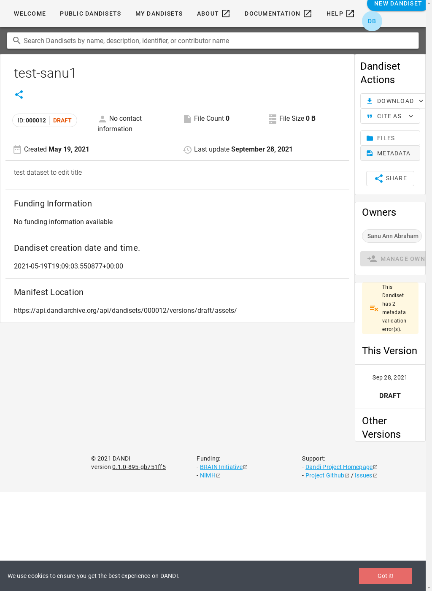 |  |  |

#### Error Messages
<pre>Message: unknown error: Chrome failed to start: exited abnormally
  (unknown error: DevToolsActivePort file doesn't exist)
  (The process started from chrome location /usr/bin/chromium is no longer running, so ChromeDriver is assuming that Chrome has crashed.)
  (Driver info: chromedriver=73.0.3683.75,platform=Linux 4.19.0-0.bpo.9-amd64 x86_64)</pre>
<pre>Message: unknown error: Chrome failed to start: exited abnormally
  (unknown error: DevToolsActivePort file doesn't exist)
  (The process started from chrome location /usr/bin/chromium is no longer running, so ChromeDriver is assuming that Chrome has crashed.)
  (Driver info: chromedriver=73.0.3683.75,platform=Linux 4.19.0-0.bpo.9-amd64 x86_64)</pre>
<pre>Message: unknown error: Chrome failed to start: exited abnormally
  (unknown error: DevToolsActivePort file doesn't exist)
  (The process started from chrome location /usr/bin/chromium is no longer running, so ChromeDriver is assuming that Chrome has crashed.)
  (Driver info: chromedriver=73.0.3683.75,platform=Linux 4.19.0-0.bpo.9-amd64 x86_64)</pre>
### 000013

| t=[See below] [Go to page](https://gui-staging.dandiarchive.org/#/dandiset/000013) | t=[See below] Edit Metadata | t=[See below] [Go to page](https://gui-staging.dandiarchive.org/#/dandiset/000013/draft/files) |
| --- | --- | --- |
|  |  |  |

#### Error Messages
<pre>Message: unknown error: Chrome failed to start: exited abnormally
  (unknown error: DevToolsActivePort file doesn't exist)
  (The process started from chrome location /usr/bin/chromium is no longer running, so ChromeDriver is assuming that Chrome has crashed.)
  (Driver info: chromedriver=73.0.3683.75,platform=Linux 4.19.0-0.bpo.9-amd64 x86_64)</pre>
<pre>Message: unknown error: Chrome failed to start: exited abnormally
  (unknown error: DevToolsActivePort file doesn't exist)
  (The process started from chrome location /usr/bin/chromium is no longer running, so ChromeDriver is assuming that Chrome has crashed.)
  (Driver info: chromedriver=73.0.3683.75,platform=Linux 4.19.0-0.bpo.9-amd64 x86_64)</pre>
<pre>Message: unknown error: Chrome failed to start: exited abnormally
  (unknown error: Devtools port number file contents &lt;&gt; were in an unexpected format)
  (The process started from chrome location /usr/bin/chromium is no longer running, so ChromeDriver is assuming that Chrome has crashed.)
  (Driver info: chromedriver=73.0.3683.75,platform=Linux 4.19.0-0.bpo.9-amd64 x86_64)</pre>
### 000014

| t=[See below] [Go to page](https://gui-staging.dandiarchive.org/#/dandiset/000014) | t=[See below] Edit Metadata | t=[See below] [Go to page](https://gui-staging.dandiarchive.org/#/dandiset/000014/draft/files) |
| --- | --- | --- |
| 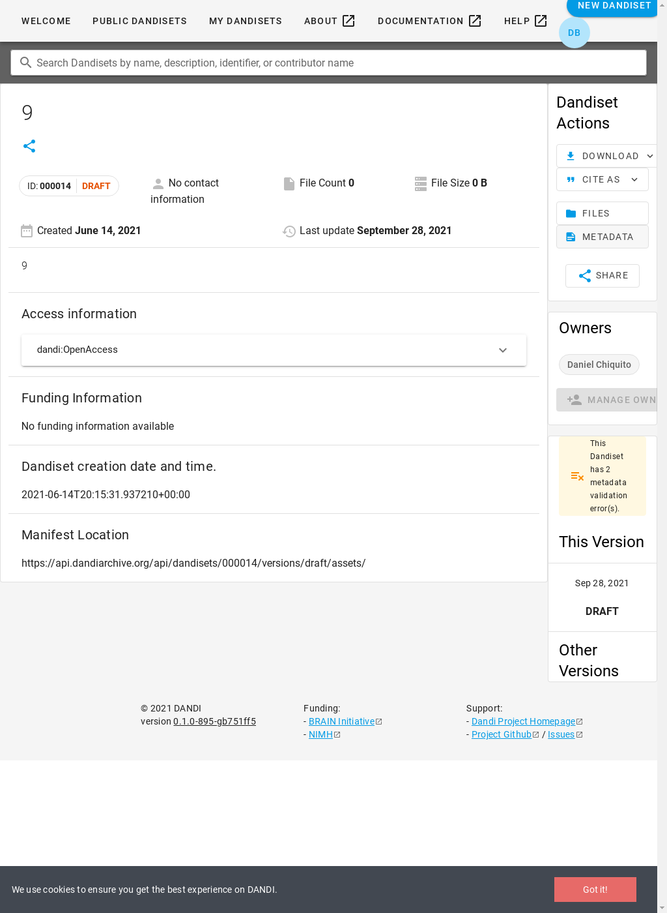 |  |  |

#### Error Messages
<pre>Message: unknown error: Chrome failed to start: exited abnormally
  (unknown error: DevToolsActivePort file doesn't exist)
  (The process started from chrome location /usr/bin/chromium is no longer running, so ChromeDriver is assuming that Chrome has crashed.)
  (Driver info: chromedriver=73.0.3683.75,platform=Linux 4.19.0-0.bpo.9-amd64 x86_64)</pre>
<pre>Message: unknown error: Chrome failed to start: exited abnormally
  (unknown error: DevToolsActivePort file doesn't exist)
  (The process started from chrome location /usr/bin/chromium is no longer running, so ChromeDriver is assuming that Chrome has crashed.)
  (Driver info: chromedriver=73.0.3683.75,platform=Linux 4.19.0-0.bpo.9-amd64 x86_64)</pre>
<pre>Message: unknown error: Chrome failed to start: exited abnormally
  (unknown error: DevToolsActivePort file doesn't exist)
  (The process started from chrome location /usr/bin/chromium is no longer running, so ChromeDriver is assuming that Chrome has crashed.)
  (Driver info: chromedriver=73.0.3683.75,platform=Linux 4.19.0-0.bpo.9-amd64 x86_64)</pre>
### 000015

| t=[See below] [Go to page](https://gui-staging.dandiarchive.org/#/dandiset/000015) | t=[See below] Edit Metadata | t=[See below] [Go to page](https://gui-staging.dandiarchive.org/#/dandiset/000015/draft/files) |
| --- | --- | --- |
|  |  |  |

#### Error Messages
<pre>Message: unknown error: Chrome failed to start: exited abnormally
  (unknown error: DevToolsActivePort file doesn't exist)
  (The process started from chrome location /usr/bin/chromium is no longer running, so ChromeDriver is assuming that Chrome has crashed.)
  (Driver info: chromedriver=73.0.3683.75,platform=Linux 4.19.0-0.bpo.9-amd64 x86_64)</pre>
<pre>Message: unknown error: Chrome failed to start: exited abnormally
  (unknown error: DevToolsActivePort file doesn't exist)
  (The process started from chrome location /usr/bin/chromium is no longer running, so ChromeDriver is assuming that Chrome has crashed.)
  (Driver info: chromedriver=73.0.3683.75,platform=Linux 4.19.0-0.bpo.9-amd64 x86_64)</pre>
<pre>Message: unknown error: Chrome failed to start: exited abnormally
  (unknown error: DevToolsActivePort file doesn't exist)
  (The process started from chrome location /usr/bin/chromium is no longer running, so ChromeDriver is assuming that Chrome has crashed.)
  (Driver info: chromedriver=73.0.3683.75,platform=Linux 4.19.0-0.bpo.9-amd64 x86_64)</pre>
### 000016

| t=[See below] [Go to page](https://gui-staging.dandiarchive.org/#/dandiset/000016) | t=[See below] Edit Metadata | t=[See below] [Go to page](https://gui-staging.dandiarchive.org/#/dandiset/000016/draft/files) |
| --- | --- | --- |
|  | 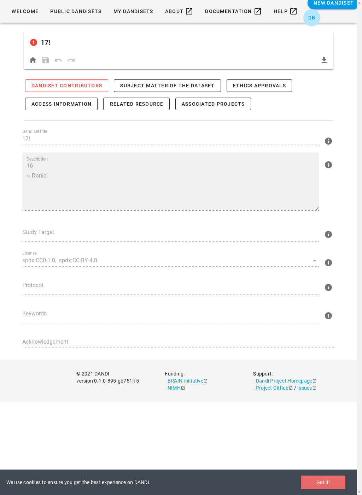 |  |

#### Error Messages
<pre>Message: unknown error: Chrome failed to start: exited abnormally
  (unknown error: Devtools port number file contents &lt;&gt; were in an unexpected format)
  (The process started from chrome location /usr/bin/chromium is no longer running, so ChromeDriver is assuming that Chrome has crashed.)
  (Driver info: chromedriver=73.0.3683.75,platform=Linux 4.19.0-0.bpo.9-amd64 x86_64)</pre>
<pre>Message: unknown error: Chrome failed to start: exited abnormally
  (unknown error: DevToolsActivePort file doesn't exist)
  (The process started from chrome location /usr/bin/chromium is no longer running, so ChromeDriver is assuming that Chrome has crashed.)
  (Driver info: chromedriver=73.0.3683.75,platform=Linux 4.19.0-0.bpo.9-amd64 x86_64)</pre>
<pre>Message: unknown error: Chrome failed to start: exited abnormally
  (unknown error: DevToolsActivePort file doesn't exist)
  (The process started from chrome location /usr/bin/chromium is no longer running, so ChromeDriver is assuming that Chrome has crashed.)
  (Driver info: chromedriver=73.0.3683.75,platform=Linux 4.19.0-0.bpo.9-amd64 x86_64)</pre>
### 000017

| t=[See below] [Go to page](https://gui-staging.dandiarchive.org/#/dandiset/000017) | t=[See below] Edit Metadata | t=[See below] [Go to page](https://gui-staging.dandiarchive.org/#/dandiset/000017/draft/files) |
| --- | --- | --- |
|  |  |  |

#### Error Messages
<pre>Message: unknown error: Chrome failed to start: exited abnormally
  (unknown error: Devtools port number file contents &lt;&gt; were in an unexpected format)
  (The process started from chrome location /usr/bin/chromium is no longer running, so ChromeDriver is assuming that Chrome has crashed.)
  (Driver info: chromedriver=73.0.3683.75,platform=Linux 4.19.0-0.bpo.9-amd64 x86_64)</pre>
<pre>Message: unknown error: Chrome failed to start: exited abnormally
  (unknown error: DevToolsActivePort file doesn't exist)
  (The process started from chrome location /usr/bin/chromium is no longer running, so ChromeDriver is assuming that Chrome has crashed.)
  (Driver info: chromedriver=73.0.3683.75,platform=Linux 4.19.0-0.bpo.9-amd64 x86_64)</pre>
<pre>Message: unknown error: Chrome failed to start: exited abnormally
  (unknown error: Devtools port number file contents &lt;&gt; were in an unexpected format)
  (The process started from chrome location /usr/bin/chromium is no longer running, so ChromeDriver is assuming that Chrome has crashed.)
  (Driver info: chromedriver=73.0.3683.75,platform=Linux 4.19.0-0.bpo.9-amd64 x86_64)</pre>
### 000018

| t=[See below] [Go to page](https://gui-staging.dandiarchive.org/#/dandiset/000018) | t=[See below] Edit Metadata | t=[See below] [Go to page](https://gui-staging.dandiarchive.org/#/dandiset/000018/draft/files) |
| --- | --- | --- |
|  |  |  |

#### Error Messages
<pre>Message: unknown error: Chrome failed to start: exited abnormally
  (unknown error: DevToolsActivePort file doesn't exist)
  (The process started from chrome location /usr/bin/chromium is no longer running, so ChromeDriver is assuming that Chrome has crashed.)
  (Driver info: chromedriver=73.0.3683.75,platform=Linux 4.19.0-0.bpo.9-amd64 x86_64)</pre>
<pre>Message: unknown error: Chrome failed to start: exited abnormally
  (unknown error: DevToolsActivePort file doesn't exist)
  (The process started from chrome location /usr/bin/chromium is no longer running, so ChromeDriver is assuming that Chrome has crashed.)
  (Driver info: chromedriver=73.0.3683.75,platform=Linux 4.19.0-0.bpo.9-amd64 x86_64)</pre>
<pre>Message: unknown error: Chrome failed to start: exited abnormally
  (unknown error: Devtools port number file contents &lt;&gt; were in an unexpected format)
  (The process started from chrome location /usr/bin/chromium is no longer running, so ChromeDriver is assuming that Chrome has crashed.)
  (Driver info: chromedriver=73.0.3683.75,platform=Linux 4.19.0-0.bpo.9-amd64 x86_64)</pre>
### 000019

| t=[See below] [Go to page](https://gui-staging.dandiarchive.org/#/dandiset/000019) | t=[See below] Edit Metadata | t=[See below] [Go to page](https://gui-staging.dandiarchive.org/#/dandiset/000019/draft/files) |
| --- | --- | --- |
| 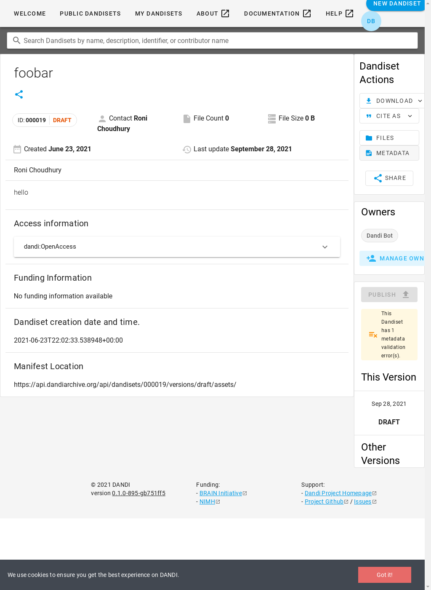 |  |  |

#### Error Messages
<pre>Message: unknown error: Chrome failed to start: exited abnormally
  (unknown error: DevToolsActivePort file doesn't exist)
  (The process started from chrome location /usr/bin/chromium is no longer running, so ChromeDriver is assuming that Chrome has crashed.)
  (Driver info: chromedriver=73.0.3683.75,platform=Linux 4.19.0-0.bpo.9-amd64 x86_64)</pre>
<pre>Message: unknown error: Chrome failed to start: exited abnormally
  (unknown error: DevToolsActivePort file doesn't exist)
  (The process started from chrome location /usr/bin/chromium is no longer running, so ChromeDriver is assuming that Chrome has crashed.)
  (Driver info: chromedriver=73.0.3683.75,platform=Linux 4.19.0-0.bpo.9-amd64 x86_64)</pre>
<pre>Message: unknown error: Chrome failed to start: exited abnormally
  (unknown error: Devtools port number file contents &lt;&gt; were in an unexpected format)
  (The process started from chrome location /usr/bin/chromium is no longer running, so ChromeDriver is assuming that Chrome has crashed.)
  (Driver info: chromedriver=73.0.3683.75,platform=Linux 4.19.0-0.bpo.9-amd64 x86_64)</pre>
### 000020

| t=[See below] [Go to page](https://gui-staging.dandiarchive.org/#/dandiset/000020) | t=[See below] Edit Metadata | t=[See below] [Go to page](https://gui-staging.dandiarchive.org/#/dandiset/000020/draft/files) |
| --- | --- | --- |
|  |  |  |

#### Error Messages
<pre>Message: unknown error: Chrome failed to start: exited abnormally
  (unknown error: DevToolsActivePort file doesn't exist)
  (The process started from chrome location /usr/bin/chromium is no longer running, so ChromeDriver is assuming that Chrome has crashed.)
  (Driver info: chromedriver=73.0.3683.75,platform=Linux 4.19.0-0.bpo.9-amd64 x86_64)</pre>
<pre>Message: unknown error: Chrome failed to start: exited abnormally
  (unknown error: DevToolsActivePort file doesn't exist)
  (The process started from chrome location /usr/bin/chromium is no longer running, so ChromeDriver is assuming that Chrome has crashed.)
  (Driver info: chromedriver=73.0.3683.75,platform=Linux 4.19.0-0.bpo.9-amd64 x86_64)</pre>
<pre>Message: unknown error: Chrome failed to start: exited abnormally
  (unknown error: DevToolsActivePort file doesn't exist)
  (The process started from chrome location /usr/bin/chromium is no longer running, so ChromeDriver is assuming that Chrome has crashed.)
  (Driver info: chromedriver=73.0.3683.75,platform=Linux 4.19.0-0.bpo.9-amd64 x86_64)</pre>
### 000021

| t=[See below] [Go to page](https://gui-staging.dandiarchive.org/#/dandiset/000021) | t=[See below] Edit Metadata | t=[See below] [Go to page](https://gui-staging.dandiarchive.org/#/dandiset/000021/draft/files) |
| --- | --- | --- |
|  |  |  |

#### Error Messages
<pre>Message: unknown error: Chrome failed to start: exited abnormally
  (unknown error: DevToolsActivePort file doesn't exist)
  (The process started from chrome location /usr/bin/chromium is no longer running, so ChromeDriver is assuming that Chrome has crashed.)
  (Driver info: chromedriver=73.0.3683.75,platform=Linux 4.19.0-0.bpo.9-amd64 x86_64)</pre>
<pre>Message: unknown error: Chrome failed to start: exited abnormally
  (unknown error: Devtools port number file contents &lt;&gt; were in an unexpected format)
  (The process started from chrome location /usr/bin/chromium is no longer running, so ChromeDriver is assuming that Chrome has crashed.)
  (Driver info: chromedriver=73.0.3683.75,platform=Linux 4.19.0-0.bpo.9-amd64 x86_64)</pre>
<pre>Message: unknown error: Chrome failed to start: exited abnormally
  (unknown error: DevToolsActivePort file doesn't exist)
  (The process started from chrome location /usr/bin/chromium is no longer running, so ChromeDriver is assuming that Chrome has crashed.)
  (Driver info: chromedriver=73.0.3683.75,platform=Linux 4.19.0-0.bpo.9-amd64 x86_64)</pre>
### 000022

| t=[See below] [Go to page](https://gui-staging.dandiarchive.org/#/dandiset/000022) | t=[See below] Edit Metadata | t=[See below] [Go to page](https://gui-staging.dandiarchive.org/#/dandiset/000022/draft/files) |
| --- | --- | --- |
|  |  |  |

#### Error Messages
<pre>Message: unknown error: Chrome failed to start: exited abnormally
  (unknown error: DevToolsActivePort file doesn't exist)
  (The process started from chrome location /usr/bin/chromium is no longer running, so ChromeDriver is assuming that Chrome has crashed.)
  (Driver info: chromedriver=73.0.3683.75,platform=Linux 4.19.0-0.bpo.9-amd64 x86_64)</pre>
<pre>Message: unknown error: Chrome failed to start: exited abnormally
  (unknown error: Devtools port number file contents &lt;&gt; were in an unexpected format)
  (The process started from chrome location /usr/bin/chromium is no longer running, so ChromeDriver is assuming that Chrome has crashed.)
  (Driver info: chromedriver=73.0.3683.75,platform=Linux 4.19.0-0.bpo.9-amd64 x86_64)</pre>
<pre>Message: unknown error: Chrome failed to start: exited abnormally
  (unknown error: DevToolsActivePort file doesn't exist)
  (The process started from chrome location /usr/bin/chromium is no longer running, so ChromeDriver is assuming that Chrome has crashed.)
  (Driver info: chromedriver=73.0.3683.75,platform=Linux 4.19.0-0.bpo.9-amd64 x86_64)</pre>
### 000023

| t=[See below] [Go to page](https://gui-staging.dandiarchive.org/#/dandiset/000023) | t=[See below] Edit Metadata | t=[See below] [Go to page](https://gui-staging.dandiarchive.org/#/dandiset/000023/draft/files) |
| --- | --- | --- |
|  |  |  |

#### Error Messages
<pre>Message: unknown error: Chrome failed to start: exited abnormally
  (unknown error: Devtools port number file contents &lt;&gt; were in an unexpected format)
  (The process started from chrome location /usr/bin/chromium is no longer running, so ChromeDriver is assuming that Chrome has crashed.)
  (Driver info: chromedriver=73.0.3683.75,platform=Linux 4.19.0-0.bpo.9-amd64 x86_64)</pre>
<pre>Message: unknown error: Chrome failed to start: exited abnormally
  (unknown error: DevToolsActivePort file doesn't exist)
  (The process started from chrome location /usr/bin/chromium is no longer running, so ChromeDriver is assuming that Chrome has crashed.)
  (Driver info: chromedriver=73.0.3683.75,platform=Linux 4.19.0-0.bpo.9-amd64 x86_64)</pre>
<pre>Message: unknown error: Chrome failed to start: exited abnormally
  (unknown error: Devtools port number file contents &lt;&gt; were in an unexpected format)
  (The process started from chrome location /usr/bin/chromium is no longer running, so ChromeDriver is assuming that Chrome has crashed.)
  (Driver info: chromedriver=73.0.3683.75,platform=Linux 4.19.0-0.bpo.9-amd64 x86_64)</pre>
### 000024

| t=[See below] [Go to page](https://gui-staging.dandiarchive.org/#/dandiset/000024) | t=[See below] Edit Metadata | t=[See below] [Go to page](https://gui-staging.dandiarchive.org/#/dandiset/000024/draft/files) |
| --- | --- | --- |
| 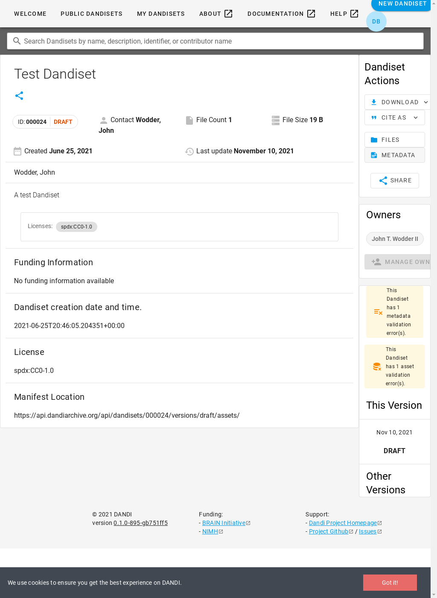 | 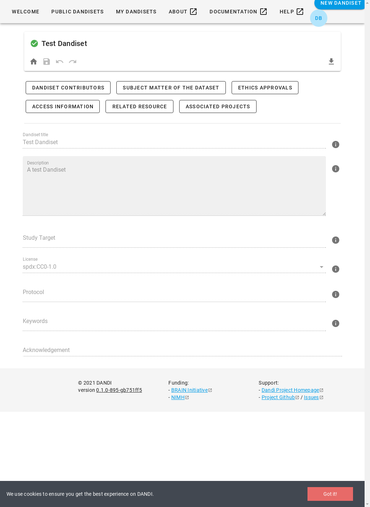 |  |

#### Error Messages
<pre>Message: unknown error: Chrome failed to start: exited abnormally
  (unknown error: Devtools port number file contents &lt;&gt; were in an unexpected format)
  (The process started from chrome location /usr/bin/chromium is no longer running, so ChromeDriver is assuming that Chrome has crashed.)
  (Driver info: chromedriver=73.0.3683.75,platform=Linux 4.19.0-0.bpo.9-amd64 x86_64)</pre>
<pre>Message: unknown error: Chrome failed to start: exited abnormally
  (unknown error: Devtools port number file contents &lt;&gt; were in an unexpected format)
  (The process started from chrome location /usr/bin/chromium is no longer running, so ChromeDriver is assuming that Chrome has crashed.)
  (Driver info: chromedriver=73.0.3683.75,platform=Linux 4.19.0-0.bpo.9-amd64 x86_64)</pre>
<pre>Message: unknown error: Chrome failed to start: exited abnormally
  (unknown error: DevToolsActivePort file doesn't exist)
  (The process started from chrome location /usr/bin/chromium is no longer running, so ChromeDriver is assuming that Chrome has crashed.)
  (Driver info: chromedriver=73.0.3683.75,platform=Linux 4.19.0-0.bpo.9-amd64 x86_64)</pre>
### 000025

| t=[See below] [Go to page](https://gui-staging.dandiarchive.org/#/dandiset/000025) | t=[See below] Edit Metadata | t=[See below] [Go to page](https://gui-staging.dandiarchive.org/#/dandiset/000025/draft/files) |
| --- | --- | --- |
|  |  |  |

#### Error Messages
<pre>Message: unknown error: Chrome failed to start: exited abnormally
  (unknown error: DevToolsActivePort file doesn't exist)
  (The process started from chrome location /usr/bin/chromium is no longer running, so ChromeDriver is assuming that Chrome has crashed.)
  (Driver info: chromedriver=73.0.3683.75,platform=Linux 4.19.0-0.bpo.9-amd64 x86_64)</pre>
<pre>Message: unknown error: Chrome failed to start: exited abnormally
  (unknown error: DevToolsActivePort file doesn't exist)
  (The process started from chrome location /usr/bin/chromium is no longer running, so ChromeDriver is assuming that Chrome has crashed.)
  (Driver info: chromedriver=73.0.3683.75,platform=Linux 4.19.0-0.bpo.9-amd64 x86_64)</pre>
<pre>Message: unknown error: Chrome failed to start: exited abnormally
  (unknown error: Devtools port number file contents &lt;&gt; were in an unexpected format)
  (The process started from chrome location /usr/bin/chromium is no longer running, so ChromeDriver is assuming that Chrome has crashed.)
  (Driver info: chromedriver=73.0.3683.75,platform=Linux 4.19.0-0.bpo.9-amd64 x86_64)</pre>
### 000026

| t=[See below] [Go to page](https://gui-staging.dandiarchive.org/#/dandiset/000026) | t=[See below] Edit Metadata | t=[See below] [Go to page](https://gui-staging.dandiarchive.org/#/dandiset/000026/draft/files) |
| --- | --- | --- |
| 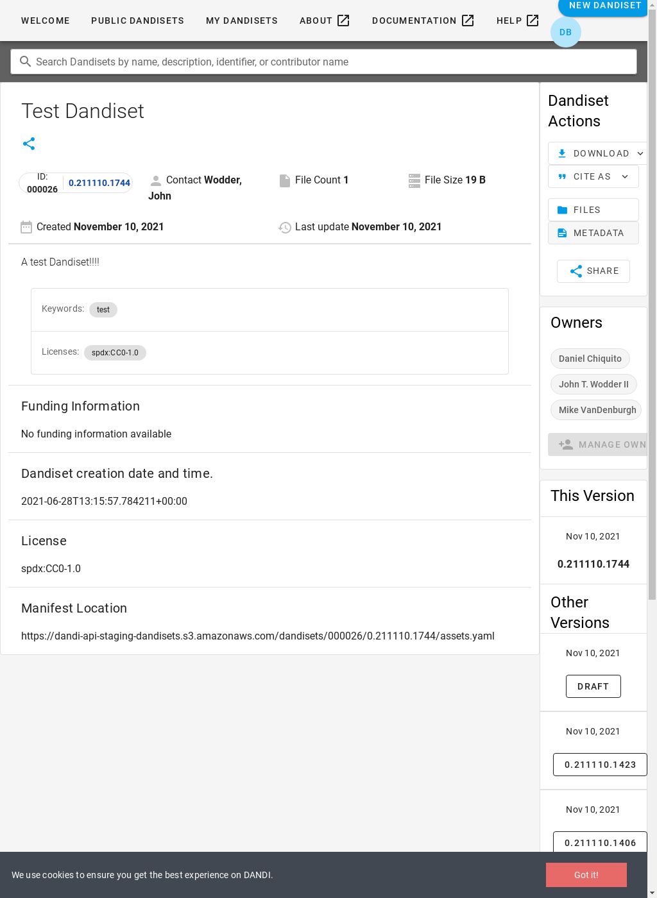 |  |  |

#### Error Messages
<pre>Message: unknown error: Chrome failed to start: exited abnormally
  (unknown error: Devtools port number file contents &lt;&gt; were in an unexpected format)
  (The process started from chrome location /usr/bin/chromium is no longer running, so ChromeDriver is assuming that Chrome has crashed.)
  (Driver info: chromedriver=73.0.3683.75,platform=Linux 4.19.0-0.bpo.9-amd64 x86_64)</pre>
<pre>Message: unknown error: Chrome failed to start: exited abnormally
  (unknown error: DevToolsActivePort file doesn't exist)
  (The process started from chrome location /usr/bin/chromium is no longer running, so ChromeDriver is assuming that Chrome has crashed.)
  (Driver info: chromedriver=73.0.3683.75,platform=Linux 4.19.0-0.bpo.9-amd64 x86_64)</pre>
<pre>Message: unknown error: Chrome failed to start: exited abnormally
  (unknown error: DevToolsActivePort file doesn't exist)
  (The process started from chrome location /usr/bin/chromium is no longer running, so ChromeDriver is assuming that Chrome has crashed.)
  (Driver info: chromedriver=73.0.3683.75,platform=Linux 4.19.0-0.bpo.9-amd64 x86_64)</pre>
### 000027

| t=[See below] [Go to page](https://gui-staging.dandiarchive.org/#/dandiset/000027) | t=[See below] Edit Metadata | t=[See below] [Go to page](https://gui-staging.dandiarchive.org/#/dandiset/000027/draft/files) |
| --- | --- | --- |
|  |  |  |

#### Error Messages
<pre>Message: unknown error: Chrome failed to start: exited abnormally
  (unknown error: DevToolsActivePort file doesn't exist)
  (The process started from chrome location /usr/bin/chromium is no longer running, so ChromeDriver is assuming that Chrome has crashed.)
  (Driver info: chromedriver=73.0.3683.75,platform=Linux 4.19.0-0.bpo.9-amd64 x86_64)</pre>
<pre>Message: unknown error: Chrome failed to start: exited abnormally
  (unknown error: DevToolsActivePort file doesn't exist)
  (The process started from chrome location /usr/bin/chromium is no longer running, so ChromeDriver is assuming that Chrome has crashed.)
  (Driver info: chromedriver=73.0.3683.75,platform=Linux 4.19.0-0.bpo.9-amd64 x86_64)</pre>
<pre>Message: unknown error: Chrome failed to start: exited abnormally
  (unknown error: Devtools port number file contents &lt;&gt; were in an unexpected format)
  (The process started from chrome location /usr/bin/chromium is no longer running, so ChromeDriver is assuming that Chrome has crashed.)
  (Driver info: chromedriver=73.0.3683.75,platform=Linux 4.19.0-0.bpo.9-amd64 x86_64)</pre>
### 000028

| t=[See below] [Go to page](https://gui-staging.dandiarchive.org/#/dandiset/000028) | t=[See below] Edit Metadata | t=[See below] [Go to page](https://gui-staging.dandiarchive.org/#/dandiset/000028/draft/files) |
| --- | --- | --- |
|  |  |  |

#### Error Messages
<pre>Message: unknown error: Chrome failed to start: exited abnormally
  (unknown error: DevToolsActivePort file doesn't exist)
  (The process started from chrome location /usr/bin/chromium is no longer running, so ChromeDriver is assuming that Chrome has crashed.)
  (Driver info: chromedriver=73.0.3683.75,platform=Linux 4.19.0-0.bpo.9-amd64 x86_64)</pre>
<pre>Message: unknown error: Chrome failed to start: exited abnormally
  (unknown error: DevToolsActivePort file doesn't exist)
  (The process started from chrome location /usr/bin/chromium is no longer running, so ChromeDriver is assuming that Chrome has crashed.)
  (Driver info: chromedriver=73.0.3683.75,platform=Linux 4.19.0-0.bpo.9-amd64 x86_64)</pre>
<pre>Message: unknown error: Chrome failed to start: exited abnormally
  (unknown error: Devtools port number file contents &lt;&gt; were in an unexpected format)
  (The process started from chrome location /usr/bin/chromium is no longer running, so ChromeDriver is assuming that Chrome has crashed.)
  (Driver info: chromedriver=73.0.3683.75,platform=Linux 4.19.0-0.bpo.9-amd64 x86_64)</pre>
### 000029

| t=[See below] [Go to page](https://gui-staging.dandiarchive.org/#/dandiset/000029) | t=[See below] Edit Metadata | t=[See below] [Go to page](https://gui-staging.dandiarchive.org/#/dandiset/000029/draft/files) |
| --- | --- | --- |
| 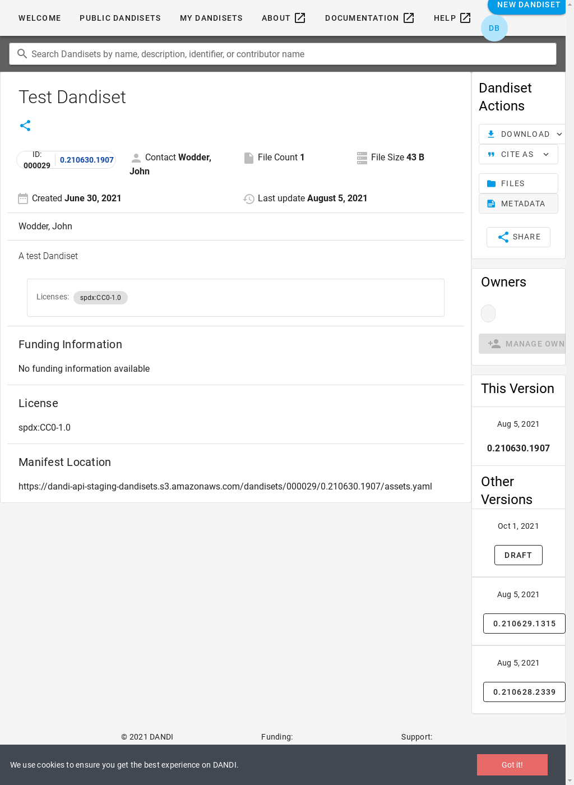 |  |  |

#### Error Messages
<pre>Message: unknown error: Chrome failed to start: exited abnormally
  (unknown error: Devtools port number file contents &lt;&gt; were in an unexpected format)
  (The process started from chrome location /usr/bin/chromium is no longer running, so ChromeDriver is assuming that Chrome has crashed.)
  (Driver info: chromedriver=73.0.3683.75,platform=Linux 4.19.0-0.bpo.9-amd64 x86_64)</pre>
<pre>Message: unknown error: Chrome failed to start: exited abnormally
  (unknown error: Devtools port number file contents &lt;&gt; were in an unexpected format)
  (The process started from chrome location /usr/bin/chromium is no longer running, so ChromeDriver is assuming that Chrome has crashed.)
  (Driver info: chromedriver=73.0.3683.75,platform=Linux 4.19.0-0.bpo.9-amd64 x86_64)</pre>
<pre>Message: unknown error: Chrome failed to start: exited abnormally
  (unknown error: DevToolsActivePort file doesn't exist)
  (The process started from chrome location /usr/bin/chromium is no longer running, so ChromeDriver is assuming that Chrome has crashed.)
  (Driver info: chromedriver=73.0.3683.75,platform=Linux 4.19.0-0.bpo.9-amd64 x86_64)</pre>
### 000030

| t=[See below] [Go to page](https://gui-staging.dandiarchive.org/#/dandiset/000030) | t=[See below] Edit Metadata | t=[See below] [Go to page](https://gui-staging.dandiarchive.org/#/dandiset/000030/draft/files) |
| --- | --- | --- |
|  |  |  |

#### Error Messages
<pre>Message: unknown error: Chrome failed to start: exited abnormally
  (unknown error: DevToolsActivePort file doesn't exist)
  (The process started from chrome location /usr/bin/chromium is no longer running, so ChromeDriver is assuming that Chrome has crashed.)
  (Driver info: chromedriver=73.0.3683.75,platform=Linux 4.19.0-0.bpo.9-amd64 x86_64)</pre>
<pre>Message: unknown error: Chrome failed to start: exited abnormally
  (unknown error: DevToolsActivePort file doesn't exist)
  (The process started from chrome location /usr/bin/chromium is no longer running, so ChromeDriver is assuming that Chrome has crashed.)
  (Driver info: chromedriver=73.0.3683.75,platform=Linux 4.19.0-0.bpo.9-amd64 x86_64)</pre>
<pre>Message: unknown error: Chrome failed to start: exited abnormally
  (unknown error: Devtools port number file contents &lt;&gt; were in an unexpected format)
  (The process started from chrome location /usr/bin/chromium is no longer running, so ChromeDriver is assuming that Chrome has crashed.)
  (Driver info: chromedriver=73.0.3683.75,platform=Linux 4.19.0-0.bpo.9-amd64 x86_64)</pre>
### 000031

| t=[See below] [Go to page](https://gui-staging.dandiarchive.org/#/dandiset/000031) | t=[See below] Edit Metadata | t=[See below] [Go to page](https://gui-staging.dandiarchive.org/#/dandiset/000031/draft/files) |
| --- | --- | --- |
|  |  |  |

#### Error Messages
<pre>Message: unknown error: Chrome failed to start: exited abnormally
  (unknown error: Devtools port number file contents &lt;&gt; were in an unexpected format)
  (The process started from chrome location /usr/bin/chromium is no longer running, so ChromeDriver is assuming that Chrome has crashed.)
  (Driver info: chromedriver=73.0.3683.75,platform=Linux 4.19.0-0.bpo.9-amd64 x86_64)</pre>
<pre>Message: unknown error: Chrome failed to start: exited abnormally
  (unknown error: Devtools port number file contents &lt;&gt; were in an unexpected format)
  (The process started from chrome location /usr/bin/chromium is no longer running, so ChromeDriver is assuming that Chrome has crashed.)
  (Driver info: chromedriver=73.0.3683.75,platform=Linux 4.19.0-0.bpo.9-amd64 x86_64)</pre>
<pre>Message: unknown error: Chrome failed to start: exited abnormally
  (unknown error: DevToolsActivePort file doesn't exist)
  (The process started from chrome location /usr/bin/chromium is no longer running, so ChromeDriver is assuming that Chrome has crashed.)
  (Driver info: chromedriver=73.0.3683.75,platform=Linux 4.19.0-0.bpo.9-amd64 x86_64)</pre>
### 000032

| t=[See below] [Go to page](https://gui-staging.dandiarchive.org/#/dandiset/000032) | t=[See below] Edit Metadata | t=[See below] [Go to page](https://gui-staging.dandiarchive.org/#/dandiset/000032/draft/files) |
| --- | --- | --- |
|  |  |  |

#### Error Messages
<pre>Message: unknown error: Chrome failed to start: exited abnormally
  (unknown error: Devtools port number file contents &lt;&gt; were in an unexpected format)
  (The process started from chrome location /usr/bin/chromium is no longer running, so ChromeDriver is assuming that Chrome has crashed.)
  (Driver info: chromedriver=73.0.3683.75,platform=Linux 4.19.0-0.bpo.9-amd64 x86_64)</pre>
<pre>Message: unknown error: Chrome failed to start: exited abnormally
  (unknown error: DevToolsActivePort file doesn't exist)
  (The process started from chrome location /usr/bin/chromium is no longer running, so ChromeDriver is assuming that Chrome has crashed.)
  (Driver info: chromedriver=73.0.3683.75,platform=Linux 4.19.0-0.bpo.9-amd64 x86_64)</pre>
<pre>Message: unknown error: Chrome failed to start: exited abnormally
  (unknown error: DevToolsActivePort file doesn't exist)
  (The process started from chrome location /usr/bin/chromium is no longer running, so ChromeDriver is assuming that Chrome has crashed.)
  (Driver info: chromedriver=73.0.3683.75,platform=Linux 4.19.0-0.bpo.9-amd64 x86_64)</pre>
### 000033

| t=[See below] [Go to page](https://gui-staging.dandiarchive.org/#/dandiset/000033) | t=[See below] Edit Metadata | t=[See below] [Go to page](https://gui-staging.dandiarchive.org/#/dandiset/000033/draft/files) |
| --- | --- | --- |
|  |  |  |

#### Error Messages
<pre>Message: unknown error: Chrome failed to start: exited abnormally
  (unknown error: DevToolsActivePort file doesn't exist)
  (The process started from chrome location /usr/bin/chromium is no longer running, so ChromeDriver is assuming that Chrome has crashed.)
  (Driver info: chromedriver=73.0.3683.75,platform=Linux 4.19.0-0.bpo.9-amd64 x86_64)</pre>
<pre>Message: unknown error: Chrome failed to start: exited abnormally
  (unknown error: Devtools port number file contents &lt;&gt; were in an unexpected format)
  (The process started from chrome location /usr/bin/chromium is no longer running, so ChromeDriver is assuming that Chrome has crashed.)
  (Driver info: chromedriver=73.0.3683.75,platform=Linux 4.19.0-0.bpo.9-amd64 x86_64)</pre>
<pre>Message: unknown error: Chrome failed to start: exited abnormally
  (unknown error: Devtools port number file contents &lt;&gt; were in an unexpected format)
  (The process started from chrome location /usr/bin/chromium is no longer running, so ChromeDriver is assuming that Chrome has crashed.)
  (Driver info: chromedriver=73.0.3683.75,platform=Linux 4.19.0-0.bpo.9-amd64 x86_64)</pre>
### 000035

| t=[See below] [Go to page](https://gui-staging.dandiarchive.org/#/dandiset/000035) | t=[See below] Edit Metadata | t=[See below] [Go to page](https://gui-staging.dandiarchive.org/#/dandiset/000035/draft/files) |
| --- | --- | --- |
|  |  |  |

#### Error Messages
<pre>Message: unknown error: Chrome failed to start: exited abnormally
  (unknown error: Devtools port number file contents &lt;&gt; were in an unexpected format)
  (The process started from chrome location /usr/bin/chromium is no longer running, so ChromeDriver is assuming that Chrome has crashed.)
  (Driver info: chromedriver=73.0.3683.75,platform=Linux 4.19.0-0.bpo.9-amd64 x86_64)</pre>
<pre>Message: unknown error: Chrome failed to start: exited abnormally
  (unknown error: DevToolsActivePort file doesn't exist)
  (The process started from chrome location /usr/bin/chromium is no longer running, so ChromeDriver is assuming that Chrome has crashed.)
  (Driver info: chromedriver=73.0.3683.75,platform=Linux 4.19.0-0.bpo.9-amd64 x86_64)</pre>
<pre>Message: unknown error: Chrome failed to start: exited abnormally
  (unknown error: Devtools port number file contents &lt;&gt; were in an unexpected format)
  (The process started from chrome location /usr/bin/chromium is no longer running, so ChromeDriver is assuming that Chrome has crashed.)
  (Driver info: chromedriver=73.0.3683.75,platform=Linux 4.19.0-0.bpo.9-amd64 x86_64)</pre>
### 000036

| t=[See below] [Go to page](https://gui-staging.dandiarchive.org/#/dandiset/000036) | t=[See below] Edit Metadata | t=[See below] [Go to page](https://gui-staging.dandiarchive.org/#/dandiset/000036/draft/files) |
| --- | --- | --- |
|  |  |  |

#### Error Messages
<pre>Message: unknown error: Chrome failed to start: exited abnormally
  (unknown error: Devtools port number file contents &lt;&gt; were in an unexpected format)
  (The process started from chrome location /usr/bin/chromium is no longer running, so ChromeDriver is assuming that Chrome has crashed.)
  (Driver info: chromedriver=73.0.3683.75,platform=Linux 4.19.0-0.bpo.9-amd64 x86_64)</pre>
<pre>Message: unknown error: Chrome failed to start: exited abnormally
  (unknown error: DevToolsActivePort file doesn't exist)
  (The process started from chrome location /usr/bin/chromium is no longer running, so ChromeDriver is assuming that Chrome has crashed.)
  (Driver info: chromedriver=73.0.3683.75,platform=Linux 4.19.0-0.bpo.9-amd64 x86_64)</pre>
<pre>Message: unknown error: Chrome failed to start: exited abnormally
  (unknown error: Devtools port number file contents &lt;&gt; were in an unexpected format)
  (The process started from chrome location /usr/bin/chromium is no longer running, so ChromeDriver is assuming that Chrome has crashed.)
  (Driver info: chromedriver=73.0.3683.75,platform=Linux 4.19.0-0.bpo.9-amd64 x86_64)</pre>
### 000037

| t=[See below] [Go to page](https://gui-staging.dandiarchive.org/#/dandiset/000037) | t=[See below] Edit Metadata | t=[See below] [Go to page](https://gui-staging.dandiarchive.org/#/dandiset/000037/draft/files) |
| --- | --- | --- |
|  |  |  |

#### Error Messages
<pre>Message: unknown error: Chrome failed to start: exited abnormally
  (unknown error: DevToolsActivePort file doesn't exist)
  (The process started from chrome location /usr/bin/chromium is no longer running, so ChromeDriver is assuming that Chrome has crashed.)
  (Driver info: chromedriver=73.0.3683.75,platform=Linux 4.19.0-0.bpo.9-amd64 x86_64)</pre>
<pre>Message: unknown error: Chrome failed to start: exited abnormally
  (unknown error: Devtools port number file contents &lt;&gt; were in an unexpected format)
  (The process started from chrome location /usr/bin/chromium is no longer running, so ChromeDriver is assuming that Chrome has crashed.)
  (Driver info: chromedriver=73.0.3683.75,platform=Linux 4.19.0-0.bpo.9-amd64 x86_64)</pre>
<pre>Message: unknown error: Chrome failed to start: exited abnormally
  (unknown error: Devtools port number file contents &lt;&gt; were in an unexpected format)
  (The process started from chrome location /usr/bin/chromium is no longer running, so ChromeDriver is assuming that Chrome has crashed.)
  (Driver info: chromedriver=73.0.3683.75,platform=Linux 4.19.0-0.bpo.9-amd64 x86_64)</pre>
### 000170

| t=[See below] [Go to page](https://gui-staging.dandiarchive.org/#/dandiset/000170) | t=[See below] Edit Metadata | t=[See below] [Go to page](https://gui-staging.dandiarchive.org/#/dandiset/000170/draft/files) |
| --- | --- | --- |
| 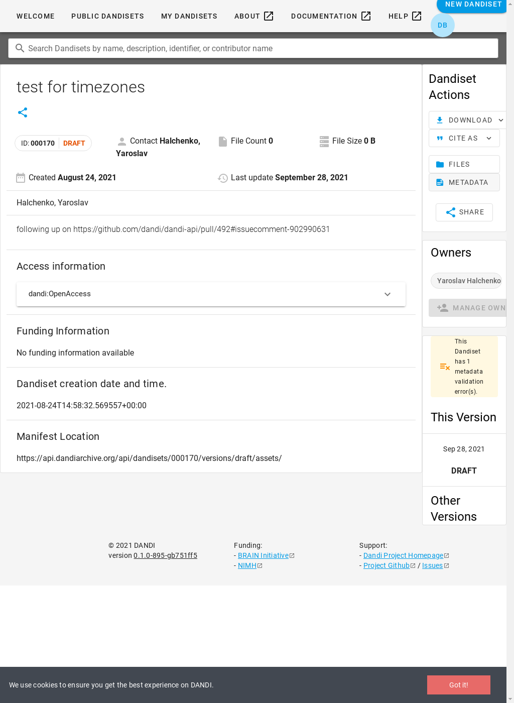 | 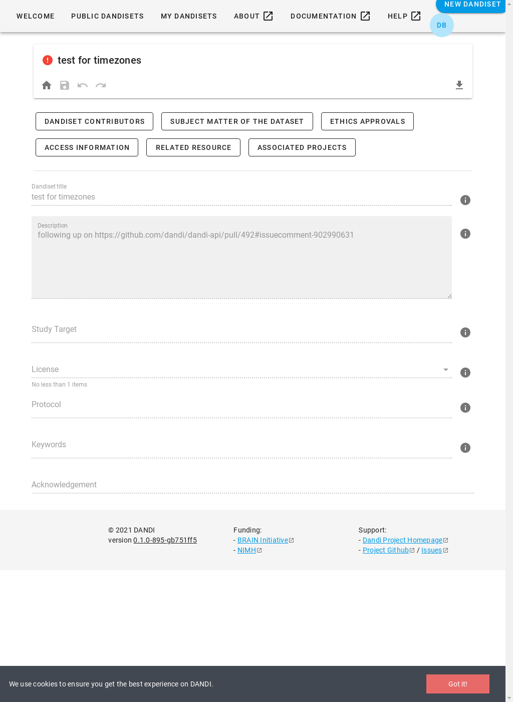 |  |

#### Error Messages
<pre>Message: unknown error: Chrome failed to start: exited abnormally
  (unknown error: DevToolsActivePort file doesn't exist)
  (The process started from chrome location /usr/bin/chromium is no longer running, so ChromeDriver is assuming that Chrome has crashed.)
  (Driver info: chromedriver=73.0.3683.75,platform=Linux 4.19.0-0.bpo.9-amd64 x86_64)</pre>
<pre>Message: unknown error: Chrome failed to start: exited abnormally
  (unknown error: Devtools port number file contents &lt;&gt; were in an unexpected format)
  (The process started from chrome location /usr/bin/chromium is no longer running, so ChromeDriver is assuming that Chrome has crashed.)
  (Driver info: chromedriver=73.0.3683.75,platform=Linux 4.19.0-0.bpo.9-amd64 x86_64)</pre>
<pre>Message: unknown error: Chrome failed to start: exited abnormally
  (unknown error: Devtools port number file contents &lt;&gt; were in an unexpected format)
  (The process started from chrome location /usr/bin/chromium is no longer running, so ChromeDriver is assuming that Chrome has crashed.)
  (Driver info: chromedriver=73.0.3683.75,platform=Linux 4.19.0-0.bpo.9-amd64 x86_64)</pre>
### 000211

| t=[See below] [Go to page](https://gui-staging.dandiarchive.org/#/dandiset/000211) | t=[See below] Edit Metadata | t=[See below] [Go to page](https://gui-staging.dandiarchive.org/#/dandiset/000211/draft/files) |
| --- | --- | --- |
|  |  |  |

#### Error Messages
<pre>Message: unknown error: Chrome failed to start: exited abnormally
  (unknown error: Devtools port number file contents &lt;&gt; were in an unexpected format)
  (The process started from chrome location /usr/bin/chromium is no longer running, so ChromeDriver is assuming that Chrome has crashed.)
  (Driver info: chromedriver=73.0.3683.75,platform=Linux 4.19.0-0.bpo.9-amd64 x86_64)</pre>
<pre>Message: unknown error: Chrome failed to start: exited abnormally
  (unknown error: Devtools port number file contents &lt;&gt; were in an unexpected format)
  (The process started from chrome location /usr/bin/chromium is no longer running, so ChromeDriver is assuming that Chrome has crashed.)
  (Driver info: chromedriver=73.0.3683.75,platform=Linux 4.19.0-0.bpo.9-amd64 x86_64)</pre>
<pre>Message: unknown error: Chrome failed to start: exited abnormally
  (unknown error: DevToolsActivePort file doesn't exist)
  (The process started from chrome location /usr/bin/chromium is no longer running, so ChromeDriver is assuming that Chrome has crashed.)
  (Driver info: chromedriver=73.0.3683.75,platform=Linux 4.19.0-0.bpo.9-amd64 x86_64)</pre>
### 000212

| t=[See below] [Go to page](https://gui-staging.dandiarchive.org/#/dandiset/000212) | t=[See below] Edit Metadata | t=[See below] [Go to page](https://gui-staging.dandiarchive.org/#/dandiset/000212/draft/files) |
| --- | --- | --- |
|  |  |  |

#### Error Messages
<pre>Message: unknown error: Chrome failed to start: exited abnormally
  (unknown error: Devtools port number file contents &lt;&gt; were in an unexpected format)
  (The process started from chrome location /usr/bin/chromium is no longer running, so ChromeDriver is assuming that Chrome has crashed.)
  (Driver info: chromedriver=73.0.3683.75,platform=Linux 4.19.0-0.bpo.9-amd64 x86_64)</pre>
<pre>Message: unknown error: Chrome failed to start: exited abnormally
  (unknown error: DevToolsActivePort file doesn't exist)
  (The process started from chrome location /usr/bin/chromium is no longer running, so ChromeDriver is assuming that Chrome has crashed.)
  (Driver info: chromedriver=73.0.3683.75,platform=Linux 4.19.0-0.bpo.9-amd64 x86_64)</pre>
<pre>Message: unknown error: Chrome failed to start: exited abnormally
  (unknown error: DevToolsActivePort file doesn't exist)
  (The process started from chrome location /usr/bin/chromium is no longer running, so ChromeDriver is assuming that Chrome has crashed.)
  (Driver info: chromedriver=73.0.3683.75,platform=Linux 4.19.0-0.bpo.9-amd64 x86_64)</pre>
### 000221

| t=[See below] [Go to page](https://gui-staging.dandiarchive.org/#/dandiset/000221) | t=[See below] Edit Metadata | t=[See below] [Go to page](https://gui-staging.dandiarchive.org/#/dandiset/000221/draft/files) |
| --- | --- | --- |
|  | 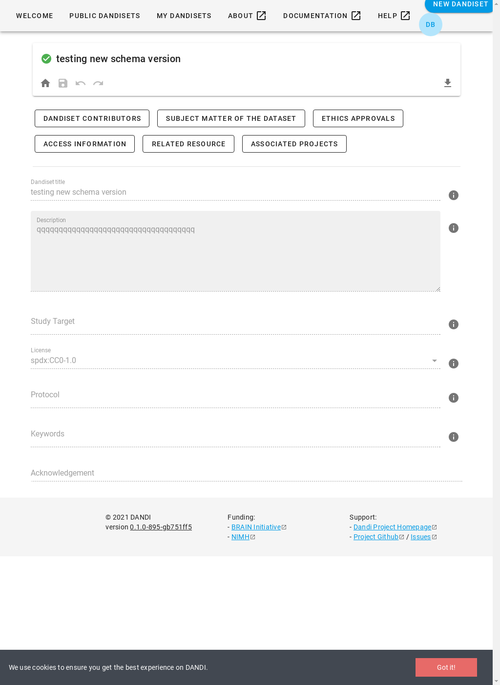 |  |

#### Error Messages
<pre>Message: unknown error: Chrome failed to start: exited abnormally
  (unknown error: Devtools port number file contents &lt;&gt; were in an unexpected format)
  (The process started from chrome location /usr/bin/chromium is no longer running, so ChromeDriver is assuming that Chrome has crashed.)
  (Driver info: chromedriver=73.0.3683.75,platform=Linux 4.19.0-0.bpo.9-amd64 x86_64)</pre>
<pre>Message: unknown error: Chrome failed to start: exited abnormally
  (unknown error: DevToolsActivePort file doesn't exist)
  (The process started from chrome location /usr/bin/chromium is no longer running, so ChromeDriver is assuming that Chrome has crashed.)
  (Driver info: chromedriver=73.0.3683.75,platform=Linux 4.19.0-0.bpo.9-amd64 x86_64)</pre>
<pre>Message: unknown error: Chrome failed to start: exited abnormally
  (unknown error: Devtools port number file contents &lt;&gt; were in an unexpected format)
  (The process started from chrome location /usr/bin/chromium is no longer running, so ChromeDriver is assuming that Chrome has crashed.)
  (Driver info: chromedriver=73.0.3683.75,platform=Linux 4.19.0-0.bpo.9-amd64 x86_64)</pre>
### 000222

| t=[See below] [Go to page](https://gui-staging.dandiarchive.org/#/dandiset/000222) | t=[See below] Edit Metadata | t=[See below] [Go to page](https://gui-staging.dandiarchive.org/#/dandiset/000222/draft/files) |
| --- | --- | --- |
| 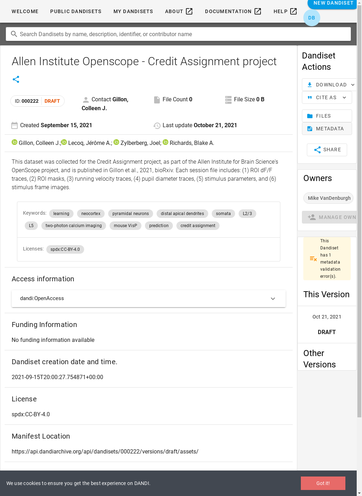 |  |  |

#### Error Messages
<pre>Message: unknown error: Chrome failed to start: exited abnormally
  (unknown error: Devtools port number file contents &lt;&gt; were in an unexpected format)
  (The process started from chrome location /usr/bin/chromium is no longer running, so ChromeDriver is assuming that Chrome has crashed.)
  (Driver info: chromedriver=73.0.3683.75,platform=Linux 4.19.0-0.bpo.9-amd64 x86_64)</pre>
<pre>Message: unknown error: Chrome failed to start: exited abnormally
  (unknown error: Devtools port number file contents &lt;&gt; were in an unexpected format)
  (The process started from chrome location /usr/bin/chromium is no longer running, so ChromeDriver is assuming that Chrome has crashed.)
  (Driver info: chromedriver=73.0.3683.75,platform=Linux 4.19.0-0.bpo.9-amd64 x86_64)</pre>
<pre>Message: unknown error: Chrome failed to start: exited abnormally
  (unknown error: DevToolsActivePort file doesn't exist)
  (The process started from chrome location /usr/bin/chromium is no longer running, so ChromeDriver is assuming that Chrome has crashed.)
  (Driver info: chromedriver=73.0.3683.75,platform=Linux 4.19.0-0.bpo.9-amd64 x86_64)</pre>
### 100238

| t=[See below] [Go to page](https://gui-staging.dandiarchive.org/#/dandiset/100238) | t=[See below] Edit Metadata | t=[See below] [Go to page](https://gui-staging.dandiarchive.org/#/dandiset/100238/draft/files) |
| --- | --- | --- |
|  |  |  |

#### Error Messages
<pre>Message: unknown error: Chrome failed to start: exited abnormally
  (unknown error: DevToolsActivePort file doesn't exist)
  (The process started from chrome location /usr/bin/chromium is no longer running, so ChromeDriver is assuming that Chrome has crashed.)
  (Driver info: chromedriver=73.0.3683.75,platform=Linux 4.19.0-0.bpo.9-amd64 x86_64)</pre>
<pre>Message: unknown error: Chrome failed to start: exited abnormally
  (unknown error: Devtools port number file contents &lt;&gt; were in an unexpected format)
  (The process started from chrome location /usr/bin/chromium is no longer running, so ChromeDriver is assuming that Chrome has crashed.)
  (Driver info: chromedriver=73.0.3683.75,platform=Linux 4.19.0-0.bpo.9-amd64 x86_64)</pre>
<pre>Message: unknown error: Chrome failed to start: exited abnormally
  (unknown error: Devtools port number file contents &lt;&gt; were in an unexpected format)
  (The process started from chrome location /usr/bin/chromium is no longer running, so ChromeDriver is assuming that Chrome has crashed.)
  (Driver info: chromedriver=73.0.3683.75,platform=Linux 4.19.0-0.bpo.9-amd64 x86_64)</pre>
### 100239

| t=[See below] [Go to page](https://gui-staging.dandiarchive.org/#/dandiset/100239) | t=[See below] Edit Metadata | t=[See below] [Go to page](https://gui-staging.dandiarchive.org/#/dandiset/100239/draft/files) |
| --- | --- | --- |
| 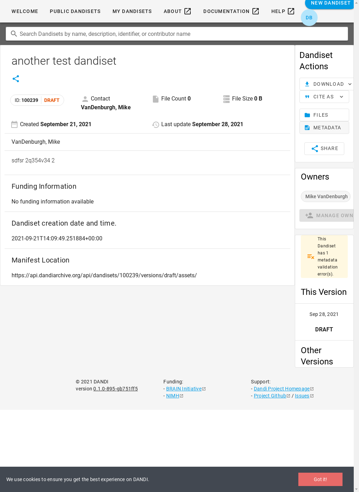 | 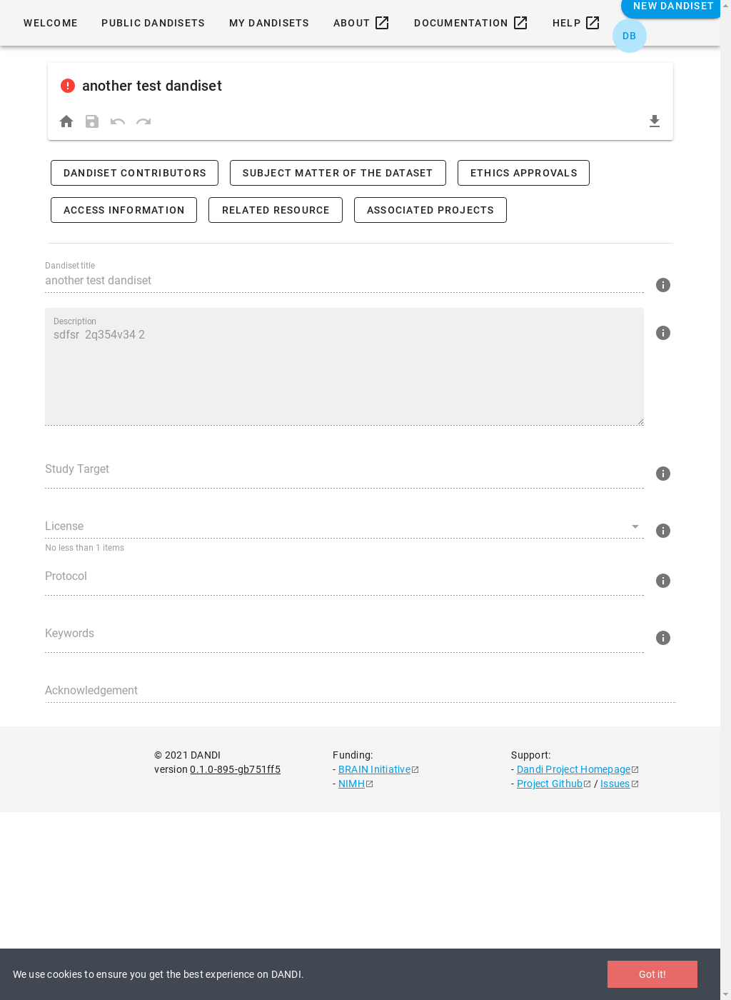 |  |

#### Error Messages
<pre>Message: unknown error: Chrome failed to start: exited abnormally
  (unknown error: DevToolsActivePort file doesn't exist)
  (The process started from chrome location /usr/bin/chromium is no longer running, so ChromeDriver is assuming that Chrome has crashed.)
  (Driver info: chromedriver=73.0.3683.75,platform=Linux 4.19.0-0.bpo.9-amd64 x86_64)</pre>
<pre>Message: unknown error: Chrome failed to start: exited abnormally
  (unknown error: Devtools port number file contents &lt;&gt; were in an unexpected format)
  (The process started from chrome location /usr/bin/chromium is no longer running, so ChromeDriver is assuming that Chrome has crashed.)
  (Driver info: chromedriver=73.0.3683.75,platform=Linux 4.19.0-0.bpo.9-amd64 x86_64)</pre>
<pre>Message: unknown error: Chrome failed to start: exited abnormally
  (unknown error: DevToolsActivePort file doesn't exist)
  (The process started from chrome location /usr/bin/chromium is no longer running, so ChromeDriver is assuming that Chrome has crashed.)
  (Driver info: chromedriver=73.0.3683.75,platform=Linux 4.19.0-0.bpo.9-amd64 x86_64)</pre>
### 100268

| t=[See below] [Go to page](https://gui-staging.dandiarchive.org/#/dandiset/100268) | t=[See below] Edit Metadata | t=[See below] [Go to page](https://gui-staging.dandiarchive.org/#/dandiset/100268/draft/files) |
| --- | --- | --- |
| 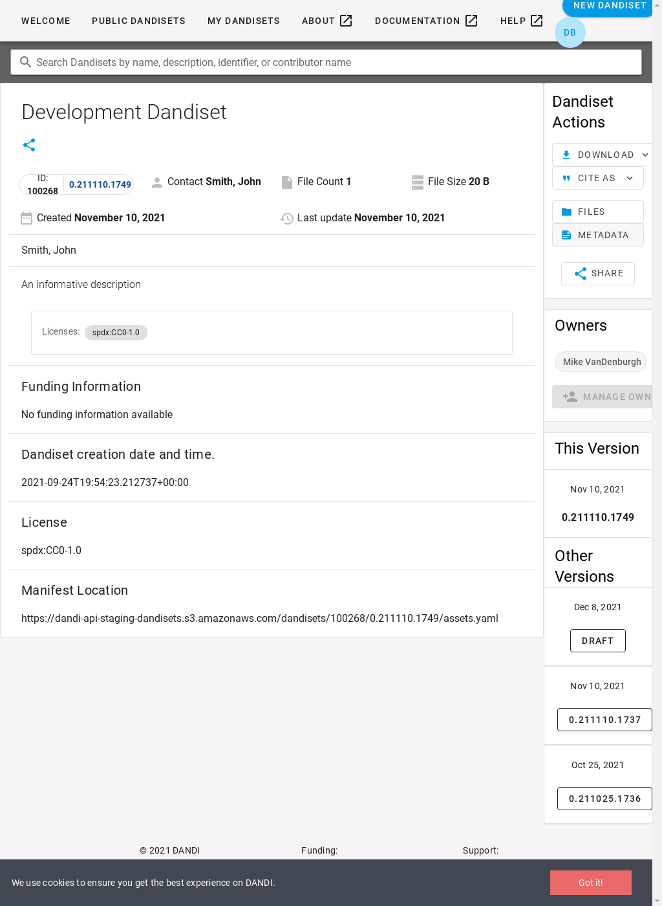 |  |  |

#### Error Messages
<pre>Message: unknown error: Chrome failed to start: exited abnormally
  (unknown error: DevToolsActivePort file doesn't exist)
  (The process started from chrome location /usr/bin/chromium is no longer running, so ChromeDriver is assuming that Chrome has crashed.)
  (Driver info: chromedriver=73.0.3683.75,platform=Linux 4.19.0-0.bpo.9-amd64 x86_64)</pre>
<pre>Message: unknown error: Chrome failed to start: exited abnormally
  (unknown error: Devtools port number file contents &lt;&gt; were in an unexpected format)
  (The process started from chrome location /usr/bin/chromium is no longer running, so ChromeDriver is assuming that Chrome has crashed.)
  (Driver info: chromedriver=73.0.3683.75,platform=Linux 4.19.0-0.bpo.9-amd64 x86_64)</pre>
<pre>Message: unknown error: Chrome failed to start: exited abnormally
  (unknown error: DevToolsActivePort file doesn't exist)
  (The process started from chrome location /usr/bin/chromium is no longer running, so ChromeDriver is assuming that Chrome has crashed.)
  (Driver info: chromedriver=73.0.3683.75,platform=Linux 4.19.0-0.bpo.9-amd64 x86_64)</pre>
### 100273

| t=[See below] [Go to page](https://gui-staging.dandiarchive.org/#/dandiset/100273) | t=[See below] Edit Metadata | t=[See below] [Go to page](https://gui-staging.dandiarchive.org/#/dandiset/100273/draft/files) |
| --- | --- | --- |
|  |  |  |

#### Error Messages
<pre>Message: unknown error: Chrome failed to start: exited abnormally
  (unknown error: DevToolsActivePort file doesn't exist)
  (The process started from chrome location /usr/bin/chromium is no longer running, so ChromeDriver is assuming that Chrome has crashed.)
  (Driver info: chromedriver=73.0.3683.75,platform=Linux 4.19.0-0.bpo.9-amd64 x86_64)</pre>
<pre>Message: unknown error: Chrome failed to start: exited abnormally
  (unknown error: Devtools port number file contents &lt;&gt; were in an unexpected format)
  (The process started from chrome location /usr/bin/chromium is no longer running, so ChromeDriver is assuming that Chrome has crashed.)
  (Driver info: chromedriver=73.0.3683.75,platform=Linux 4.19.0-0.bpo.9-amd64 x86_64)</pre>
<pre>Message: unknown error: Chrome failed to start: exited abnormally
  (unknown error: Devtools port number file contents &lt;&gt; were in an unexpected format)
  (The process started from chrome location /usr/bin/chromium is no longer running, so ChromeDriver is assuming that Chrome has crashed.)
  (Driver info: chromedriver=73.0.3683.75,platform=Linux 4.19.0-0.bpo.9-amd64 x86_64)</pre>
### 100274

| t=[See below] [Go to page](https://gui-staging.dandiarchive.org/#/dandiset/100274) | t=[See below] Edit Metadata | t=[See below] [Go to page](https://gui-staging.dandiarchive.org/#/dandiset/100274/draft/files) |
| --- | --- | --- |
|  |  |  |

#### Error Messages
<pre>Message: unknown error: Chrome failed to start: exited abnormally
  (unknown error: DevToolsActivePort file doesn't exist)
  (The process started from chrome location /usr/bin/chromium is no longer running, so ChromeDriver is assuming that Chrome has crashed.)
  (Driver info: chromedriver=73.0.3683.75,platform=Linux 4.19.0-0.bpo.9-amd64 x86_64)</pre>
<pre>Message: unknown error: Chrome failed to start: exited abnormally
  (unknown error: DevToolsActivePort file doesn't exist)
  (The process started from chrome location /usr/bin/chromium is no longer running, so ChromeDriver is assuming that Chrome has crashed.)
  (Driver info: chromedriver=73.0.3683.75,platform=Linux 4.19.0-0.bpo.9-amd64 x86_64)</pre>
<pre>Message: unknown error: Chrome failed to start: exited abnormally
  (unknown error: DevToolsActivePort file doesn't exist)
  (The process started from chrome location /usr/bin/chromium is no longer running, so ChromeDriver is assuming that Chrome has crashed.)
  (Driver info: chromedriver=73.0.3683.75,platform=Linux 4.19.0-0.bpo.9-amd64 x86_64)</pre>
### 100275

| t=[See below] [Go to page](https://gui-staging.dandiarchive.org/#/dandiset/100275) | t=[See below] Edit Metadata | t=[See below] [Go to page](https://gui-staging.dandiarchive.org/#/dandiset/100275/draft/files) |
| --- | --- | --- |
|  |  |  |

#### Error Messages
<pre>Message: unknown error: Chrome failed to start: exited abnormally
  (unknown error: Devtools port number file contents &lt;&gt; were in an unexpected format)
  (The process started from chrome location /usr/bin/chromium is no longer running, so ChromeDriver is assuming that Chrome has crashed.)
  (Driver info: chromedriver=73.0.3683.75,platform=Linux 4.19.0-0.bpo.9-amd64 x86_64)</pre>
<pre>Message: unknown error: Chrome failed to start: exited abnormally
  (unknown error: Devtools port number file contents &lt;&gt; were in an unexpected format)
  (The process started from chrome location /usr/bin/chromium is no longer running, so ChromeDriver is assuming that Chrome has crashed.)
  (Driver info: chromedriver=73.0.3683.75,platform=Linux 4.19.0-0.bpo.9-amd64 x86_64)</pre>
<pre>Message: unknown error: Chrome failed to start: exited abnormally
  (unknown error: Devtools port number file contents &lt;&gt; were in an unexpected format)
  (The process started from chrome location /usr/bin/chromium is no longer running, so ChromeDriver is assuming that Chrome has crashed.)
  (Driver info: chromedriver=73.0.3683.75,platform=Linux 4.19.0-0.bpo.9-amd64 x86_64)</pre>
### 100276

| t=[See below] [Go to page](https://gui-staging.dandiarchive.org/#/dandiset/100276) | t=[See below] Edit Metadata | t=[See below] [Go to page](https://gui-staging.dandiarchive.org/#/dandiset/100276/draft/files) |
| --- | --- | --- |
| 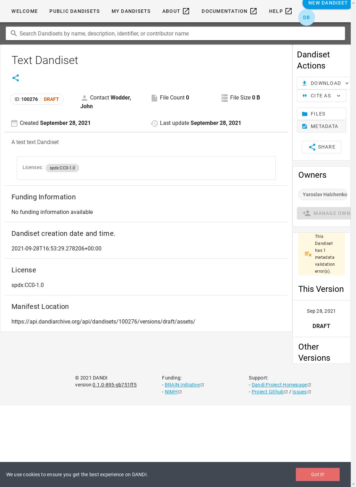 |  |  |

#### Error Messages
<pre>Message: unknown error: Chrome failed to start: exited abnormally
  (unknown error: DevToolsActivePort file doesn't exist)
  (The process started from chrome location /usr/bin/chromium is no longer running, so ChromeDriver is assuming that Chrome has crashed.)
  (Driver info: chromedriver=73.0.3683.75,platform=Linux 4.19.0-0.bpo.9-amd64 x86_64)</pre>
<pre>Message: unknown error: Chrome failed to start: exited abnormally
  (unknown error: Devtools port number file contents &lt;&gt; were in an unexpected format)
  (The process started from chrome location /usr/bin/chromium is no longer running, so ChromeDriver is assuming that Chrome has crashed.)
  (Driver info: chromedriver=73.0.3683.75,platform=Linux 4.19.0-0.bpo.9-amd64 x86_64)</pre>
<pre>Message: unknown error: Chrome failed to start: exited abnormally
  (unknown error: Devtools port number file contents &lt;&gt; were in an unexpected format)
  (The process started from chrome location /usr/bin/chromium is no longer running, so ChromeDriver is assuming that Chrome has crashed.)
  (Driver info: chromedriver=73.0.3683.75,platform=Linux 4.19.0-0.bpo.9-amd64 x86_64)</pre>
### 100277

| t=[See below] [Go to page](https://gui-staging.dandiarchive.org/#/dandiset/100277) | t=[See below] Edit Metadata | t=[See below] [Go to page](https://gui-staging.dandiarchive.org/#/dandiset/100277/draft/files) |
| --- | --- | --- |
| 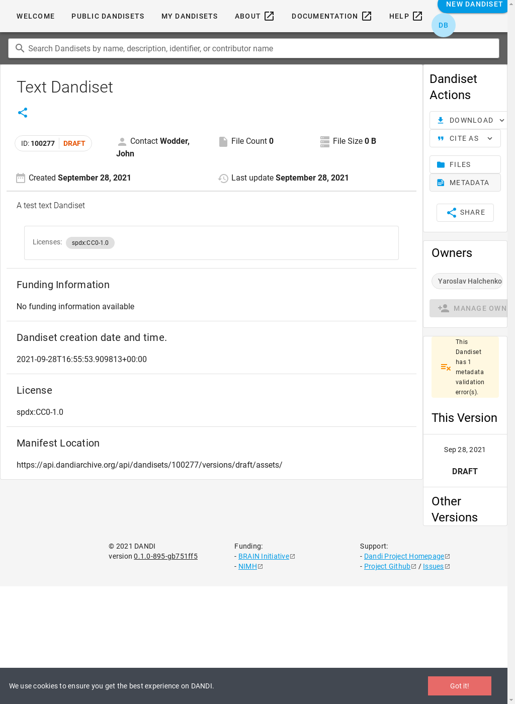 |  |  |

#### Error Messages
<pre>Message: unknown error: Chrome failed to start: exited abnormally
  (unknown error: DevToolsActivePort file doesn't exist)
  (The process started from chrome location /usr/bin/chromium is no longer running, so ChromeDriver is assuming that Chrome has crashed.)
  (Driver info: chromedriver=73.0.3683.75,platform=Linux 4.19.0-0.bpo.9-amd64 x86_64)</pre>
<pre>Message: unknown error: Chrome failed to start: exited abnormally
  (unknown error: Devtools port number file contents &lt;&gt; were in an unexpected format)
  (The process started from chrome location /usr/bin/chromium is no longer running, so ChromeDriver is assuming that Chrome has crashed.)
  (Driver info: chromedriver=73.0.3683.75,platform=Linux 4.19.0-0.bpo.9-amd64 x86_64)</pre>
<pre>Message: unknown error: Chrome failed to start: exited abnormally
  (unknown error: DevToolsActivePort file doesn't exist)
  (The process started from chrome location /usr/bin/chromium is no longer running, so ChromeDriver is assuming that Chrome has crashed.)
  (Driver info: chromedriver=73.0.3683.75,platform=Linux 4.19.0-0.bpo.9-amd64 x86_64)</pre>
### 100278

| t=[See below] [Go to page](https://gui-staging.dandiarchive.org/#/dandiset/100278) | t=[See below] Edit Metadata | t=[See below] [Go to page](https://gui-staging.dandiarchive.org/#/dandiset/100278/draft/files) |
| --- | --- | --- |
|  |  |  |

#### Error Messages
<pre>Message: unknown error: Chrome failed to start: exited abnormally
  (unknown error: Devtools port number file contents &lt;&gt; were in an unexpected format)
  (The process started from chrome location /usr/bin/chromium is no longer running, so ChromeDriver is assuming that Chrome has crashed.)
  (Driver info: chromedriver=73.0.3683.75,platform=Linux 4.19.0-0.bpo.9-amd64 x86_64)</pre>
<pre>Message: unknown error: Chrome failed to start: exited abnormally
  (unknown error: Devtools port number file contents &lt;&gt; were in an unexpected format)
  (The process started from chrome location /usr/bin/chromium is no longer running, so ChromeDriver is assuming that Chrome has crashed.)
  (Driver info: chromedriver=73.0.3683.75,platform=Linux 4.19.0-0.bpo.9-amd64 x86_64)</pre>
<pre>Message: unknown error: Chrome failed to start: exited abnormally
  (unknown error: Devtools port number file contents &lt;&gt; were in an unexpected format)
  (The process started from chrome location /usr/bin/chromium is no longer running, so ChromeDriver is assuming that Chrome has crashed.)
  (Driver info: chromedriver=73.0.3683.75,platform=Linux 4.19.0-0.bpo.9-amd64 x86_64)</pre>
### 100279

| t=[See below] [Go to page](https://gui-staging.dandiarchive.org/#/dandiset/100279) | t=[See below] Edit Metadata | t=[See below] [Go to page](https://gui-staging.dandiarchive.org/#/dandiset/100279/draft/files) |
| --- | --- | --- |
| 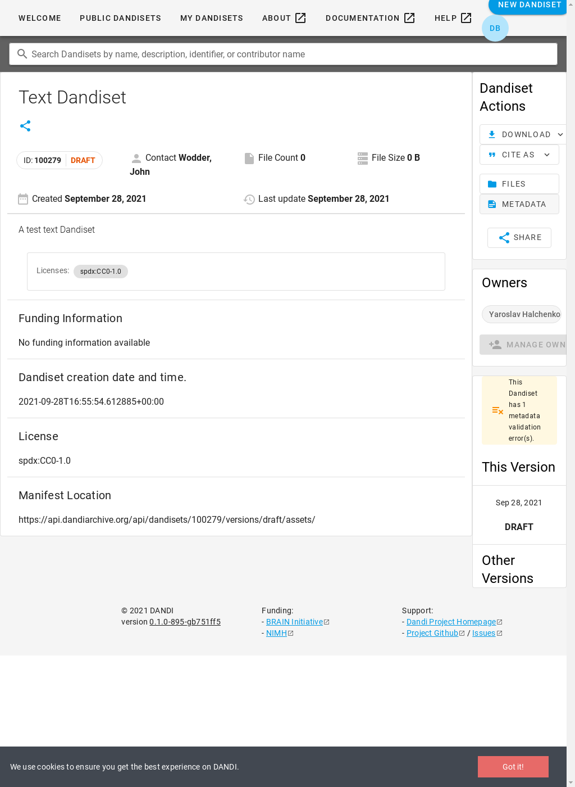 |  |  |

#### Error Messages
<pre>Message: unknown error: Chrome failed to start: exited abnormally
  (unknown error: Devtools port number file contents &lt;&gt; were in an unexpected format)
  (The process started from chrome location /usr/bin/chromium is no longer running, so ChromeDriver is assuming that Chrome has crashed.)
  (Driver info: chromedriver=73.0.3683.75,platform=Linux 4.19.0-0.bpo.9-amd64 x86_64)</pre>
<pre>Message: unknown error: Chrome failed to start: exited abnormally
  (unknown error: DevToolsActivePort file doesn't exist)
  (The process started from chrome location /usr/bin/chromium is no longer running, so ChromeDriver is assuming that Chrome has crashed.)
  (Driver info: chromedriver=73.0.3683.75,platform=Linux 4.19.0-0.bpo.9-amd64 x86_64)</pre>
<pre>Message: unknown error: Chrome failed to start: exited abnormally
  (unknown error: Devtools port number file contents &lt;&gt; were in an unexpected format)
  (The process started from chrome location /usr/bin/chromium is no longer running, so ChromeDriver is assuming that Chrome has crashed.)
  (Driver info: chromedriver=73.0.3683.75,platform=Linux 4.19.0-0.bpo.9-amd64 x86_64)</pre>
### 100280

| t=[See below] [Go to page](https://gui-staging.dandiarchive.org/#/dandiset/100280) | t=[See below] Edit Metadata | t=[See below] [Go to page](https://gui-staging.dandiarchive.org/#/dandiset/100280/draft/files) |
| --- | --- | --- |
| 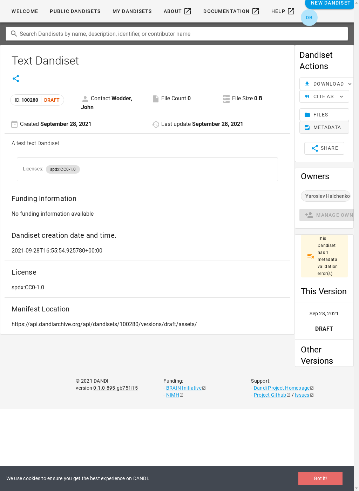 |  |  |

#### Error Messages
<pre>Message: unknown error: Chrome failed to start: exited abnormally
  (unknown error: DevToolsActivePort file doesn't exist)
  (The process started from chrome location /usr/bin/chromium is no longer running, so ChromeDriver is assuming that Chrome has crashed.)
  (Driver info: chromedriver=73.0.3683.75,platform=Linux 4.19.0-0.bpo.9-amd64 x86_64)</pre>
<pre>Message: unknown error: Chrome failed to start: exited abnormally
  (unknown error: Devtools port number file contents &lt;&gt; were in an unexpected format)
  (The process started from chrome location /usr/bin/chromium is no longer running, so ChromeDriver is assuming that Chrome has crashed.)
  (Driver info: chromedriver=73.0.3683.75,platform=Linux 4.19.0-0.bpo.9-amd64 x86_64)</pre>
<pre>Message: unknown error: Chrome failed to start: exited abnormally
  (unknown error: Devtools port number file contents &lt;&gt; were in an unexpected format)
  (The process started from chrome location /usr/bin/chromium is no longer running, so ChromeDriver is assuming that Chrome has crashed.)
  (Driver info: chromedriver=73.0.3683.75,platform=Linux 4.19.0-0.bpo.9-amd64 x86_64)</pre>
### 100285

| t=[See below] [Go to page](https://gui-staging.dandiarchive.org/#/dandiset/100285) | t=[See below] Edit Metadata | t=[See below] [Go to page](https://gui-staging.dandiarchive.org/#/dandiset/100285/draft/files) |
| --- | --- | --- |
| 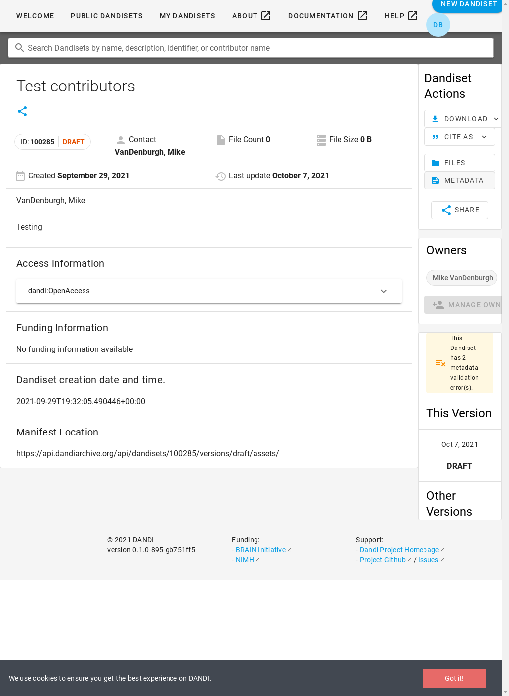 |  |  |

#### Error Messages
<pre>Message: unknown error: Chrome failed to start: exited abnormally
  (unknown error: DevToolsActivePort file doesn't exist)
  (The process started from chrome location /usr/bin/chromium is no longer running, so ChromeDriver is assuming that Chrome has crashed.)
  (Driver info: chromedriver=73.0.3683.75,platform=Linux 4.19.0-0.bpo.9-amd64 x86_64)</pre>
<pre>Message: unknown error: Chrome failed to start: exited abnormally
  (unknown error: Devtools port number file contents &lt;&gt; were in an unexpected format)
  (The process started from chrome location /usr/bin/chromium is no longer running, so ChromeDriver is assuming that Chrome has crashed.)
  (Driver info: chromedriver=73.0.3683.75,platform=Linux 4.19.0-0.bpo.9-amd64 x86_64)</pre>
<pre>Message: unknown error: Chrome failed to start: exited abnormally
  (unknown error: Devtools port number file contents &lt;&gt; were in an unexpected format)
  (The process started from chrome location /usr/bin/chromium is no longer running, so ChromeDriver is assuming that Chrome has crashed.)
  (Driver info: chromedriver=73.0.3683.75,platform=Linux 4.19.0-0.bpo.9-amd64 x86_64)</pre>
### 100338

| t=[See below] [Go to page](https://gui-staging.dandiarchive.org/#/dandiset/100338) | t=[See below] Edit Metadata | t=[See below] [Go to page](https://gui-staging.dandiarchive.org/#/dandiset/100338/draft/files) |
| --- | --- | --- |
| 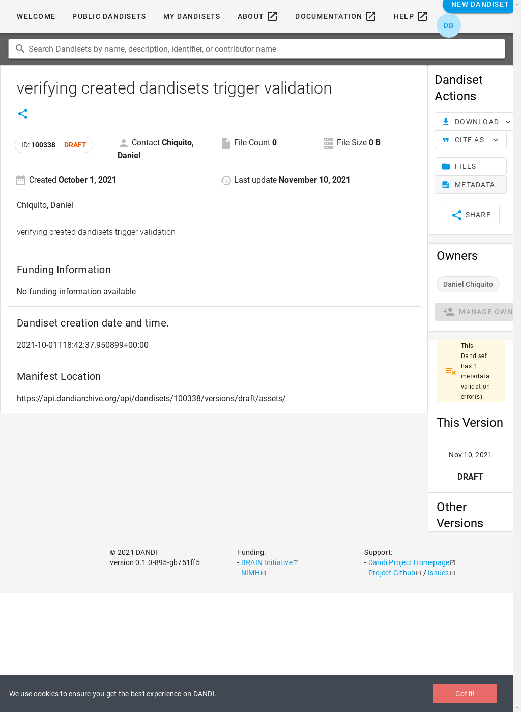 |  |  |

#### Error Messages
<pre>Message: unknown error: Chrome failed to start: exited abnormally
  (unknown error: DevToolsActivePort file doesn't exist)
  (The process started from chrome location /usr/bin/chromium is no longer running, so ChromeDriver is assuming that Chrome has crashed.)
  (Driver info: chromedriver=73.0.3683.75,platform=Linux 4.19.0-0.bpo.9-amd64 x86_64)</pre>
<pre>Message: unknown error: Chrome failed to start: exited abnormally
  (unknown error: Devtools port number file contents &lt;&gt; were in an unexpected format)
  (The process started from chrome location /usr/bin/chromium is no longer running, so ChromeDriver is assuming that Chrome has crashed.)
  (Driver info: chromedriver=73.0.3683.75,platform=Linux 4.19.0-0.bpo.9-amd64 x86_64)</pre>
<pre>Message: unknown error: Chrome failed to start: exited abnormally
  (unknown error: DevToolsActivePort file doesn't exist)
  (The process started from chrome location /usr/bin/chromium is no longer running, so ChromeDriver is assuming that Chrome has crashed.)
  (Driver info: chromedriver=73.0.3683.75,platform=Linux 4.19.0-0.bpo.9-amd64 x86_64)</pre>
### 100354

| t=[See below] [Go to page](https://gui-staging.dandiarchive.org/#/dandiset/100354) | t=[See below] Edit Metadata | t=[See below] [Go to page](https://gui-staging.dandiarchive.org/#/dandiset/100354/draft/files) |
| --- | --- | --- |
| 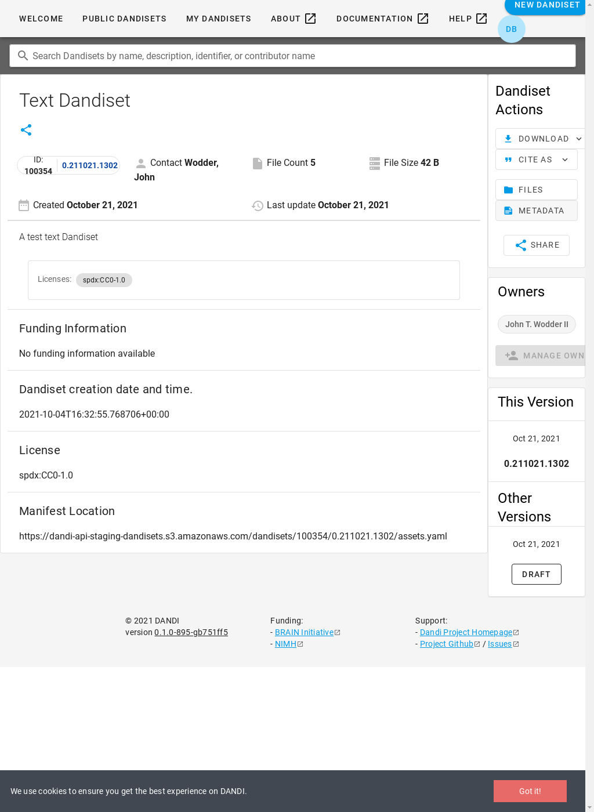 |  | 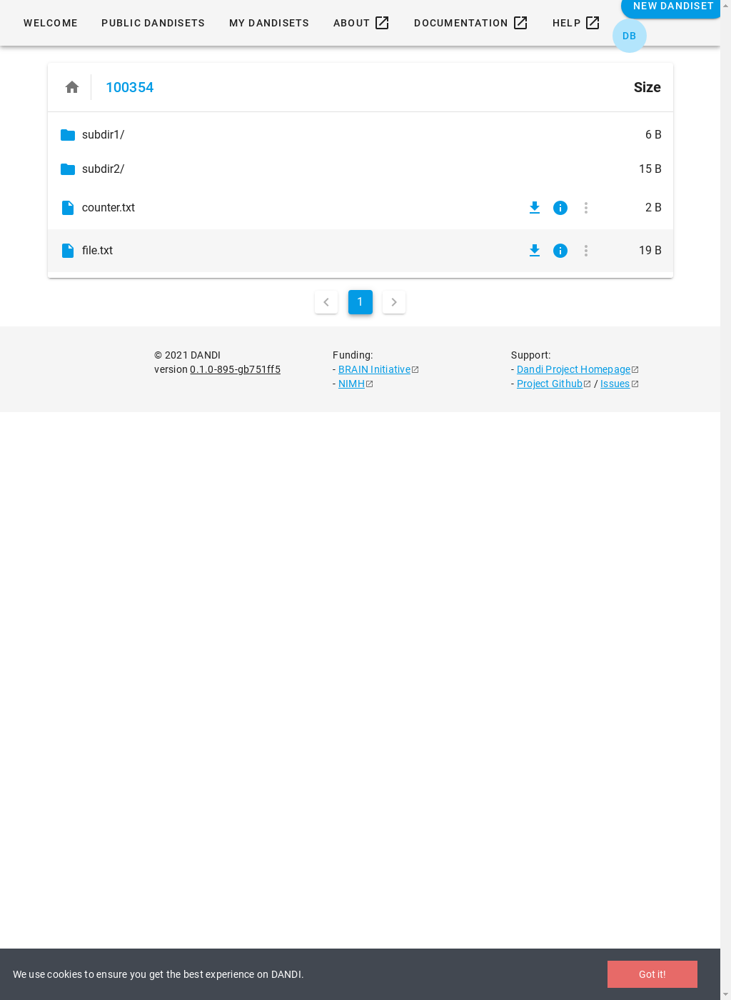 |

#### Error Messages
<pre>Message: unknown error: Chrome failed to start: exited abnormally
  (unknown error: Devtools port number file contents &lt;&gt; were in an unexpected format)
  (The process started from chrome location /usr/bin/chromium is no longer running, so ChromeDriver is assuming that Chrome has crashed.)
  (Driver info: chromedriver=73.0.3683.75,platform=Linux 4.19.0-0.bpo.9-amd64 x86_64)</pre>
<pre>Message: unknown error: Chrome failed to start: exited abnormally
  (unknown error: Devtools port number file contents &lt;&gt; were in an unexpected format)
  (The process started from chrome location /usr/bin/chromium is no longer running, so ChromeDriver is assuming that Chrome has crashed.)
  (Driver info: chromedriver=73.0.3683.75,platform=Linux 4.19.0-0.bpo.9-amd64 x86_64)</pre>
<pre>Message: unknown error: Chrome failed to start: exited abnormally
  (unknown error: DevToolsActivePort file doesn't exist)
  (The process started from chrome location /usr/bin/chromium is no longer running, so ChromeDriver is assuming that Chrome has crashed.)
  (Driver info: chromedriver=73.0.3683.75,platform=Linux 4.19.0-0.bpo.9-amd64 x86_64)</pre>
### 100358

| t=[See below] [Go to page](https://gui-staging.dandiarchive.org/#/dandiset/100358) | t=[See below] Edit Metadata | t=[See below] [Go to page](https://gui-staging.dandiarchive.org/#/dandiset/100358/draft/files) |
| --- | --- | --- |
|  |  |  |

#### Error Messages
<pre>Message: unknown error: Chrome failed to start: exited abnormally
  (unknown error: Devtools port number file contents &lt;&gt; were in an unexpected format)
  (The process started from chrome location /usr/bin/chromium is no longer running, so ChromeDriver is assuming that Chrome has crashed.)
  (Driver info: chromedriver=73.0.3683.75,platform=Linux 4.19.0-0.bpo.9-amd64 x86_64)</pre>
<pre>Message: unknown error: Chrome failed to start: exited abnormally
  (unknown error: DevToolsActivePort file doesn't exist)
  (The process started from chrome location /usr/bin/chromium is no longer running, so ChromeDriver is assuming that Chrome has crashed.)
  (Driver info: chromedriver=73.0.3683.75,platform=Linux 4.19.0-0.bpo.9-amd64 x86_64)</pre>
<pre>Message: unknown error: Chrome failed to start: exited abnormally
  (unknown error: Devtools port number file contents &lt;&gt; were in an unexpected format)
  (The process started from chrome location /usr/bin/chromium is no longer running, so ChromeDriver is assuming that Chrome has crashed.)
  (Driver info: chromedriver=73.0.3683.75,platform=Linux 4.19.0-0.bpo.9-amd64 x86_64)</pre>
### 100362

| t=[See below] [Go to page](https://gui-staging.dandiarchive.org/#/dandiset/100362) | t=[See below] Edit Metadata | t=[See below] [Go to page](https://gui-staging.dandiarchive.org/#/dandiset/100362/draft/files) |
| --- | --- | --- |
|  |  | 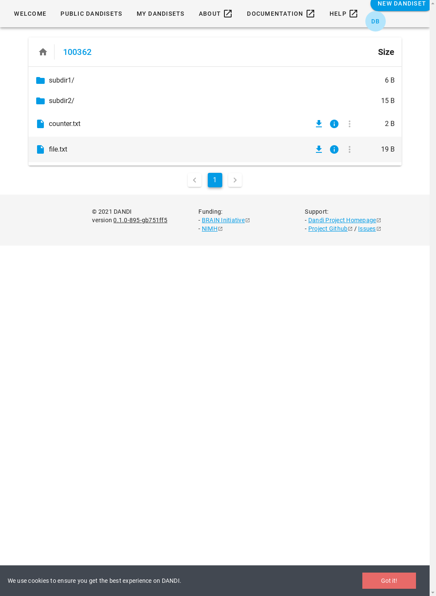 |

#### Error Messages
<pre>Message: unknown error: Chrome failed to start: exited abnormally
  (unknown error: Devtools port number file contents &lt;&gt; were in an unexpected format)
  (The process started from chrome location /usr/bin/chromium is no longer running, so ChromeDriver is assuming that Chrome has crashed.)
  (Driver info: chromedriver=73.0.3683.75,platform=Linux 4.19.0-0.bpo.9-amd64 x86_64)</pre>
<pre>Message: unknown error: Chrome failed to start: exited abnormally
  (unknown error: Devtools port number file contents &lt;&gt; were in an unexpected format)
  (The process started from chrome location /usr/bin/chromium is no longer running, so ChromeDriver is assuming that Chrome has crashed.)
  (Driver info: chromedriver=73.0.3683.75,platform=Linux 4.19.0-0.bpo.9-amd64 x86_64)</pre>
<pre>Message: unknown error: Chrome failed to start: exited abnormally
  (unknown error: Devtools port number file contents &lt;&gt; were in an unexpected format)
  (The process started from chrome location /usr/bin/chromium is no longer running, so ChromeDriver is assuming that Chrome has crashed.)
  (Driver info: chromedriver=73.0.3683.75,platform=Linux 4.19.0-0.bpo.9-amd64 x86_64)</pre>
### 100389

| t=[See below] [Go to page](https://gui-staging.dandiarchive.org/#/dandiset/100389) | t=[See below] Edit Metadata | t=[See below] [Go to page](https://gui-staging.dandiarchive.org/#/dandiset/100389/draft/files) |
| --- | --- | --- |
|  |  |  |

#### Error Messages
<pre>Message: unknown error: Chrome failed to start: exited abnormally
  (unknown error: DevToolsActivePort file doesn't exist)
  (The process started from chrome location /usr/bin/chromium is no longer running, so ChromeDriver is assuming that Chrome has crashed.)
  (Driver info: chromedriver=73.0.3683.75,platform=Linux 4.19.0-0.bpo.9-amd64 x86_64)</pre>
<pre>Message: unknown error: Chrome failed to start: exited abnormally
  (unknown error: Devtools port number file contents &lt;&gt; were in an unexpected format)
  (The process started from chrome location /usr/bin/chromium is no longer running, so ChromeDriver is assuming that Chrome has crashed.)
  (Driver info: chromedriver=73.0.3683.75,platform=Linux 4.19.0-0.bpo.9-amd64 x86_64)</pre>
<pre>Message: unknown error: Chrome failed to start: exited abnormally
  (unknown error: DevToolsActivePort file doesn't exist)
  (The process started from chrome location /usr/bin/chromium is no longer running, so ChromeDriver is assuming that Chrome has crashed.)
  (Driver info: chromedriver=73.0.3683.75,platform=Linux 4.19.0-0.bpo.9-amd64 x86_64)</pre>
### 100455

| t=[See below] [Go to page](https://gui-staging.dandiarchive.org/#/dandiset/100455) | t=[See below] Edit Metadata | t=[See below] [Go to page](https://gui-staging.dandiarchive.org/#/dandiset/100455/draft/files) |
| --- | --- | --- |
|  |  |  |

#### Error Messages
<pre>Message: unknown error: Chrome failed to start: exited abnormally
  (unknown error: DevToolsActivePort file doesn't exist)
  (The process started from chrome location /usr/bin/chromium is no longer running, so ChromeDriver is assuming that Chrome has crashed.)
  (Driver info: chromedriver=73.0.3683.75,platform=Linux 4.19.0-0.bpo.9-amd64 x86_64)</pre>
<pre>Message: unknown error: Chrome failed to start: exited abnormally
  (unknown error: Devtools port number file contents &lt;&gt; were in an unexpected format)
  (The process started from chrome location /usr/bin/chromium is no longer running, so ChromeDriver is assuming that Chrome has crashed.)
  (Driver info: chromedriver=73.0.3683.75,platform=Linux 4.19.0-0.bpo.9-amd64 x86_64)</pre>
<pre>Message: unknown error: Chrome failed to start: exited abnormally
  (unknown error: DevToolsActivePort file doesn't exist)
  (The process started from chrome location /usr/bin/chromium is no longer running, so ChromeDriver is assuming that Chrome has crashed.)
  (Driver info: chromedriver=73.0.3683.75,platform=Linux 4.19.0-0.bpo.9-amd64 x86_64)</pre>
### 100463

| t=[See below] [Go to page](https://gui-staging.dandiarchive.org/#/dandiset/100463) | t=[See below] Edit Metadata | t=[See below] [Go to page](https://gui-staging.dandiarchive.org/#/dandiset/100463/draft/files) |
| --- | --- | --- |
| 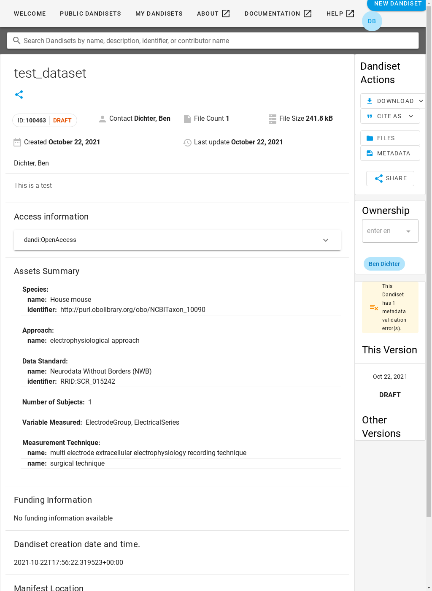 |  |  |

#### Error Messages
<pre>Message: unknown error: Chrome failed to start: exited abnormally
  (unknown error: Devtools port number file contents &lt;&gt; were in an unexpected format)
  (The process started from chrome location /usr/bin/chromium is no longer running, so ChromeDriver is assuming that Chrome has crashed.)
  (Driver info: chromedriver=73.0.3683.75,platform=Linux 4.19.0-0.bpo.9-amd64 x86_64)</pre>
<pre>Message: unknown error: Chrome failed to start: exited abnormally
  (unknown error: Devtools port number file contents &lt;&gt; were in an unexpected format)
  (The process started from chrome location /usr/bin/chromium is no longer running, so ChromeDriver is assuming that Chrome has crashed.)
  (Driver info: chromedriver=73.0.3683.75,platform=Linux 4.19.0-0.bpo.9-amd64 x86_64)</pre>
<pre>Message: unknown error: Chrome failed to start: exited abnormally
  (unknown error: DevToolsActivePort file doesn't exist)
  (The process started from chrome location /usr/bin/chromium is no longer running, so ChromeDriver is assuming that Chrome has crashed.)
  (Driver info: chromedriver=73.0.3683.75,platform=Linux 4.19.0-0.bpo.9-amd64 x86_64)</pre>
### 100464

| t=[See below] [Go to page](https://gui-staging.dandiarchive.org/#/dandiset/100464) | t=[See below] Edit Metadata | t=[See below] [Go to page](https://gui-staging.dandiarchive.org/#/dandiset/100464/draft/files) |
| --- | --- | --- |
| 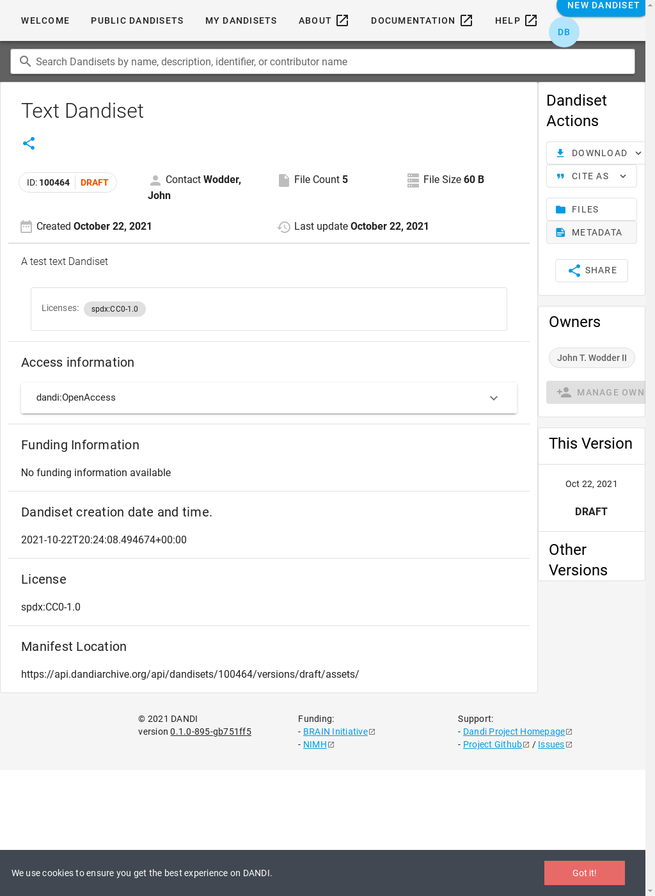 | 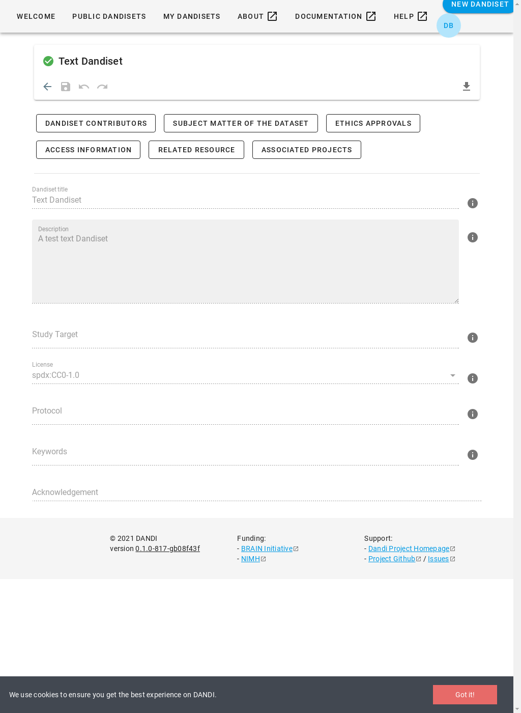 |  |

#### Error Messages
<pre>Message: unknown error: Chrome failed to start: exited abnormally
  (unknown error: Devtools port number file contents &lt;&gt; were in an unexpected format)
  (The process started from chrome location /usr/bin/chromium is no longer running, so ChromeDriver is assuming that Chrome has crashed.)
  (Driver info: chromedriver=73.0.3683.75,platform=Linux 4.19.0-0.bpo.9-amd64 x86_64)</pre>
<pre>Message: unknown error: Chrome failed to start: exited abnormally
  (unknown error: Devtools port number file contents &lt;&gt; were in an unexpected format)
  (The process started from chrome location /usr/bin/chromium is no longer running, so ChromeDriver is assuming that Chrome has crashed.)
  (Driver info: chromedriver=73.0.3683.75,platform=Linux 4.19.0-0.bpo.9-amd64 x86_64)</pre>
<pre>Message: unknown error: Chrome failed to start: exited abnormally
  (unknown error: DevToolsActivePort file doesn't exist)
  (The process started from chrome location /usr/bin/chromium is no longer running, so ChromeDriver is assuming that Chrome has crashed.)
  (Driver info: chromedriver=73.0.3683.75,platform=Linux 4.19.0-0.bpo.9-amd64 x86_64)</pre>
### 100467

| t=[See below] [Go to page](https://gui-staging.dandiarchive.org/#/dandiset/100467) | t=[See below] Edit Metadata | t=[See below] [Go to page](https://gui-staging.dandiarchive.org/#/dandiset/100467/draft/files) |
| --- | --- | --- |
| 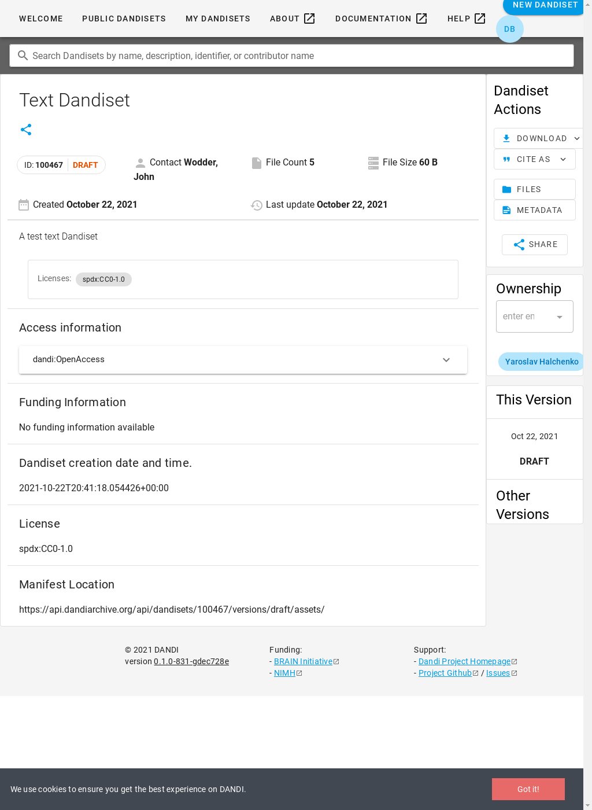 | 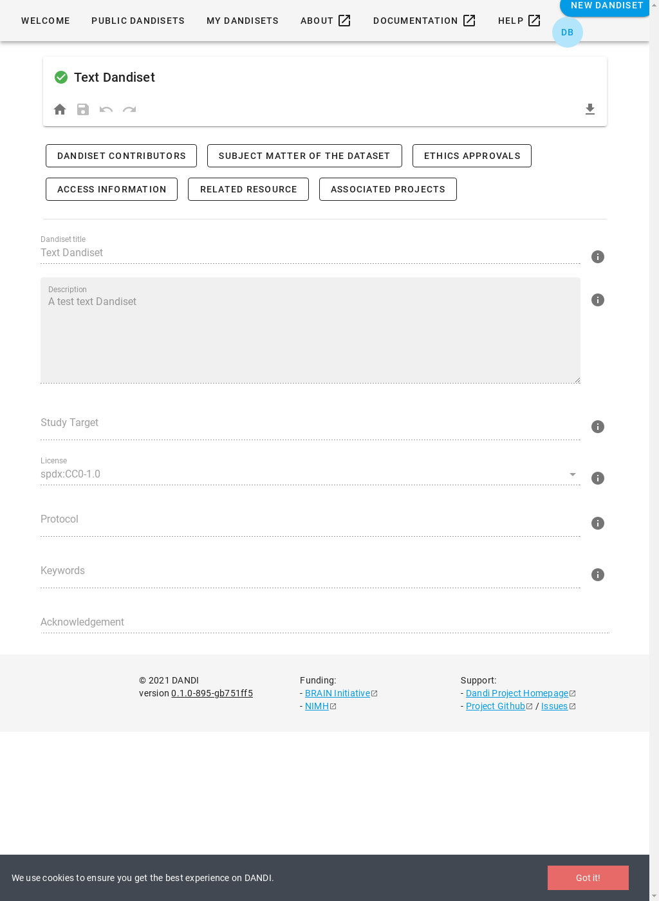 | 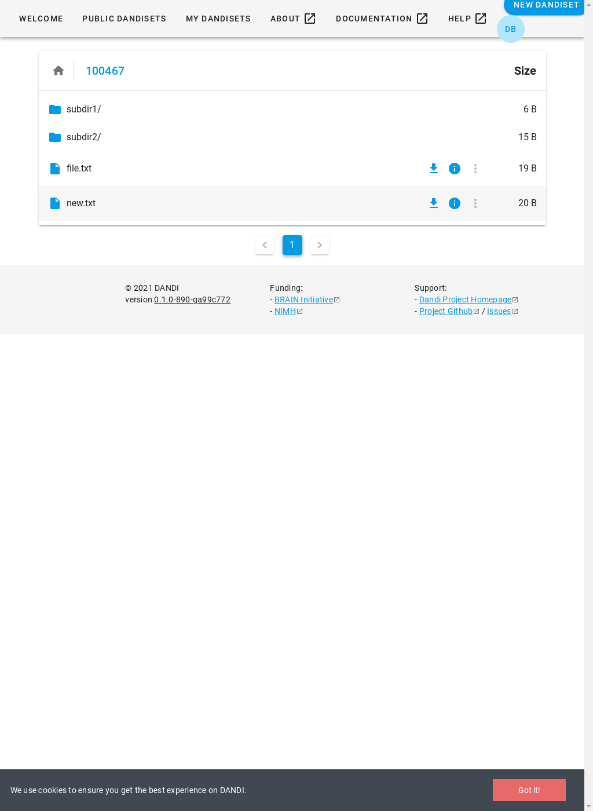 |

#### Error Messages
<pre>Message: unknown error: Chrome failed to start: exited abnormally
  (unknown error: Devtools port number file contents &lt;&gt; were in an unexpected format)
  (The process started from chrome location /usr/bin/chromium is no longer running, so ChromeDriver is assuming that Chrome has crashed.)
  (Driver info: chromedriver=73.0.3683.75,platform=Linux 4.19.0-0.bpo.9-amd64 x86_64)</pre>
<pre>Message: unknown error: Chrome failed to start: exited abnormally
  (unknown error: DevToolsActivePort file doesn't exist)
  (The process started from chrome location /usr/bin/chromium is no longer running, so ChromeDriver is assuming that Chrome has crashed.)
  (Driver info: chromedriver=73.0.3683.75,platform=Linux 4.19.0-0.bpo.9-amd64 x86_64)</pre>
<pre>Message: unknown error: Chrome failed to start: exited abnormally
  (unknown error: Devtools port number file contents &lt;&gt; were in an unexpected format)
  (The process started from chrome location /usr/bin/chromium is no longer running, so ChromeDriver is assuming that Chrome has crashed.)
  (Driver info: chromedriver=73.0.3683.75,platform=Linux 4.19.0-0.bpo.9-amd64 x86_64)</pre>
### 100507

| t=[See below] [Go to page](https://gui-staging.dandiarchive.org/#/dandiset/100507) | t=[See below] Edit Metadata | t=[See below] [Go to page](https://gui-staging.dandiarchive.org/#/dandiset/100507/draft/files) |
| --- | --- | --- |
| 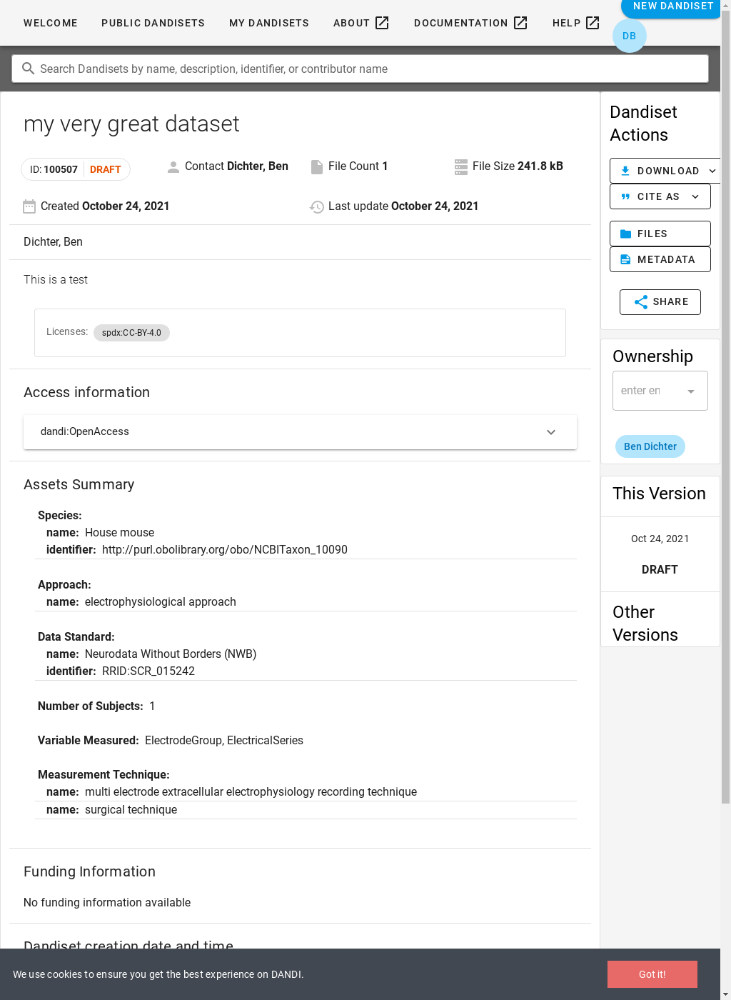 |  |  |

#### Error Messages
<pre>Message: unknown error: Chrome failed to start: exited abnormally
  (unknown error: DevToolsActivePort file doesn't exist)
  (The process started from chrome location /usr/bin/chromium is no longer running, so ChromeDriver is assuming that Chrome has crashed.)
  (Driver info: chromedriver=73.0.3683.75,platform=Linux 4.19.0-0.bpo.9-amd64 x86_64)</pre>
<pre>Message: unknown error: Chrome failed to start: exited abnormally
  (unknown error: DevToolsActivePort file doesn't exist)
  (The process started from chrome location /usr/bin/chromium is no longer running, so ChromeDriver is assuming that Chrome has crashed.)
  (Driver info: chromedriver=73.0.3683.75,platform=Linux 4.19.0-0.bpo.9-amd64 x86_64)</pre>
<pre>Message: unknown error: Chrome failed to start: exited abnormally
  (unknown error: Devtools port number file contents &lt;&gt; were in an unexpected format)
  (The process started from chrome location /usr/bin/chromium is no longer running, so ChromeDriver is assuming that Chrome has crashed.)
  (Driver info: chromedriver=73.0.3683.75,platform=Linux 4.19.0-0.bpo.9-amd64 x86_64)</pre>
### 100576

| t=[See below] [Go to page](https://gui-staging.dandiarchive.org/#/dandiset/100576) | t=[See below] Edit Metadata | t=[See below] [Go to page](https://gui-staging.dandiarchive.org/#/dandiset/100576/draft/files) |
| --- | --- | --- |
| 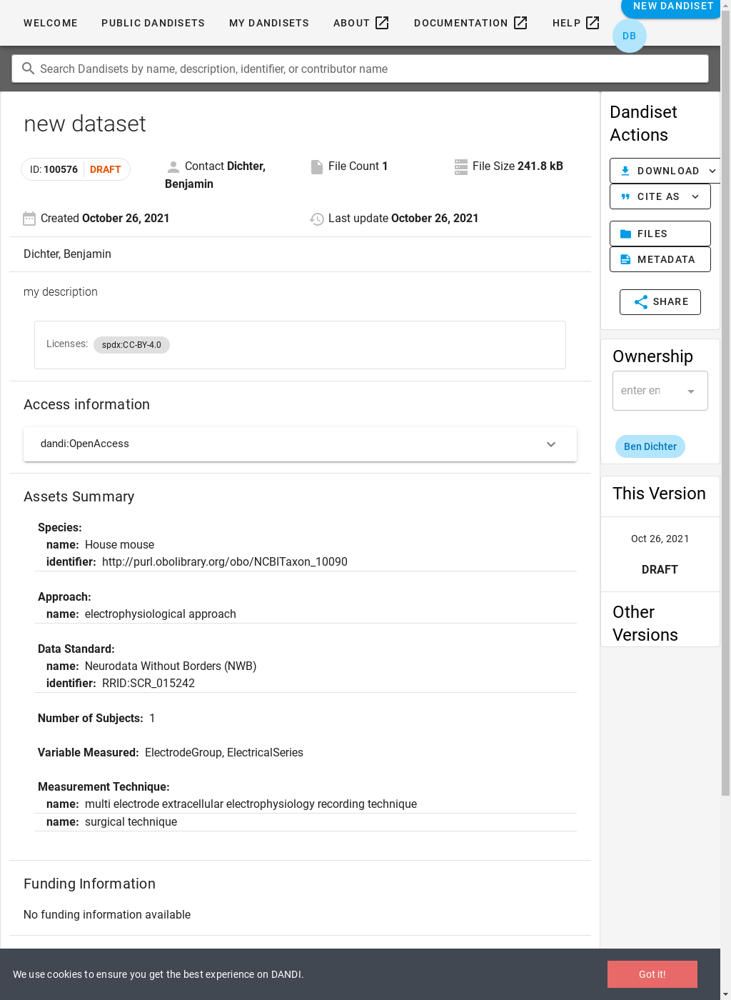 |  |  |

#### Error Messages
<pre>Message: unknown error: Chrome failed to start: exited abnormally
  (unknown error: DevToolsActivePort file doesn't exist)
  (The process started from chrome location /usr/bin/chromium is no longer running, so ChromeDriver is assuming that Chrome has crashed.)
  (Driver info: chromedriver=73.0.3683.75,platform=Linux 4.19.0-0.bpo.9-amd64 x86_64)</pre>
<pre>Message: unknown error: Chrome failed to start: exited abnormally
  (unknown error: DevToolsActivePort file doesn't exist)
  (The process started from chrome location /usr/bin/chromium is no longer running, so ChromeDriver is assuming that Chrome has crashed.)
  (Driver info: chromedriver=73.0.3683.75,platform=Linux 4.19.0-0.bpo.9-amd64 x86_64)</pre>
<pre>Message: unknown error: Chrome failed to start: exited abnormally
  (unknown error: Devtools port number file contents &lt;&gt; were in an unexpected format)
  (The process started from chrome location /usr/bin/chromium is no longer running, so ChromeDriver is assuming that Chrome has crashed.)
  (Driver info: chromedriver=73.0.3683.75,platform=Linux 4.19.0-0.bpo.9-amd64 x86_64)</pre>
### 100604

| t=[See below] [Go to page](https://gui-staging.dandiarchive.org/#/dandiset/100604) | t=[See below] Edit Metadata | t=[See below] [Go to page](https://gui-staging.dandiarchive.org/#/dandiset/100604/draft/files) |
| --- | --- | --- |
| 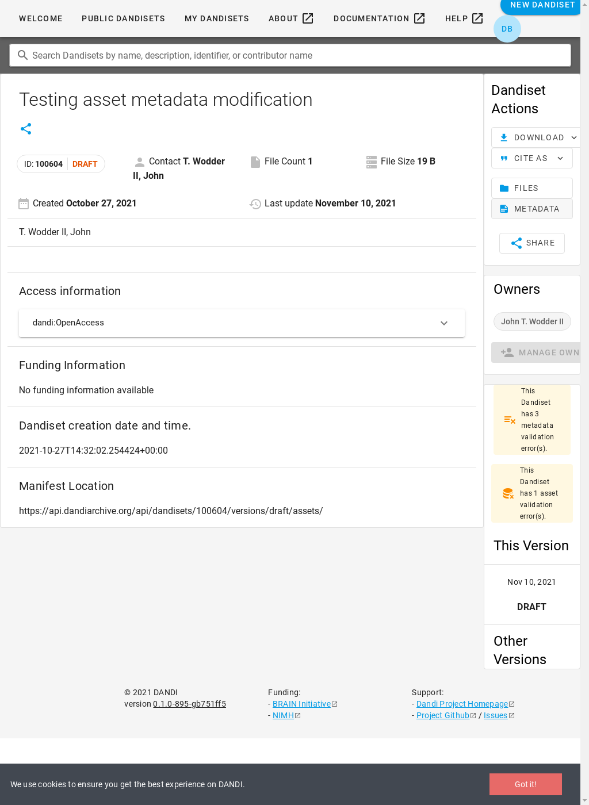 |  |  |

#### Error Messages
<pre>Message: unknown error: Chrome failed to start: exited abnormally
  (unknown error: Devtools port number file contents &lt;&gt; were in an unexpected format)
  (The process started from chrome location /usr/bin/chromium is no longer running, so ChromeDriver is assuming that Chrome has crashed.)
  (Driver info: chromedriver=73.0.3683.75,platform=Linux 4.19.0-0.bpo.9-amd64 x86_64)</pre>
<pre>Message: unknown error: Chrome failed to start: exited abnormally
  (unknown error: Devtools port number file contents &lt;&gt; were in an unexpected format)
  (The process started from chrome location /usr/bin/chromium is no longer running, so ChromeDriver is assuming that Chrome has crashed.)
  (Driver info: chromedriver=73.0.3683.75,platform=Linux 4.19.0-0.bpo.9-amd64 x86_64)</pre>
<pre>Message: unknown error: Chrome failed to start: exited abnormally
  (unknown error: DevToolsActivePort file doesn't exist)
  (The process started from chrome location /usr/bin/chromium is no longer running, so ChromeDriver is assuming that Chrome has crashed.)
  (Driver info: chromedriver=73.0.3683.75,platform=Linux 4.19.0-0.bpo.9-amd64 x86_64)</pre>
### 100605

| t=[See below] [Go to page](https://gui-staging.dandiarchive.org/#/dandiset/100605) | t=[See below] Edit Metadata | t=[See below] [Go to page](https://gui-staging.dandiarchive.org/#/dandiset/100605/draft/files) |
| --- | --- | --- |
| 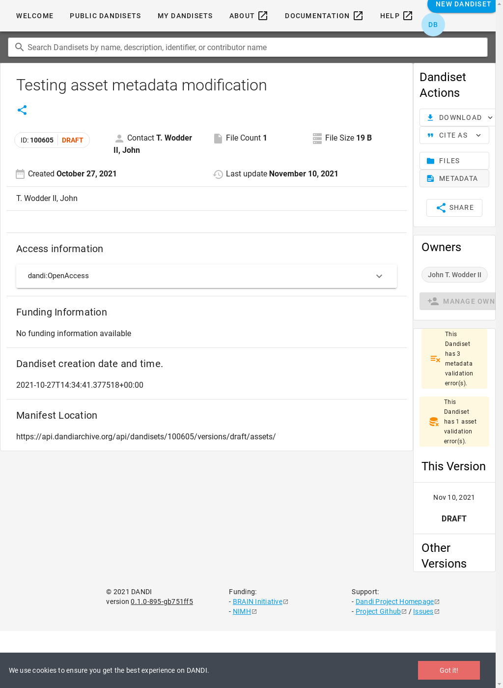 |  |  |

#### Error Messages
<pre>Message: unknown error: Chrome failed to start: exited abnormally
  (unknown error: Devtools port number file contents &lt;&gt; were in an unexpected format)
  (The process started from chrome location /usr/bin/chromium is no longer running, so ChromeDriver is assuming that Chrome has crashed.)
  (Driver info: chromedriver=73.0.3683.75,platform=Linux 4.19.0-0.bpo.9-amd64 x86_64)</pre>
<pre>Message: unknown error: Chrome failed to start: exited abnormally
  (unknown error: Devtools port number file contents &lt;&gt; were in an unexpected format)
  (The process started from chrome location /usr/bin/chromium is no longer running, so ChromeDriver is assuming that Chrome has crashed.)
  (Driver info: chromedriver=73.0.3683.75,platform=Linux 4.19.0-0.bpo.9-amd64 x86_64)</pre>
<pre>Message: unknown error: Chrome failed to start: exited abnormally
  (unknown error: DevToolsActivePort file doesn't exist)
  (The process started from chrome location /usr/bin/chromium is no longer running, so ChromeDriver is assuming that Chrome has crashed.)
  (Driver info: chromedriver=73.0.3683.75,platform=Linux 4.19.0-0.bpo.9-amd64 x86_64)</pre>
### 100653

| t=[See below] [Go to page](https://gui-staging.dandiarchive.org/#/dandiset/100653) | t=[See below] Edit Metadata | t=[See below] [Go to page](https://gui-staging.dandiarchive.org/#/dandiset/100653/draft/files) |
| --- | --- | --- |
| 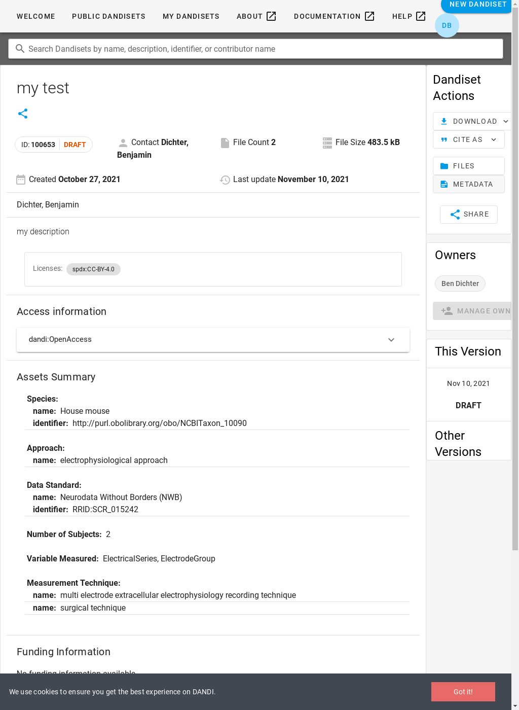 |  |  |

#### Error Messages
<pre>Message: unknown error: Chrome failed to start: exited abnormally
  (unknown error: DevToolsActivePort file doesn't exist)
  (The process started from chrome location /usr/bin/chromium is no longer running, so ChromeDriver is assuming that Chrome has crashed.)
  (Driver info: chromedriver=73.0.3683.75,platform=Linux 4.19.0-0.bpo.9-amd64 x86_64)</pre>
<pre>Message: unknown error: Chrome failed to start: exited abnormally
  (unknown error: Devtools port number file contents &lt;&gt; were in an unexpected format)
  (The process started from chrome location /usr/bin/chromium is no longer running, so ChromeDriver is assuming that Chrome has crashed.)
  (Driver info: chromedriver=73.0.3683.75,platform=Linux 4.19.0-0.bpo.9-amd64 x86_64)</pre>
<pre>Message: unknown error: Chrome failed to start: exited abnormally
  (unknown error: DevToolsActivePort file doesn't exist)
  (The process started from chrome location /usr/bin/chromium is no longer running, so ChromeDriver is assuming that Chrome has crashed.)
  (Driver info: chromedriver=73.0.3683.75,platform=Linux 4.19.0-0.bpo.9-amd64 x86_64)</pre>
### 100676

| t=[See below] [Go to page](https://gui-staging.dandiarchive.org/#/dandiset/100676) | t=[See below] Edit Metadata | t=[See below] [Go to page](https://gui-staging.dandiarchive.org/#/dandiset/100676/draft/files) |
| --- | --- | --- |
| 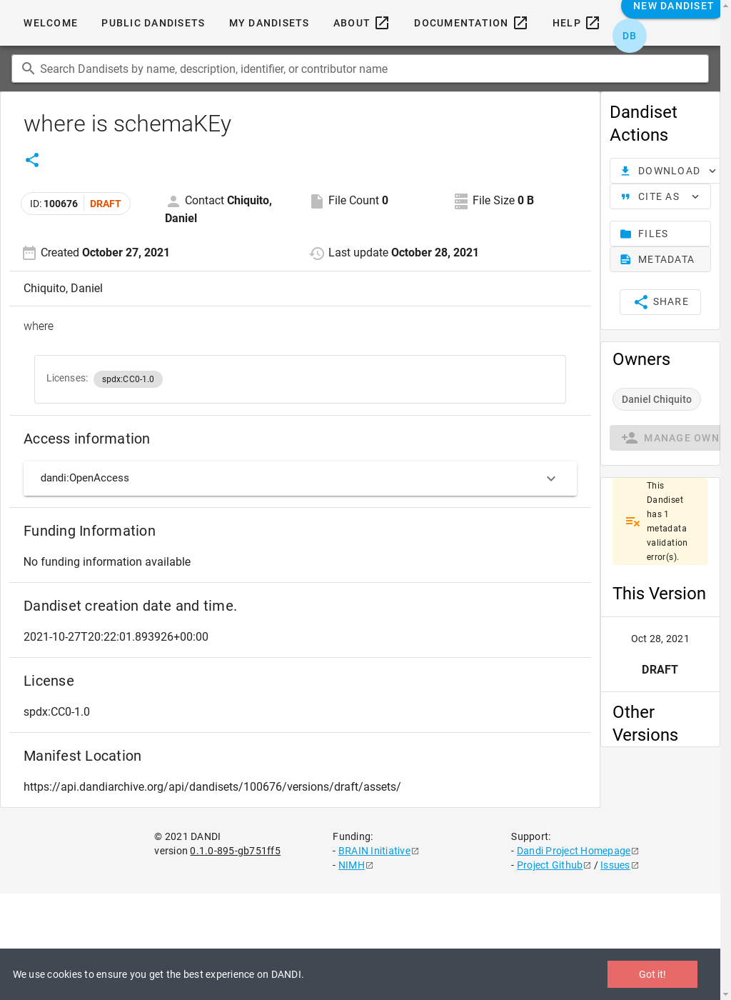 |  |  |

#### Error Messages
<pre>Message: unknown error: Chrome failed to start: exited abnormally
  (unknown error: DevToolsActivePort file doesn't exist)
  (The process started from chrome location /usr/bin/chromium is no longer running, so ChromeDriver is assuming that Chrome has crashed.)
  (Driver info: chromedriver=73.0.3683.75,platform=Linux 4.19.0-0.bpo.9-amd64 x86_64)</pre>
<pre>Message: unknown error: Chrome failed to start: exited abnormally
  (unknown error: DevToolsActivePort file doesn't exist)
  (The process started from chrome location /usr/bin/chromium is no longer running, so ChromeDriver is assuming that Chrome has crashed.)
  (Driver info: chromedriver=73.0.3683.75,platform=Linux 4.19.0-0.bpo.9-amd64 x86_64)</pre>
<pre>Message: unknown error: Chrome failed to start: exited abnormally
  (unknown error: Devtools port number file contents &lt;&gt; were in an unexpected format)
  (The process started from chrome location /usr/bin/chromium is no longer running, so ChromeDriver is assuming that Chrome has crashed.)
  (Driver info: chromedriver=73.0.3683.75,platform=Linux 4.19.0-0.bpo.9-amd64 x86_64)</pre>
### 100731

| t=[See below] [Go to page](https://gui-staging.dandiarchive.org/#/dandiset/100731) | t=[See below] Edit Metadata | t=[See below] [Go to page](https://gui-staging.dandiarchive.org/#/dandiset/100731/draft/files) |
| --- | --- | --- |
| 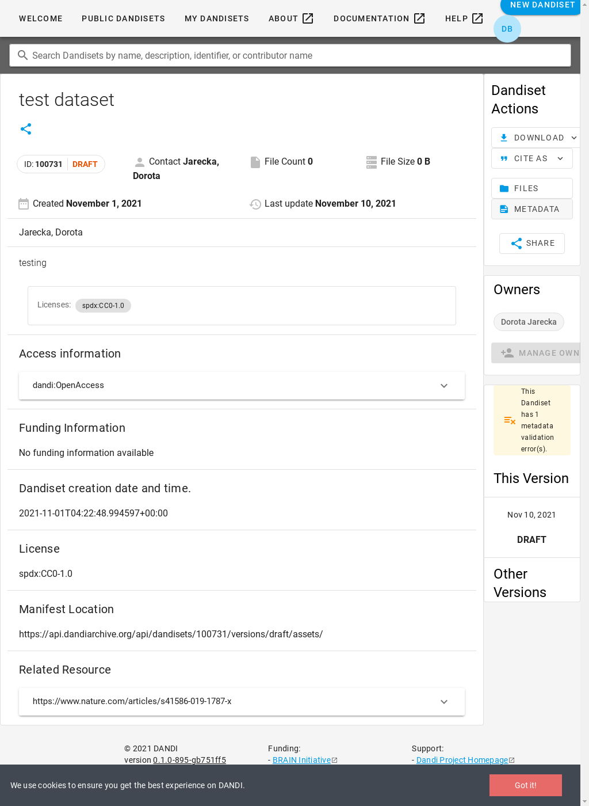 |  |  |

#### Error Messages
<pre>Message: unknown error: Chrome failed to start: exited abnormally
  (unknown error: Devtools port number file contents &lt;&gt; were in an unexpected format)
  (The process started from chrome location /usr/bin/chromium is no longer running, so ChromeDriver is assuming that Chrome has crashed.)
  (Driver info: chromedriver=73.0.3683.75,platform=Linux 4.19.0-0.bpo.9-amd64 x86_64)</pre>
<pre>Message: unknown error: Chrome failed to start: exited abnormally
  (unknown error: Devtools port number file contents &lt;&gt; were in an unexpected format)
  (The process started from chrome location /usr/bin/chromium is no longer running, so ChromeDriver is assuming that Chrome has crashed.)
  (Driver info: chromedriver=73.0.3683.75,platform=Linux 4.19.0-0.bpo.9-amd64 x86_64)</pre>
<pre>Message: unknown error: Chrome failed to start: exited abnormally
  (unknown error: Devtools port number file contents &lt;&gt; were in an unexpected format)
  (The process started from chrome location /usr/bin/chromium is no longer running, so ChromeDriver is assuming that Chrome has crashed.)
  (Driver info: chromedriver=73.0.3683.75,platform=Linux 4.19.0-0.bpo.9-amd64 x86_64)</pre>
### 100760

| t=[See below] [Go to page](https://gui-staging.dandiarchive.org/#/dandiset/100760) | t=[See below] Edit Metadata | t=[See below] [Go to page](https://gui-staging.dandiarchive.org/#/dandiset/100760/draft/files) |
| --- | --- | --- |
| 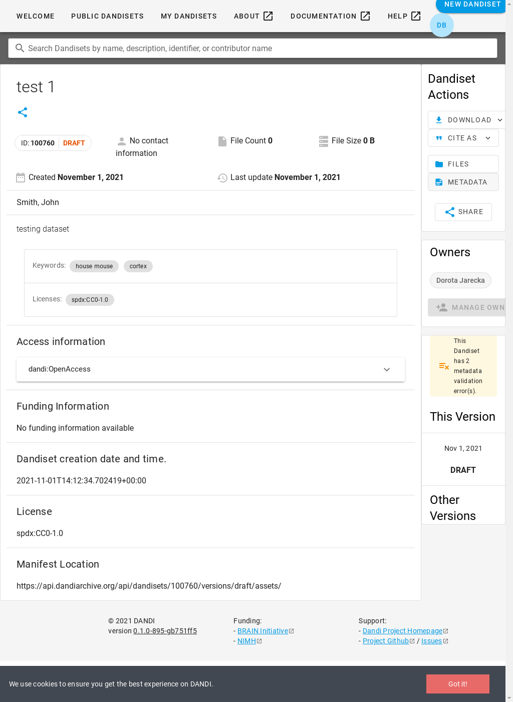 | 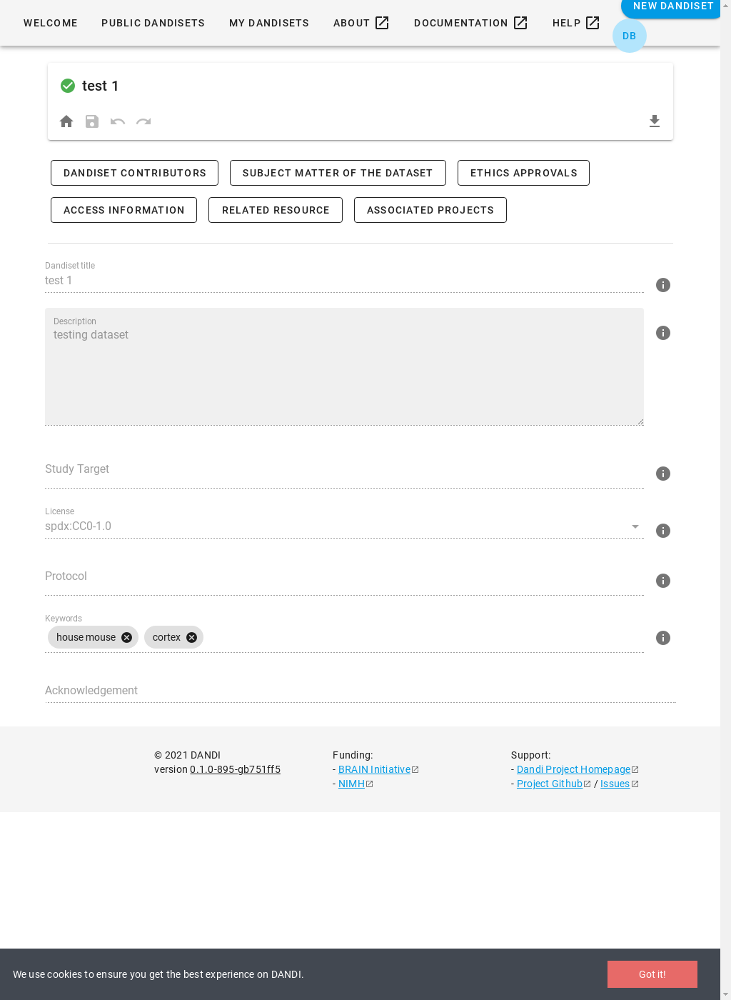 |  |

#### Error Messages
<pre>Message: unknown error: Chrome failed to start: exited abnormally
  (unknown error: DevToolsActivePort file doesn't exist)
  (The process started from chrome location /usr/bin/chromium is no longer running, so ChromeDriver is assuming that Chrome has crashed.)
  (Driver info: chromedriver=73.0.3683.75,platform=Linux 4.19.0-0.bpo.9-amd64 x86_64)</pre>
<pre>Message: unknown error: Chrome failed to start: exited abnormally
  (unknown error: Devtools port number file contents &lt;&gt; were in an unexpected format)
  (The process started from chrome location /usr/bin/chromium is no longer running, so ChromeDriver is assuming that Chrome has crashed.)
  (Driver info: chromedriver=73.0.3683.75,platform=Linux 4.19.0-0.bpo.9-amd64 x86_64)</pre>
<pre>Message: unknown error: Chrome failed to start: exited abnormally
  (unknown error: Devtools port number file contents &lt;&gt; were in an unexpected format)
  (The process started from chrome location /usr/bin/chromium is no longer running, so ChromeDriver is assuming that Chrome has crashed.)
  (Driver info: chromedriver=73.0.3683.75,platform=Linux 4.19.0-0.bpo.9-amd64 x86_64)</pre>
### 100773

| t=[See below] [Go to page](https://gui-staging.dandiarchive.org/#/dandiset/100773) | t=[See below] Edit Metadata | t=[See below] [Go to page](https://gui-staging.dandiarchive.org/#/dandiset/100773/draft/files) |
| --- | --- | --- |
| 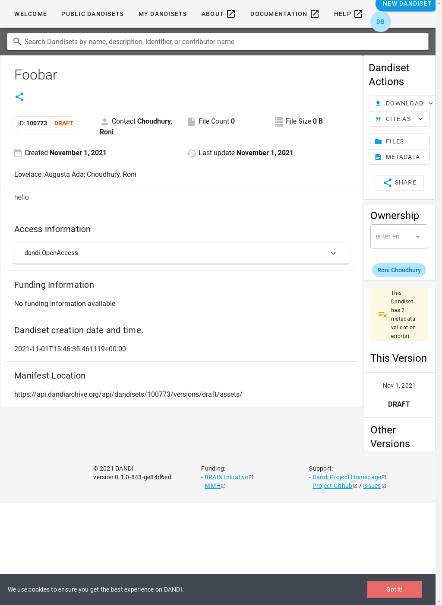 |  |  |

#### Error Messages
<pre>Message: unknown error: Chrome failed to start: exited abnormally
  (unknown error: Devtools port number file contents &lt;&gt; were in an unexpected format)
  (The process started from chrome location /usr/bin/chromium is no longer running, so ChromeDriver is assuming that Chrome has crashed.)
  (Driver info: chromedriver=73.0.3683.75,platform=Linux 4.19.0-0.bpo.9-amd64 x86_64)</pre>
<pre>Message: unknown error: Chrome failed to start: exited abnormally
  (unknown error: DevToolsActivePort file doesn't exist)
  (The process started from chrome location /usr/bin/chromium is no longer running, so ChromeDriver is assuming that Chrome has crashed.)
  (Driver info: chromedriver=73.0.3683.75,platform=Linux 4.19.0-0.bpo.9-amd64 x86_64)</pre>
<pre>Message: unknown error: Chrome failed to start: exited abnormally
  (unknown error: DevToolsActivePort file doesn't exist)
  (The process started from chrome location /usr/bin/chromium is no longer running, so ChromeDriver is assuming that Chrome has crashed.)
  (Driver info: chromedriver=73.0.3683.75,platform=Linux 4.19.0-0.bpo.9-amd64 x86_64)</pre>
### 100774

| t=[See below] [Go to page](https://gui-staging.dandiarchive.org/#/dandiset/100774) | t=[See below] Edit Metadata | t=[See below] [Go to page](https://gui-staging.dandiarchive.org/#/dandiset/100774/draft/files) |
| --- | --- | --- |
| 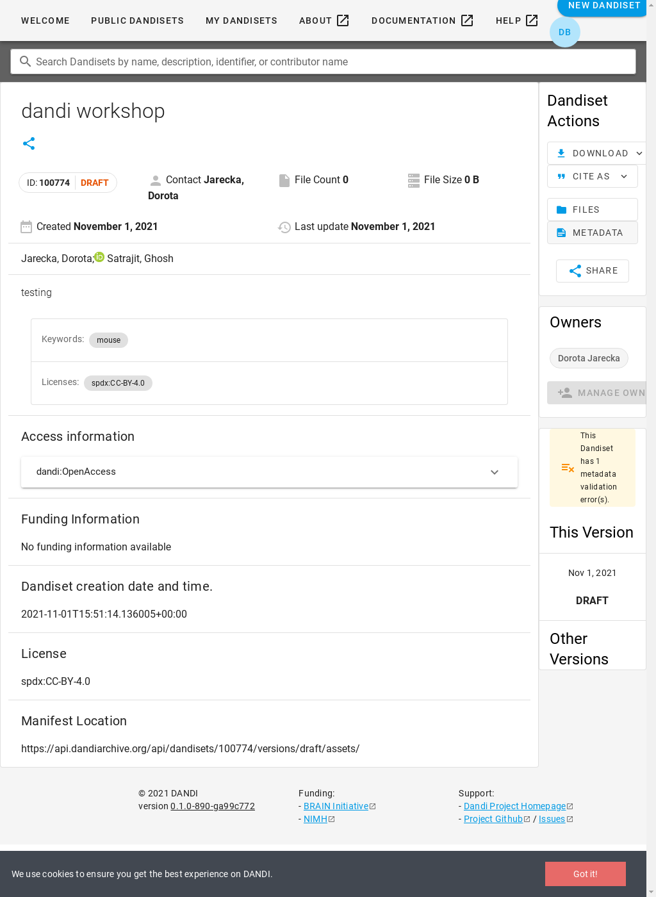 | 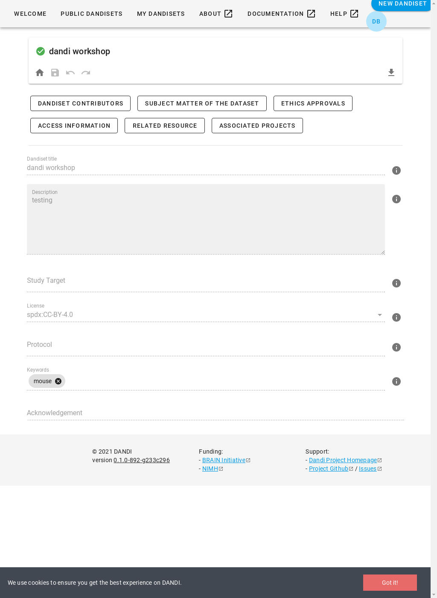 |  |

#### Error Messages
<pre>Message: unknown error: Chrome failed to start: exited abnormally
  (unknown error: DevToolsActivePort file doesn't exist)
  (The process started from chrome location /usr/bin/chromium is no longer running, so ChromeDriver is assuming that Chrome has crashed.)
  (Driver info: chromedriver=73.0.3683.75,platform=Linux 4.19.0-0.bpo.9-amd64 x86_64)</pre>
<pre>Message: unknown error: Chrome failed to start: exited abnormally
  (unknown error: Devtools port number file contents &lt;&gt; were in an unexpected format)
  (The process started from chrome location /usr/bin/chromium is no longer running, so ChromeDriver is assuming that Chrome has crashed.)
  (Driver info: chromedriver=73.0.3683.75,platform=Linux 4.19.0-0.bpo.9-amd64 x86_64)</pre>
<pre>Message: unknown error: Chrome failed to start: exited abnormally
  (unknown error: Devtools port number file contents &lt;&gt; were in an unexpected format)
  (The process started from chrome location /usr/bin/chromium is no longer running, so ChromeDriver is assuming that Chrome has crashed.)
  (Driver info: chromedriver=73.0.3683.75,platform=Linux 4.19.0-0.bpo.9-amd64 x86_64)</pre>
### 100775

| t=[See below] [Go to page](https://gui-staging.dandiarchive.org/#/dandiset/100775) | t=[See below] Edit Metadata | t=[See below] [Go to page](https://gui-staging.dandiarchive.org/#/dandiset/100775/draft/files) |
| --- | --- | --- |
| 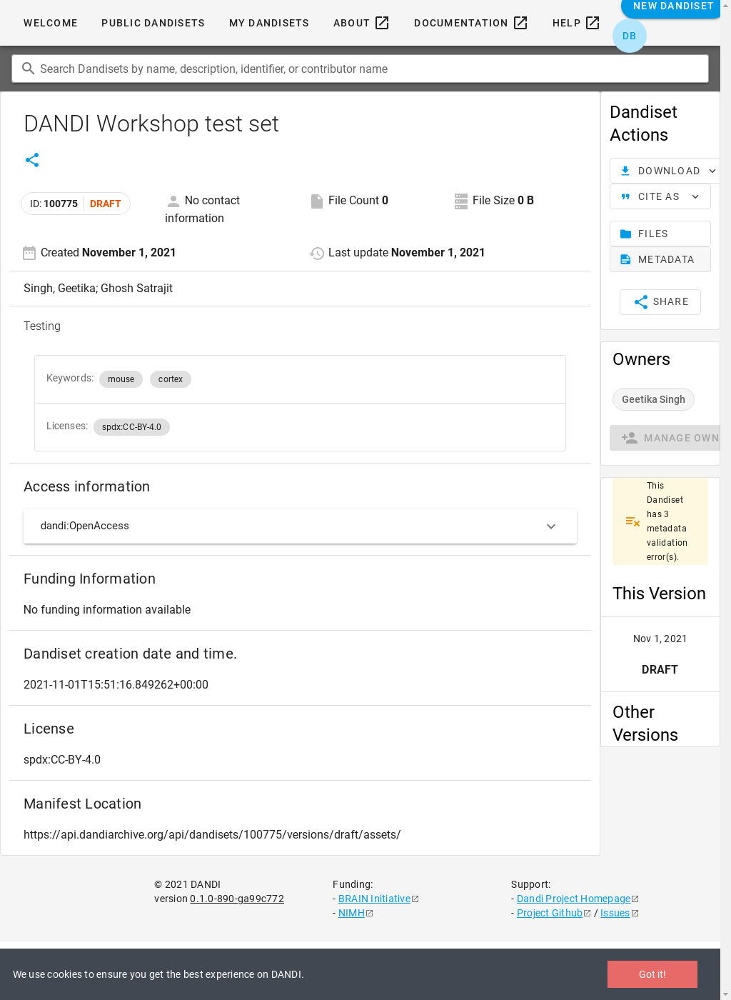 | 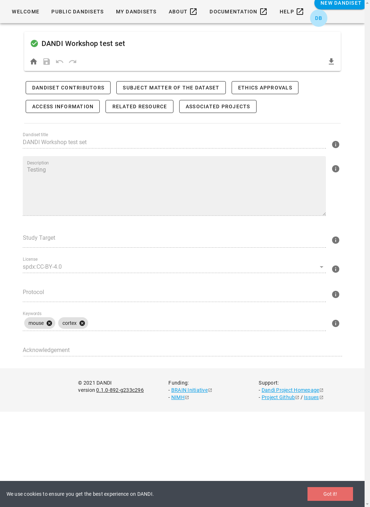 |  |

#### Error Messages
<pre>Message: unknown error: Chrome failed to start: exited abnormally
  (unknown error: Devtools port number file contents &lt;&gt; were in an unexpected format)
  (The process started from chrome location /usr/bin/chromium is no longer running, so ChromeDriver is assuming that Chrome has crashed.)
  (Driver info: chromedriver=73.0.3683.75,platform=Linux 4.19.0-0.bpo.9-amd64 x86_64)</pre>
<pre>Message: unknown error: Chrome failed to start: exited abnormally
  (unknown error: Devtools port number file contents &lt;&gt; were in an unexpected format)
  (The process started from chrome location /usr/bin/chromium is no longer running, so ChromeDriver is assuming that Chrome has crashed.)
  (Driver info: chromedriver=73.0.3683.75,platform=Linux 4.19.0-0.bpo.9-amd64 x86_64)</pre>
<pre>Message: unknown error: Chrome failed to start: exited abnormally
  (unknown error: DevToolsActivePort file doesn't exist)
  (The process started from chrome location /usr/bin/chromium is no longer running, so ChromeDriver is assuming that Chrome has crashed.)
  (Driver info: chromedriver=73.0.3683.75,platform=Linux 4.19.0-0.bpo.9-amd64 x86_64)</pre>
### 100776

| t=[See below] [Go to page](https://gui-staging.dandiarchive.org/#/dandiset/100776) | t=[See below] Edit Metadata | t=[See below] [Go to page](https://gui-staging.dandiarchive.org/#/dandiset/100776/draft/files) |
| --- | --- | --- |
| 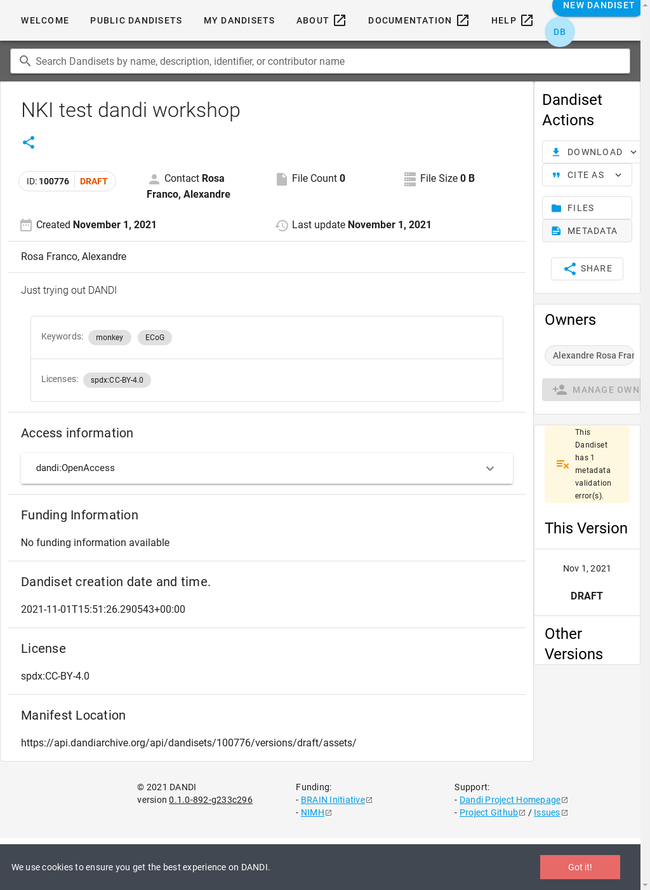 | 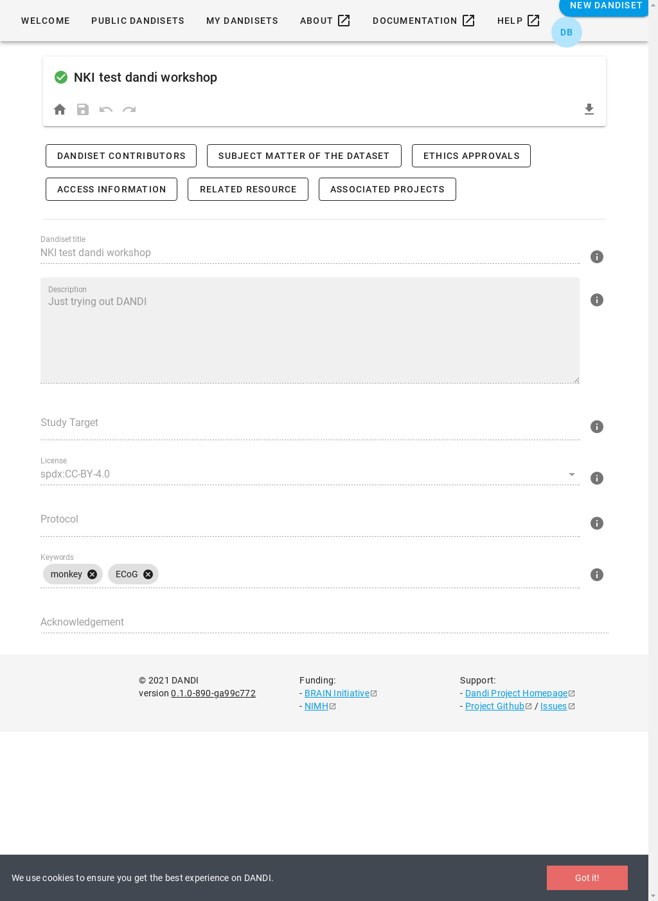 |  |

#### Error Messages
<pre>Message: unknown error: Chrome failed to start: exited abnormally
  (unknown error: Devtools port number file contents &lt;&gt; were in an unexpected format)
  (The process started from chrome location /usr/bin/chromium is no longer running, so ChromeDriver is assuming that Chrome has crashed.)
  (Driver info: chromedriver=73.0.3683.75,platform=Linux 4.19.0-0.bpo.9-amd64 x86_64)</pre>
<pre>Message: unknown error: Chrome failed to start: exited abnormally
  (unknown error: DevToolsActivePort file doesn't exist)
  (The process started from chrome location /usr/bin/chromium is no longer running, so ChromeDriver is assuming that Chrome has crashed.)
  (Driver info: chromedriver=73.0.3683.75,platform=Linux 4.19.0-0.bpo.9-amd64 x86_64)</pre>
<pre>Message: unknown error: Chrome failed to start: exited abnormally
  (unknown error: Devtools port number file contents &lt;&gt; were in an unexpected format)
  (The process started from chrome location /usr/bin/chromium is no longer running, so ChromeDriver is assuming that Chrome has crashed.)
  (Driver info: chromedriver=73.0.3683.75,platform=Linux 4.19.0-0.bpo.9-amd64 x86_64)</pre>
### 100777

| t=[See below] [Go to page](https://gui-staging.dandiarchive.org/#/dandiset/100777) | t=[See below] Edit Metadata | t=[See below] [Go to page](https://gui-staging.dandiarchive.org/#/dandiset/100777/draft/files) |
| --- | --- | --- |
| 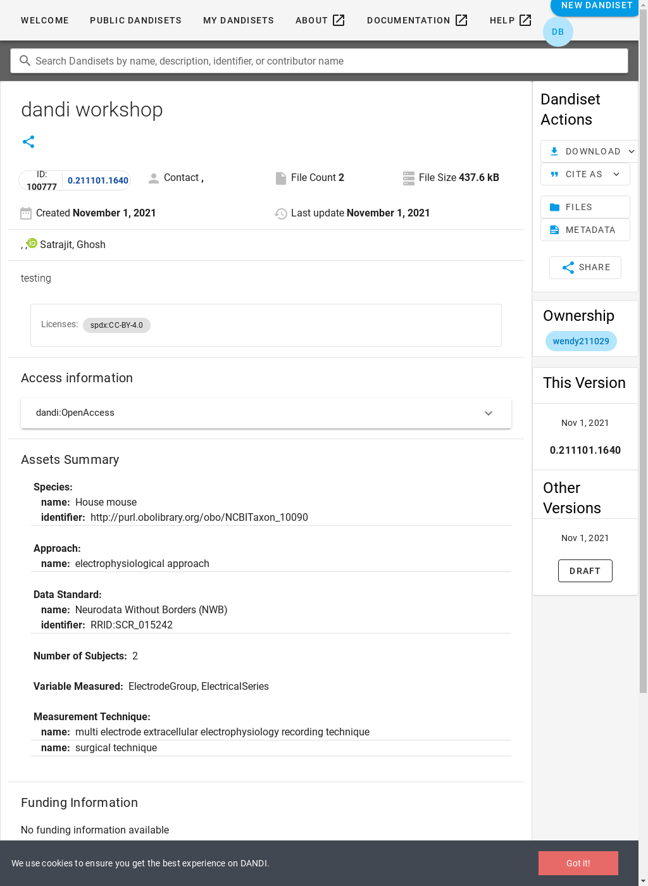 | 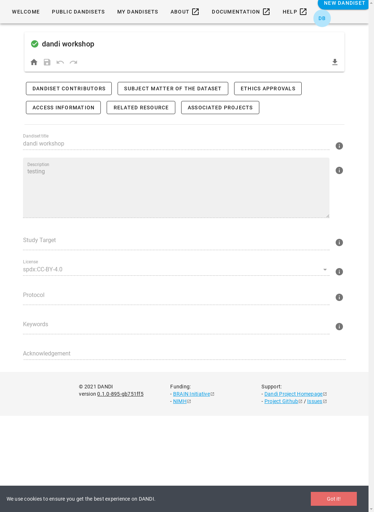 |  |

#### Error Messages
<pre>Message: unknown error: Chrome failed to start: exited abnormally
  (unknown error: DevToolsActivePort file doesn't exist)
  (The process started from chrome location /usr/bin/chromium is no longer running, so ChromeDriver is assuming that Chrome has crashed.)
  (Driver info: chromedriver=73.0.3683.75,platform=Linux 4.19.0-0.bpo.9-amd64 x86_64)</pre>
<pre>Message: unknown error: Chrome failed to start: exited abnormally
  (unknown error: Devtools port number file contents &lt;&gt; were in an unexpected format)
  (The process started from chrome location /usr/bin/chromium is no longer running, so ChromeDriver is assuming that Chrome has crashed.)
  (Driver info: chromedriver=73.0.3683.75,platform=Linux 4.19.0-0.bpo.9-amd64 x86_64)</pre>
<pre>Message: unknown error: Chrome failed to start: exited abnormally
  (unknown error: Devtools port number file contents &lt;&gt; were in an unexpected format)
  (The process started from chrome location /usr/bin/chromium is no longer running, so ChromeDriver is assuming that Chrome has crashed.)
  (Driver info: chromedriver=73.0.3683.75,platform=Linux 4.19.0-0.bpo.9-amd64 x86_64)</pre>
### 100778

| t=[See below] [Go to page](https://gui-staging.dandiarchive.org/#/dandiset/100778) | t=[See below] Edit Metadata | t=[See below] [Go to page](https://gui-staging.dandiarchive.org/#/dandiset/100778/draft/files) |
| --- | --- | --- |
| 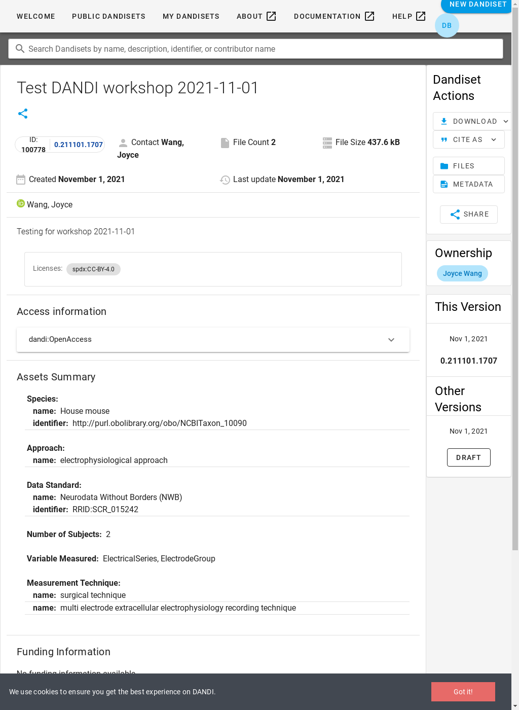 | 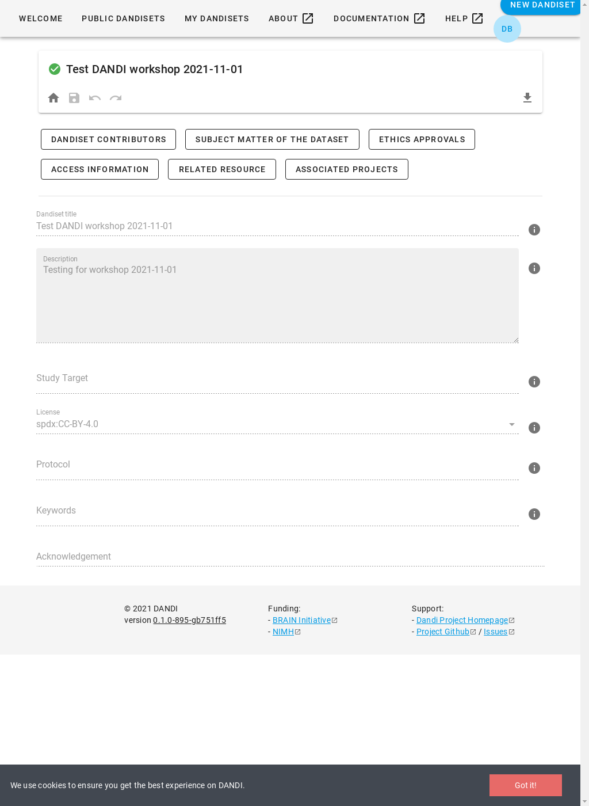 |  |

#### Error Messages
<pre>Message: unknown error: Chrome failed to start: exited abnormally
  (unknown error: DevToolsActivePort file doesn't exist)
  (The process started from chrome location /usr/bin/chromium is no longer running, so ChromeDriver is assuming that Chrome has crashed.)
  (Driver info: chromedriver=73.0.3683.75,platform=Linux 4.19.0-0.bpo.9-amd64 x86_64)</pre>
<pre>Message: unknown error: Chrome failed to start: exited abnormally
  (unknown error: Devtools port number file contents &lt;&gt; were in an unexpected format)
  (The process started from chrome location /usr/bin/chromium is no longer running, so ChromeDriver is assuming that Chrome has crashed.)
  (Driver info: chromedriver=73.0.3683.75,platform=Linux 4.19.0-0.bpo.9-amd64 x86_64)</pre>
<pre>Message: unknown error: Chrome failed to start: exited abnormally
  (unknown error: Devtools port number file contents &lt;&gt; were in an unexpected format)
  (The process started from chrome location /usr/bin/chromium is no longer running, so ChromeDriver is assuming that Chrome has crashed.)
  (Driver info: chromedriver=73.0.3683.75,platform=Linux 4.19.0-0.bpo.9-amd64 x86_64)</pre>
### 100779

| t=[See below] [Go to page](https://gui-staging.dandiarchive.org/#/dandiset/100779) | t=[See below] Edit Metadata | t=[See below] [Go to page](https://gui-staging.dandiarchive.org/#/dandiset/100779/draft/files) |
| --- | --- | --- |
| 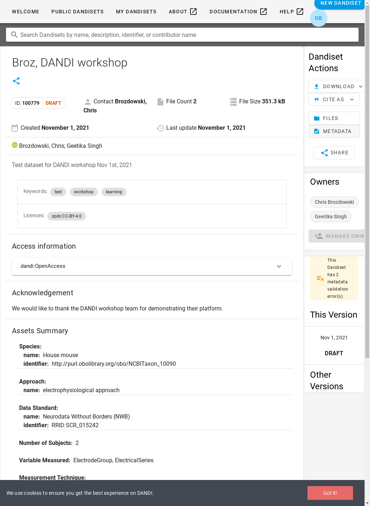 | 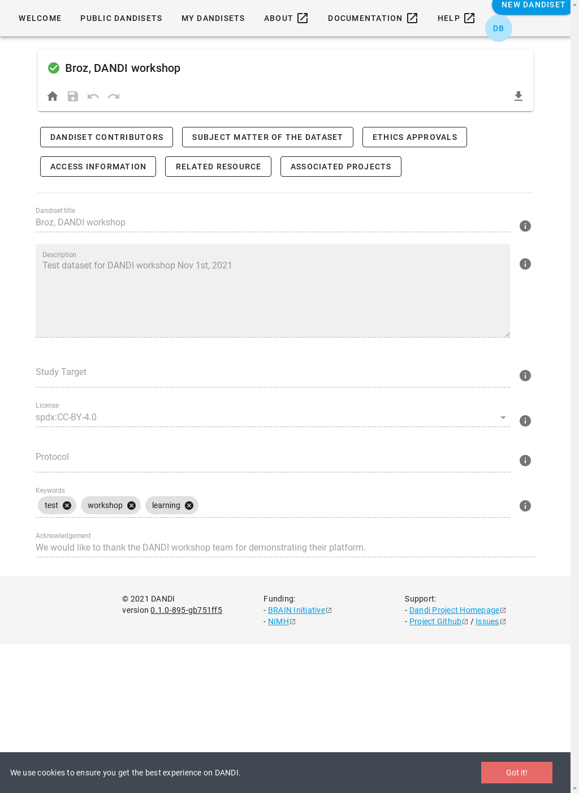 |  |

#### Error Messages
<pre>Message: unknown error: Chrome failed to start: exited abnormally
  (unknown error: Devtools port number file contents &lt;&gt; were in an unexpected format)
  (The process started from chrome location /usr/bin/chromium is no longer running, so ChromeDriver is assuming that Chrome has crashed.)
  (Driver info: chromedriver=73.0.3683.75,platform=Linux 4.19.0-0.bpo.9-amd64 x86_64)</pre>
<pre>Message: unknown error: Chrome failed to start: exited abnormally
  (unknown error: Devtools port number file contents &lt;&gt; were in an unexpected format)
  (The process started from chrome location /usr/bin/chromium is no longer running, so ChromeDriver is assuming that Chrome has crashed.)
  (Driver info: chromedriver=73.0.3683.75,platform=Linux 4.19.0-0.bpo.9-amd64 x86_64)</pre>
<pre>Message: unknown error: Chrome failed to start: exited abnormally
  (unknown error: Devtools port number file contents &lt;&gt; were in an unexpected format)
  (The process started from chrome location /usr/bin/chromium is no longer running, so ChromeDriver is assuming that Chrome has crashed.)
  (Driver info: chromedriver=73.0.3683.75,platform=Linux 4.19.0-0.bpo.9-amd64 x86_64)</pre>
### 100780

| t=[See below] [Go to page](https://gui-staging.dandiarchive.org/#/dandiset/100780) | t=[See below] Edit Metadata | t=[See below] [Go to page](https://gui-staging.dandiarchive.org/#/dandiset/100780/draft/files) |
| --- | --- | --- |
| 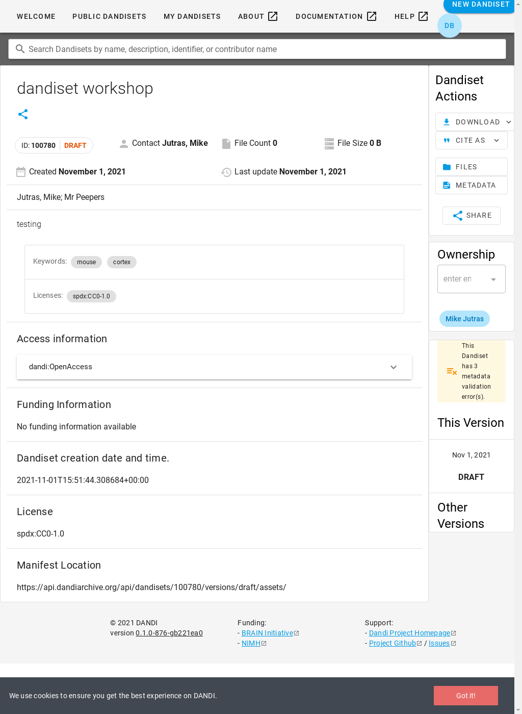 | 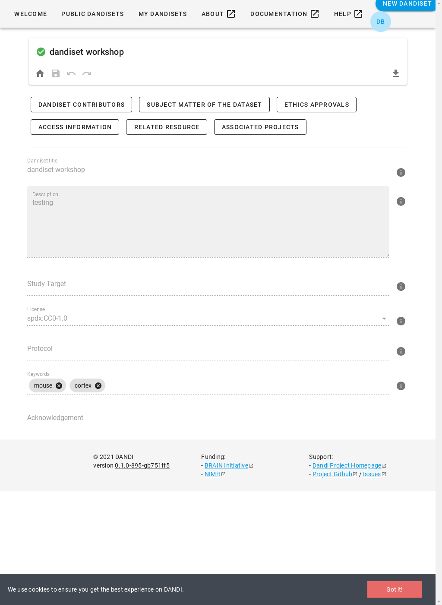 |  |

#### Error Messages
<pre>Message: unknown error: Chrome failed to start: exited abnormally
  (unknown error: DevToolsActivePort file doesn't exist)
  (The process started from chrome location /usr/bin/chromium is no longer running, so ChromeDriver is assuming that Chrome has crashed.)
  (Driver info: chromedriver=73.0.3683.75,platform=Linux 4.19.0-0.bpo.9-amd64 x86_64)</pre>
<pre>Message: unknown error: Chrome failed to start: exited abnormally
  (unknown error: Devtools port number file contents &lt;&gt; were in an unexpected format)
  (The process started from chrome location /usr/bin/chromium is no longer running, so ChromeDriver is assuming that Chrome has crashed.)
  (Driver info: chromedriver=73.0.3683.75,platform=Linux 4.19.0-0.bpo.9-amd64 x86_64)</pre>
<pre>Message: unknown error: Chrome failed to start: exited abnormally
  (unknown error: DevToolsActivePort file doesn't exist)
  (The process started from chrome location /usr/bin/chromium is no longer running, so ChromeDriver is assuming that Chrome has crashed.)
  (Driver info: chromedriver=73.0.3683.75,platform=Linux 4.19.0-0.bpo.9-amd64 x86_64)</pre>
### 100781

| t=[See below] [Go to page](https://gui-staging.dandiarchive.org/#/dandiset/100781) | t=[See below] Edit Metadata | t=[See below] [Go to page](https://gui-staging.dandiarchive.org/#/dandiset/100781/draft/files) |
| --- | --- | --- |
| 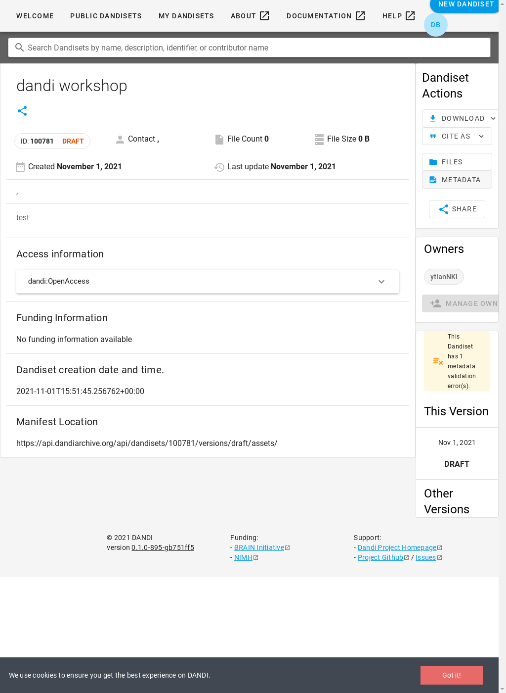 | 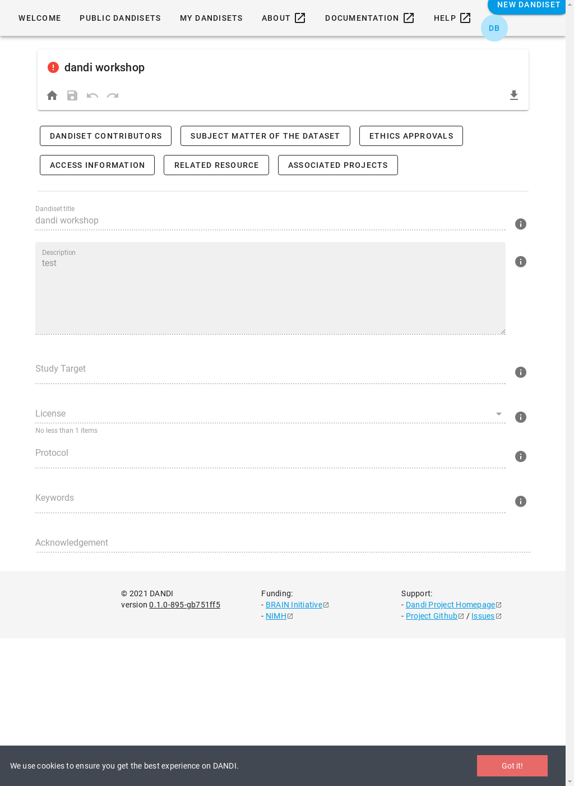 |  |

#### Error Messages
<pre>Message: unknown error: Chrome failed to start: exited abnormally
  (unknown error: Devtools port number file contents &lt;&gt; were in an unexpected format)
  (The process started from chrome location /usr/bin/chromium is no longer running, so ChromeDriver is assuming that Chrome has crashed.)
  (Driver info: chromedriver=73.0.3683.75,platform=Linux 4.19.0-0.bpo.9-amd64 x86_64)</pre>
<pre>Message: unknown error: Chrome failed to start: exited abnormally
  (unknown error: DevToolsActivePort file doesn't exist)
  (The process started from chrome location /usr/bin/chromium is no longer running, so ChromeDriver is assuming that Chrome has crashed.)
  (Driver info: chromedriver=73.0.3683.75,platform=Linux 4.19.0-0.bpo.9-amd64 x86_64)</pre>
<pre>Message: unknown error: Chrome failed to start: exited abnormally
  (unknown error: DevToolsActivePort file doesn't exist)
  (The process started from chrome location /usr/bin/chromium is no longer running, so ChromeDriver is assuming that Chrome has crashed.)
  (Driver info: chromedriver=73.0.3683.75,platform=Linux 4.19.0-0.bpo.9-amd64 x86_64)</pre>
### 100782

| t=[See below] [Go to page](https://gui-staging.dandiarchive.org/#/dandiset/100782) | t=[See below] Edit Metadata | t=[See below] [Go to page](https://gui-staging.dandiarchive.org/#/dandiset/100782/draft/files) |
| --- | --- | --- |
| 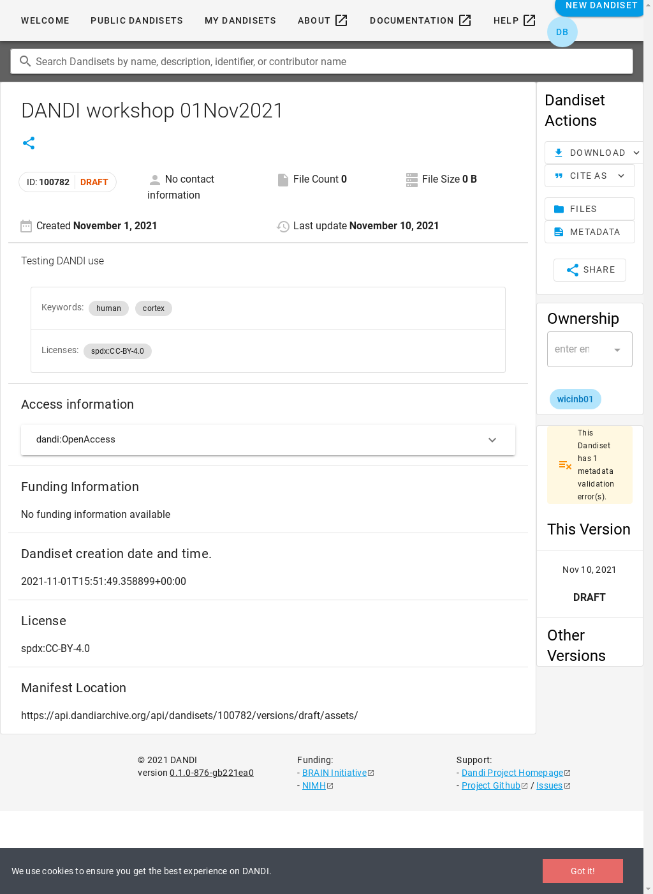 | 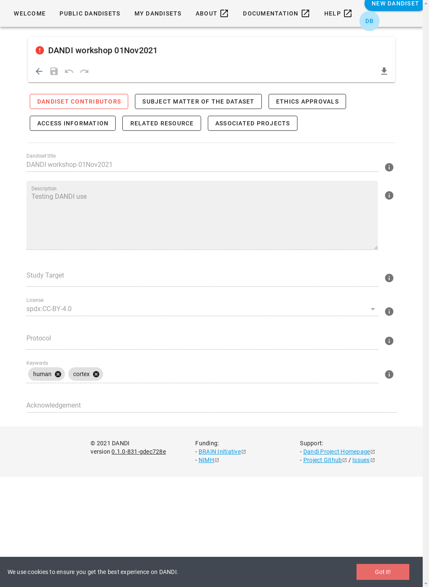 |  |

#### Error Messages
<pre>Message: unknown error: Chrome failed to start: exited abnormally
  (unknown error: DevToolsActivePort file doesn't exist)
  (The process started from chrome location /usr/bin/chromium is no longer running, so ChromeDriver is assuming that Chrome has crashed.)
  (Driver info: chromedriver=73.0.3683.75,platform=Linux 4.19.0-0.bpo.9-amd64 x86_64)</pre>
<pre>Message: unknown error: Chrome failed to start: exited abnormally
  (unknown error: DevToolsActivePort file doesn't exist)
  (The process started from chrome location /usr/bin/chromium is no longer running, so ChromeDriver is assuming that Chrome has crashed.)
  (Driver info: chromedriver=73.0.3683.75,platform=Linux 4.19.0-0.bpo.9-amd64 x86_64)</pre>
<pre>Message: unknown error: Chrome failed to start: exited abnormally
  (unknown error: DevToolsActivePort file doesn't exist)
  (The process started from chrome location /usr/bin/chromium is no longer running, so ChromeDriver is assuming that Chrome has crashed.)
  (Driver info: chromedriver=73.0.3683.75,platform=Linux 4.19.0-0.bpo.9-amd64 x86_64)</pre>
### 100783

| t=[See below] [Go to page](https://gui-staging.dandiarchive.org/#/dandiset/100783) | t=[See below] Edit Metadata | t=[See below] [Go to page](https://gui-staging.dandiarchive.org/#/dandiset/100783/draft/files) |
| --- | --- | --- |
| 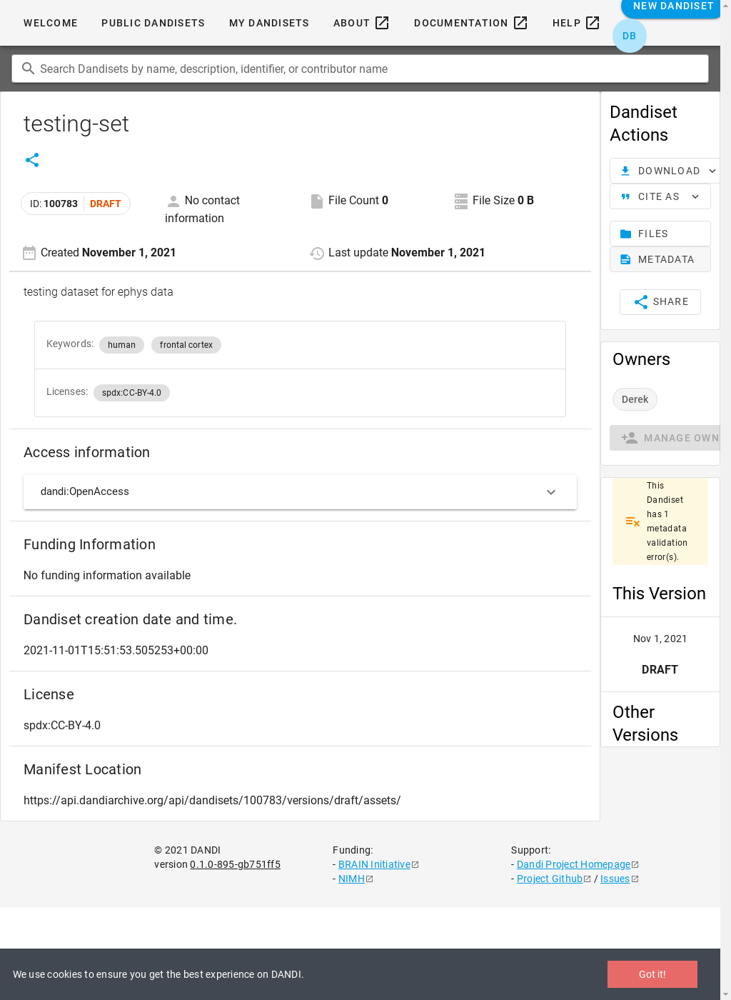 | 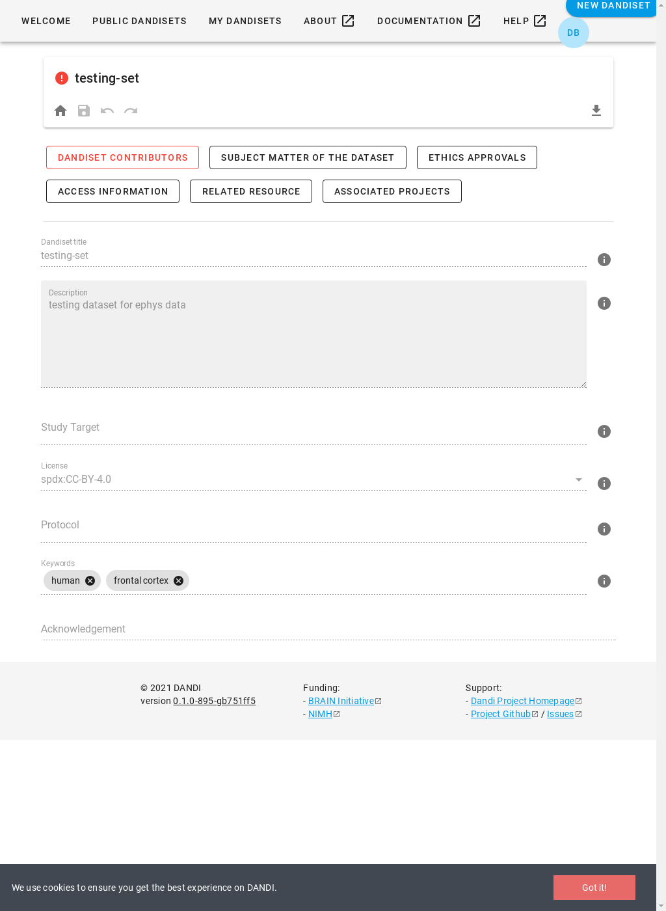 |  |

#### Error Messages
<pre>Message: unknown error: Chrome failed to start: exited abnormally
  (unknown error: DevToolsActivePort file doesn't exist)
  (The process started from chrome location /usr/bin/chromium is no longer running, so ChromeDriver is assuming that Chrome has crashed.)
  (Driver info: chromedriver=73.0.3683.75,platform=Linux 4.19.0-0.bpo.9-amd64 x86_64)</pre>
<pre>Message: unknown error: Chrome failed to start: exited abnormally
  (unknown error: DevToolsActivePort file doesn't exist)
  (The process started from chrome location /usr/bin/chromium is no longer running, so ChromeDriver is assuming that Chrome has crashed.)
  (Driver info: chromedriver=73.0.3683.75,platform=Linux 4.19.0-0.bpo.9-amd64 x86_64)</pre>
<pre>Message: unknown error: Chrome failed to start: exited abnormally
  (unknown error: DevToolsActivePort file doesn't exist)
  (The process started from chrome location /usr/bin/chromium is no longer running, so ChromeDriver is assuming that Chrome has crashed.)
  (Driver info: chromedriver=73.0.3683.75,platform=Linux 4.19.0-0.bpo.9-amd64 x86_64)</pre>
### 100784

| t=[See below] [Go to page](https://gui-staging.dandiarchive.org/#/dandiset/100784) | t=[See below] Edit Metadata | t=[See below] [Go to page](https://gui-staging.dandiarchive.org/#/dandiset/100784/draft/files) |
| --- | --- | --- |
| 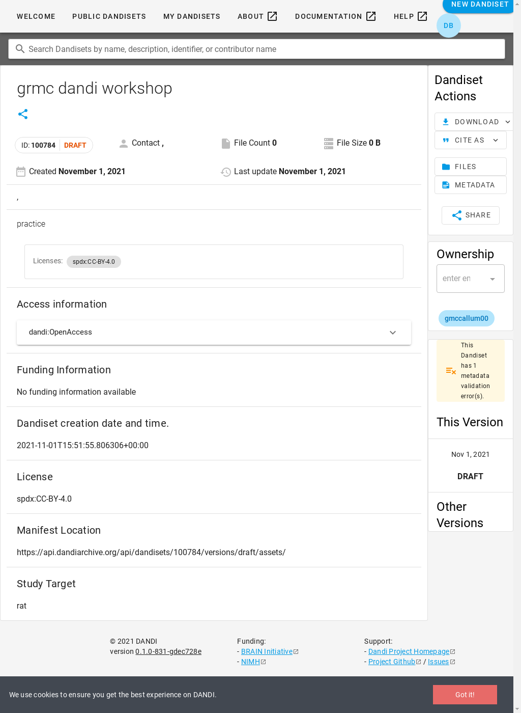 | 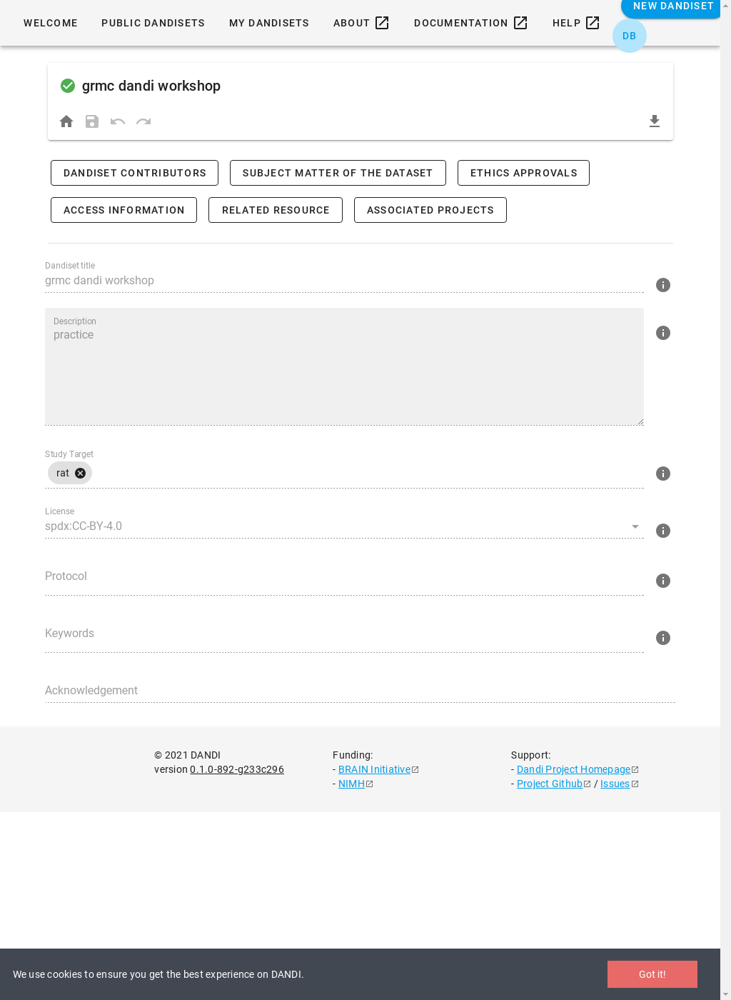 |  |

#### Error Messages
<pre>Message: unknown error: Chrome failed to start: exited abnormally
  (unknown error: DevToolsActivePort file doesn't exist)
  (The process started from chrome location /usr/bin/chromium is no longer running, so ChromeDriver is assuming that Chrome has crashed.)
  (Driver info: chromedriver=73.0.3683.75,platform=Linux 4.19.0-0.bpo.9-amd64 x86_64)</pre>
<pre>Message: unknown error: Chrome failed to start: exited abnormally
  (unknown error: DevToolsActivePort file doesn't exist)
  (The process started from chrome location /usr/bin/chromium is no longer running, so ChromeDriver is assuming that Chrome has crashed.)
  (Driver info: chromedriver=73.0.3683.75,platform=Linux 4.19.0-0.bpo.9-amd64 x86_64)</pre>
<pre>Message: unknown error: Chrome failed to start: exited abnormally
  (unknown error: Devtools port number file contents &lt;&gt; were in an unexpected format)
  (The process started from chrome location /usr/bin/chromium is no longer running, so ChromeDriver is assuming that Chrome has crashed.)
  (Driver info: chromedriver=73.0.3683.75,platform=Linux 4.19.0-0.bpo.9-amd64 x86_64)</pre>
### 100785

| t=[See below] [Go to page](https://gui-staging.dandiarchive.org/#/dandiset/100785) | t=[See below] Edit Metadata | t=[See below] [Go to page](https://gui-staging.dandiarchive.org/#/dandiset/100785/draft/files) |
| --- | --- | --- |
| 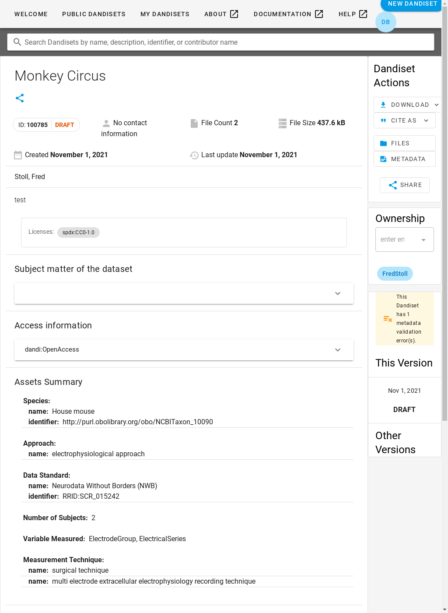 | 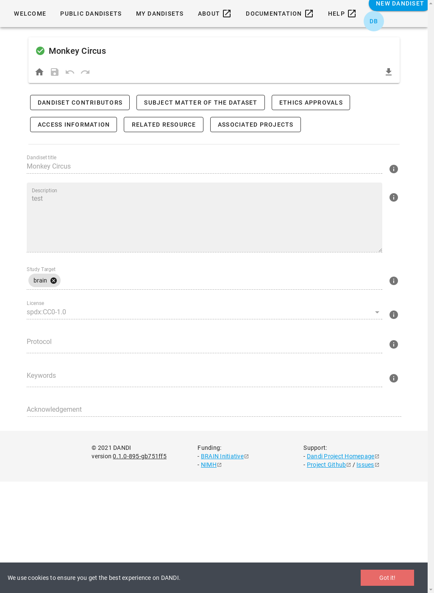 |  |

#### Error Messages
<pre>Message: unknown error: Chrome failed to start: exited abnormally
  (unknown error: DevToolsActivePort file doesn't exist)
  (The process started from chrome location /usr/bin/chromium is no longer running, so ChromeDriver is assuming that Chrome has crashed.)
  (Driver info: chromedriver=73.0.3683.75,platform=Linux 4.19.0-0.bpo.9-amd64 x86_64)</pre>
<pre>Message: unknown error: Chrome failed to start: exited abnormally
  (unknown error: Devtools port number file contents &lt;&gt; were in an unexpected format)
  (The process started from chrome location /usr/bin/chromium is no longer running, so ChromeDriver is assuming that Chrome has crashed.)
  (Driver info: chromedriver=73.0.3683.75,platform=Linux 4.19.0-0.bpo.9-amd64 x86_64)</pre>
<pre>Message: unknown error: Chrome failed to start: exited abnormally
  (unknown error: DevToolsActivePort file doesn't exist)
  (The process started from chrome location /usr/bin/chromium is no longer running, so ChromeDriver is assuming that Chrome has crashed.)
  (Driver info: chromedriver=73.0.3683.75,platform=Linux 4.19.0-0.bpo.9-amd64 x86_64)</pre>
### 100786

| t=[See below] [Go to page](https://gui-staging.dandiarchive.org/#/dandiset/100786) | t=[See below] Edit Metadata | t=[See below] [Go to page](https://gui-staging.dandiarchive.org/#/dandiset/100786/draft/files) |
| --- | --- | --- |
| 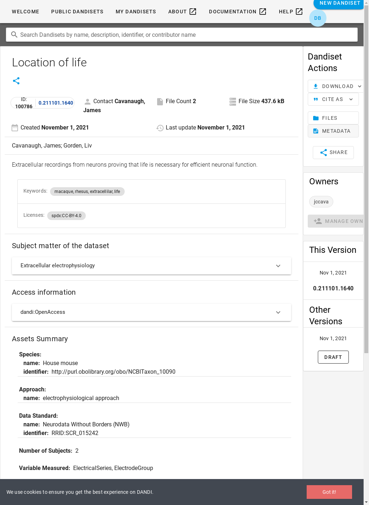 | 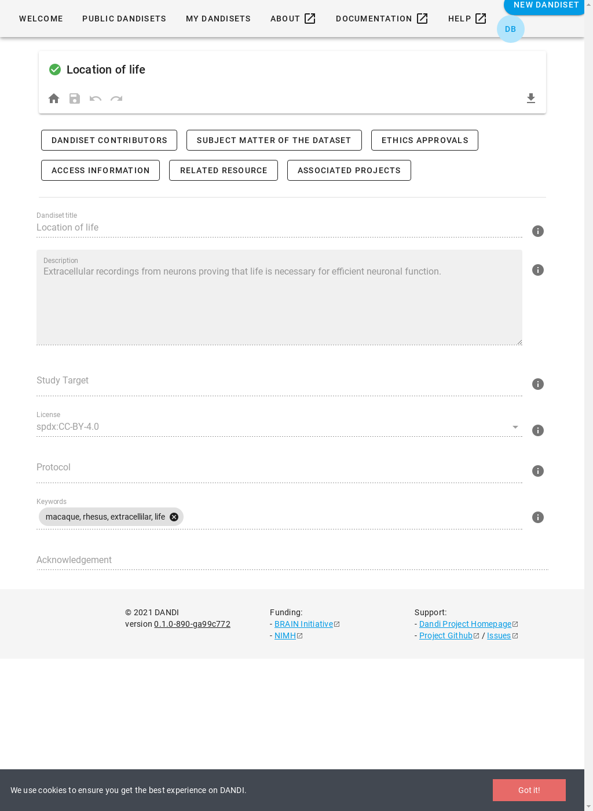 |  |

#### Error Messages
<pre>Message: unknown error: Chrome failed to start: exited abnormally
  (unknown error: Devtools port number file contents &lt;&gt; were in an unexpected format)
  (The process started from chrome location /usr/bin/chromium is no longer running, so ChromeDriver is assuming that Chrome has crashed.)
  (Driver info: chromedriver=73.0.3683.75,platform=Linux 4.19.0-0.bpo.9-amd64 x86_64)</pre>
<pre>Message: unknown error: Chrome failed to start: exited abnormally
  (unknown error: Devtools port number file contents &lt;&gt; were in an unexpected format)
  (The process started from chrome location /usr/bin/chromium is no longer running, so ChromeDriver is assuming that Chrome has crashed.)
  (Driver info: chromedriver=73.0.3683.75,platform=Linux 4.19.0-0.bpo.9-amd64 x86_64)</pre>
<pre>Message: unknown error: Chrome failed to start: exited abnormally
  (unknown error: DevToolsActivePort file doesn't exist)
  (The process started from chrome location /usr/bin/chromium is no longer running, so ChromeDriver is assuming that Chrome has crashed.)
  (Driver info: chromedriver=73.0.3683.75,platform=Linux 4.19.0-0.bpo.9-amd64 x86_64)</pre>
### 100787

| t=[See below] [Go to page](https://gui-staging.dandiarchive.org/#/dandiset/100787) | t=[See below] Edit Metadata | t=[See below] [Go to page](https://gui-staging.dandiarchive.org/#/dandiset/100787/draft/files) |
| --- | --- | --- |
| 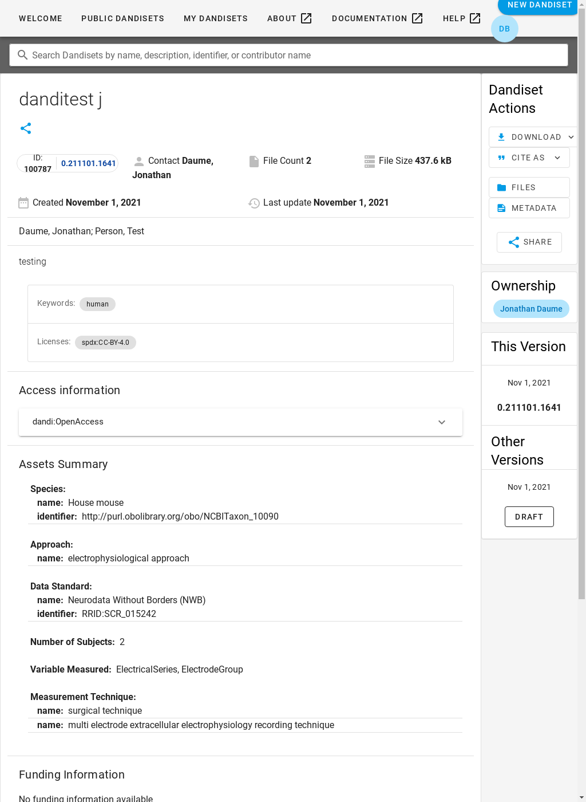 | 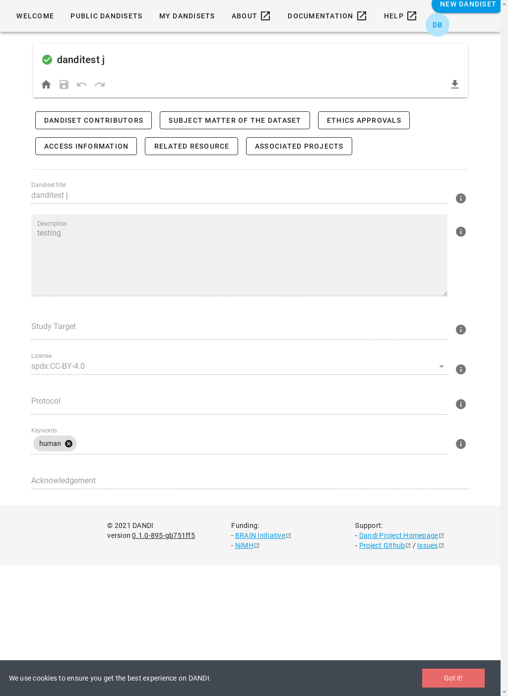 |  |

#### Error Messages
<pre>Message: unknown error: Chrome failed to start: exited abnormally
  (unknown error: DevToolsActivePort file doesn't exist)
  (The process started from chrome location /usr/bin/chromium is no longer running, so ChromeDriver is assuming that Chrome has crashed.)
  (Driver info: chromedriver=73.0.3683.75,platform=Linux 4.19.0-0.bpo.9-amd64 x86_64)</pre>
<pre>Message: unknown error: Chrome failed to start: exited abnormally
  (unknown error: DevToolsActivePort file doesn't exist)
  (The process started from chrome location /usr/bin/chromium is no longer running, so ChromeDriver is assuming that Chrome has crashed.)
  (Driver info: chromedriver=73.0.3683.75,platform=Linux 4.19.0-0.bpo.9-amd64 x86_64)</pre>
<pre>Message: unknown error: Chrome failed to start: exited abnormally
  (unknown error: DevToolsActivePort file doesn't exist)
  (The process started from chrome location /usr/bin/chromium is no longer running, so ChromeDriver is assuming that Chrome has crashed.)
  (Driver info: chromedriver=73.0.3683.75,platform=Linux 4.19.0-0.bpo.9-amd64 x86_64)</pre>
### 100788

| t=[See below] [Go to page](https://gui-staging.dandiarchive.org/#/dandiset/100788) | t=[See below] Edit Metadata | t=[See below] [Go to page](https://gui-staging.dandiarchive.org/#/dandiset/100788/draft/files) |
| --- | --- | --- |
| 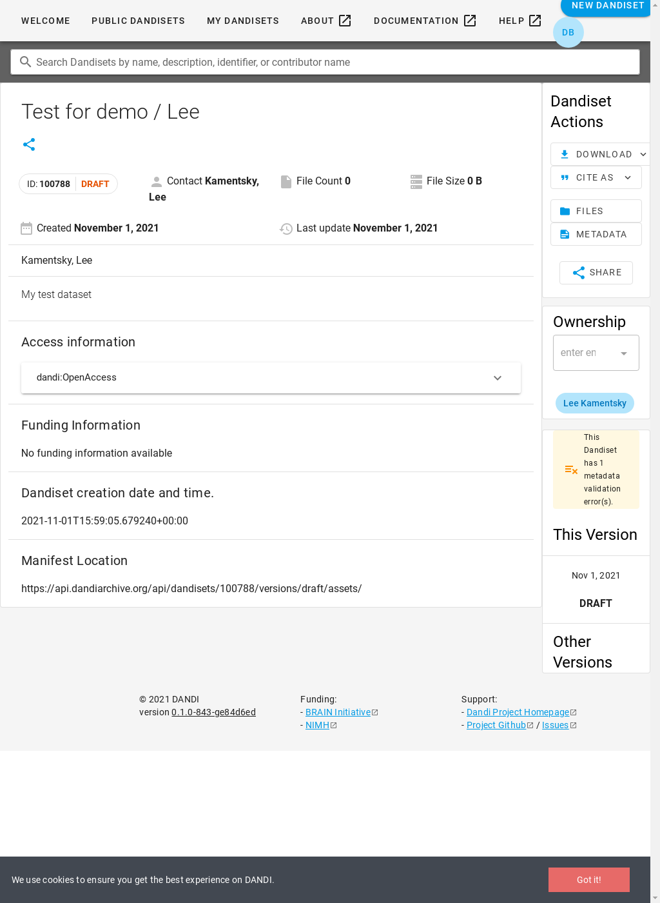 |  |  |

#### Error Messages
<pre>Message: unknown error: Chrome failed to start: exited abnormally
  (unknown error: DevToolsActivePort file doesn't exist)
  (The process started from chrome location /usr/bin/chromium is no longer running, so ChromeDriver is assuming that Chrome has crashed.)
  (Driver info: chromedriver=73.0.3683.75,platform=Linux 4.19.0-0.bpo.9-amd64 x86_64)</pre>
<pre>Message: unknown error: Chrome failed to start: exited abnormally
  (unknown error: DevToolsActivePort file doesn't exist)
  (The process started from chrome location /usr/bin/chromium is no longer running, so ChromeDriver is assuming that Chrome has crashed.)
  (Driver info: chromedriver=73.0.3683.75,platform=Linux 4.19.0-0.bpo.9-amd64 x86_64)</pre>
<pre>Message: unknown error: Chrome failed to start: exited abnormally
  (unknown error: DevToolsActivePort file doesn't exist)
  (The process started from chrome location /usr/bin/chromium is no longer running, so ChromeDriver is assuming that Chrome has crashed.)
  (Driver info: chromedriver=73.0.3683.75,platform=Linux 4.19.0-0.bpo.9-amd64 x86_64)</pre>
### 100789

| t=[See below] [Go to page](https://gui-staging.dandiarchive.org/#/dandiset/100789) | t=[See below] Edit Metadata | t=[See below] [Go to page](https://gui-staging.dandiarchive.org/#/dandiset/100789/draft/files) |
| --- | --- | --- |
| 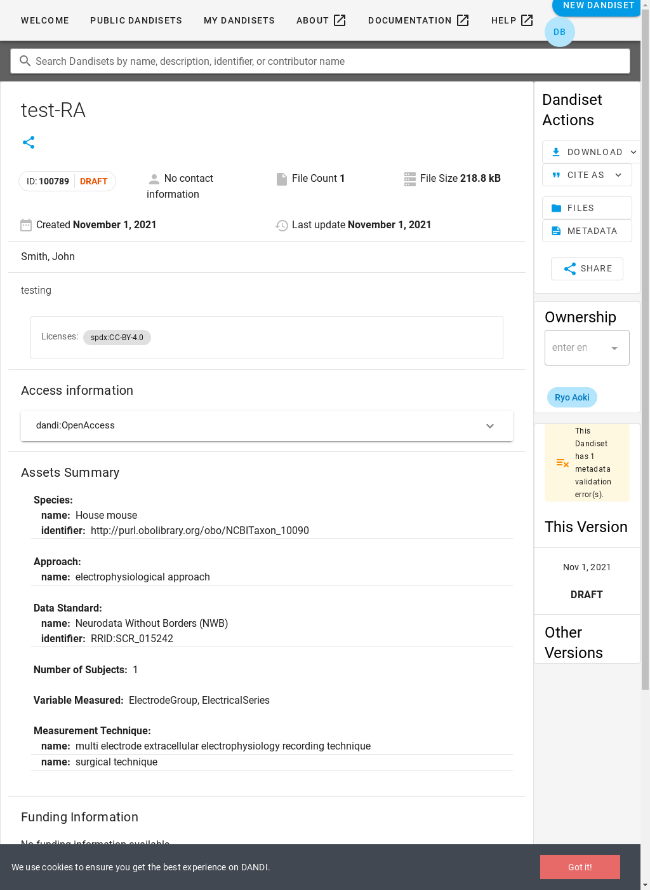 |  |  |

#### Error Messages
<pre>Message: unknown error: Chrome failed to start: exited abnormally
  (unknown error: Devtools port number file contents &lt;&gt; were in an unexpected format)
  (The process started from chrome location /usr/bin/chromium is no longer running, so ChromeDriver is assuming that Chrome has crashed.)
  (Driver info: chromedriver=73.0.3683.75,platform=Linux 4.19.0-0.bpo.9-amd64 x86_64)</pre>
<pre>Message: unknown error: Chrome failed to start: exited abnormally
  (unknown error: Devtools port number file contents &lt;&gt; were in an unexpected format)
  (The process started from chrome location /usr/bin/chromium is no longer running, so ChromeDriver is assuming that Chrome has crashed.)
  (Driver info: chromedriver=73.0.3683.75,platform=Linux 4.19.0-0.bpo.9-amd64 x86_64)</pre>
<pre>Message: unknown error: Chrome failed to start: exited abnormally
  (unknown error: DevToolsActivePort file doesn't exist)
  (The process started from chrome location /usr/bin/chromium is no longer running, so ChromeDriver is assuming that Chrome has crashed.)
  (Driver info: chromedriver=73.0.3683.75,platform=Linux 4.19.0-0.bpo.9-amd64 x86_64)</pre>
### 100790

| t=[See below] [Go to page](https://gui-staging.dandiarchive.org/#/dandiset/100790) | t=[See below] Edit Metadata | t=[See below] [Go to page](https://gui-staging.dandiarchive.org/#/dandiset/100790/draft/files) |
| --- | --- | --- |
| 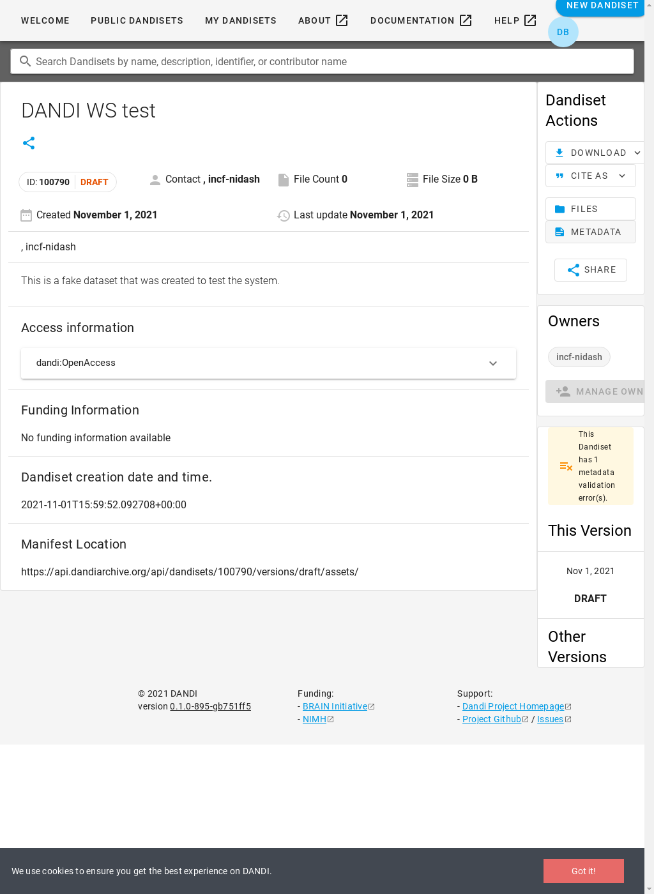 |  |  |

#### Error Messages
<pre>Message: unknown error: Chrome failed to start: exited abnormally
  (unknown error: Devtools port number file contents &lt;&gt; were in an unexpected format)
  (The process started from chrome location /usr/bin/chromium is no longer running, so ChromeDriver is assuming that Chrome has crashed.)
  (Driver info: chromedriver=73.0.3683.75,platform=Linux 4.19.0-0.bpo.9-amd64 x86_64)</pre>
<pre>Message: unknown error: Chrome failed to start: exited abnormally
  (unknown error: Devtools port number file contents &lt;&gt; were in an unexpected format)
  (The process started from chrome location /usr/bin/chromium is no longer running, so ChromeDriver is assuming that Chrome has crashed.)
  (Driver info: chromedriver=73.0.3683.75,platform=Linux 4.19.0-0.bpo.9-amd64 x86_64)</pre>
<pre>Message: unknown error: Chrome failed to start: exited abnormally
  (unknown error: Devtools port number file contents &lt;&gt; were in an unexpected format)
  (The process started from chrome location /usr/bin/chromium is no longer running, so ChromeDriver is assuming that Chrome has crashed.)
  (Driver info: chromedriver=73.0.3683.75,platform=Linux 4.19.0-0.bpo.9-amd64 x86_64)</pre>
### 100791

| t=[See below] [Go to page](https://gui-staging.dandiarchive.org/#/dandiset/100791) | t=[See below] Edit Metadata | t=[See below] [Go to page](https://gui-staging.dandiarchive.org/#/dandiset/100791/draft/files) |
| --- | --- | --- |
| 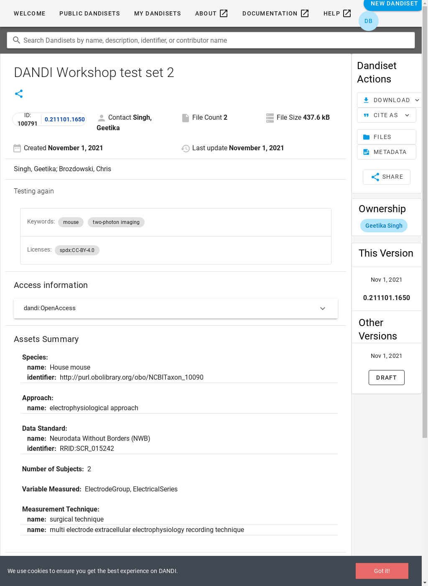 | 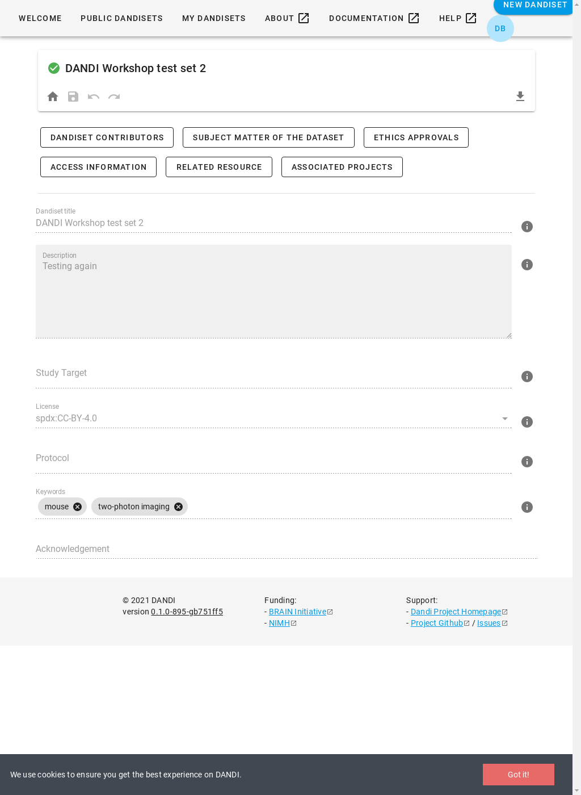 |  |

#### Error Messages
<pre>Message: unknown error: Chrome failed to start: exited abnormally
  (unknown error: Devtools port number file contents &lt;&gt; were in an unexpected format)
  (The process started from chrome location /usr/bin/chromium is no longer running, so ChromeDriver is assuming that Chrome has crashed.)
  (Driver info: chromedriver=73.0.3683.75,platform=Linux 4.19.0-0.bpo.9-amd64 x86_64)</pre>
<pre>Message: unknown error: Chrome failed to start: exited abnormally
  (unknown error: DevToolsActivePort file doesn't exist)
  (The process started from chrome location /usr/bin/chromium is no longer running, so ChromeDriver is assuming that Chrome has crashed.)
  (Driver info: chromedriver=73.0.3683.75,platform=Linux 4.19.0-0.bpo.9-amd64 x86_64)</pre>
<pre>Message: unknown error: Chrome failed to start: exited abnormally
  (unknown error: Devtools port number file contents &lt;&gt; were in an unexpected format)
  (The process started from chrome location /usr/bin/chromium is no longer running, so ChromeDriver is assuming that Chrome has crashed.)
  (Driver info: chromedriver=73.0.3683.75,platform=Linux 4.19.0-0.bpo.9-amd64 x86_64)</pre>
### 100792

| t=[See below] [Go to page](https://gui-staging.dandiarchive.org/#/dandiset/100792) | t=[See below] Edit Metadata | t=[See below] [Go to page](https://gui-staging.dandiarchive.org/#/dandiset/100792/draft/files) |
| --- | --- | --- |
| 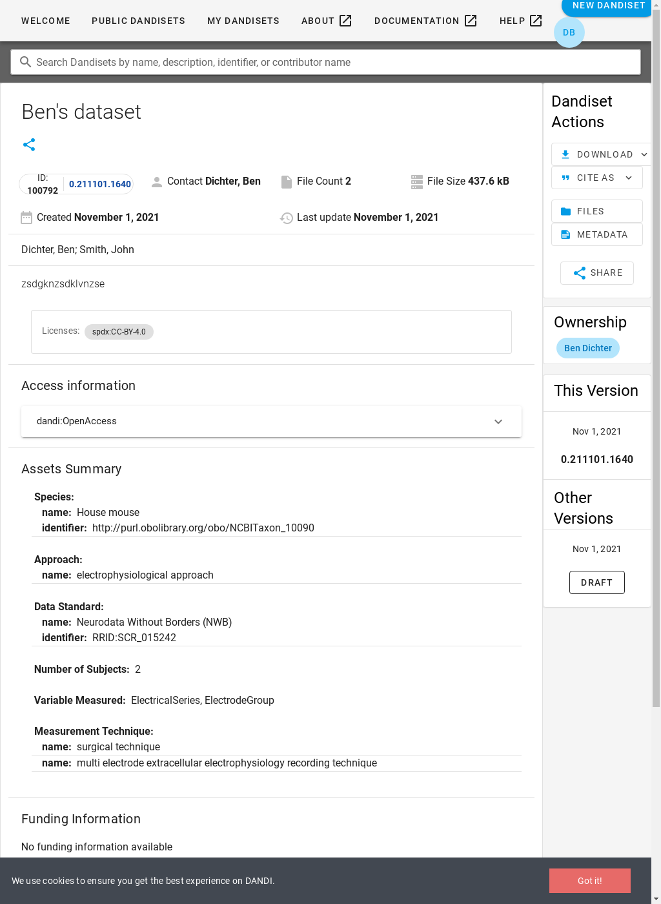 | 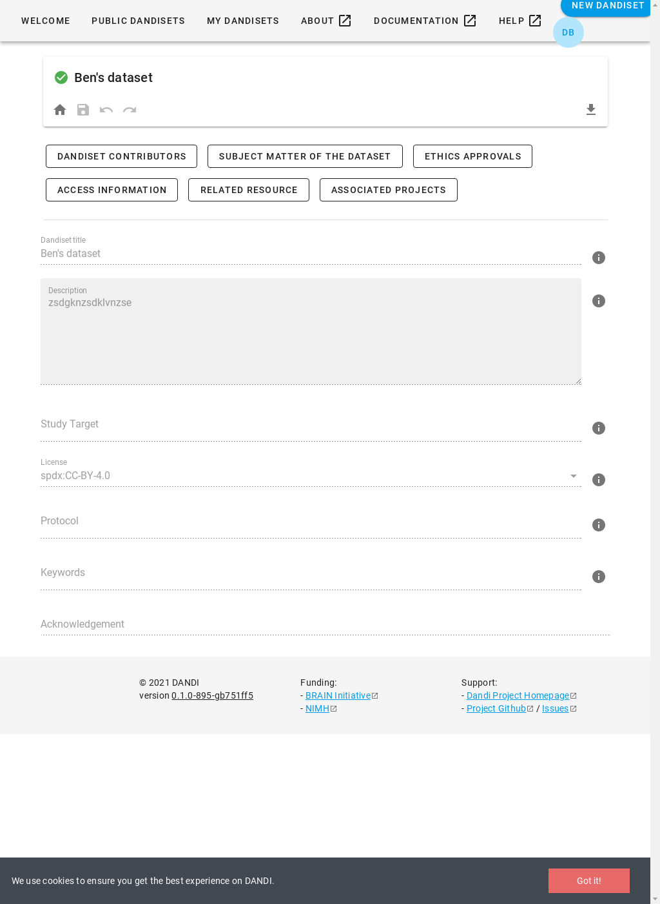 |  |

#### Error Messages
<pre>Message: unknown error: Chrome failed to start: exited abnormally
  (unknown error: Devtools port number file contents &lt;&gt; were in an unexpected format)
  (The process started from chrome location /usr/bin/chromium is no longer running, so ChromeDriver is assuming that Chrome has crashed.)
  (Driver info: chromedriver=73.0.3683.75,platform=Linux 4.19.0-0.bpo.9-amd64 x86_64)</pre>
<pre>Message: unknown error: Chrome failed to start: exited abnormally
  (unknown error: Devtools port number file contents &lt;&gt; were in an unexpected format)
  (The process started from chrome location /usr/bin/chromium is no longer running, so ChromeDriver is assuming that Chrome has crashed.)
  (Driver info: chromedriver=73.0.3683.75,platform=Linux 4.19.0-0.bpo.9-amd64 x86_64)</pre>
<pre>Message: unknown error: Chrome failed to start: exited abnormally
  (unknown error: Devtools port number file contents &lt;&gt; were in an unexpected format)
  (The process started from chrome location /usr/bin/chromium is no longer running, so ChromeDriver is assuming that Chrome has crashed.)
  (Driver info: chromedriver=73.0.3683.75,platform=Linux 4.19.0-0.bpo.9-amd64 x86_64)</pre>
### 100793

| t=[See below] [Go to page](https://gui-staging.dandiarchive.org/#/dandiset/100793) | t=[See below] Edit Metadata | t=[See below] [Go to page](https://gui-staging.dandiarchive.org/#/dandiset/100793/draft/files) |
| --- | --- | --- |
| 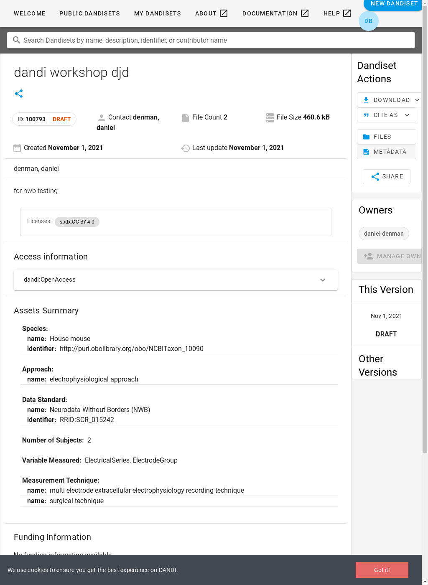 | 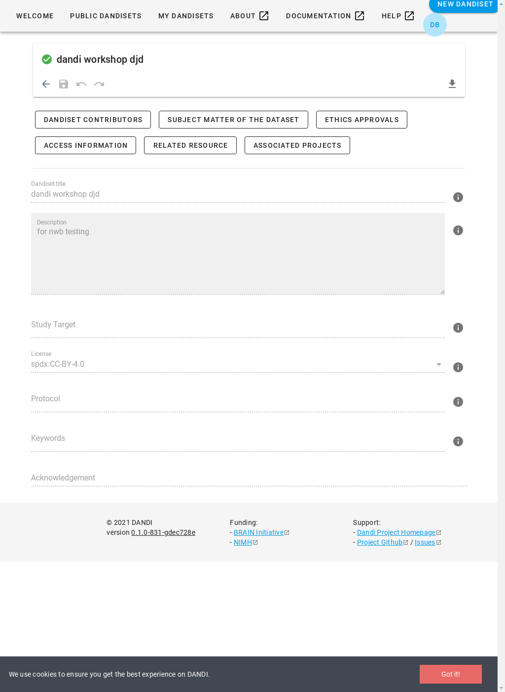 |  |

#### Error Messages
<pre>Message: unknown error: Chrome failed to start: exited abnormally
  (unknown error: DevToolsActivePort file doesn't exist)
  (The process started from chrome location /usr/bin/chromium is no longer running, so ChromeDriver is assuming that Chrome has crashed.)
  (Driver info: chromedriver=73.0.3683.75,platform=Linux 4.19.0-0.bpo.9-amd64 x86_64)</pre>
<pre>Message: unknown error: Chrome failed to start: exited abnormally
  (unknown error: Devtools port number file contents &lt;&gt; were in an unexpected format)
  (The process started from chrome location /usr/bin/chromium is no longer running, so ChromeDriver is assuming that Chrome has crashed.)
  (Driver info: chromedriver=73.0.3683.75,platform=Linux 4.19.0-0.bpo.9-amd64 x86_64)</pre>
<pre>Message: unknown error: Chrome failed to start: exited abnormally
  (unknown error: DevToolsActivePort file doesn't exist)
  (The process started from chrome location /usr/bin/chromium is no longer running, so ChromeDriver is assuming that Chrome has crashed.)
  (Driver info: chromedriver=73.0.3683.75,platform=Linux 4.19.0-0.bpo.9-amd64 x86_64)</pre>
### 100794

| t=[See below] [Go to page](https://gui-staging.dandiarchive.org/#/dandiset/100794) | t=[See below] Edit Metadata | t=[See below] [Go to page](https://gui-staging.dandiarchive.org/#/dandiset/100794/draft/files) |
| --- | --- | --- |
| 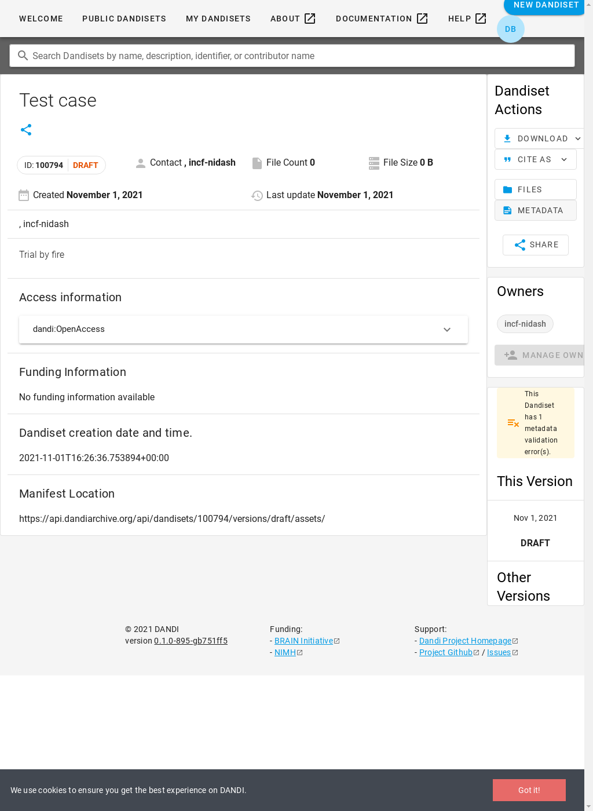 |  |  |

#### Error Messages
<pre>Message: unknown error: Chrome failed to start: exited abnormally
  (unknown error: Devtools port number file contents &lt;&gt; were in an unexpected format)
  (The process started from chrome location /usr/bin/chromium is no longer running, so ChromeDriver is assuming that Chrome has crashed.)
  (Driver info: chromedriver=73.0.3683.75,platform=Linux 4.19.0-0.bpo.9-amd64 x86_64)</pre>
<pre>Message: unknown error: Chrome failed to start: exited abnormally
  (unknown error: DevToolsActivePort file doesn't exist)
  (The process started from chrome location /usr/bin/chromium is no longer running, so ChromeDriver is assuming that Chrome has crashed.)
  (Driver info: chromedriver=73.0.3683.75,platform=Linux 4.19.0-0.bpo.9-amd64 x86_64)</pre>
<pre>Message: unknown error: Chrome failed to start: exited abnormally
  (unknown error: DevToolsActivePort file doesn't exist)
  (The process started from chrome location /usr/bin/chromium is no longer running, so ChromeDriver is assuming that Chrome has crashed.)
  (Driver info: chromedriver=73.0.3683.75,platform=Linux 4.19.0-0.bpo.9-amd64 x86_64)</pre>
### 100795

| t=[See below] [Go to page](https://gui-staging.dandiarchive.org/#/dandiset/100795) | t=[See below] Edit Metadata | t=[See below] [Go to page](https://gui-staging.dandiarchive.org/#/dandiset/100795/draft/files) |
| --- | --- | --- |
| 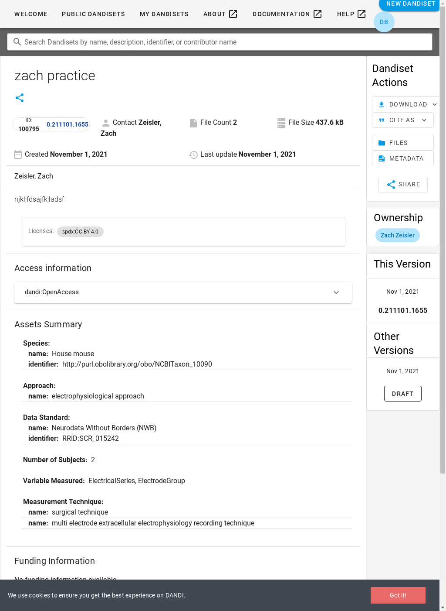 |  |  |

#### Error Messages
<pre>Message: unknown error: Chrome failed to start: exited abnormally
  (unknown error: DevToolsActivePort file doesn't exist)
  (The process started from chrome location /usr/bin/chromium is no longer running, so ChromeDriver is assuming that Chrome has crashed.)
  (Driver info: chromedriver=73.0.3683.75,platform=Linux 4.19.0-0.bpo.9-amd64 x86_64)</pre>
<pre>Message: unknown error: Chrome failed to start: exited abnormally
  (unknown error: Devtools port number file contents &lt;&gt; were in an unexpected format)
  (The process started from chrome location /usr/bin/chromium is no longer running, so ChromeDriver is assuming that Chrome has crashed.)
  (Driver info: chromedriver=73.0.3683.75,platform=Linux 4.19.0-0.bpo.9-amd64 x86_64)</pre>
<pre>Message: unknown error: Chrome failed to start: exited abnormally
  (unknown error: Devtools port number file contents &lt;&gt; were in an unexpected format)
  (The process started from chrome location /usr/bin/chromium is no longer running, so ChromeDriver is assuming that Chrome has crashed.)
  (Driver info: chromedriver=73.0.3683.75,platform=Linux 4.19.0-0.bpo.9-amd64 x86_64)</pre>
### 100796

| t=[See below] [Go to page](https://gui-staging.dandiarchive.org/#/dandiset/100796) | t=[See below] Edit Metadata | t=[See below] [Go to page](https://gui-staging.dandiarchive.org/#/dandiset/100796/draft/files) |
| --- | --- | --- |
| 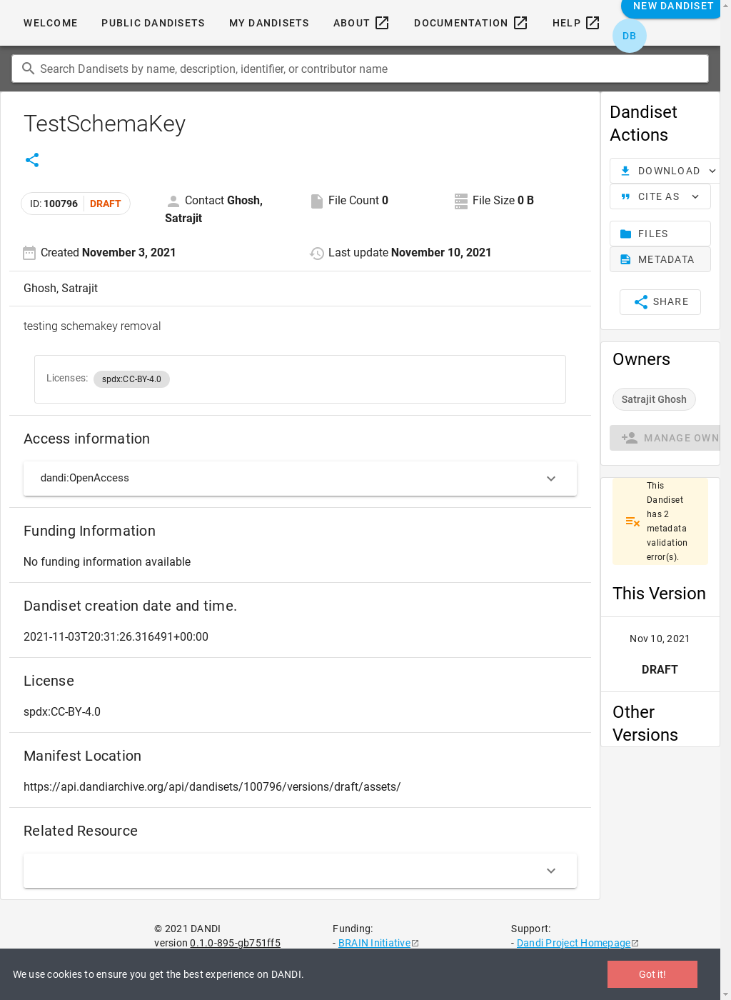 | 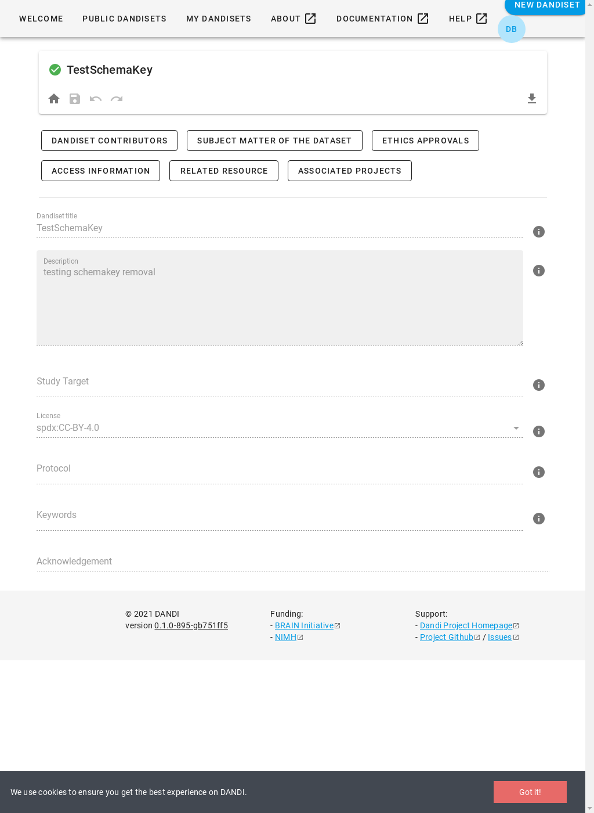 |  |

#### Error Messages
<pre>Message: unknown error: Chrome failed to start: exited abnormally
  (unknown error: Devtools port number file contents &lt;&gt; were in an unexpected format)
  (The process started from chrome location /usr/bin/chromium is no longer running, so ChromeDriver is assuming that Chrome has crashed.)
  (Driver info: chromedriver=73.0.3683.75,platform=Linux 4.19.0-0.bpo.9-amd64 x86_64)</pre>
<pre>Message: unknown error: Chrome failed to start: exited abnormally
  (unknown error: DevToolsActivePort file doesn't exist)
  (The process started from chrome location /usr/bin/chromium is no longer running, so ChromeDriver is assuming that Chrome has crashed.)
  (Driver info: chromedriver=73.0.3683.75,platform=Linux 4.19.0-0.bpo.9-amd64 x86_64)</pre>
<pre>Message: unknown error: Chrome failed to start: exited abnormally
  (unknown error: Devtools port number file contents &lt;&gt; were in an unexpected format)
  (The process started from chrome location /usr/bin/chromium is no longer running, so ChromeDriver is assuming that Chrome has crashed.)
  (Driver info: chromedriver=73.0.3683.75,platform=Linux 4.19.0-0.bpo.9-amd64 x86_64)</pre>
### 100830

| t=[See below] [Go to page](https://gui-staging.dandiarchive.org/#/dandiset/100830) | t=[See below] Edit Metadata | t=[See below] [Go to page](https://gui-staging.dandiarchive.org/#/dandiset/100830/draft/files) |
| --- | --- | --- |
| 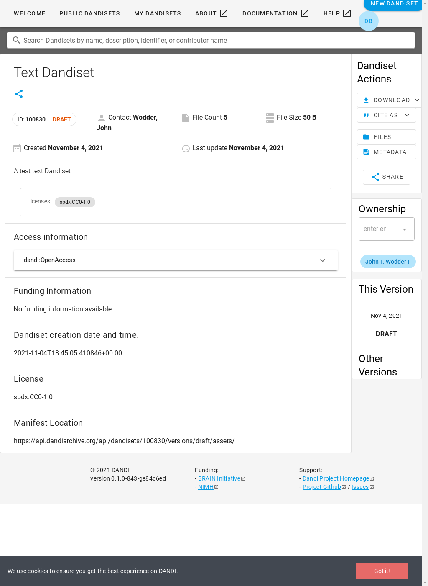 | 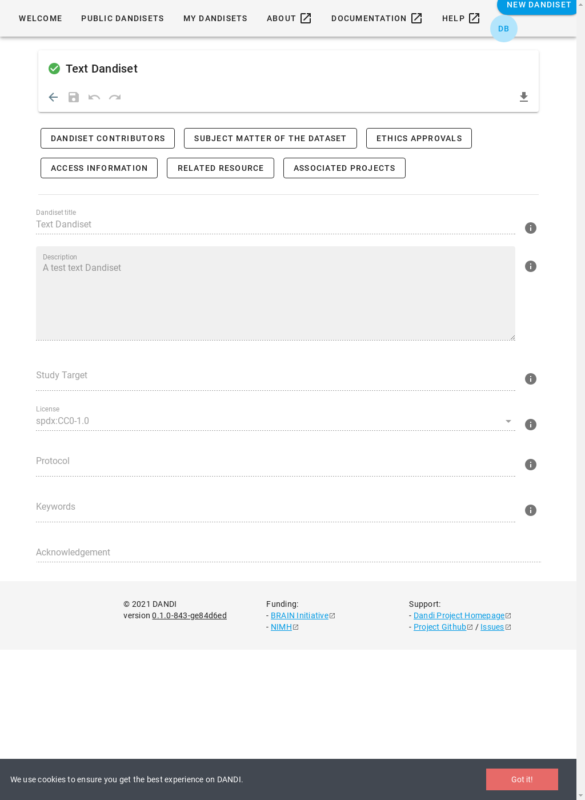 | 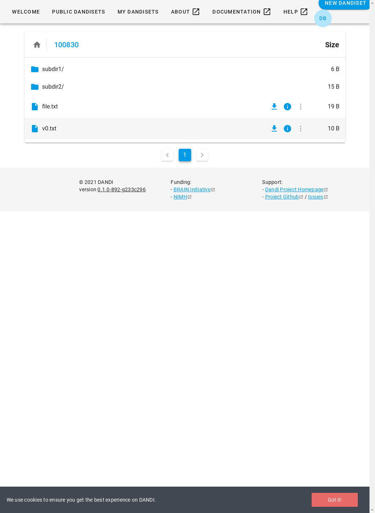 |

#### Error Messages
<pre>Message: unknown error: Chrome failed to start: exited abnormally
  (unknown error: DevToolsActivePort file doesn't exist)
  (The process started from chrome location /usr/bin/chromium is no longer running, so ChromeDriver is assuming that Chrome has crashed.)
  (Driver info: chromedriver=73.0.3683.75,platform=Linux 4.19.0-0.bpo.9-amd64 x86_64)</pre>
<pre>Message: unknown error: Chrome failed to start: exited abnormally
  (unknown error: DevToolsActivePort file doesn't exist)
  (The process started from chrome location /usr/bin/chromium is no longer running, so ChromeDriver is assuming that Chrome has crashed.)
  (Driver info: chromedriver=73.0.3683.75,platform=Linux 4.19.0-0.bpo.9-amd64 x86_64)</pre>
<pre>Message: unknown error: Chrome failed to start: exited abnormally
  (unknown error: Devtools port number file contents &lt;&gt; were in an unexpected format)
  (The process started from chrome location /usr/bin/chromium is no longer running, so ChromeDriver is assuming that Chrome has crashed.)
  (Driver info: chromedriver=73.0.3683.75,platform=Linux 4.19.0-0.bpo.9-amd64 x86_64)</pre>
### 100851

| t=[See below] [Go to page](https://gui-staging.dandiarchive.org/#/dandiset/100851) | t=[See below] Edit Metadata | t=[See below] [Go to page](https://gui-staging.dandiarchive.org/#/dandiset/100851/draft/files) |
| --- | --- | --- |
| 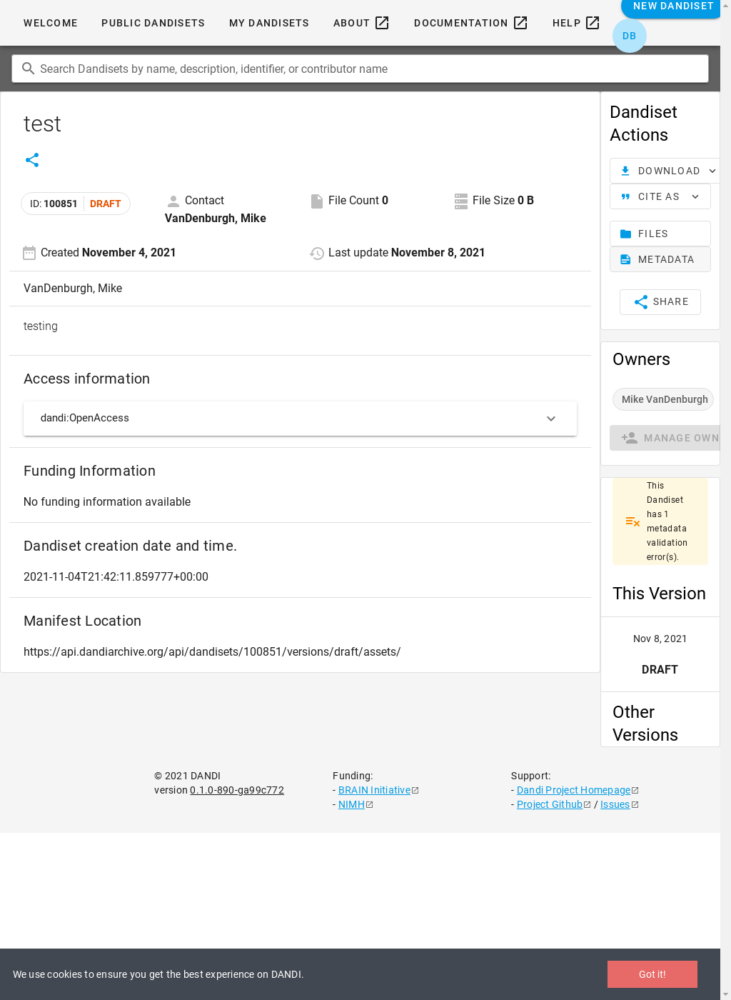 |  |  |

#### Error Messages
<pre>Message: unknown error: Chrome failed to start: exited abnormally
  (unknown error: DevToolsActivePort file doesn't exist)
  (The process started from chrome location /usr/bin/chromium is no longer running, so ChromeDriver is assuming that Chrome has crashed.)
  (Driver info: chromedriver=73.0.3683.75,platform=Linux 4.19.0-0.bpo.9-amd64 x86_64)</pre>
<pre>Message: unknown error: Chrome failed to start: exited abnormally
  (unknown error: DevToolsActivePort file doesn't exist)
  (The process started from chrome location /usr/bin/chromium is no longer running, so ChromeDriver is assuming that Chrome has crashed.)
  (Driver info: chromedriver=73.0.3683.75,platform=Linux 4.19.0-0.bpo.9-amd64 x86_64)</pre>
<pre>Message: unknown error: Chrome failed to start: exited abnormally
  (unknown error: DevToolsActivePort file doesn't exist)
  (The process started from chrome location /usr/bin/chromium is no longer running, so ChromeDriver is assuming that Chrome has crashed.)
  (Driver info: chromedriver=73.0.3683.75,platform=Linux 4.19.0-0.bpo.9-amd64 x86_64)</pre>
### 200003

| t=[See below] [Go to page](https://gui-staging.dandiarchive.org/#/dandiset/200003) | t=[See below] Edit Metadata | t=[See below] [Go to page](https://gui-staging.dandiarchive.org/#/dandiset/200003/draft/files) |
| --- | --- | --- |
|  | 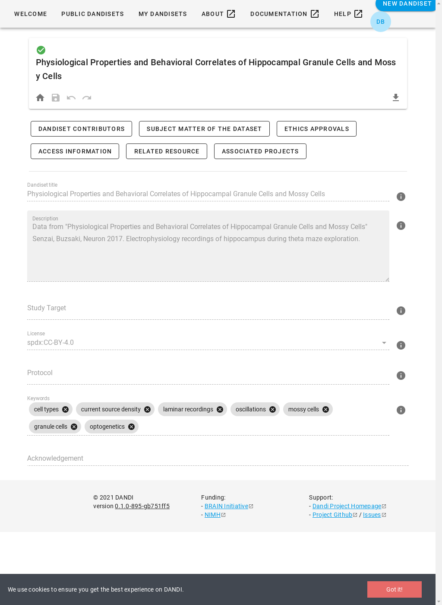 |  |

#### Error Messages
<pre>Message: unknown error: Chrome failed to start: exited abnormally
  (unknown error: Devtools port number file contents &lt;&gt; were in an unexpected format)
  (The process started from chrome location /usr/bin/chromium is no longer running, so ChromeDriver is assuming that Chrome has crashed.)
  (Driver info: chromedriver=73.0.3683.75,platform=Linux 4.19.0-0.bpo.9-amd64 x86_64)</pre>
<pre>Message: unknown error: Chrome failed to start: exited abnormally
  (unknown error: Devtools port number file contents &lt;&gt; were in an unexpected format)
  (The process started from chrome location /usr/bin/chromium is no longer running, so ChromeDriver is assuming that Chrome has crashed.)
  (Driver info: chromedriver=73.0.3683.75,platform=Linux 4.19.0-0.bpo.9-amd64 x86_64)</pre>
<pre>Message: unknown error: Chrome failed to start: exited abnormally
  (unknown error: DevToolsActivePort file doesn't exist)
  (The process started from chrome location /usr/bin/chromium is no longer running, so ChromeDriver is assuming that Chrome has crashed.)
  (Driver info: chromedriver=73.0.3683.75,platform=Linux 4.19.0-0.bpo.9-amd64 x86_64)</pre>
### 200004

| t=[See below] [Go to page](https://gui-staging.dandiarchive.org/#/dandiset/200004) | t=[See below] Edit Metadata | t=[See below] [Go to page](https://gui-staging.dandiarchive.org/#/dandiset/200004/draft/files) |
| --- | --- | --- |
| 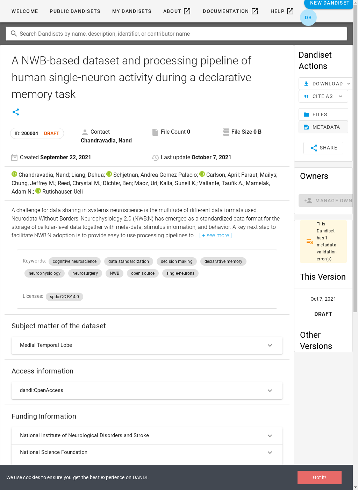 | 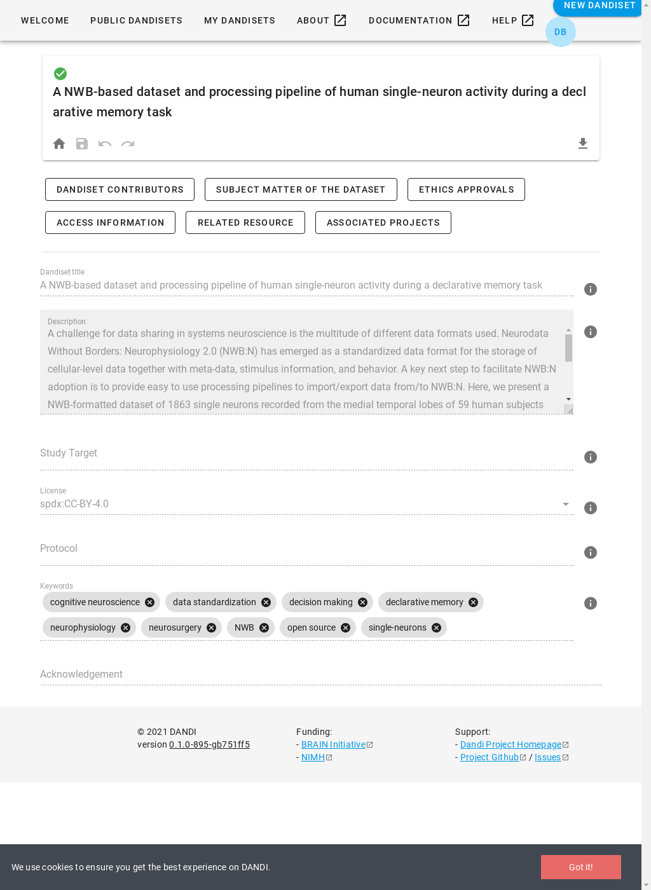 |  |

#### Error Messages
<pre>Message: unknown error: Chrome failed to start: exited abnormally
  (unknown error: DevToolsActivePort file doesn't exist)
  (The process started from chrome location /usr/bin/chromium is no longer running, so ChromeDriver is assuming that Chrome has crashed.)
  (Driver info: chromedriver=73.0.3683.75,platform=Linux 4.19.0-0.bpo.9-amd64 x86_64)</pre>
<pre>Message: unknown error: Chrome failed to start: exited abnormally
  (unknown error: DevToolsActivePort file doesn't exist)
  (The process started from chrome location /usr/bin/chromium is no longer running, so ChromeDriver is assuming that Chrome has crashed.)
  (Driver info: chromedriver=73.0.3683.75,platform=Linux 4.19.0-0.bpo.9-amd64 x86_64)</pre>
<pre>Message: unknown error: Chrome failed to start: exited abnormally
  (unknown error: Devtools port number file contents &lt;&gt; were in an unexpected format)
  (The process started from chrome location /usr/bin/chromium is no longer running, so ChromeDriver is assuming that Chrome has crashed.)
  (Driver info: chromedriver=73.0.3683.75,platform=Linux 4.19.0-0.bpo.9-amd64 x86_64)</pre>
### 200005

| t=[See below] [Go to page](https://gui-staging.dandiarchive.org/#/dandiset/200005) | t=[See below] Edit Metadata | t=[See below] [Go to page](https://gui-staging.dandiarchive.org/#/dandiset/200005/draft/files) |
| --- | --- | --- |
| 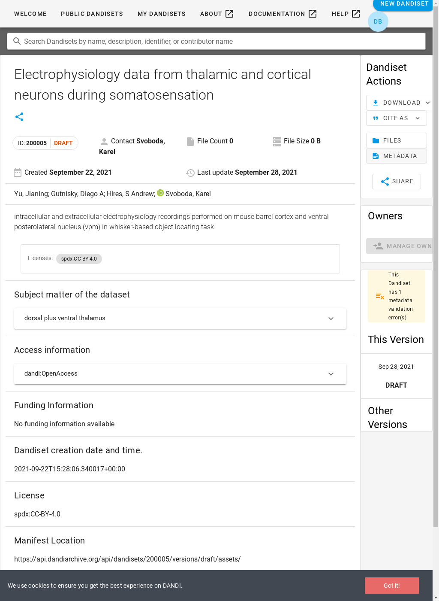 |  |  |

#### Error Messages
<pre>Message: unknown error: Chrome failed to start: exited abnormally
  (unknown error: DevToolsActivePort file doesn't exist)
  (The process started from chrome location /usr/bin/chromium is no longer running, so ChromeDriver is assuming that Chrome has crashed.)
  (Driver info: chromedriver=73.0.3683.75,platform=Linux 4.19.0-0.bpo.9-amd64 x86_64)</pre>
<pre>Message: unknown error: Chrome failed to start: exited abnormally
  (unknown error: DevToolsActivePort file doesn't exist)
  (The process started from chrome location /usr/bin/chromium is no longer running, so ChromeDriver is assuming that Chrome has crashed.)
  (Driver info: chromedriver=73.0.3683.75,platform=Linux 4.19.0-0.bpo.9-amd64 x86_64)</pre>
<pre>Message: unknown error: Chrome failed to start: exited abnormally
  (unknown error: Devtools port number file contents &lt;&gt; were in an unexpected format)
  (The process started from chrome location /usr/bin/chromium is no longer running, so ChromeDriver is assuming that Chrome has crashed.)
  (Driver info: chromedriver=73.0.3683.75,platform=Linux 4.19.0-0.bpo.9-amd64 x86_64)</pre>
### 200006

| t=[See below] [Go to page](https://gui-staging.dandiarchive.org/#/dandiset/200006) | t=[See below] Edit Metadata | t=[See below] [Go to page](https://gui-staging.dandiarchive.org/#/dandiset/200006/draft/files) |
| --- | --- | --- |
| 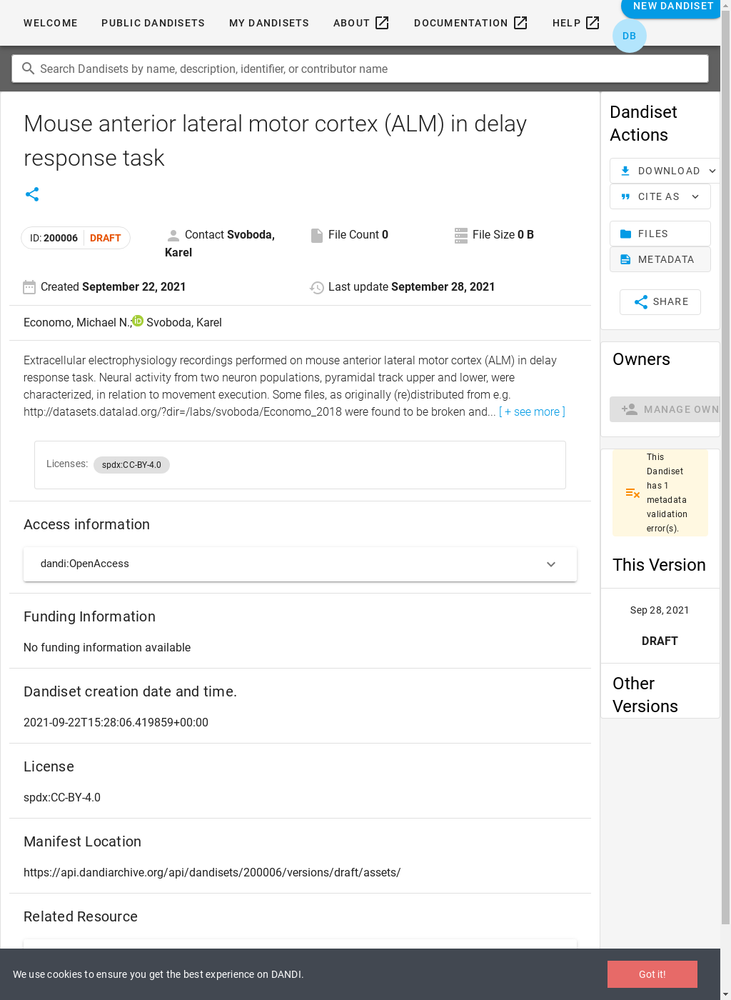 | 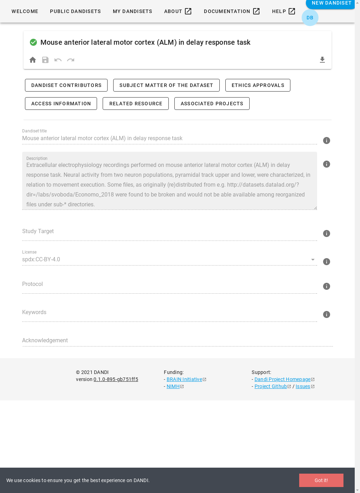 |  |

#### Error Messages
<pre>Message: unknown error: Chrome failed to start: exited abnormally
  (unknown error: Devtools port number file contents &lt;&gt; were in an unexpected format)
  (The process started from chrome location /usr/bin/chromium is no longer running, so ChromeDriver is assuming that Chrome has crashed.)
  (Driver info: chromedriver=73.0.3683.75,platform=Linux 4.19.0-0.bpo.9-amd64 x86_64)</pre>
<pre>Message: unknown error: Chrome failed to start: exited abnormally
  (unknown error: DevToolsActivePort file doesn't exist)
  (The process started from chrome location /usr/bin/chromium is no longer running, so ChromeDriver is assuming that Chrome has crashed.)
  (Driver info: chromedriver=73.0.3683.75,platform=Linux 4.19.0-0.bpo.9-amd64 x86_64)</pre>
<pre>Message: unknown error: Chrome failed to start: exited abnormally
  (unknown error: Devtools port number file contents &lt;&gt; were in an unexpected format)
  (The process started from chrome location /usr/bin/chromium is no longer running, so ChromeDriver is assuming that Chrome has crashed.)
  (Driver info: chromedriver=73.0.3683.75,platform=Linux 4.19.0-0.bpo.9-amd64 x86_64)</pre>
### 200007

| t=[See below] [Go to page](https://gui-staging.dandiarchive.org/#/dandiset/200007) | t=[See below] Edit Metadata | t=[See below] [Go to page](https://gui-staging.dandiarchive.org/#/dandiset/200007/draft/files) |
| --- | --- | --- |
|  |  |  |

#### Error Messages
<pre>Message: unknown error: Chrome failed to start: exited abnormally
  (unknown error: DevToolsActivePort file doesn't exist)
  (The process started from chrome location /usr/bin/chromium is no longer running, so ChromeDriver is assuming that Chrome has crashed.)
  (Driver info: chromedriver=73.0.3683.75,platform=Linux 4.19.0-0.bpo.9-amd64 x86_64)</pre>
<pre>Message: unknown error: Chrome failed to start: exited abnormally
  (unknown error: Devtools port number file contents &lt;&gt; were in an unexpected format)
  (The process started from chrome location /usr/bin/chromium is no longer running, so ChromeDriver is assuming that Chrome has crashed.)
  (Driver info: chromedriver=73.0.3683.75,platform=Linux 4.19.0-0.bpo.9-amd64 x86_64)</pre>
<pre>Message: unknown error: Chrome failed to start: exited abnormally
  (unknown error: DevToolsActivePort file doesn't exist)
  (The process started from chrome location /usr/bin/chromium is no longer running, so ChromeDriver is assuming that Chrome has crashed.)
  (Driver info: chromedriver=73.0.3683.75,platform=Linux 4.19.0-0.bpo.9-amd64 x86_64)</pre>
### 200008

| t=[See below] [Go to page](https://gui-staging.dandiarchive.org/#/dandiset/200008) | t=[See below] Edit Metadata | t=[See below] [Go to page](https://gui-staging.dandiarchive.org/#/dandiset/200008/draft/files) |
| --- | --- | --- |
| 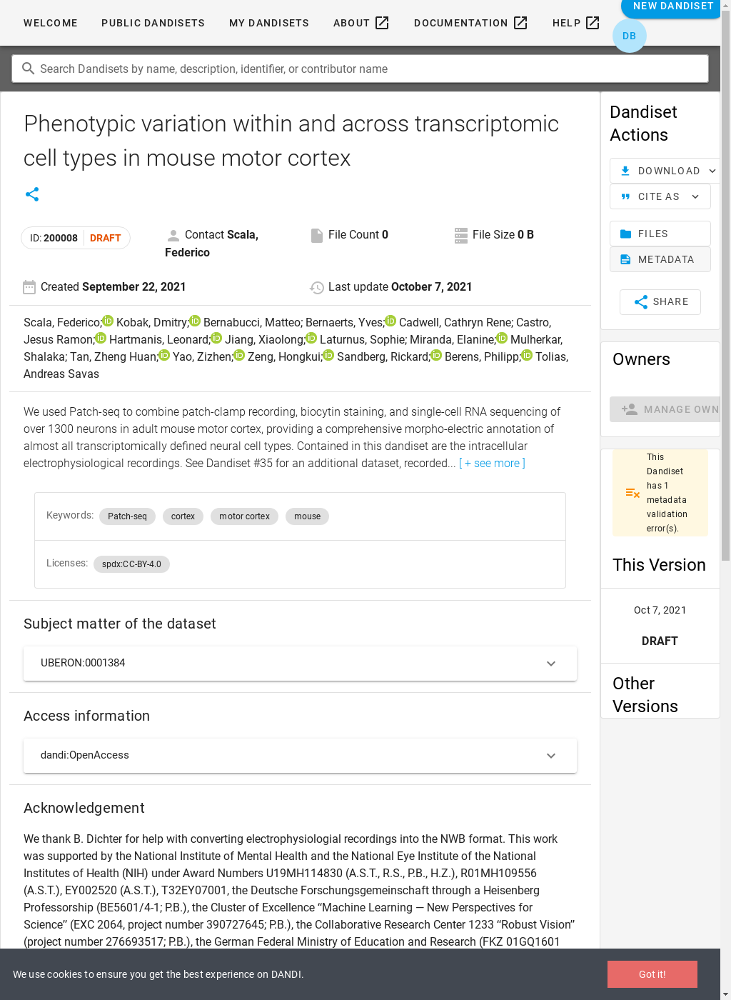 |  |  |

#### Error Messages
<pre>Message: unknown error: Chrome failed to start: exited abnormally
  (unknown error: Devtools port number file contents &lt;&gt; were in an unexpected format)
  (The process started from chrome location /usr/bin/chromium is no longer running, so ChromeDriver is assuming that Chrome has crashed.)
  (Driver info: chromedriver=73.0.3683.75,platform=Linux 4.19.0-0.bpo.9-amd64 x86_64)</pre>
<pre>Message: unknown error: Chrome failed to start: exited abnormally
  (unknown error: Devtools port number file contents &lt;&gt; were in an unexpected format)
  (The process started from chrome location /usr/bin/chromium is no longer running, so ChromeDriver is assuming that Chrome has crashed.)
  (Driver info: chromedriver=73.0.3683.75,platform=Linux 4.19.0-0.bpo.9-amd64 x86_64)</pre>
<pre>Message: unknown error: Chrome failed to start: exited abnormally
  (unknown error: DevToolsActivePort file doesn't exist)
  (The process started from chrome location /usr/bin/chromium is no longer running, so ChromeDriver is assuming that Chrome has crashed.)
  (Driver info: chromedriver=73.0.3683.75,platform=Linux 4.19.0-0.bpo.9-amd64 x86_64)</pre>
### 200009

| t=[See below] [Go to page](https://gui-staging.dandiarchive.org/#/dandiset/200009) | t=[See below] Edit Metadata | t=[See below] [Go to page](https://gui-staging.dandiarchive.org/#/dandiset/200009/draft/files) |
| --- | --- | --- |
| 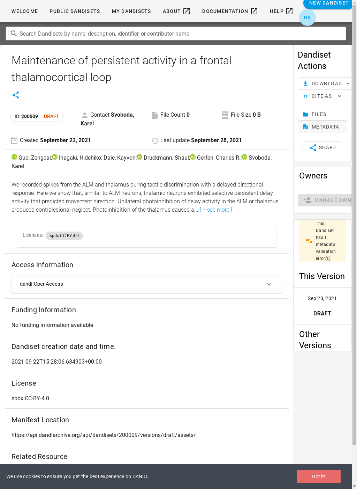 | 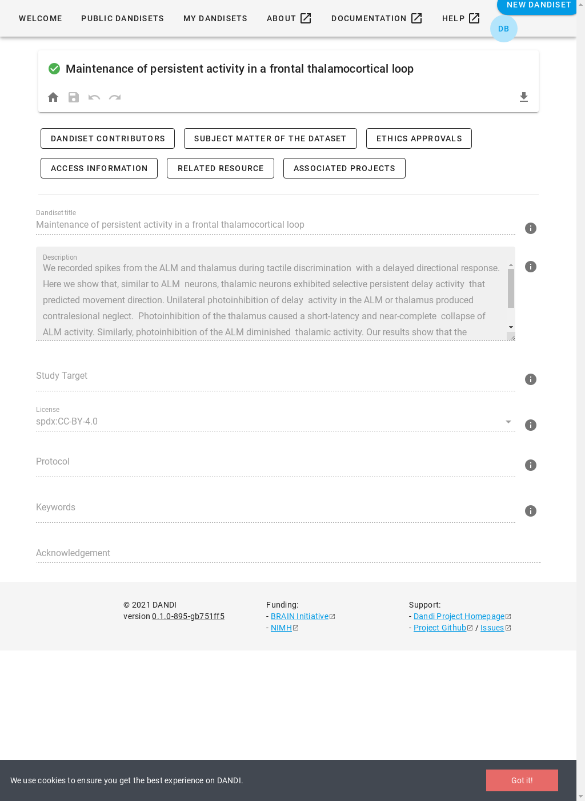 |  |

#### Error Messages
<pre>Message: unknown error: Chrome failed to start: exited abnormally
  (unknown error: Devtools port number file contents &lt;&gt; were in an unexpected format)
  (The process started from chrome location /usr/bin/chromium is no longer running, so ChromeDriver is assuming that Chrome has crashed.)
  (Driver info: chromedriver=73.0.3683.75,platform=Linux 4.19.0-0.bpo.9-amd64 x86_64)</pre>
<pre>Message: unknown error: Chrome failed to start: exited abnormally
  (unknown error: DevToolsActivePort file doesn't exist)
  (The process started from chrome location /usr/bin/chromium is no longer running, so ChromeDriver is assuming that Chrome has crashed.)
  (Driver info: chromedriver=73.0.3683.75,platform=Linux 4.19.0-0.bpo.9-amd64 x86_64)</pre>
<pre>Message: unknown error: Chrome failed to start: exited abnormally
  (unknown error: Devtools port number file contents &lt;&gt; were in an unexpected format)
  (The process started from chrome location /usr/bin/chromium is no longer running, so ChromeDriver is assuming that Chrome has crashed.)
  (Driver info: chromedriver=73.0.3683.75,platform=Linux 4.19.0-0.bpo.9-amd64 x86_64)</pre>
### 200010

| t=[See below] [Go to page](https://gui-staging.dandiarchive.org/#/dandiset/200010) | t=[See below] Edit Metadata | t=[See below] [Go to page](https://gui-staging.dandiarchive.org/#/dandiset/200010/draft/files) |
| --- | --- | --- |
|  |  |  |

#### Error Messages
<pre>Message: unknown error: Chrome failed to start: exited abnormally
  (unknown error: DevToolsActivePort file doesn't exist)
  (The process started from chrome location /usr/bin/chromium is no longer running, so ChromeDriver is assuming that Chrome has crashed.)
  (Driver info: chromedriver=73.0.3683.75,platform=Linux 4.19.0-0.bpo.9-amd64 x86_64)</pre>
<pre>Message: unknown error: Chrome failed to start: exited abnormally
  (unknown error: DevToolsActivePort file doesn't exist)
  (The process started from chrome location /usr/bin/chromium is no longer running, so ChromeDriver is assuming that Chrome has crashed.)
  (Driver info: chromedriver=73.0.3683.75,platform=Linux 4.19.0-0.bpo.9-amd64 x86_64)</pre>
<pre>Message: unknown error: Chrome failed to start: exited abnormally
  (unknown error: Devtools port number file contents &lt;&gt; were in an unexpected format)
  (The process started from chrome location /usr/bin/chromium is no longer running, so ChromeDriver is assuming that Chrome has crashed.)
  (Driver info: chromedriver=73.0.3683.75,platform=Linux 4.19.0-0.bpo.9-amd64 x86_64)</pre>
### 200011

| t=[See below] [Go to page](https://gui-staging.dandiarchive.org/#/dandiset/200011) | t=[See below] Edit Metadata | t=[See below] [Go to page](https://gui-staging.dandiarchive.org/#/dandiset/200011/draft/files) |
| --- | --- | --- |
|  |  |  |

#### Error Messages
<pre>Message: unknown error: Chrome failed to start: exited abnormally
  (unknown error: Devtools port number file contents &lt;&gt; were in an unexpected format)
  (The process started from chrome location /usr/bin/chromium is no longer running, so ChromeDriver is assuming that Chrome has crashed.)
  (Driver info: chromedriver=73.0.3683.75,platform=Linux 4.19.0-0.bpo.9-amd64 x86_64)</pre>
<pre>Message: unknown error: Chrome failed to start: exited abnormally
  (unknown error: Devtools port number file contents &lt;&gt; were in an unexpected format)
  (The process started from chrome location /usr/bin/chromium is no longer running, so ChromeDriver is assuming that Chrome has crashed.)
  (Driver info: chromedriver=73.0.3683.75,platform=Linux 4.19.0-0.bpo.9-amd64 x86_64)</pre>
<pre>Message: unknown error: Chrome failed to start: exited abnormally
  (unknown error: DevToolsActivePort file doesn't exist)
  (The process started from chrome location /usr/bin/chromium is no longer running, so ChromeDriver is assuming that Chrome has crashed.)
  (Driver info: chromedriver=73.0.3683.75,platform=Linux 4.19.0-0.bpo.9-amd64 x86_64)</pre>
### 200012

| t=[See below] [Go to page](https://gui-staging.dandiarchive.org/#/dandiset/200012) | t=[See below] Edit Metadata | t=[See below] [Go to page](https://gui-staging.dandiarchive.org/#/dandiset/200012/draft/files) |
| --- | --- | --- |
| 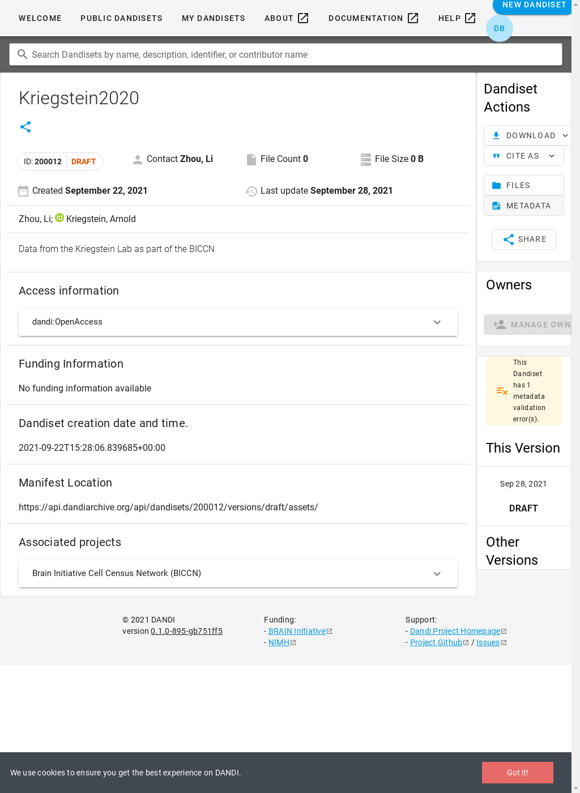 |  |  |

#### Error Messages
<pre>Message: unknown error: Chrome failed to start: exited abnormally
  (unknown error: DevToolsActivePort file doesn't exist)
  (The process started from chrome location /usr/bin/chromium is no longer running, so ChromeDriver is assuming that Chrome has crashed.)
  (Driver info: chromedriver=73.0.3683.75,platform=Linux 4.19.0-0.bpo.9-amd64 x86_64)</pre>
<pre>Message: unknown error: Chrome failed to start: exited abnormally
  (unknown error: DevToolsActivePort file doesn't exist)
  (The process started from chrome location /usr/bin/chromium is no longer running, so ChromeDriver is assuming that Chrome has crashed.)
  (Driver info: chromedriver=73.0.3683.75,platform=Linux 4.19.0-0.bpo.9-amd64 x86_64)</pre>
<pre>Message: unknown error: Chrome failed to start: exited abnormally
  (unknown error: DevToolsActivePort file doesn't exist)
  (The process started from chrome location /usr/bin/chromium is no longer running, so ChromeDriver is assuming that Chrome has crashed.)
  (Driver info: chromedriver=73.0.3683.75,platform=Linux 4.19.0-0.bpo.9-amd64 x86_64)</pre>
### 200013

| t=[See below] [Go to page](https://gui-staging.dandiarchive.org/#/dandiset/200013) | t=[See below] Edit Metadata | t=[See below] [Go to page](https://gui-staging.dandiarchive.org/#/dandiset/200013/draft/files) |
| --- | --- | --- |
| 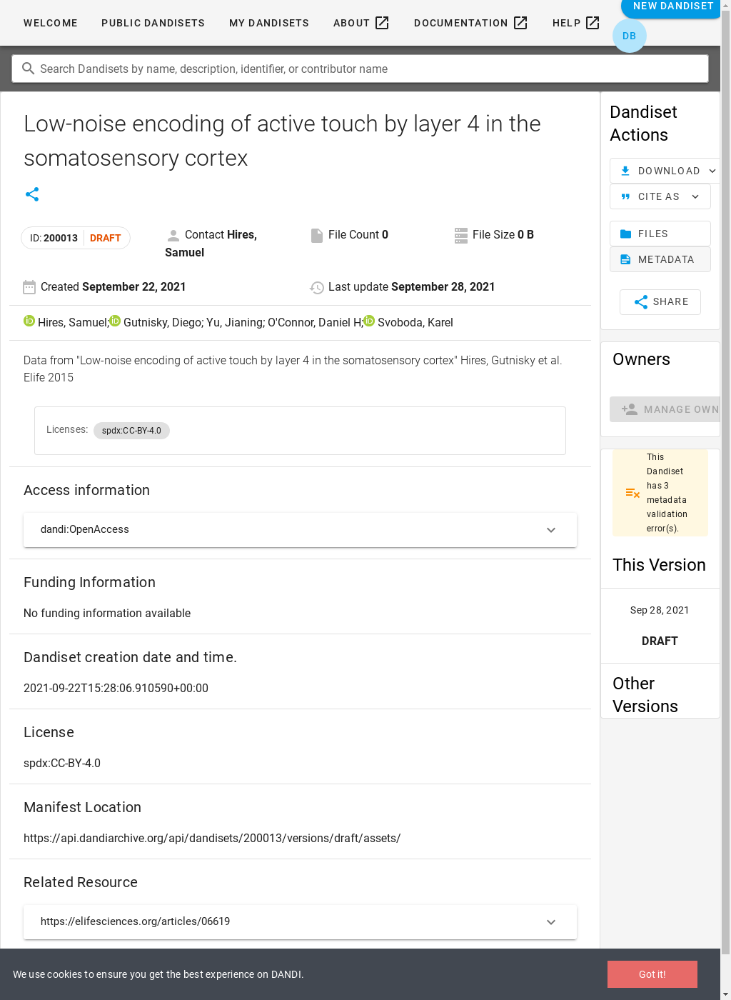 |  |  |

#### Error Messages
<pre>Message: unknown error: Chrome failed to start: exited abnormally
  (unknown error: Devtools port number file contents &lt;&gt; were in an unexpected format)
  (The process started from chrome location /usr/bin/chromium is no longer running, so ChromeDriver is assuming that Chrome has crashed.)
  (Driver info: chromedriver=73.0.3683.75,platform=Linux 4.19.0-0.bpo.9-amd64 x86_64)</pre>
<pre>Message: unknown error: Chrome failed to start: exited abnormally
  (unknown error: Devtools port number file contents &lt;&gt; were in an unexpected format)
  (The process started from chrome location /usr/bin/chromium is no longer running, so ChromeDriver is assuming that Chrome has crashed.)
  (Driver info: chromedriver=73.0.3683.75,platform=Linux 4.19.0-0.bpo.9-amd64 x86_64)</pre>
<pre>Message: unknown error: Chrome failed to start: exited abnormally
  (unknown error: DevToolsActivePort file doesn't exist)
  (The process started from chrome location /usr/bin/chromium is no longer running, so ChromeDriver is assuming that Chrome has crashed.)
  (Driver info: chromedriver=73.0.3683.75,platform=Linux 4.19.0-0.bpo.9-amd64 x86_64)</pre>
### 200015

| t=[See below] [Go to page](https://gui-staging.dandiarchive.org/#/dandiset/200015) | t=[See below] Edit Metadata | t=[See below] [Go to page](https://gui-staging.dandiarchive.org/#/dandiset/200015/draft/files) |
| --- | --- | --- |
|  |  |  |

#### Error Messages
<pre>Message: unknown error: Chrome failed to start: exited abnormally
  (unknown error: Devtools port number file contents &lt;&gt; were in an unexpected format)
  (The process started from chrome location /usr/bin/chromium is no longer running, so ChromeDriver is assuming that Chrome has crashed.)
  (Driver info: chromedriver=73.0.3683.75,platform=Linux 4.19.0-0.bpo.9-amd64 x86_64)</pre>
<pre>Message: unknown error: Chrome failed to start: exited abnormally
  (unknown error: Devtools port number file contents &lt;&gt; were in an unexpected format)
  (The process started from chrome location /usr/bin/chromium is no longer running, so ChromeDriver is assuming that Chrome has crashed.)
  (Driver info: chromedriver=73.0.3683.75,platform=Linux 4.19.0-0.bpo.9-amd64 x86_64)</pre>
<pre>Message: unknown error: Chrome failed to start: exited abnormally
  (unknown error: DevToolsActivePort file doesn't exist)
  (The process started from chrome location /usr/bin/chromium is no longer running, so ChromeDriver is assuming that Chrome has crashed.)
  (Driver info: chromedriver=73.0.3683.75,platform=Linux 4.19.0-0.bpo.9-amd64 x86_64)</pre>
### 200016

| t=[See below] [Go to page](https://gui-staging.dandiarchive.org/#/dandiset/200016) | t=[See below] Edit Metadata | t=[See below] [Go to page](https://gui-staging.dandiarchive.org/#/dandiset/200016/draft/files) |
| --- | --- | --- |
| 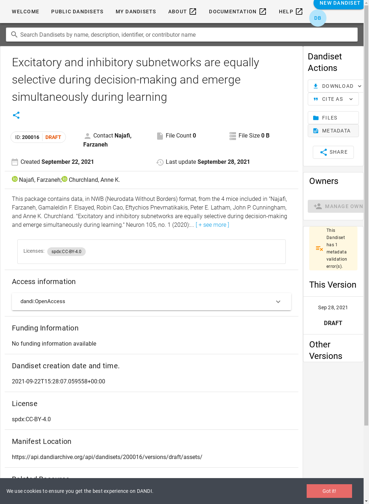 |  |  |

#### Error Messages
<pre>Message: unknown error: Chrome failed to start: exited abnormally
  (unknown error: DevToolsActivePort file doesn't exist)
  (The process started from chrome location /usr/bin/chromium is no longer running, so ChromeDriver is assuming that Chrome has crashed.)
  (Driver info: chromedriver=73.0.3683.75,platform=Linux 4.19.0-0.bpo.9-amd64 x86_64)</pre>
<pre>Message: unknown error: Chrome failed to start: exited abnormally
  (unknown error: Devtools port number file contents &lt;&gt; were in an unexpected format)
  (The process started from chrome location /usr/bin/chromium is no longer running, so ChromeDriver is assuming that Chrome has crashed.)
  (Driver info: chromedriver=73.0.3683.75,platform=Linux 4.19.0-0.bpo.9-amd64 x86_64)</pre>
<pre>Message: unknown error: Chrome failed to start: exited abnormally
  (unknown error: Devtools port number file contents &lt;&gt; were in an unexpected format)
  (The process started from chrome location /usr/bin/chromium is no longer running, so ChromeDriver is assuming that Chrome has crashed.)
  (Driver info: chromedriver=73.0.3683.75,platform=Linux 4.19.0-0.bpo.9-amd64 x86_64)</pre>
### 200017

| t=[See below] [Go to page](https://gui-staging.dandiarchive.org/#/dandiset/200017) | t=[See below] Edit Metadata | t=[See below] [Go to page](https://gui-staging.dandiarchive.org/#/dandiset/200017/draft/files) |
| --- | --- | --- |
| 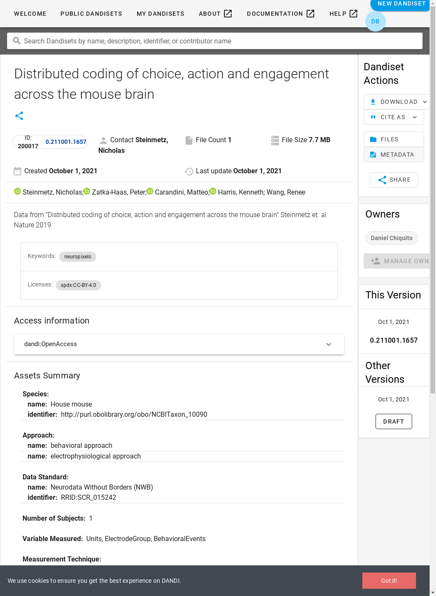 |  |  |

#### Error Messages
<pre>Message: unknown error: Chrome failed to start: exited abnormally
  (unknown error: Devtools port number file contents &lt;&gt; were in an unexpected format)
  (The process started from chrome location /usr/bin/chromium is no longer running, so ChromeDriver is assuming that Chrome has crashed.)
  (Driver info: chromedriver=73.0.3683.75,platform=Linux 4.19.0-0.bpo.9-amd64 x86_64)</pre>
<pre>Message: unknown error: Chrome failed to start: exited abnormally
  (unknown error: DevToolsActivePort file doesn't exist)
  (The process started from chrome location /usr/bin/chromium is no longer running, so ChromeDriver is assuming that Chrome has crashed.)
  (Driver info: chromedriver=73.0.3683.75,platform=Linux 4.19.0-0.bpo.9-amd64 x86_64)</pre>
<pre>Message: unknown error: Chrome failed to start: exited abnormally
  (unknown error: DevToolsActivePort file doesn't exist)
  (The process started from chrome location /usr/bin/chromium is no longer running, so ChromeDriver is assuming that Chrome has crashed.)
  (Driver info: chromedriver=73.0.3683.75,platform=Linux 4.19.0-0.bpo.9-amd64 x86_64)</pre>
### 200018

| t=[See below] [Go to page](https://gui-staging.dandiarchive.org/#/dandiset/200018) | t=[See below] Edit Metadata | t=[See below] [Go to page](https://gui-staging.dandiarchive.org/#/dandiset/200018/draft/files) |
| --- | --- | --- |
| 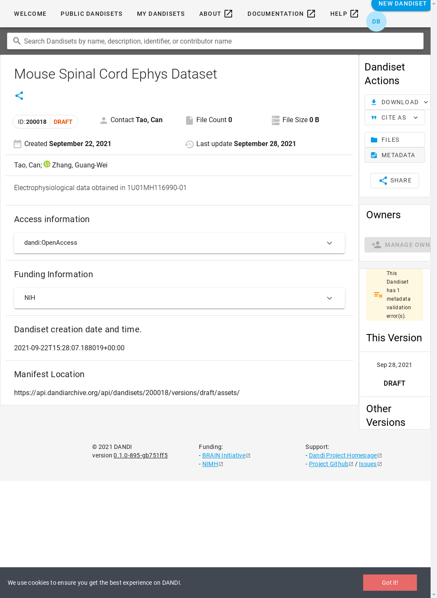 |  |  |

#### Error Messages
<pre>Message: unknown error: Chrome failed to start: exited abnormally
  (unknown error: DevToolsActivePort file doesn't exist)
  (The process started from chrome location /usr/bin/chromium is no longer running, so ChromeDriver is assuming that Chrome has crashed.)
  (Driver info: chromedriver=73.0.3683.75,platform=Linux 4.19.0-0.bpo.9-amd64 x86_64)</pre>
<pre>Message: unknown error: Chrome failed to start: exited abnormally
  (unknown error: Devtools port number file contents &lt;&gt; were in an unexpected format)
  (The process started from chrome location /usr/bin/chromium is no longer running, so ChromeDriver is assuming that Chrome has crashed.)
  (Driver info: chromedriver=73.0.3683.75,platform=Linux 4.19.0-0.bpo.9-amd64 x86_64)</pre>
<pre>Message: unknown error: Chrome failed to start: exited abnormally
  (unknown error: Devtools port number file contents &lt;&gt; were in an unexpected format)
  (The process started from chrome location /usr/bin/chromium is no longer running, so ChromeDriver is assuming that Chrome has crashed.)
  (Driver info: chromedriver=73.0.3683.75,platform=Linux 4.19.0-0.bpo.9-amd64 x86_64)</pre>
### 200019

| t=[See below] [Go to page](https://gui-staging.dandiarchive.org/#/dandiset/200019) | t=[See below] Edit Metadata | t=[See below] [Go to page](https://gui-staging.dandiarchive.org/#/dandiset/200019/draft/files) |
| --- | --- | --- |
| 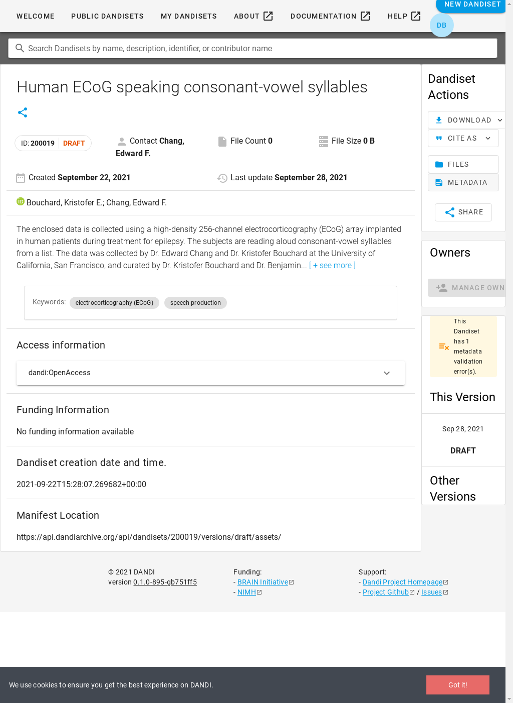 | 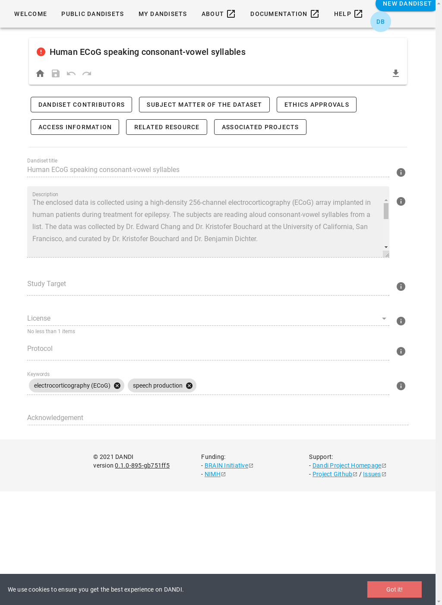 |  |

#### Error Messages
<pre>Message: unknown error: Chrome failed to start: exited abnormally
  (unknown error: DevToolsActivePort file doesn't exist)
  (The process started from chrome location /usr/bin/chromium is no longer running, so ChromeDriver is assuming that Chrome has crashed.)
  (Driver info: chromedriver=73.0.3683.75,platform=Linux 4.19.0-0.bpo.9-amd64 x86_64)</pre>
<pre>Message: unknown error: Chrome failed to start: exited abnormally
  (unknown error: DevToolsActivePort file doesn't exist)
  (The process started from chrome location /usr/bin/chromium is no longer running, so ChromeDriver is assuming that Chrome has crashed.)
  (Driver info: chromedriver=73.0.3683.75,platform=Linux 4.19.0-0.bpo.9-amd64 x86_64)</pre>
<pre>Message: unknown error: Chrome failed to start: exited abnormally
  (unknown error: Devtools port number file contents &lt;&gt; were in an unexpected format)
  (The process started from chrome location /usr/bin/chromium is no longer running, so ChromeDriver is assuming that Chrome has crashed.)
  (Driver info: chromedriver=73.0.3683.75,platform=Linux 4.19.0-0.bpo.9-amd64 x86_64)</pre>
### 200020

| t=[See below] [Go to page](https://gui-staging.dandiarchive.org/#/dandiset/200020) | t=[See below] Edit Metadata | t=[See below] [Go to page](https://gui-staging.dandiarchive.org/#/dandiset/200020/draft/files) |
| --- | --- | --- |
| 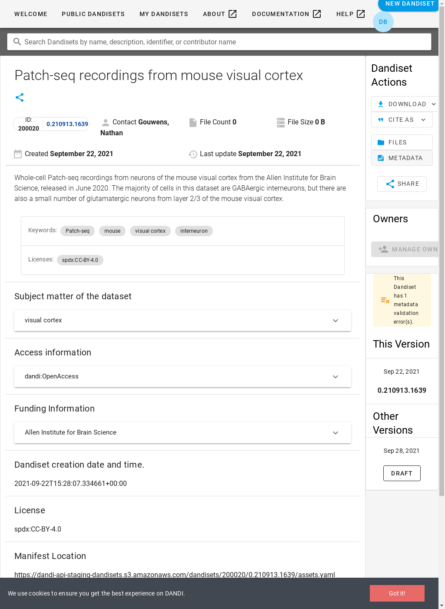 | 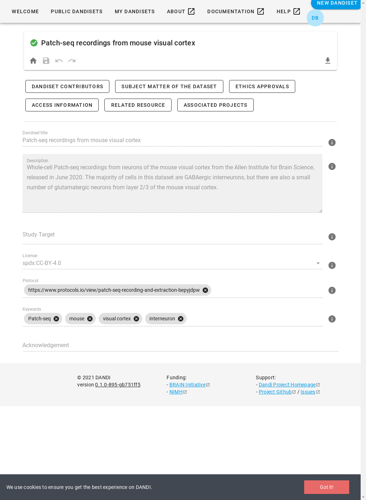 |  |

#### Error Messages
<pre>Message: unknown error: Chrome failed to start: exited abnormally
  (unknown error: Devtools port number file contents &lt;&gt; were in an unexpected format)
  (The process started from chrome location /usr/bin/chromium is no longer running, so ChromeDriver is assuming that Chrome has crashed.)
  (Driver info: chromedriver=73.0.3683.75,platform=Linux 4.19.0-0.bpo.9-amd64 x86_64)</pre>
<pre>Message: unknown error: Chrome failed to start: exited abnormally
  (unknown error: Devtools port number file contents &lt;&gt; were in an unexpected format)
  (The process started from chrome location /usr/bin/chromium is no longer running, so ChromeDriver is assuming that Chrome has crashed.)
  (Driver info: chromedriver=73.0.3683.75,platform=Linux 4.19.0-0.bpo.9-amd64 x86_64)</pre>
<pre>Message: unknown error: Chrome failed to start: exited abnormally
  (unknown error: DevToolsActivePort file doesn't exist)
  (The process started from chrome location /usr/bin/chromium is no longer running, so ChromeDriver is assuming that Chrome has crashed.)
  (Driver info: chromedriver=73.0.3683.75,platform=Linux 4.19.0-0.bpo.9-amd64 x86_64)</pre>
### 200021

| t=[See below] [Go to page](https://gui-staging.dandiarchive.org/#/dandiset/200021) | t=[See below] Edit Metadata | t=[See below] [Go to page](https://gui-staging.dandiarchive.org/#/dandiset/200021/draft/files) |
| --- | --- | --- |
| 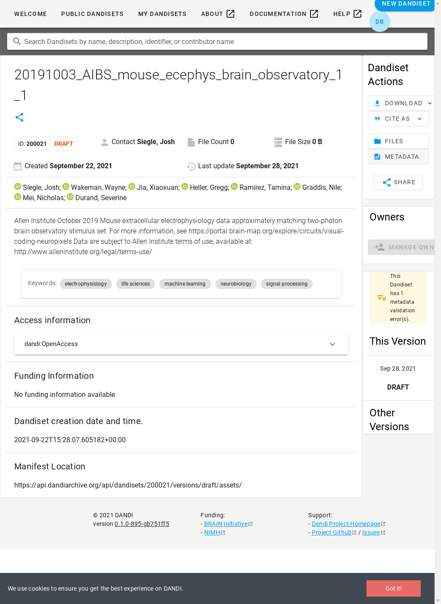 |  |  |

#### Error Messages
<pre>Message: unknown error: Chrome failed to start: exited abnormally
  (unknown error: DevToolsActivePort file doesn't exist)
  (The process started from chrome location /usr/bin/chromium is no longer running, so ChromeDriver is assuming that Chrome has crashed.)
  (Driver info: chromedriver=73.0.3683.75,platform=Linux 4.19.0-0.bpo.9-amd64 x86_64)</pre>
<pre>Message: unknown error: Chrome failed to start: exited abnormally
  (unknown error: Devtools port number file contents &lt;&gt; were in an unexpected format)
  (The process started from chrome location /usr/bin/chromium is no longer running, so ChromeDriver is assuming that Chrome has crashed.)
  (Driver info: chromedriver=73.0.3683.75,platform=Linux 4.19.0-0.bpo.9-amd64 x86_64)</pre>
<pre>Message: unknown error: Chrome failed to start: exited abnormally
  (unknown error: Devtools port number file contents &lt;&gt; were in an unexpected format)
  (The process started from chrome location /usr/bin/chromium is no longer running, so ChromeDriver is assuming that Chrome has crashed.)
  (Driver info: chromedriver=73.0.3683.75,platform=Linux 4.19.0-0.bpo.9-amd64 x86_64)</pre>
### 200022

| t=[See below] [Go to page](https://gui-staging.dandiarchive.org/#/dandiset/200022) | t=[See below] Edit Metadata | t=[See below] [Go to page](https://gui-staging.dandiarchive.org/#/dandiset/200022/draft/files) |
| --- | --- | --- |
|  |  |  |

#### Error Messages
<pre>Message: unknown error: Chrome failed to start: exited abnormally
  (unknown error: DevToolsActivePort file doesn't exist)
  (The process started from chrome location /usr/bin/chromium is no longer running, so ChromeDriver is assuming that Chrome has crashed.)
  (Driver info: chromedriver=73.0.3683.75,platform=Linux 4.19.0-0.bpo.9-amd64 x86_64)</pre>
<pre>Message: unknown error: Chrome failed to start: exited abnormally
  (unknown error: DevToolsActivePort file doesn't exist)
  (The process started from chrome location /usr/bin/chromium is no longer running, so ChromeDriver is assuming that Chrome has crashed.)
  (Driver info: chromedriver=73.0.3683.75,platform=Linux 4.19.0-0.bpo.9-amd64 x86_64)</pre>
<pre>Message: unknown error: Chrome failed to start: exited abnormally
  (unknown error: Devtools port number file contents &lt;&gt; were in an unexpected format)
  (The process started from chrome location /usr/bin/chromium is no longer running, so ChromeDriver is assuming that Chrome has crashed.)
  (Driver info: chromedriver=73.0.3683.75,platform=Linux 4.19.0-0.bpo.9-amd64 x86_64)</pre>
### 200023

| t=[See below] [Go to page](https://gui-staging.dandiarchive.org/#/dandiset/200023) | t=[See below] Edit Metadata | t=[See below] [Go to page](https://gui-staging.dandiarchive.org/#/dandiset/200023/draft/files) |
| --- | --- | --- |
| 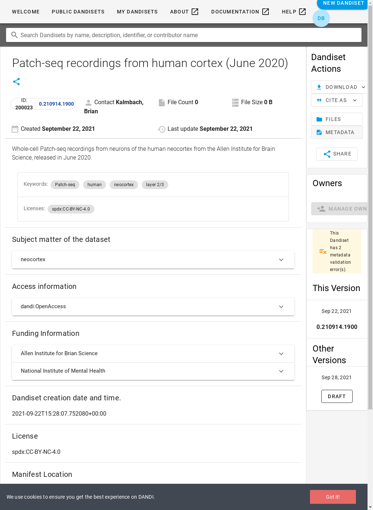 | 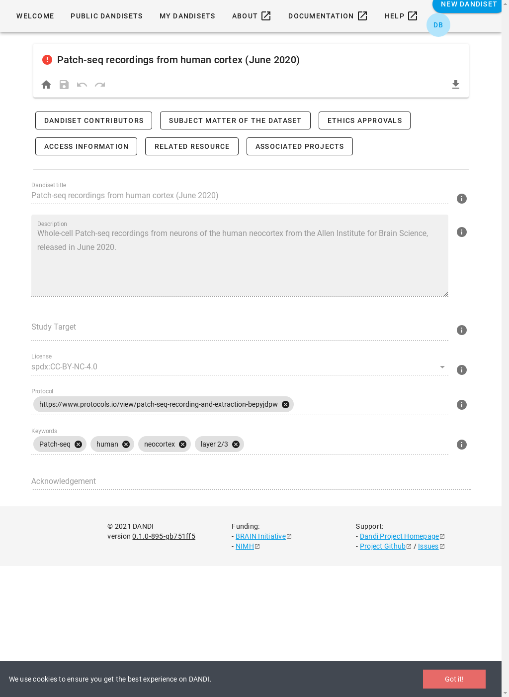 |  |

#### Error Messages
<pre>Message: unknown error: Chrome failed to start: exited abnormally
  (unknown error: DevToolsActivePort file doesn't exist)
  (The process started from chrome location /usr/bin/chromium is no longer running, so ChromeDriver is assuming that Chrome has crashed.)
  (Driver info: chromedriver=73.0.3683.75,platform=Linux 4.19.0-0.bpo.9-amd64 x86_64)</pre>
<pre>Message: unknown error: Chrome failed to start: exited abnormally
  (unknown error: Devtools port number file contents &lt;&gt; were in an unexpected format)
  (The process started from chrome location /usr/bin/chromium is no longer running, so ChromeDriver is assuming that Chrome has crashed.)
  (Driver info: chromedriver=73.0.3683.75,platform=Linux 4.19.0-0.bpo.9-amd64 x86_64)</pre>
<pre>Message: unknown error: Chrome failed to start: exited abnormally
  (unknown error: DevToolsActivePort file doesn't exist)
  (The process started from chrome location /usr/bin/chromium is no longer running, so ChromeDriver is assuming that Chrome has crashed.)
  (Driver info: chromedriver=73.0.3683.75,platform=Linux 4.19.0-0.bpo.9-amd64 x86_64)</pre>
### 200024

| t=[See below] [Go to page](https://gui-staging.dandiarchive.org/#/dandiset/200024) | t=[See below] Edit Metadata | t=[See below] [Go to page](https://gui-staging.dandiarchive.org/#/dandiset/200024/draft/files) |
| --- | --- | --- |
| 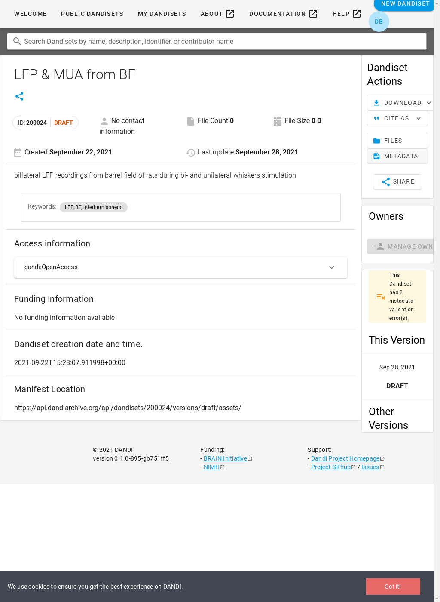 |  |  |

#### Error Messages
<pre>Message: unknown error: Chrome failed to start: exited abnormally
  (unknown error: Devtools port number file contents &lt;&gt; were in an unexpected format)
  (The process started from chrome location /usr/bin/chromium is no longer running, so ChromeDriver is assuming that Chrome has crashed.)
  (Driver info: chromedriver=73.0.3683.75,platform=Linux 4.19.0-0.bpo.9-amd64 x86_64)</pre>
<pre>Message: unknown error: Chrome failed to start: exited abnormally
  (unknown error: DevToolsActivePort file doesn't exist)
  (The process started from chrome location /usr/bin/chromium is no longer running, so ChromeDriver is assuming that Chrome has crashed.)
  (Driver info: chromedriver=73.0.3683.75,platform=Linux 4.19.0-0.bpo.9-amd64 x86_64)</pre>
<pre>Message: unknown error: Chrome failed to start: exited abnormally
  (unknown error: Devtools port number file contents &lt;&gt; were in an unexpected format)
  (The process started from chrome location /usr/bin/chromium is no longer running, so ChromeDriver is assuming that Chrome has crashed.)
  (Driver info: chromedriver=73.0.3683.75,platform=Linux 4.19.0-0.bpo.9-amd64 x86_64)</pre>
### 200025

| t=[See below] [Go to page](https://gui-staging.dandiarchive.org/#/dandiset/200025) | t=[See below] Edit Metadata | t=[See below] [Go to page](https://gui-staging.dandiarchive.org/#/dandiset/200025/draft/files) |
| --- | --- | --- |
| 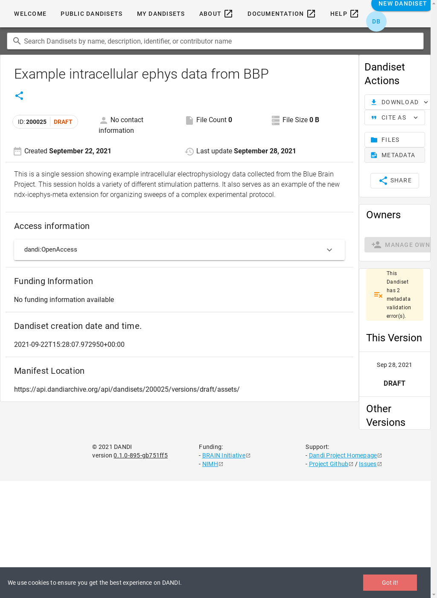 |  |  |

#### Error Messages
<pre>Message: unknown error: Chrome failed to start: exited abnormally
  (unknown error: Devtools port number file contents &lt;&gt; were in an unexpected format)
  (The process started from chrome location /usr/bin/chromium is no longer running, so ChromeDriver is assuming that Chrome has crashed.)
  (Driver info: chromedriver=73.0.3683.75,platform=Linux 4.19.0-0.bpo.9-amd64 x86_64)</pre>
<pre>Message: unknown error: Chrome failed to start: exited abnormally
  (unknown error: DevToolsActivePort file doesn't exist)
  (The process started from chrome location /usr/bin/chromium is no longer running, so ChromeDriver is assuming that Chrome has crashed.)
  (Driver info: chromedriver=73.0.3683.75,platform=Linux 4.19.0-0.bpo.9-amd64 x86_64)</pre>
<pre>Message: unknown error: Chrome failed to start: exited abnormally
  (unknown error: Devtools port number file contents &lt;&gt; were in an unexpected format)
  (The process started from chrome location /usr/bin/chromium is no longer running, so ChromeDriver is assuming that Chrome has crashed.)
  (Driver info: chromedriver=73.0.3683.75,platform=Linux 4.19.0-0.bpo.9-amd64 x86_64)</pre>
### 200026

| t=[See below] [Go to page](https://gui-staging.dandiarchive.org/#/dandiset/200026) | t=[See below] Edit Metadata | t=[See below] [Go to page](https://gui-staging.dandiarchive.org/#/dandiset/200026/draft/files) |
| --- | --- | --- |
| 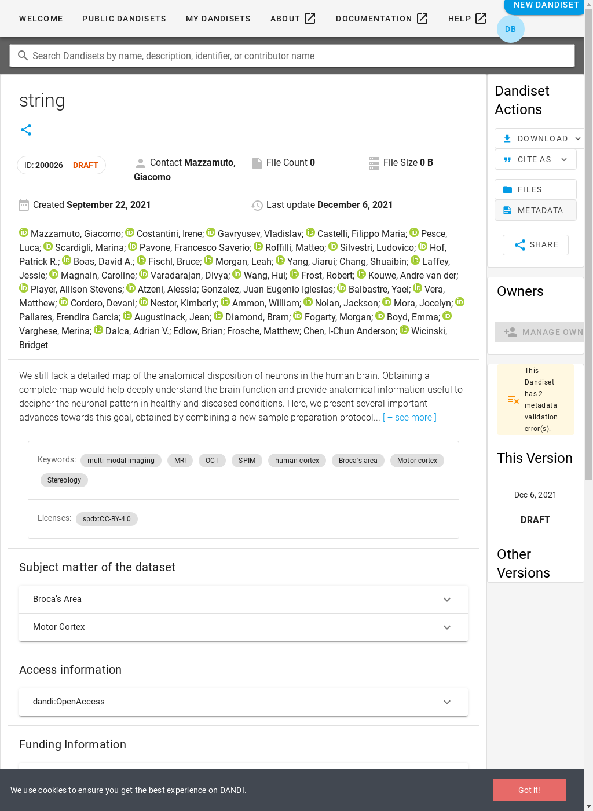 |  |  |

#### Error Messages
<pre>Message: unknown error: Chrome failed to start: exited abnormally
  (unknown error: Devtools port number file contents &lt;&gt; were in an unexpected format)
  (The process started from chrome location /usr/bin/chromium is no longer running, so ChromeDriver is assuming that Chrome has crashed.)
  (Driver info: chromedriver=73.0.3683.75,platform=Linux 4.19.0-0.bpo.9-amd64 x86_64)</pre>
<pre>Message: unknown error: Chrome failed to start: exited abnormally
  (unknown error: Devtools port number file contents &lt;&gt; were in an unexpected format)
  (The process started from chrome location /usr/bin/chromium is no longer running, so ChromeDriver is assuming that Chrome has crashed.)
  (Driver info: chromedriver=73.0.3683.75,platform=Linux 4.19.0-0.bpo.9-amd64 x86_64)</pre>
<pre>Message: unknown error: Chrome failed to start: exited abnormally
  (unknown error: DevToolsActivePort file doesn't exist)
  (The process started from chrome location /usr/bin/chromium is no longer running, so ChromeDriver is assuming that Chrome has crashed.)
  (Driver info: chromedriver=73.0.3683.75,platform=Linux 4.19.0-0.bpo.9-amd64 x86_64)</pre>
### 200027

| t=[See below] [Go to page](https://gui-staging.dandiarchive.org/#/dandiset/200027) | t=[See below] Edit Metadata | t=[See below] [Go to page](https://gui-staging.dandiarchive.org/#/dandiset/200027/draft/files) |
| --- | --- | --- |
|  | 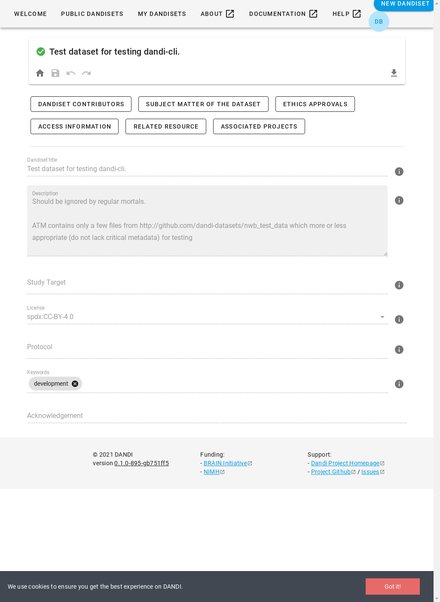 |  |

#### Error Messages
<pre>Message: unknown error: Chrome failed to start: exited abnormally
  (unknown error: DevToolsActivePort file doesn't exist)
  (The process started from chrome location /usr/bin/chromium is no longer running, so ChromeDriver is assuming that Chrome has crashed.)
  (Driver info: chromedriver=73.0.3683.75,platform=Linux 4.19.0-0.bpo.9-amd64 x86_64)</pre>
<pre>Message: unknown error: Chrome failed to start: exited abnormally
  (unknown error: Devtools port number file contents &lt;&gt; were in an unexpected format)
  (The process started from chrome location /usr/bin/chromium is no longer running, so ChromeDriver is assuming that Chrome has crashed.)
  (Driver info: chromedriver=73.0.3683.75,platform=Linux 4.19.0-0.bpo.9-amd64 x86_64)</pre>
<pre>Message: unknown error: Chrome failed to start: exited abnormally
  (unknown error: Devtools port number file contents &lt;&gt; were in an unexpected format)
  (The process started from chrome location /usr/bin/chromium is no longer running, so ChromeDriver is assuming that Chrome has crashed.)
  (Driver info: chromedriver=73.0.3683.75,platform=Linux 4.19.0-0.bpo.9-amd64 x86_64)</pre>
### 200028

| t=[See below] [Go to page](https://gui-staging.dandiarchive.org/#/dandiset/200028) | t=[See below] Edit Metadata | t=[See below] [Go to page](https://gui-staging.dandiarchive.org/#/dandiset/200028/draft/files) |
| --- | --- | --- |
|  | 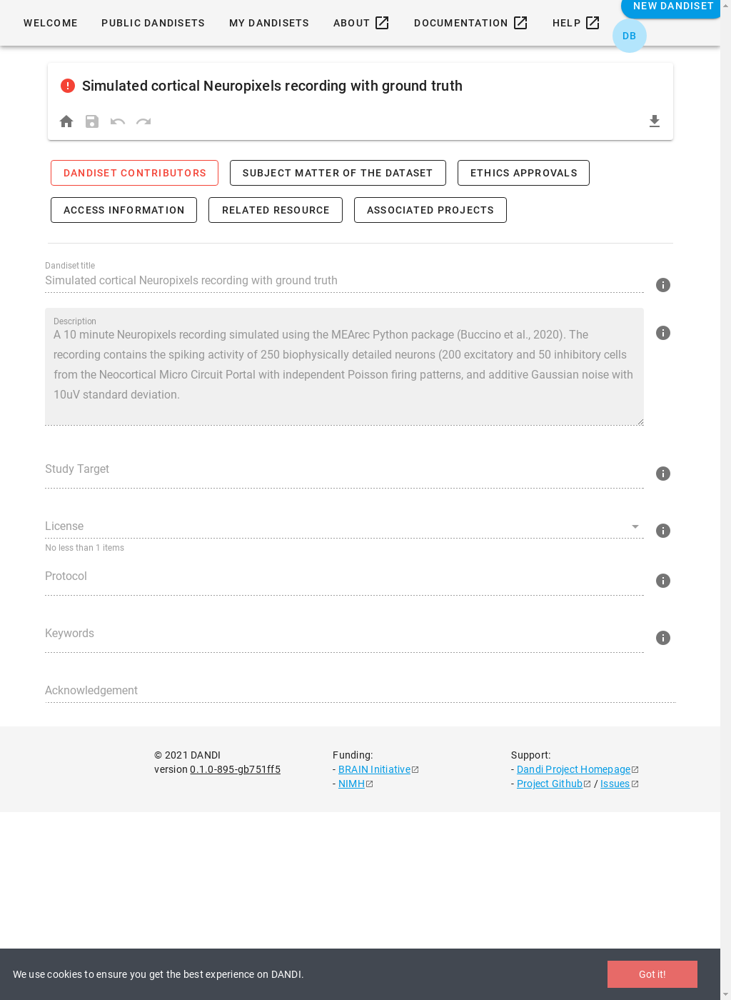 |  |

#### Error Messages
<pre>Message: unknown error: Chrome failed to start: exited abnormally
  (unknown error: Devtools port number file contents &lt;&gt; were in an unexpected format)
  (The process started from chrome location /usr/bin/chromium is no longer running, so ChromeDriver is assuming that Chrome has crashed.)
  (Driver info: chromedriver=73.0.3683.75,platform=Linux 4.19.0-0.bpo.9-amd64 x86_64)</pre>
<pre>Message: unknown error: Chrome failed to start: exited abnormally
  (unknown error: Devtools port number file contents &lt;&gt; were in an unexpected format)
  (The process started from chrome location /usr/bin/chromium is no longer running, so ChromeDriver is assuming that Chrome has crashed.)
  (Driver info: chromedriver=73.0.3683.75,platform=Linux 4.19.0-0.bpo.9-amd64 x86_64)</pre>
<pre>Message: unknown error: Chrome failed to start: exited abnormally
  (unknown error: DevToolsActivePort file doesn't exist)
  (The process started from chrome location /usr/bin/chromium is no longer running, so ChromeDriver is assuming that Chrome has crashed.)
  (Driver info: chromedriver=73.0.3683.75,platform=Linux 4.19.0-0.bpo.9-amd64 x86_64)</pre>
### 200029

| t=[See below] [Go to page](https://gui-staging.dandiarchive.org/#/dandiset/200029) | t=[See below] Edit Metadata | t=[See below] [Go to page](https://gui-staging.dandiarchive.org/#/dandiset/200029/draft/files) |
| --- | --- | --- |
| 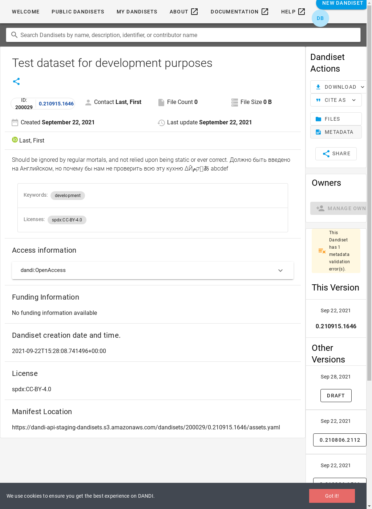 | 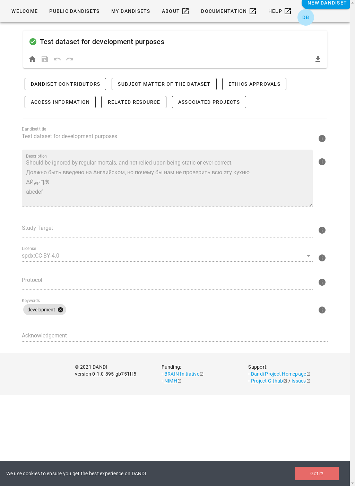 |  |

#### Error Messages
<pre>Message: unknown error: Chrome failed to start: exited abnormally
  (unknown error: Devtools port number file contents &lt;&gt; were in an unexpected format)
  (The process started from chrome location /usr/bin/chromium is no longer running, so ChromeDriver is assuming that Chrome has crashed.)
  (Driver info: chromedriver=73.0.3683.75,platform=Linux 4.19.0-0.bpo.9-amd64 x86_64)</pre>
<pre>Message: unknown error: Chrome failed to start: exited abnormally
  (unknown error: DevToolsActivePort file doesn't exist)
  (The process started from chrome location /usr/bin/chromium is no longer running, so ChromeDriver is assuming that Chrome has crashed.)
  (Driver info: chromedriver=73.0.3683.75,platform=Linux 4.19.0-0.bpo.9-amd64 x86_64)</pre>
<pre>Message: unknown error: Chrome failed to start: exited abnormally
  (unknown error: Devtools port number file contents &lt;&gt; were in an unexpected format)
  (The process started from chrome location /usr/bin/chromium is no longer running, so ChromeDriver is assuming that Chrome has crashed.)
  (Driver info: chromedriver=73.0.3683.75,platform=Linux 4.19.0-0.bpo.9-amd64 x86_64)</pre>
### 200030

| t=[See below] [Go to page](https://gui-staging.dandiarchive.org/#/dandiset/200030) | t=[See below] Edit Metadata | t=[See below] [Go to page](https://gui-staging.dandiarchive.org/#/dandiset/200030/draft/files) |
| --- | --- | --- |
| 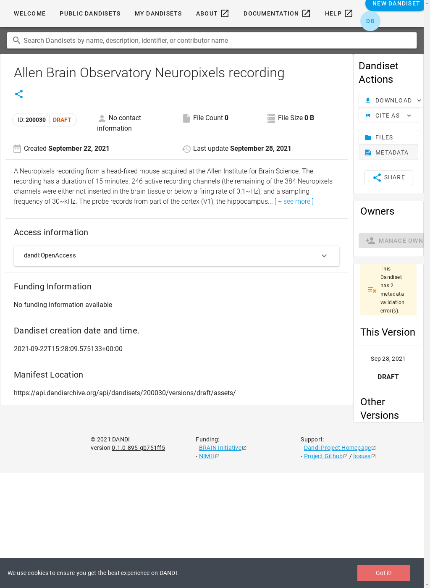 |  |  |

#### Error Messages
<pre>Message: unknown error: Chrome failed to start: exited abnormally
  (unknown error: DevToolsActivePort file doesn't exist)
  (The process started from chrome location /usr/bin/chromium is no longer running, so ChromeDriver is assuming that Chrome has crashed.)
  (Driver info: chromedriver=73.0.3683.75,platform=Linux 4.19.0-0.bpo.9-amd64 x86_64)</pre>
<pre>Message: unknown error: Chrome failed to start: exited abnormally
  (unknown error: DevToolsActivePort file doesn't exist)
  (The process started from chrome location /usr/bin/chromium is no longer running, so ChromeDriver is assuming that Chrome has crashed.)
  (Driver info: chromedriver=73.0.3683.75,platform=Linux 4.19.0-0.bpo.9-amd64 x86_64)</pre>
<pre>Message: unknown error: Chrome failed to start: exited abnormally
  (unknown error: DevToolsActivePort file doesn't exist)
  (The process started from chrome location /usr/bin/chromium is no longer running, so ChromeDriver is assuming that Chrome has crashed.)
  (Driver info: chromedriver=73.0.3683.75,platform=Linux 4.19.0-0.bpo.9-amd64 x86_64)</pre>
### 200031

| t=[See below] [Go to page](https://gui-staging.dandiarchive.org/#/dandiset/200031) | t=[See below] Edit Metadata | t=[See below] [Go to page](https://gui-staging.dandiarchive.org/#/dandiset/200031/draft/files) |
| --- | --- | --- |
|  |  |  |

#### Error Messages
<pre>Message: unknown error: Chrome failed to start: exited abnormally
  (unknown error: Devtools port number file contents &lt;&gt; were in an unexpected format)
  (The process started from chrome location /usr/bin/chromium is no longer running, so ChromeDriver is assuming that Chrome has crashed.)
  (Driver info: chromedriver=73.0.3683.75,platform=Linux 4.19.0-0.bpo.9-amd64 x86_64)</pre>
<pre>Message: unknown error: Chrome failed to start: exited abnormally
  (unknown error: Devtools port number file contents &lt;&gt; were in an unexpected format)
  (The process started from chrome location /usr/bin/chromium is no longer running, so ChromeDriver is assuming that Chrome has crashed.)
  (Driver info: chromedriver=73.0.3683.75,platform=Linux 4.19.0-0.bpo.9-amd64 x86_64)</pre>
<pre>Message: unknown error: Chrome failed to start: exited abnormally
  (unknown error: DevToolsActivePort file doesn't exist)
  (The process started from chrome location /usr/bin/chromium is no longer running, so ChromeDriver is assuming that Chrome has crashed.)
  (Driver info: chromedriver=73.0.3683.75,platform=Linux 4.19.0-0.bpo.9-amd64 x86_64)</pre>
### 200032

| t=[See below] [Go to page](https://gui-staging.dandiarchive.org/#/dandiset/200032) | t=[See below] Edit Metadata | t=[See below] [Go to page](https://gui-staging.dandiarchive.org/#/dandiset/200032/draft/files) |
| --- | --- | --- |
|  |  |  |

#### Error Messages
<pre>Message: unknown error: Chrome failed to start: exited abnormally
  (unknown error: DevToolsActivePort file doesn't exist)
  (The process started from chrome location /usr/bin/chromium is no longer running, so ChromeDriver is assuming that Chrome has crashed.)
  (Driver info: chromedriver=73.0.3683.75,platform=Linux 4.19.0-0.bpo.9-amd64 x86_64)</pre>
<pre>Message: unknown error: Chrome failed to start: exited abnormally
  (unknown error: Devtools port number file contents &lt;&gt; were in an unexpected format)
  (The process started from chrome location /usr/bin/chromium is no longer running, so ChromeDriver is assuming that Chrome has crashed.)
  (Driver info: chromedriver=73.0.3683.75,platform=Linux 4.19.0-0.bpo.9-amd64 x86_64)</pre>
<pre>Message: unknown error: Chrome failed to start: exited abnormally
  (unknown error: Devtools port number file contents &lt;&gt; were in an unexpected format)
  (The process started from chrome location /usr/bin/chromium is no longer running, so ChromeDriver is assuming that Chrome has crashed.)
  (Driver info: chromedriver=73.0.3683.75,platform=Linux 4.19.0-0.bpo.9-amd64 x86_64)</pre>
### 200033

| t=[See below] [Go to page](https://gui-staging.dandiarchive.org/#/dandiset/200033) | t=[See below] Edit Metadata | t=[See below] [Go to page](https://gui-staging.dandiarchive.org/#/dandiset/200033/draft/files) |
| --- | --- | --- |
|  |  |  |

#### Error Messages
<pre>Message: unknown error: Chrome failed to start: exited abnormally
  (unknown error: DevToolsActivePort file doesn't exist)
  (The process started from chrome location /usr/bin/chromium is no longer running, so ChromeDriver is assuming that Chrome has crashed.)
  (Driver info: chromedriver=73.0.3683.75,platform=Linux 4.19.0-0.bpo.9-amd64 x86_64)</pre>
<pre>Message: unknown error: Chrome failed to start: exited abnormally
  (unknown error: Devtools port number file contents &lt;&gt; were in an unexpected format)
  (The process started from chrome location /usr/bin/chromium is no longer running, so ChromeDriver is assuming that Chrome has crashed.)
  (Driver info: chromedriver=73.0.3683.75,platform=Linux 4.19.0-0.bpo.9-amd64 x86_64)</pre>
<pre>Message: unknown error: Chrome failed to start: exited abnormally
  (unknown error: DevToolsActivePort file doesn't exist)
  (The process started from chrome location /usr/bin/chromium is no longer running, so ChromeDriver is assuming that Chrome has crashed.)
  (Driver info: chromedriver=73.0.3683.75,platform=Linux 4.19.0-0.bpo.9-amd64 x86_64)</pre>
### 200034

| t=[See below] [Go to page](https://gui-staging.dandiarchive.org/#/dandiset/200034) | t=[See below] Edit Metadata | t=[See below] [Go to page](https://gui-staging.dandiarchive.org/#/dandiset/200034/draft/files) |
| --- | --- | --- |
|  | 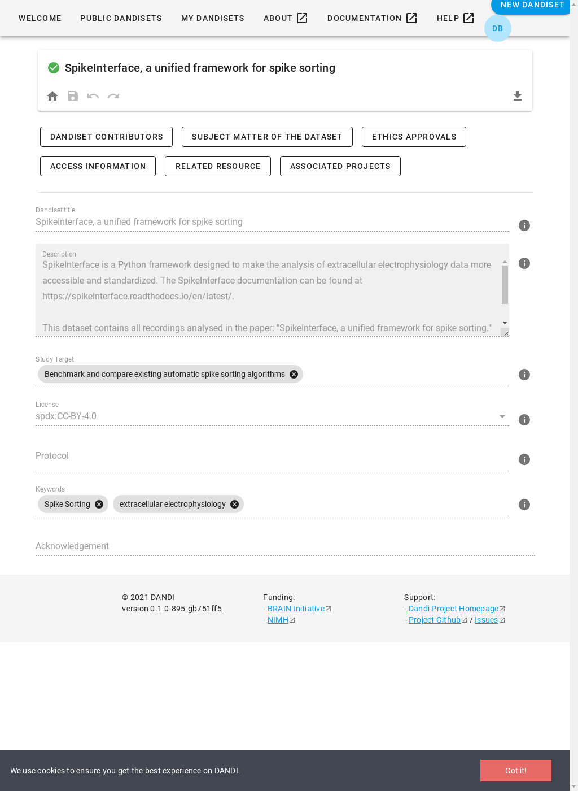 |  |

#### Error Messages
<pre>Message: unknown error: Chrome failed to start: exited abnormally
  (unknown error: Devtools port number file contents &lt;&gt; were in an unexpected format)
  (The process started from chrome location /usr/bin/chromium is no longer running, so ChromeDriver is assuming that Chrome has crashed.)
  (Driver info: chromedriver=73.0.3683.75,platform=Linux 4.19.0-0.bpo.9-amd64 x86_64)</pre>
<pre>Message: unknown error: Chrome failed to start: exited abnormally
  (unknown error: Devtools port number file contents &lt;&gt; were in an unexpected format)
  (The process started from chrome location /usr/bin/chromium is no longer running, so ChromeDriver is assuming that Chrome has crashed.)
  (Driver info: chromedriver=73.0.3683.75,platform=Linux 4.19.0-0.bpo.9-amd64 x86_64)</pre>
<pre>Message: unknown error: Chrome failed to start: exited abnormally
  (unknown error: DevToolsActivePort file doesn't exist)
  (The process started from chrome location /usr/bin/chromium is no longer running, so ChromeDriver is assuming that Chrome has crashed.)
  (Driver info: chromedriver=73.0.3683.75,platform=Linux 4.19.0-0.bpo.9-amd64 x86_64)</pre>
### 200035

| t=[See below] [Go to page](https://gui-staging.dandiarchive.org/#/dandiset/200035) | t=[See below] Edit Metadata | t=[See below] [Go to page](https://gui-staging.dandiarchive.org/#/dandiset/200035/draft/files) |
| --- | --- | --- |
|  |  |  |

#### Error Messages
<pre>Message: unknown error: Chrome failed to start: exited abnormally
  (unknown error: Devtools port number file contents &lt;&gt; were in an unexpected format)
  (The process started from chrome location /usr/bin/chromium is no longer running, so ChromeDriver is assuming that Chrome has crashed.)
  (Driver info: chromedriver=73.0.3683.75,platform=Linux 4.19.0-0.bpo.9-amd64 x86_64)</pre>
<pre>Message: unknown error: Chrome failed to start: exited abnormally
  (unknown error: DevToolsActivePort file doesn't exist)
  (The process started from chrome location /usr/bin/chromium is no longer running, so ChromeDriver is assuming that Chrome has crashed.)
  (Driver info: chromedriver=73.0.3683.75,platform=Linux 4.19.0-0.bpo.9-amd64 x86_64)</pre>
<pre>Message: unknown error: Chrome failed to start: exited abnormally
  (unknown error: DevToolsActivePort file doesn't exist)
  (The process started from chrome location /usr/bin/chromium is no longer running, so ChromeDriver is assuming that Chrome has crashed.)
  (Driver info: chromedriver=73.0.3683.75,platform=Linux 4.19.0-0.bpo.9-amd64 x86_64)</pre>
### 200036

| t=[See below] [Go to page](https://gui-staging.dandiarchive.org/#/dandiset/200036) | t=[See below] Edit Metadata | t=[See below] [Go to page](https://gui-staging.dandiarchive.org/#/dandiset/200036/draft/files) |
| --- | --- | --- |
|  | 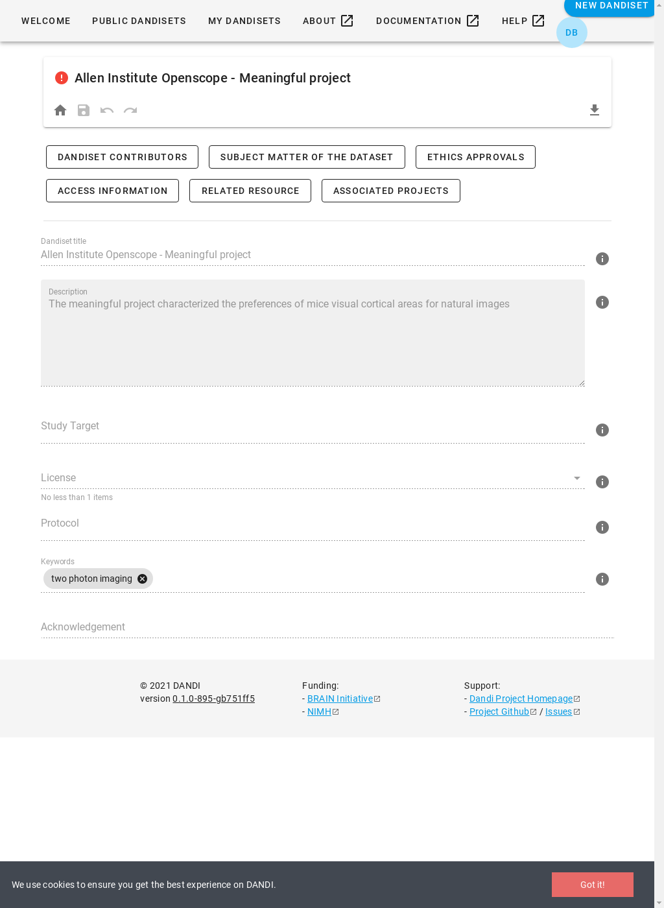 |  |

#### Error Messages
<pre>Message: unknown error: Chrome failed to start: exited abnormally
  (unknown error: Devtools port number file contents &lt;&gt; were in an unexpected format)
  (The process started from chrome location /usr/bin/chromium is no longer running, so ChromeDriver is assuming that Chrome has crashed.)
  (Driver info: chromedriver=73.0.3683.75,platform=Linux 4.19.0-0.bpo.9-amd64 x86_64)</pre>
<pre>Message: unknown error: Chrome failed to start: exited abnormally
  (unknown error: DevToolsActivePort file doesn't exist)
  (The process started from chrome location /usr/bin/chromium is no longer running, so ChromeDriver is assuming that Chrome has crashed.)
  (Driver info: chromedriver=73.0.3683.75,platform=Linux 4.19.0-0.bpo.9-amd64 x86_64)</pre>
<pre>Message: unknown error: Chrome failed to start: exited abnormally
  (unknown error: Devtools port number file contents &lt;&gt; were in an unexpected format)
  (The process started from chrome location /usr/bin/chromium is no longer running, so ChromeDriver is assuming that Chrome has crashed.)
  (Driver info: chromedriver=73.0.3683.75,platform=Linux 4.19.0-0.bpo.9-amd64 x86_64)</pre>
### 200037

| t=[See below] [Go to page](https://gui-staging.dandiarchive.org/#/dandiset/200037) | t=[See below] Edit Metadata | t=[See below] [Go to page](https://gui-staging.dandiarchive.org/#/dandiset/200037/draft/files) |
| --- | --- | --- |
|  | 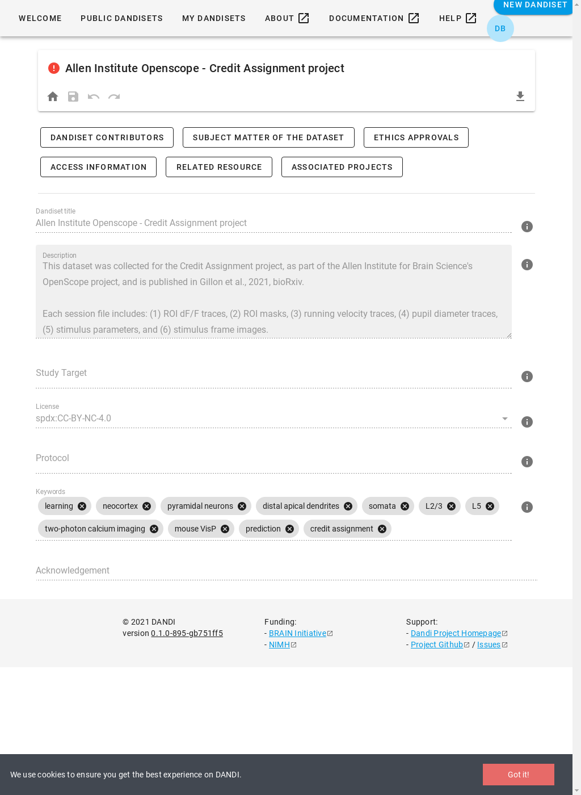 |  |

#### Error Messages
<pre>Message: unknown error: Chrome failed to start: exited abnormally
  (unknown error: DevToolsActivePort file doesn't exist)
  (The process started from chrome location /usr/bin/chromium is no longer running, so ChromeDriver is assuming that Chrome has crashed.)
  (Driver info: chromedriver=73.0.3683.75,platform=Linux 4.19.0-0.bpo.9-amd64 x86_64)</pre>
<pre>Message: unknown error: Chrome failed to start: exited abnormally
  (unknown error: Devtools port number file contents &lt;&gt; were in an unexpected format)
  (The process started from chrome location /usr/bin/chromium is no longer running, so ChromeDriver is assuming that Chrome has crashed.)
  (Driver info: chromedriver=73.0.3683.75,platform=Linux 4.19.0-0.bpo.9-amd64 x86_64)</pre>
<pre>Message: unknown error: Chrome failed to start: exited abnormally
  (unknown error: Devtools port number file contents &lt;&gt; were in an unexpected format)
  (The process started from chrome location /usr/bin/chromium is no longer running, so ChromeDriver is assuming that Chrome has crashed.)
  (Driver info: chromedriver=73.0.3683.75,platform=Linux 4.19.0-0.bpo.9-amd64 x86_64)</pre>
### 200038

| t=[See below] [Go to page](https://gui-staging.dandiarchive.org/#/dandiset/200038) | t=[See below] Edit Metadata | t=[See below] [Go to page](https://gui-staging.dandiarchive.org/#/dandiset/200038/draft/files) |
| --- | --- | --- |
|  |  |  |

#### Error Messages
<pre>Message: unknown error: Chrome failed to start: exited abnormally
  (unknown error: Devtools port number file contents &lt;&gt; were in an unexpected format)
  (The process started from chrome location /usr/bin/chromium is no longer running, so ChromeDriver is assuming that Chrome has crashed.)
  (Driver info: chromedriver=73.0.3683.75,platform=Linux 4.19.0-0.bpo.9-amd64 x86_64)</pre>
<pre>Message: unknown error: Chrome failed to start: exited abnormally
  (unknown error: DevToolsActivePort file doesn't exist)
  (The process started from chrome location /usr/bin/chromium is no longer running, so ChromeDriver is assuming that Chrome has crashed.)
  (Driver info: chromedriver=73.0.3683.75,platform=Linux 4.19.0-0.bpo.9-amd64 x86_64)</pre>
<pre>Message: unknown error: Chrome failed to start: exited abnormally
  (unknown error: DevToolsActivePort file doesn't exist)
  (The process started from chrome location /usr/bin/chromium is no longer running, so ChromeDriver is assuming that Chrome has crashed.)
  (Driver info: chromedriver=73.0.3683.75,platform=Linux 4.19.0-0.bpo.9-amd64 x86_64)</pre>
### 200039

| t=[See below] [Go to page](https://gui-staging.dandiarchive.org/#/dandiset/200039) | t=[See below] Edit Metadata | t=[See below] [Go to page](https://gui-staging.dandiarchive.org/#/dandiset/200039/draft/files) |
| --- | --- | --- |
|  |  |  |

#### Error Messages
<pre>Message: unknown error: Chrome failed to start: exited abnormally
  (unknown error: DevToolsActivePort file doesn't exist)
  (The process started from chrome location /usr/bin/chromium is no longer running, so ChromeDriver is assuming that Chrome has crashed.)
  (Driver info: chromedriver=73.0.3683.75,platform=Linux 4.19.0-0.bpo.9-amd64 x86_64)</pre>
<pre>Message: unknown error: Chrome failed to start: exited abnormally
  (unknown error: Devtools port number file contents &lt;&gt; were in an unexpected format)
  (The process started from chrome location /usr/bin/chromium is no longer running, so ChromeDriver is assuming that Chrome has crashed.)
  (Driver info: chromedriver=73.0.3683.75,platform=Linux 4.19.0-0.bpo.9-amd64 x86_64)</pre>
<pre>Message: unknown error: Chrome failed to start: exited abnormally
  (unknown error: DevToolsActivePort file doesn't exist)
  (The process started from chrome location /usr/bin/chromium is no longer running, so ChromeDriver is assuming that Chrome has crashed.)
  (Driver info: chromedriver=73.0.3683.75,platform=Linux 4.19.0-0.bpo.9-amd64 x86_64)</pre>
### 200040

| t=[See below] [Go to page](https://gui-staging.dandiarchive.org/#/dandiset/200040) | t=[See below] Edit Metadata | t=[See below] [Go to page](https://gui-staging.dandiarchive.org/#/dandiset/200040/draft/files) |
| --- | --- | --- |
| 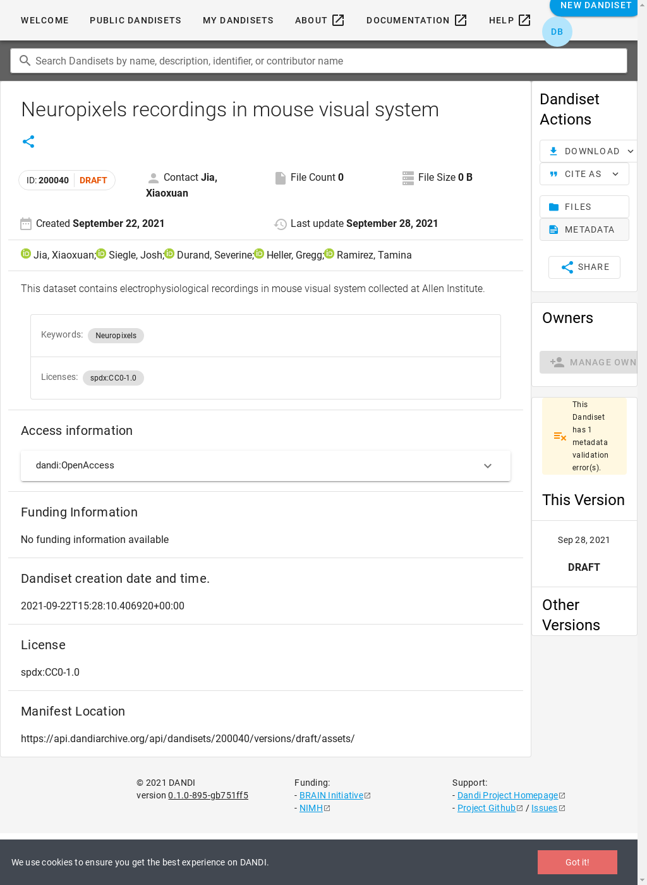 |  |  |

#### Error Messages
<pre>Message: unknown error: Chrome failed to start: exited abnormally
  (unknown error: Devtools port number file contents &lt;&gt; were in an unexpected format)
  (The process started from chrome location /usr/bin/chromium is no longer running, so ChromeDriver is assuming that Chrome has crashed.)
  (Driver info: chromedriver=73.0.3683.75,platform=Linux 4.19.0-0.bpo.9-amd64 x86_64)</pre>
<pre>Message: unknown error: Chrome failed to start: exited abnormally
  (unknown error: Devtools port number file contents &lt;&gt; were in an unexpected format)
  (The process started from chrome location /usr/bin/chromium is no longer running, so ChromeDriver is assuming that Chrome has crashed.)
  (Driver info: chromedriver=73.0.3683.75,platform=Linux 4.19.0-0.bpo.9-amd64 x86_64)</pre>
<pre>Message: unknown error: Chrome failed to start: exited abnormally
  (unknown error: Devtools port number file contents &lt;&gt; were in an unexpected format)
  (The process started from chrome location /usr/bin/chromium is no longer running, so ChromeDriver is assuming that Chrome has crashed.)
  (Driver info: chromedriver=73.0.3683.75,platform=Linux 4.19.0-0.bpo.9-amd64 x86_64)</pre>
### 200041

| t=[See below] [Go to page](https://gui-staging.dandiarchive.org/#/dandiset/200041) | t=[See below] Edit Metadata | t=[See below] [Go to page](https://gui-staging.dandiarchive.org/#/dandiset/200041/draft/files) |
| --- | --- | --- |
|  |  |  |

#### Error Messages
<pre>Message: unknown error: Chrome failed to start: exited abnormally
  (unknown error: Devtools port number file contents &lt;&gt; were in an unexpected format)
  (The process started from chrome location /usr/bin/chromium is no longer running, so ChromeDriver is assuming that Chrome has crashed.)
  (Driver info: chromedriver=73.0.3683.75,platform=Linux 4.19.0-0.bpo.9-amd64 x86_64)</pre>
<pre>Message: unknown error: Chrome failed to start: exited abnormally
  (unknown error: DevToolsActivePort file doesn't exist)
  (The process started from chrome location /usr/bin/chromium is no longer running, so ChromeDriver is assuming that Chrome has crashed.)
  (Driver info: chromedriver=73.0.3683.75,platform=Linux 4.19.0-0.bpo.9-amd64 x86_64)</pre>
<pre>Message: unknown error: Chrome failed to start: exited abnormally
  (unknown error: Devtools port number file contents &lt;&gt; were in an unexpected format)
  (The process started from chrome location /usr/bin/chromium is no longer running, so ChromeDriver is assuming that Chrome has crashed.)
  (Driver info: chromedriver=73.0.3683.75,platform=Linux 4.19.0-0.bpo.9-amd64 x86_64)</pre>
### 200042

| t=[See below] [Go to page](https://gui-staging.dandiarchive.org/#/dandiset/200042) | t=[See below] Edit Metadata | t=[See below] [Go to page](https://gui-staging.dandiarchive.org/#/dandiset/200042/draft/files) |
| --- | --- | --- |
| 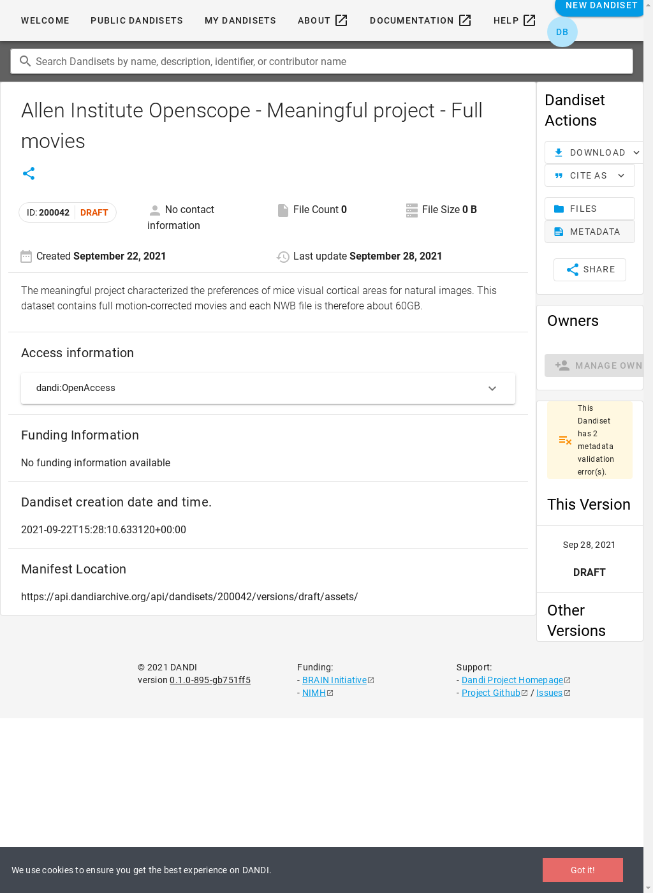 |  |  |

#### Error Messages
<pre>Message: unknown error: Chrome failed to start: exited abnormally
  (unknown error: Devtools port number file contents &lt;&gt; were in an unexpected format)
  (The process started from chrome location /usr/bin/chromium is no longer running, so ChromeDriver is assuming that Chrome has crashed.)
  (Driver info: chromedriver=73.0.3683.75,platform=Linux 4.19.0-0.bpo.9-amd64 x86_64)</pre>
<pre>Message: unknown error: Chrome failed to start: exited abnormally
  (unknown error: DevToolsActivePort file doesn't exist)
  (The process started from chrome location /usr/bin/chromium is no longer running, so ChromeDriver is assuming that Chrome has crashed.)
  (Driver info: chromedriver=73.0.3683.75,platform=Linux 4.19.0-0.bpo.9-amd64 x86_64)</pre>
<pre>Message: unknown error: Chrome failed to start: exited abnormally
  (unknown error: Devtools port number file contents &lt;&gt; were in an unexpected format)
  (The process started from chrome location /usr/bin/chromium is no longer running, so ChromeDriver is assuming that Chrome has crashed.)
  (Driver info: chromedriver=73.0.3683.75,platform=Linux 4.19.0-0.bpo.9-amd64 x86_64)</pre>
### 200043

| t=[See below] [Go to page](https://gui-staging.dandiarchive.org/#/dandiset/200043) | t=[See below] Edit Metadata | t=[See below] [Go to page](https://gui-staging.dandiarchive.org/#/dandiset/200043/draft/files) |
| --- | --- | --- |
| 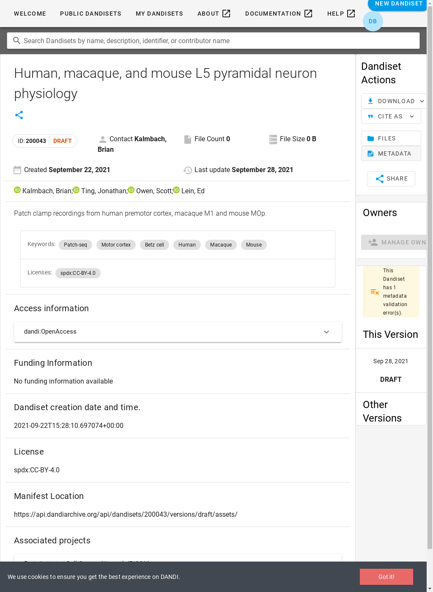 | 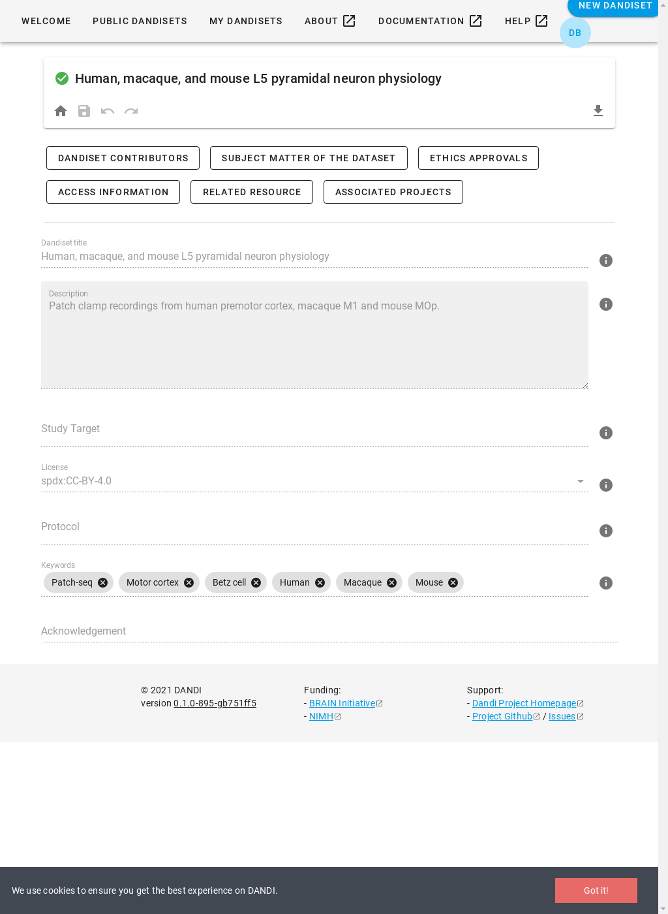 |  |

#### Error Messages
<pre>Message: unknown error: Chrome failed to start: exited abnormally
  (unknown error: DevToolsActivePort file doesn't exist)
  (The process started from chrome location /usr/bin/chromium is no longer running, so ChromeDriver is assuming that Chrome has crashed.)
  (Driver info: chromedriver=73.0.3683.75,platform=Linux 4.19.0-0.bpo.9-amd64 x86_64)</pre>
<pre>Message: unknown error: Chrome failed to start: exited abnormally
  (unknown error: Devtools port number file contents &lt;&gt; were in an unexpected format)
  (The process started from chrome location /usr/bin/chromium is no longer running, so ChromeDriver is assuming that Chrome has crashed.)
  (Driver info: chromedriver=73.0.3683.75,platform=Linux 4.19.0-0.bpo.9-amd64 x86_64)</pre>
<pre>Message: unknown error: Chrome failed to start: exited abnormally
  (unknown error: DevToolsActivePort file doesn't exist)
  (The process started from chrome location /usr/bin/chromium is no longer running, so ChromeDriver is assuming that Chrome has crashed.)
  (Driver info: chromedriver=73.0.3683.75,platform=Linux 4.19.0-0.bpo.9-amd64 x86_64)</pre>
### 200044

| t=[See below] [Go to page](https://gui-staging.dandiarchive.org/#/dandiset/200044) | t=[See below] Edit Metadata | t=[See below] [Go to page](https://gui-staging.dandiarchive.org/#/dandiset/200044/draft/files) |
| --- | --- | --- |
| 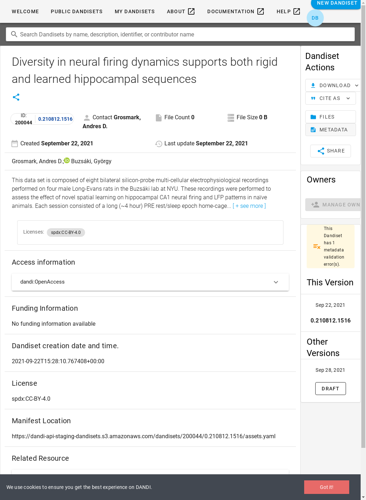 | 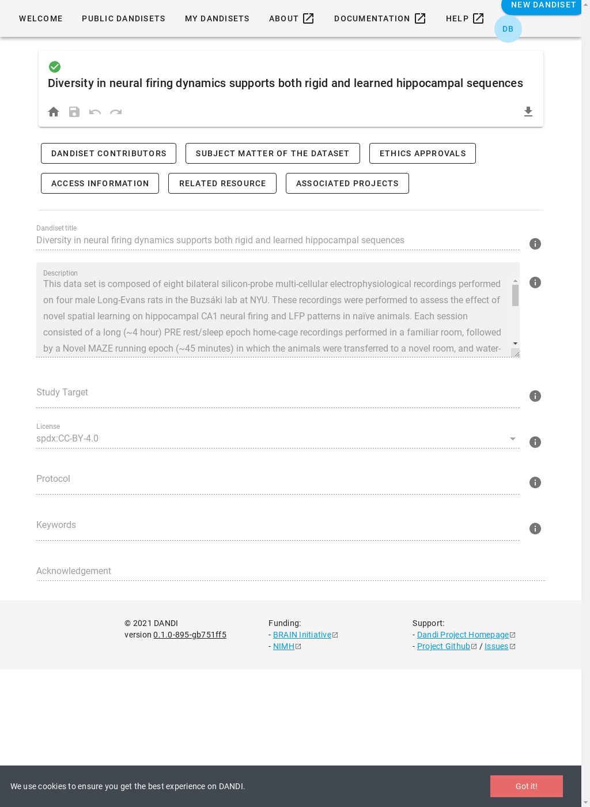 |  |

#### Error Messages
<pre>Message: unknown error: Chrome failed to start: exited abnormally
  (unknown error: DevToolsActivePort file doesn't exist)
  (The process started from chrome location /usr/bin/chromium is no longer running, so ChromeDriver is assuming that Chrome has crashed.)
  (Driver info: chromedriver=73.0.3683.75,platform=Linux 4.19.0-0.bpo.9-amd64 x86_64)</pre>
<pre>Message: unknown error: Chrome failed to start: exited abnormally
  (unknown error: Devtools port number file contents &lt;&gt; were in an unexpected format)
  (The process started from chrome location /usr/bin/chromium is no longer running, so ChromeDriver is assuming that Chrome has crashed.)
  (Driver info: chromedriver=73.0.3683.75,platform=Linux 4.19.0-0.bpo.9-amd64 x86_64)</pre>
<pre>Message: unknown error: Chrome failed to start: exited abnormally
  (unknown error: Devtools port number file contents &lt;&gt; were in an unexpected format)
  (The process started from chrome location /usr/bin/chromium is no longer running, so ChromeDriver is assuming that Chrome has crashed.)
  (Driver info: chromedriver=73.0.3683.75,platform=Linux 4.19.0-0.bpo.9-amd64 x86_64)</pre>
### 200045

| t=[See below] [Go to page](https://gui-staging.dandiarchive.org/#/dandiset/200045) | t=[See below] Edit Metadata | t=[See below] [Go to page](https://gui-staging.dandiarchive.org/#/dandiset/200045/draft/files) |
| --- | --- | --- |
|  |  |  |

#### Error Messages
<pre>Message: unknown error: Chrome failed to start: exited abnormally
  (unknown error: DevToolsActivePort file doesn't exist)
  (The process started from chrome location /usr/bin/chromium is no longer running, so ChromeDriver is assuming that Chrome has crashed.)
  (Driver info: chromedriver=73.0.3683.75,platform=Linux 4.19.0-0.bpo.9-amd64 x86_64)</pre>
<pre>Message: unknown error: Chrome failed to start: exited abnormally
  (unknown error: Devtools port number file contents &lt;&gt; were in an unexpected format)
  (The process started from chrome location /usr/bin/chromium is no longer running, so ChromeDriver is assuming that Chrome has crashed.)
  (Driver info: chromedriver=73.0.3683.75,platform=Linux 4.19.0-0.bpo.9-amd64 x86_64)</pre>
<pre>Message: unknown error: Chrome failed to start: exited abnormally
  (unknown error: DevToolsActivePort file doesn't exist)
  (The process started from chrome location /usr/bin/chromium is no longer running, so ChromeDriver is assuming that Chrome has crashed.)
  (Driver info: chromedriver=73.0.3683.75,platform=Linux 4.19.0-0.bpo.9-amd64 x86_64)</pre>
### 200046

| t=[See below] [Go to page](https://gui-staging.dandiarchive.org/#/dandiset/200046) | t=[See below] Edit Metadata | t=[See below] [Go to page](https://gui-staging.dandiarchive.org/#/dandiset/200046/draft/files) |
| --- | --- | --- |
| 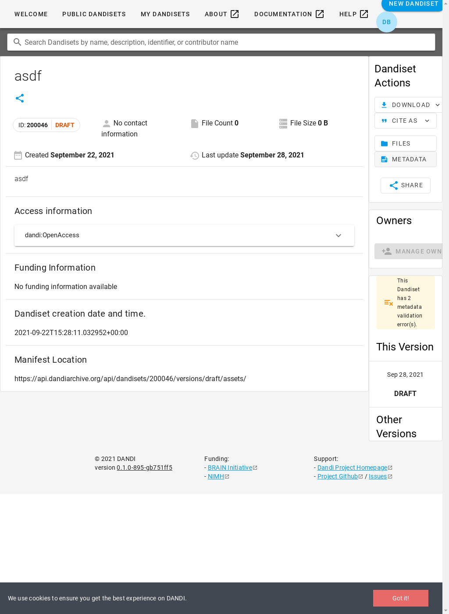 |  |  |

#### Error Messages
<pre>Message: unknown error: Chrome failed to start: exited abnormally
  (unknown error: Devtools port number file contents &lt;&gt; were in an unexpected format)
  (The process started from chrome location /usr/bin/chromium is no longer running, so ChromeDriver is assuming that Chrome has crashed.)
  (Driver info: chromedriver=73.0.3683.75,platform=Linux 4.19.0-0.bpo.9-amd64 x86_64)</pre>
<pre>Message: unknown error: Chrome failed to start: exited abnormally
  (unknown error: Devtools port number file contents &lt;&gt; were in an unexpected format)
  (The process started from chrome location /usr/bin/chromium is no longer running, so ChromeDriver is assuming that Chrome has crashed.)
  (Driver info: chromedriver=73.0.3683.75,platform=Linux 4.19.0-0.bpo.9-amd64 x86_64)</pre>
<pre>Message: unknown error: Chrome failed to start: exited abnormally
  (unknown error: DevToolsActivePort file doesn't exist)
  (The process started from chrome location /usr/bin/chromium is no longer running, so ChromeDriver is assuming that Chrome has crashed.)
  (Driver info: chromedriver=73.0.3683.75,platform=Linux 4.19.0-0.bpo.9-amd64 x86_64)</pre>
### 200047

| t=[See below] [Go to page](https://gui-staging.dandiarchive.org/#/dandiset/200047) | t=[See below] Edit Metadata | t=[See below] [Go to page](https://gui-staging.dandiarchive.org/#/dandiset/200047/draft/files) |
| --- | --- | --- |
| 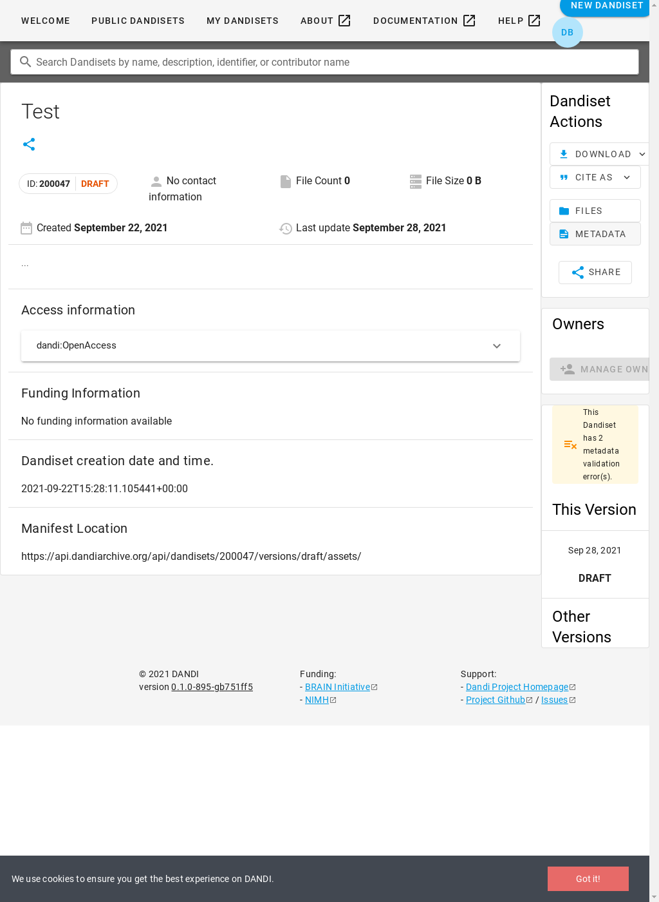 |  |  |

#### Error Messages
<pre>Message: unknown error: Chrome failed to start: exited abnormally
  (unknown error: DevToolsActivePort file doesn't exist)
  (The process started from chrome location /usr/bin/chromium is no longer running, so ChromeDriver is assuming that Chrome has crashed.)
  (Driver info: chromedriver=73.0.3683.75,platform=Linux 4.19.0-0.bpo.9-amd64 x86_64)</pre>
<pre>Message: unknown error: Chrome failed to start: exited abnormally
  (unknown error: DevToolsActivePort file doesn't exist)
  (The process started from chrome location /usr/bin/chromium is no longer running, so ChromeDriver is assuming that Chrome has crashed.)
  (Driver info: chromedriver=73.0.3683.75,platform=Linux 4.19.0-0.bpo.9-amd64 x86_64)</pre>
<pre>Message: unknown error: Chrome failed to start: exited abnormally
  (unknown error: Devtools port number file contents &lt;&gt; were in an unexpected format)
  (The process started from chrome location /usr/bin/chromium is no longer running, so ChromeDriver is assuming that Chrome has crashed.)
  (Driver info: chromedriver=73.0.3683.75,platform=Linux 4.19.0-0.bpo.9-amd64 x86_64)</pre>
### 200048

| t=[See below] [Go to page](https://gui-staging.dandiarchive.org/#/dandiset/200048) | t=[See below] Edit Metadata | t=[See below] [Go to page](https://gui-staging.dandiarchive.org/#/dandiset/200048/draft/files) |
| --- | --- | --- |
|  |  |  |

#### Error Messages
<pre>Message: unknown error: Chrome failed to start: exited abnormally
  (unknown error: Devtools port number file contents &lt;&gt; were in an unexpected format)
  (The process started from chrome location /usr/bin/chromium is no longer running, so ChromeDriver is assuming that Chrome has crashed.)
  (Driver info: chromedriver=73.0.3683.75,platform=Linux 4.19.0-0.bpo.9-amd64 x86_64)</pre>
<pre>Message: unknown error: Chrome failed to start: exited abnormally
  (unknown error: DevToolsActivePort file doesn't exist)
  (The process started from chrome location /usr/bin/chromium is no longer running, so ChromeDriver is assuming that Chrome has crashed.)
  (Driver info: chromedriver=73.0.3683.75,platform=Linux 4.19.0-0.bpo.9-amd64 x86_64)</pre>
<pre>Message: unknown error: Chrome failed to start: exited abnormally
  (unknown error: Devtools port number file contents &lt;&gt; were in an unexpected format)
  (The process started from chrome location /usr/bin/chromium is no longer running, so ChromeDriver is assuming that Chrome has crashed.)
  (Driver info: chromedriver=73.0.3683.75,platform=Linux 4.19.0-0.bpo.9-amd64 x86_64)</pre>
### 200049

| t=[See below] [Go to page](https://gui-staging.dandiarchive.org/#/dandiset/200049) | t=[See below] Edit Metadata | t=[See below] [Go to page](https://gui-staging.dandiarchive.org/#/dandiset/200049/draft/files) |
| --- | --- | --- |
|  |  |  |

#### Error Messages
<pre>Message: unknown error: Chrome failed to start: exited abnormally
  (unknown error: Devtools port number file contents &lt;&gt; were in an unexpected format)
  (The process started from chrome location /usr/bin/chromium is no longer running, so ChromeDriver is assuming that Chrome has crashed.)
  (Driver info: chromedriver=73.0.3683.75,platform=Linux 4.19.0-0.bpo.9-amd64 x86_64)</pre>
<pre>Message: unknown error: Chrome failed to start: exited abnormally
  (unknown error: Devtools port number file contents &lt;&gt; were in an unexpected format)
  (The process started from chrome location /usr/bin/chromium is no longer running, so ChromeDriver is assuming that Chrome has crashed.)
  (Driver info: chromedriver=73.0.3683.75,platform=Linux 4.19.0-0.bpo.9-amd64 x86_64)</pre>
<pre>Message: unknown error: Chrome failed to start: exited abnormally
  (unknown error: DevToolsActivePort file doesn't exist)
  (The process started from chrome location /usr/bin/chromium is no longer running, so ChromeDriver is assuming that Chrome has crashed.)
  (Driver info: chromedriver=73.0.3683.75,platform=Linux 4.19.0-0.bpo.9-amd64 x86_64)</pre>
### 200050

| t=[See below] [Go to page](https://gui-staging.dandiarchive.org/#/dandiset/200050) | t=[See below] Edit Metadata | t=[See below] [Go to page](https://gui-staging.dandiarchive.org/#/dandiset/200050/draft/files) |
| --- | --- | --- |
|  |  |  |

#### Error Messages
<pre>Message: unknown error: Chrome failed to start: exited abnormally
  (unknown error: DevToolsActivePort file doesn't exist)
  (The process started from chrome location /usr/bin/chromium is no longer running, so ChromeDriver is assuming that Chrome has crashed.)
  (Driver info: chromedriver=73.0.3683.75,platform=Linux 4.19.0-0.bpo.9-amd64 x86_64)</pre>
<pre>Message: unknown error: Chrome failed to start: exited abnormally
  (unknown error: DevToolsActivePort file doesn't exist)
  (The process started from chrome location /usr/bin/chromium is no longer running, so ChromeDriver is assuming that Chrome has crashed.)
  (Driver info: chromedriver=73.0.3683.75,platform=Linux 4.19.0-0.bpo.9-amd64 x86_64)</pre>
<pre>Message: unknown error: Chrome failed to start: exited abnormally
  (unknown error: DevToolsActivePort file doesn't exist)
  (The process started from chrome location /usr/bin/chromium is no longer running, so ChromeDriver is assuming that Chrome has crashed.)
  (Driver info: chromedriver=73.0.3683.75,platform=Linux 4.19.0-0.bpo.9-amd64 x86_64)</pre>
### 200051

| t=[See below] [Go to page](https://gui-staging.dandiarchive.org/#/dandiset/200051) | t=[See below] Edit Metadata | t=[See below] [Go to page](https://gui-staging.dandiarchive.org/#/dandiset/200051/draft/files) |
| --- | --- | --- |
|  |  |  |

#### Error Messages
<pre>Message: unknown error: Chrome failed to start: exited abnormally
  (unknown error: Devtools port number file contents &lt;&gt; were in an unexpected format)
  (The process started from chrome location /usr/bin/chromium is no longer running, so ChromeDriver is assuming that Chrome has crashed.)
  (Driver info: chromedriver=73.0.3683.75,platform=Linux 4.19.0-0.bpo.9-amd64 x86_64)</pre>
<pre>Message: unknown error: Chrome failed to start: exited abnormally
  (unknown error: DevToolsActivePort file doesn't exist)
  (The process started from chrome location /usr/bin/chromium is no longer running, so ChromeDriver is assuming that Chrome has crashed.)
  (Driver info: chromedriver=73.0.3683.75,platform=Linux 4.19.0-0.bpo.9-amd64 x86_64)</pre>
<pre>Message: unknown error: Chrome failed to start: exited abnormally
  (unknown error: DevToolsActivePort file doesn't exist)
  (The process started from chrome location /usr/bin/chromium is no longer running, so ChromeDriver is assuming that Chrome has crashed.)
  (Driver info: chromedriver=73.0.3683.75,platform=Linux 4.19.0-0.bpo.9-amd64 x86_64)</pre>
### 200052

| t=[See below] [Go to page](https://gui-staging.dandiarchive.org/#/dandiset/200052) | t=[See below] Edit Metadata | t=[See below] [Go to page](https://gui-staging.dandiarchive.org/#/dandiset/200052/draft/files) |
| --- | --- | --- |
| 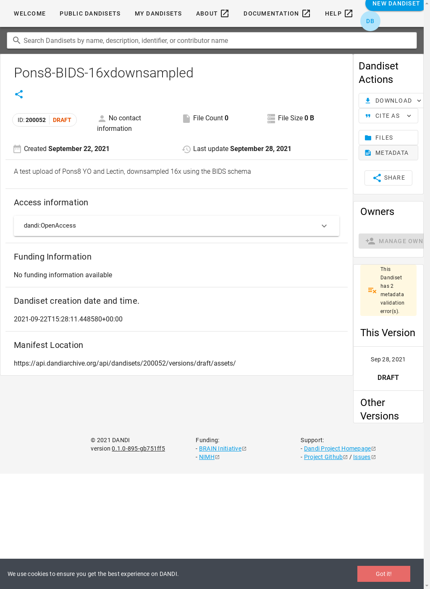 |  |  |

#### Error Messages
<pre>Message: unknown error: Chrome failed to start: exited abnormally
  (unknown error: Devtools port number file contents &lt;&gt; were in an unexpected format)
  (The process started from chrome location /usr/bin/chromium is no longer running, so ChromeDriver is assuming that Chrome has crashed.)
  (Driver info: chromedriver=73.0.3683.75,platform=Linux 4.19.0-0.bpo.9-amd64 x86_64)</pre>
<pre>Message: unknown error: Chrome failed to start: exited abnormally
  (unknown error: Devtools port number file contents &lt;&gt; were in an unexpected format)
  (The process started from chrome location /usr/bin/chromium is no longer running, so ChromeDriver is assuming that Chrome has crashed.)
  (Driver info: chromedriver=73.0.3683.75,platform=Linux 4.19.0-0.bpo.9-amd64 x86_64)</pre>
<pre>Message: unknown error: Chrome failed to start: exited abnormally
  (unknown error: Devtools port number file contents &lt;&gt; were in an unexpected format)
  (The process started from chrome location /usr/bin/chromium is no longer running, so ChromeDriver is assuming that Chrome has crashed.)
  (Driver info: chromedriver=73.0.3683.75,platform=Linux 4.19.0-0.bpo.9-amd64 x86_64)</pre>
### 200053

| t=[See below] [Go to page](https://gui-staging.dandiarchive.org/#/dandiset/200053) | t=[See below] Edit Metadata | t=[See below] [Go to page](https://gui-staging.dandiarchive.org/#/dandiset/200053/draft/files) |
| --- | --- | --- |
| 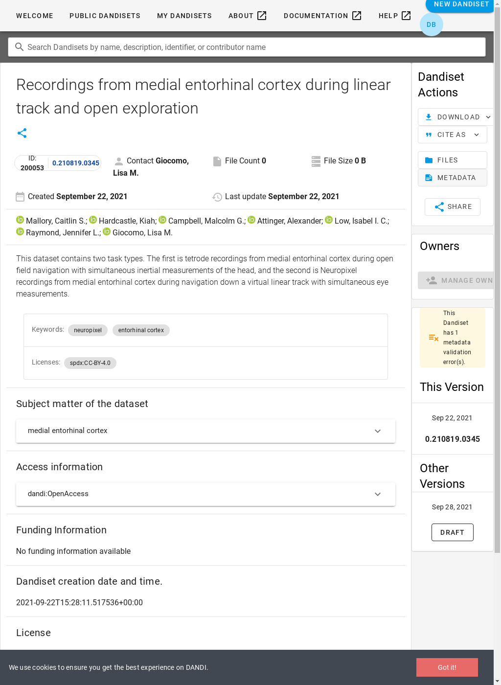 |  |  |

#### Error Messages
<pre>Message: unknown error: Chrome failed to start: exited abnormally
  (unknown error: DevToolsActivePort file doesn't exist)
  (The process started from chrome location /usr/bin/chromium is no longer running, so ChromeDriver is assuming that Chrome has crashed.)
  (Driver info: chromedriver=73.0.3683.75,platform=Linux 4.19.0-0.bpo.9-amd64 x86_64)</pre>
<pre>Message: unknown error: Chrome failed to start: exited abnormally
  (unknown error: DevToolsActivePort file doesn't exist)
  (The process started from chrome location /usr/bin/chromium is no longer running, so ChromeDriver is assuming that Chrome has crashed.)
  (Driver info: chromedriver=73.0.3683.75,platform=Linux 4.19.0-0.bpo.9-amd64 x86_64)</pre>
<pre>Message: unknown error: Chrome failed to start: exited abnormally
  (unknown error: Devtools port number file contents &lt;&gt; were in an unexpected format)
  (The process started from chrome location /usr/bin/chromium is no longer running, so ChromeDriver is assuming that Chrome has crashed.)
  (Driver info: chromedriver=73.0.3683.75,platform=Linux 4.19.0-0.bpo.9-amd64 x86_64)</pre>
### 200054

| t=[See below] [Go to page](https://gui-staging.dandiarchive.org/#/dandiset/200054) | t=[See below] Edit Metadata | t=[See below] [Go to page](https://gui-staging.dandiarchive.org/#/dandiset/200054/draft/files) |
| --- | --- | --- |
|  | 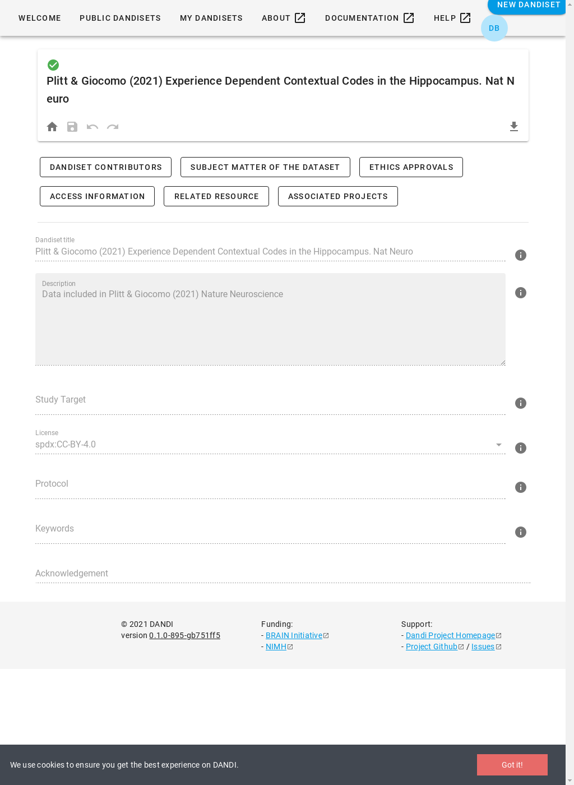 |  |

#### Error Messages
<pre>Message: unknown error: Chrome failed to start: exited abnormally
  (unknown error: Devtools port number file contents &lt;&gt; were in an unexpected format)
  (The process started from chrome location /usr/bin/chromium is no longer running, so ChromeDriver is assuming that Chrome has crashed.)
  (Driver info: chromedriver=73.0.3683.75,platform=Linux 4.19.0-0.bpo.9-amd64 x86_64)</pre>
<pre>Message: unknown error: Chrome failed to start: exited abnormally
  (unknown error: Devtools port number file contents &lt;&gt; were in an unexpected format)
  (The process started from chrome location /usr/bin/chromium is no longer running, so ChromeDriver is assuming that Chrome has crashed.)
  (Driver info: chromedriver=73.0.3683.75,platform=Linux 4.19.0-0.bpo.9-amd64 x86_64)</pre>
<pre>Message: unknown error: Chrome failed to start: exited abnormally
  (unknown error: Devtools port number file contents &lt;&gt; were in an unexpected format)
  (The process started from chrome location /usr/bin/chromium is no longer running, so ChromeDriver is assuming that Chrome has crashed.)
  (Driver info: chromedriver=73.0.3683.75,platform=Linux 4.19.0-0.bpo.9-amd64 x86_64)</pre>
### 200055

| t=[See below] [Go to page](https://gui-staging.dandiarchive.org/#/dandiset/200055) | t=[See below] Edit Metadata | t=[See below] [Go to page](https://gui-staging.dandiarchive.org/#/dandiset/200055/draft/files) |
| --- | --- | --- |
|  |  |  |

#### Error Messages
<pre>Message: unknown error: Chrome failed to start: exited abnormally
  (unknown error: DevToolsActivePort file doesn't exist)
  (The process started from chrome location /usr/bin/chromium is no longer running, so ChromeDriver is assuming that Chrome has crashed.)
  (Driver info: chromedriver=73.0.3683.75,platform=Linux 4.19.0-0.bpo.9-amd64 x86_64)</pre>
<pre>Message: unknown error: Chrome failed to start: exited abnormally
  (unknown error: DevToolsActivePort file doesn't exist)
  (The process started from chrome location /usr/bin/chromium is no longer running, so ChromeDriver is assuming that Chrome has crashed.)
  (Driver info: chromedriver=73.0.3683.75,platform=Linux 4.19.0-0.bpo.9-amd64 x86_64)</pre>
<pre>Message: unknown error: Chrome failed to start: exited abnormally
  (unknown error: Devtools port number file contents &lt;&gt; were in an unexpected format)
  (The process started from chrome location /usr/bin/chromium is no longer running, so ChromeDriver is assuming that Chrome has crashed.)
  (Driver info: chromedriver=73.0.3683.75,platform=Linux 4.19.0-0.bpo.9-amd64 x86_64)</pre>
### 200056

| t=[See below] [Go to page](https://gui-staging.dandiarchive.org/#/dandiset/200056) | t=[See below] Edit Metadata | t=[See below] [Go to page](https://gui-staging.dandiarchive.org/#/dandiset/200056/draft/files) |
| --- | --- | --- |
|  |  |  |

#### Error Messages
<pre>Message: unknown error: Chrome failed to start: exited abnormally
  (unknown error: Devtools port number file contents &lt;&gt; were in an unexpected format)
  (The process started from chrome location /usr/bin/chromium is no longer running, so ChromeDriver is assuming that Chrome has crashed.)
  (Driver info: chromedriver=73.0.3683.75,platform=Linux 4.19.0-0.bpo.9-amd64 x86_64)</pre>
<pre>Message: unknown error: Chrome failed to start: exited abnormally
  (unknown error: DevToolsActivePort file doesn't exist)
  (The process started from chrome location /usr/bin/chromium is no longer running, so ChromeDriver is assuming that Chrome has crashed.)
  (Driver info: chromedriver=73.0.3683.75,platform=Linux 4.19.0-0.bpo.9-amd64 x86_64)</pre>
<pre>Message: unknown error: Chrome failed to start: exited abnormally
  (unknown error: DevToolsActivePort file doesn't exist)
  (The process started from chrome location /usr/bin/chromium is no longer running, so ChromeDriver is assuming that Chrome has crashed.)
  (Driver info: chromedriver=73.0.3683.75,platform=Linux 4.19.0-0.bpo.9-amd64 x86_64)</pre>
### 200057

| t=[See below] [Go to page](https://gui-staging.dandiarchive.org/#/dandiset/200057) | t=[See below] Edit Metadata | t=[See below] [Go to page](https://gui-staging.dandiarchive.org/#/dandiset/200057/draft/files) |
| --- | --- | --- |
| 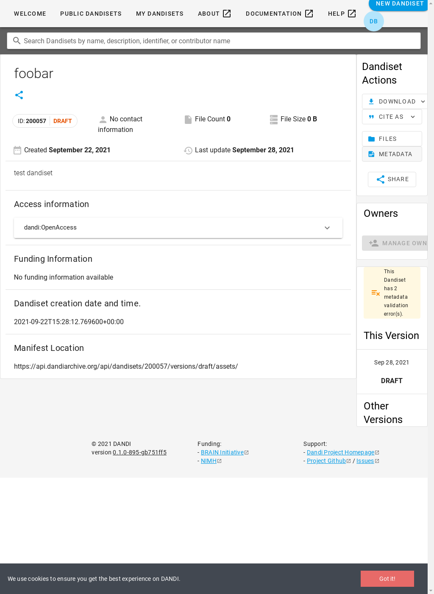 |  |  |

#### Error Messages
<pre>Message: unknown error: Chrome failed to start: exited abnormally
  (unknown error: Devtools port number file contents &lt;&gt; were in an unexpected format)
  (The process started from chrome location /usr/bin/chromium is no longer running, so ChromeDriver is assuming that Chrome has crashed.)
  (Driver info: chromedriver=73.0.3683.75,platform=Linux 4.19.0-0.bpo.9-amd64 x86_64)</pre>
<pre>Message: unknown error: Chrome failed to start: exited abnormally
  (unknown error: Devtools port number file contents &lt;&gt; were in an unexpected format)
  (The process started from chrome location /usr/bin/chromium is no longer running, so ChromeDriver is assuming that Chrome has crashed.)
  (Driver info: chromedriver=73.0.3683.75,platform=Linux 4.19.0-0.bpo.9-amd64 x86_64)</pre>
<pre>Message: unknown error: Chrome failed to start: exited abnormally
  (unknown error: DevToolsActivePort file doesn't exist)
  (The process started from chrome location /usr/bin/chromium is no longer running, so ChromeDriver is assuming that Chrome has crashed.)
  (Driver info: chromedriver=73.0.3683.75,platform=Linux 4.19.0-0.bpo.9-amd64 x86_64)</pre>
### 200058

| t=[See below] [Go to page](https://gui-staging.dandiarchive.org/#/dandiset/200058) | t=[See below] Edit Metadata | t=[See below] [Go to page](https://gui-staging.dandiarchive.org/#/dandiset/200058/draft/files) |
| --- | --- | --- |
| 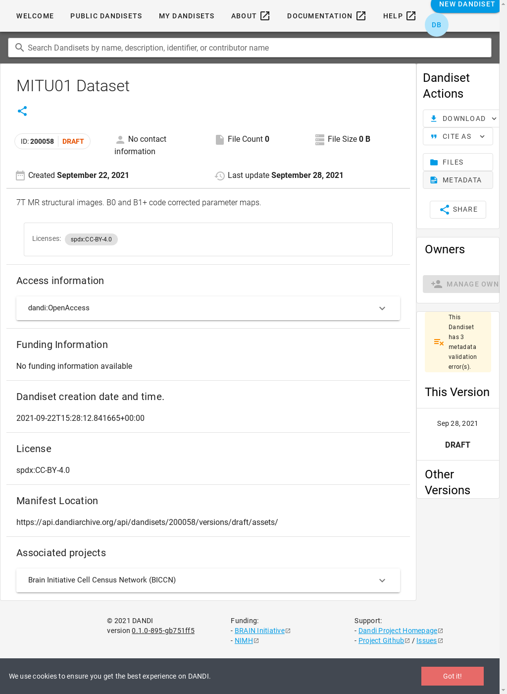 | 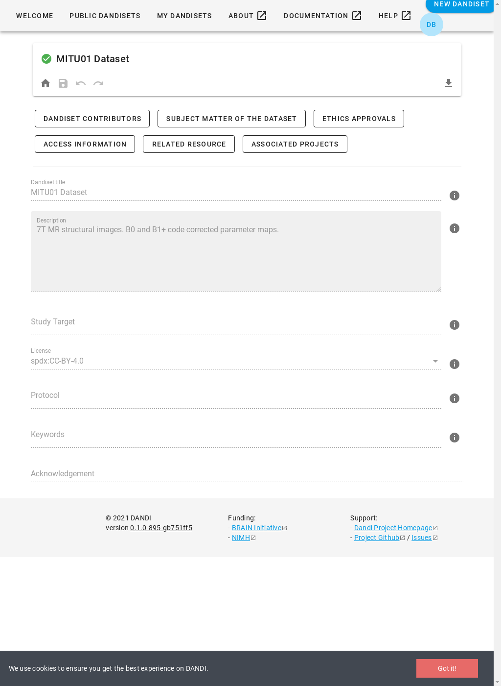 |  |

#### Error Messages
<pre>Message: unknown error: Chrome failed to start: exited abnormally
  (unknown error: DevToolsActivePort file doesn't exist)
  (The process started from chrome location /usr/bin/chromium is no longer running, so ChromeDriver is assuming that Chrome has crashed.)
  (Driver info: chromedriver=73.0.3683.75,platform=Linux 4.19.0-0.bpo.9-amd64 x86_64)</pre>
<pre>Message: unknown error: Chrome failed to start: exited abnormally
  (unknown error: DevToolsActivePort file doesn't exist)
  (The process started from chrome location /usr/bin/chromium is no longer running, so ChromeDriver is assuming that Chrome has crashed.)
  (Driver info: chromedriver=73.0.3683.75,platform=Linux 4.19.0-0.bpo.9-amd64 x86_64)</pre>
<pre>Message: unknown error: Chrome failed to start: exited abnormally
  (unknown error: Devtools port number file contents &lt;&gt; were in an unexpected format)
  (The process started from chrome location /usr/bin/chromium is no longer running, so ChromeDriver is assuming that Chrome has crashed.)
  (Driver info: chromedriver=73.0.3683.75,platform=Linux 4.19.0-0.bpo.9-amd64 x86_64)</pre>
### 200059

| t=[See below] [Go to page](https://gui-staging.dandiarchive.org/#/dandiset/200059) | t=[See below] Edit Metadata | t=[See below] [Go to page](https://gui-staging.dandiarchive.org/#/dandiset/200059/draft/files) |
| --- | --- | --- |
| 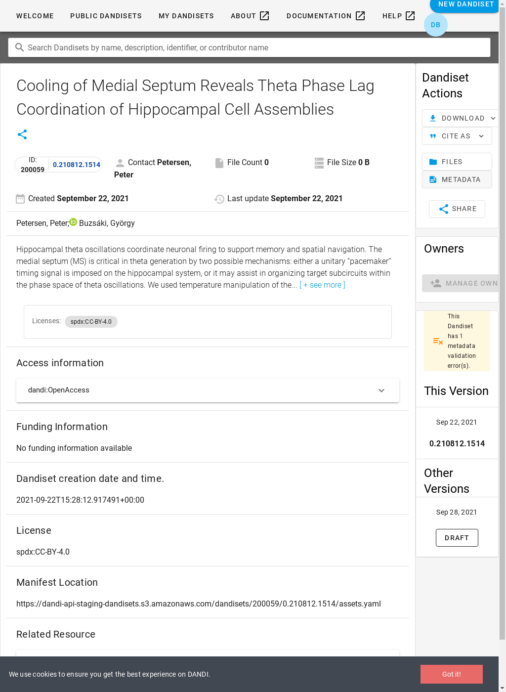 |  |  |

#### Error Messages
<pre>Message: unknown error: Chrome failed to start: exited abnormally
  (unknown error: Devtools port number file contents &lt;&gt; were in an unexpected format)
  (The process started from chrome location /usr/bin/chromium is no longer running, so ChromeDriver is assuming that Chrome has crashed.)
  (Driver info: chromedriver=73.0.3683.75,platform=Linux 4.19.0-0.bpo.9-amd64 x86_64)</pre>
<pre>Message: unknown error: Chrome failed to start: exited abnormally
  (unknown error: Devtools port number file contents &lt;&gt; were in an unexpected format)
  (The process started from chrome location /usr/bin/chromium is no longer running, so ChromeDriver is assuming that Chrome has crashed.)
  (Driver info: chromedriver=73.0.3683.75,platform=Linux 4.19.0-0.bpo.9-amd64 x86_64)</pre>
<pre>Message: unknown error: Chrome failed to start: exited abnormally
  (unknown error: Devtools port number file contents &lt;&gt; were in an unexpected format)
  (The process started from chrome location /usr/bin/chromium is no longer running, so ChromeDriver is assuming that Chrome has crashed.)
  (Driver info: chromedriver=73.0.3683.75,platform=Linux 4.19.0-0.bpo.9-amd64 x86_64)</pre>
### 200060

| t=[See below] [Go to page](https://gui-staging.dandiarchive.org/#/dandiset/200060) | t=[See below] Edit Metadata | t=[See below] [Go to page](https://gui-staging.dandiarchive.org/#/dandiset/200060/draft/files) |
| --- | --- | --- |
|  |  |  |

#### Error Messages
<pre>Message: unknown error: Chrome failed to start: exited abnormally
  (unknown error: DevToolsActivePort file doesn't exist)
  (The process started from chrome location /usr/bin/chromium is no longer running, so ChromeDriver is assuming that Chrome has crashed.)
  (Driver info: chromedriver=73.0.3683.75,platform=Linux 4.19.0-0.bpo.9-amd64 x86_64)</pre>
<pre>Message: unknown error: Chrome failed to start: exited abnormally
  (unknown error: Devtools port number file contents &lt;&gt; were in an unexpected format)
  (The process started from chrome location /usr/bin/chromium is no longer running, so ChromeDriver is assuming that Chrome has crashed.)
  (Driver info: chromedriver=73.0.3683.75,platform=Linux 4.19.0-0.bpo.9-amd64 x86_64)</pre>
<pre>Message: unknown error: Chrome failed to start: exited abnormally
  (unknown error: Devtools port number file contents &lt;&gt; were in an unexpected format)
  (The process started from chrome location /usr/bin/chromium is no longer running, so ChromeDriver is assuming that Chrome has crashed.)
  (Driver info: chromedriver=73.0.3683.75,platform=Linux 4.19.0-0.bpo.9-amd64 x86_64)</pre>
### 200061

| t=[See below] [Go to page](https://gui-staging.dandiarchive.org/#/dandiset/200061) | t=[See below] Edit Metadata | t=[See below] [Go to page](https://gui-staging.dandiarchive.org/#/dandiset/200061/draft/files) |
| --- | --- | --- |
| 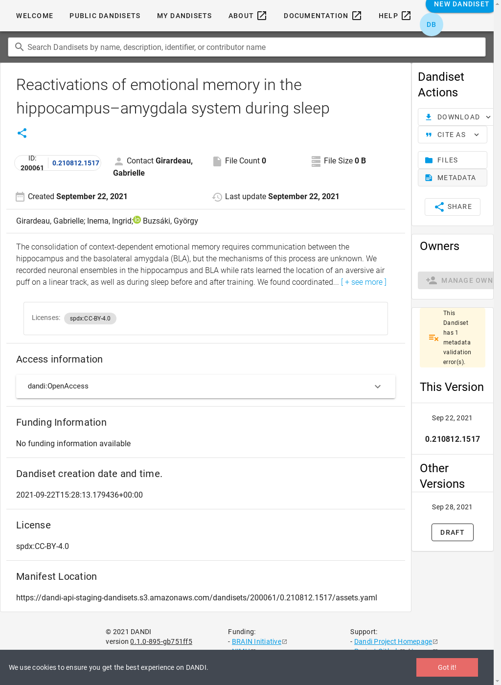 | 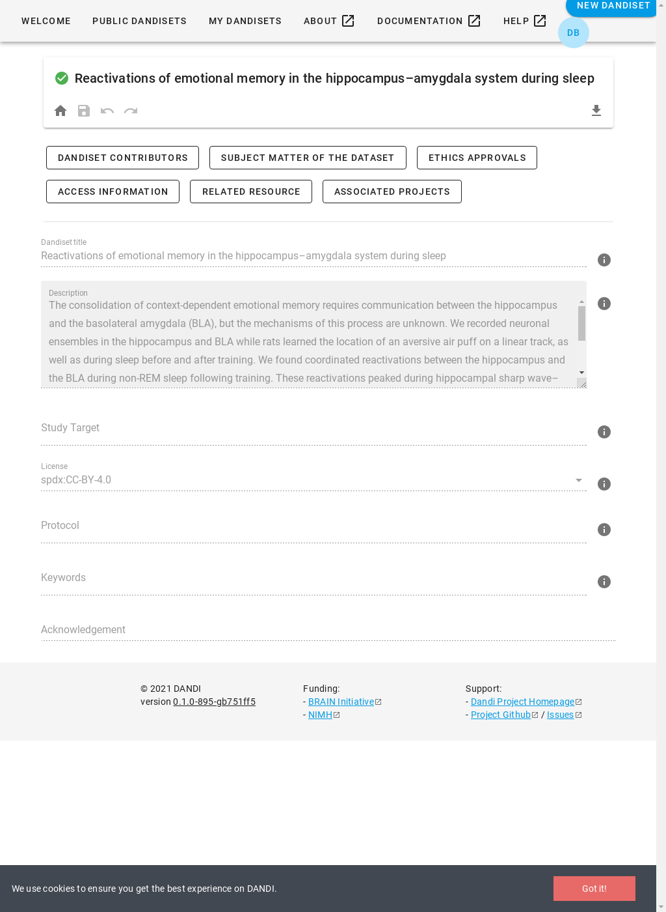 |  |

#### Error Messages
<pre>Message: unknown error: Chrome failed to start: exited abnormally
  (unknown error: Devtools port number file contents &lt;&gt; were in an unexpected format)
  (The process started from chrome location /usr/bin/chromium is no longer running, so ChromeDriver is assuming that Chrome has crashed.)
  (Driver info: chromedriver=73.0.3683.75,platform=Linux 4.19.0-0.bpo.9-amd64 x86_64)</pre>
<pre>Message: unknown error: Chrome failed to start: exited abnormally
  (unknown error: DevToolsActivePort file doesn't exist)
  (The process started from chrome location /usr/bin/chromium is no longer running, so ChromeDriver is assuming that Chrome has crashed.)
  (Driver info: chromedriver=73.0.3683.75,platform=Linux 4.19.0-0.bpo.9-amd64 x86_64)</pre>
<pre>Message: unknown error: Chrome failed to start: exited abnormally
  (unknown error: DevToolsActivePort file doesn't exist)
  (The process started from chrome location /usr/bin/chromium is no longer running, so ChromeDriver is assuming that Chrome has crashed.)
  (Driver info: chromedriver=73.0.3683.75,platform=Linux 4.19.0-0.bpo.9-amd64 x86_64)</pre>
### 200063

| t=[See below] [Go to page](https://gui-staging.dandiarchive.org/#/dandiset/200063) | t=[See below] Edit Metadata | t=[See below] [Go to page](https://gui-staging.dandiarchive.org/#/dandiset/200063/draft/files) |
| --- | --- | --- |
| 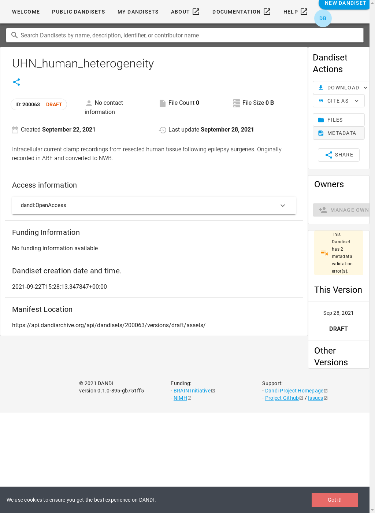 |  |  |

#### Error Messages
<pre>Message: unknown error: Chrome failed to start: exited abnormally
  (unknown error: Devtools port number file contents &lt;&gt; were in an unexpected format)
  (The process started from chrome location /usr/bin/chromium is no longer running, so ChromeDriver is assuming that Chrome has crashed.)
  (Driver info: chromedriver=73.0.3683.75,platform=Linux 4.19.0-0.bpo.9-amd64 x86_64)</pre>
<pre>Message: unknown error: Chrome failed to start: exited abnormally
  (unknown error: Devtools port number file contents &lt;&gt; were in an unexpected format)
  (The process started from chrome location /usr/bin/chromium is no longer running, so ChromeDriver is assuming that Chrome has crashed.)
  (Driver info: chromedriver=73.0.3683.75,platform=Linux 4.19.0-0.bpo.9-amd64 x86_64)</pre>
<pre>Message: unknown error: Chrome failed to start: exited abnormally
  (unknown error: Devtools port number file contents &lt;&gt; were in an unexpected format)
  (The process started from chrome location /usr/bin/chromium is no longer running, so ChromeDriver is assuming that Chrome has crashed.)
  (Driver info: chromedriver=73.0.3683.75,platform=Linux 4.19.0-0.bpo.9-amd64 x86_64)</pre>
### 200064

| t=[See below] [Go to page](https://gui-staging.dandiarchive.org/#/dandiset/200064) | t=[See below] Edit Metadata | t=[See below] [Go to page](https://gui-staging.dandiarchive.org/#/dandiset/200064/draft/files) |
| --- | --- | --- |
| 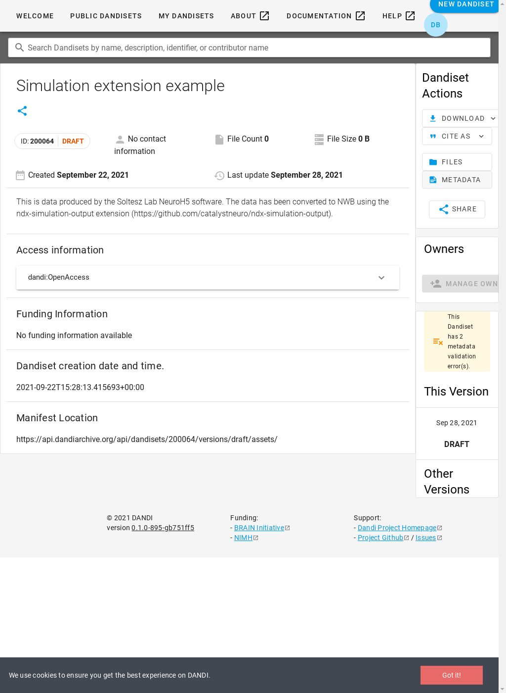 | 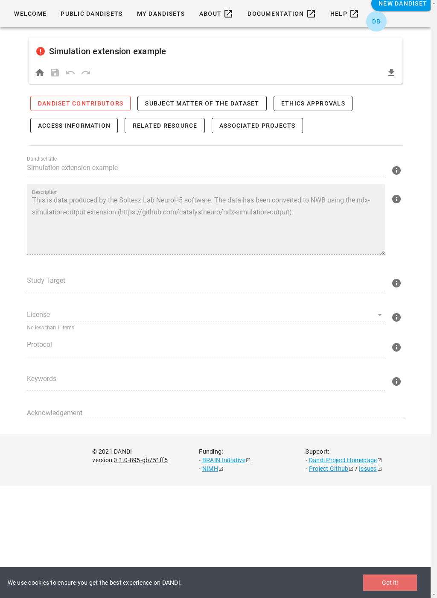 |  |

#### Error Messages
<pre>Message: unknown error: Chrome failed to start: exited abnormally
  (unknown error: Devtools port number file contents &lt;&gt; were in an unexpected format)
  (The process started from chrome location /usr/bin/chromium is no longer running, so ChromeDriver is assuming that Chrome has crashed.)
  (Driver info: chromedriver=73.0.3683.75,platform=Linux 4.19.0-0.bpo.9-amd64 x86_64)</pre>
<pre>Message: unknown error: Chrome failed to start: exited abnormally
  (unknown error: DevToolsActivePort file doesn't exist)
  (The process started from chrome location /usr/bin/chromium is no longer running, so ChromeDriver is assuming that Chrome has crashed.)
  (Driver info: chromedriver=73.0.3683.75,platform=Linux 4.19.0-0.bpo.9-amd64 x86_64)</pre>
<pre>Message: unknown error: Chrome failed to start: exited abnormally
  (unknown error: Devtools port number file contents &lt;&gt; were in an unexpected format)
  (The process started from chrome location /usr/bin/chromium is no longer running, so ChromeDriver is assuming that Chrome has crashed.)
  (Driver info: chromedriver=73.0.3683.75,platform=Linux 4.19.0-0.bpo.9-amd64 x86_64)</pre>
### 200065

| t=[See below] [Go to page](https://gui-staging.dandiarchive.org/#/dandiset/200065) | t=[See below] Edit Metadata | t=[See below] [Go to page](https://gui-staging.dandiarchive.org/#/dandiset/200065/draft/files) |
| --- | --- | --- |
|  |  |  |

#### Error Messages
<pre>Message: unknown error: Chrome failed to start: exited abnormally
  (unknown error: Devtools port number file contents &lt;&gt; were in an unexpected format)
  (The process started from chrome location /usr/bin/chromium is no longer running, so ChromeDriver is assuming that Chrome has crashed.)
  (Driver info: chromedriver=73.0.3683.75,platform=Linux 4.19.0-0.bpo.9-amd64 x86_64)</pre>
<pre>Message: unknown error: Chrome failed to start: exited abnormally
  (unknown error: DevToolsActivePort file doesn't exist)
  (The process started from chrome location /usr/bin/chromium is no longer running, so ChromeDriver is assuming that Chrome has crashed.)
  (Driver info: chromedriver=73.0.3683.75,platform=Linux 4.19.0-0.bpo.9-amd64 x86_64)</pre>
<pre>Message: unknown error: Chrome failed to start: exited abnormally
  (unknown error: Devtools port number file contents &lt;&gt; were in an unexpected format)
  (The process started from chrome location /usr/bin/chromium is no longer running, so ChromeDriver is assuming that Chrome has crashed.)
  (Driver info: chromedriver=73.0.3683.75,platform=Linux 4.19.0-0.bpo.9-amd64 x86_64)</pre>
### 200066

| t=[See below] [Go to page](https://gui-staging.dandiarchive.org/#/dandiset/200066) | t=[See below] Edit Metadata | t=[See below] [Go to page](https://gui-staging.dandiarchive.org/#/dandiset/200066/draft/files) |
| --- | --- | --- |
| 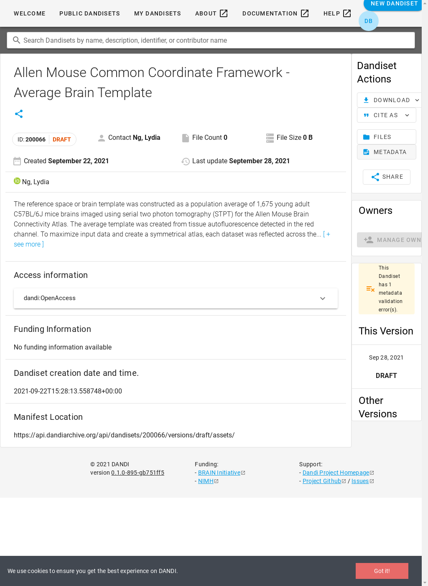 | 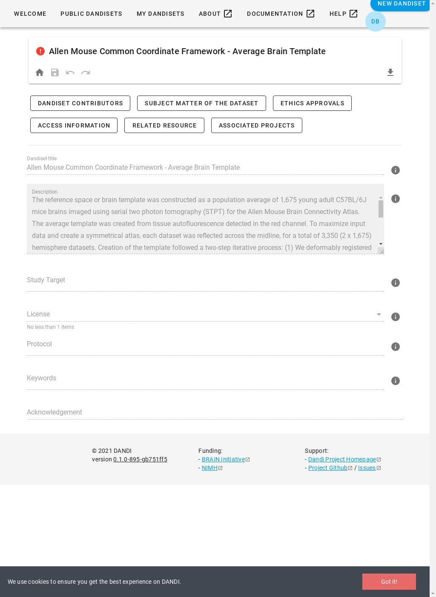 |  |

#### Error Messages
<pre>Message: unknown error: Chrome failed to start: exited abnormally
  (unknown error: Devtools port number file contents &lt;&gt; were in an unexpected format)
  (The process started from chrome location /usr/bin/chromium is no longer running, so ChromeDriver is assuming that Chrome has crashed.)
  (Driver info: chromedriver=73.0.3683.75,platform=Linux 4.19.0-0.bpo.9-amd64 x86_64)</pre>
<pre>Message: unknown error: Chrome failed to start: exited abnormally
  (unknown error: DevToolsActivePort file doesn't exist)
  (The process started from chrome location /usr/bin/chromium is no longer running, so ChromeDriver is assuming that Chrome has crashed.)
  (Driver info: chromedriver=73.0.3683.75,platform=Linux 4.19.0-0.bpo.9-amd64 x86_64)</pre>
<pre>Message: unknown error: Chrome failed to start: exited abnormally
  (unknown error: DevToolsActivePort file doesn't exist)
  (The process started from chrome location /usr/bin/chromium is no longer running, so ChromeDriver is assuming that Chrome has crashed.)
  (Driver info: chromedriver=73.0.3683.75,platform=Linux 4.19.0-0.bpo.9-amd64 x86_64)</pre>
### 200067

| t=[See below] [Go to page](https://gui-staging.dandiarchive.org/#/dandiset/200067) | t=[See below] Edit Metadata | t=[See below] [Go to page](https://gui-staging.dandiarchive.org/#/dandiset/200067/draft/files) |
| --- | --- | --- |
|  | 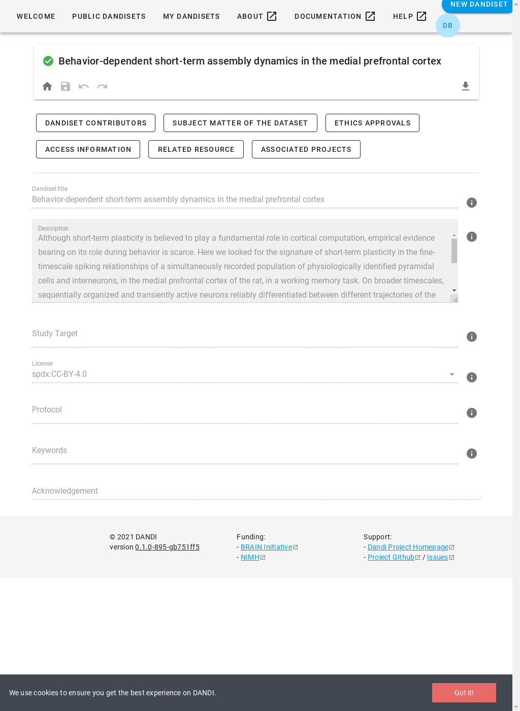 |  |

#### Error Messages
<pre>Message: unknown error: Chrome failed to start: exited abnormally
  (unknown error: DevToolsActivePort file doesn't exist)
  (The process started from chrome location /usr/bin/chromium is no longer running, so ChromeDriver is assuming that Chrome has crashed.)
  (Driver info: chromedriver=73.0.3683.75,platform=Linux 4.19.0-0.bpo.9-amd64 x86_64)</pre>
<pre>Message: unknown error: Chrome failed to start: exited abnormally
  (unknown error: DevToolsActivePort file doesn't exist)
  (The process started from chrome location /usr/bin/chromium is no longer running, so ChromeDriver is assuming that Chrome has crashed.)
  (Driver info: chromedriver=73.0.3683.75,platform=Linux 4.19.0-0.bpo.9-amd64 x86_64)</pre>
<pre>Message: unknown error: Chrome failed to start: exited abnormally
  (unknown error: DevToolsActivePort file doesn't exist)
  (The process started from chrome location /usr/bin/chromium is no longer running, so ChromeDriver is assuming that Chrome has crashed.)
  (Driver info: chromedriver=73.0.3683.75,platform=Linux 4.19.0-0.bpo.9-amd64 x86_64)</pre>
### 200068

| t=[See below] [Go to page](https://gui-staging.dandiarchive.org/#/dandiset/200068) | t=[See below] Edit Metadata | t=[See below] [Go to page](https://gui-staging.dandiarchive.org/#/dandiset/200068/draft/files) |
| --- | --- | --- |
|  |  |  |

#### Error Messages
<pre>Message: unknown error: Chrome failed to start: exited abnormally
  (unknown error: DevToolsActivePort file doesn't exist)
  (The process started from chrome location /usr/bin/chromium is no longer running, so ChromeDriver is assuming that Chrome has crashed.)
  (Driver info: chromedriver=73.0.3683.75,platform=Linux 4.19.0-0.bpo.9-amd64 x86_64)</pre>
<pre>Message: unknown error: Chrome failed to start: exited abnormally
  (unknown error: Devtools port number file contents &lt;&gt; were in an unexpected format)
  (The process started from chrome location /usr/bin/chromium is no longer running, so ChromeDriver is assuming that Chrome has crashed.)
  (Driver info: chromedriver=73.0.3683.75,platform=Linux 4.19.0-0.bpo.9-amd64 x86_64)</pre>
<pre>Message: unknown error: Chrome failed to start: exited abnormally
  (unknown error: DevToolsActivePort file doesn't exist)
  (The process started from chrome location /usr/bin/chromium is no longer running, so ChromeDriver is assuming that Chrome has crashed.)
  (Driver info: chromedriver=73.0.3683.75,platform=Linux 4.19.0-0.bpo.9-amd64 x86_64)</pre>
### 200069

| t=[See below] [Go to page](https://gui-staging.dandiarchive.org/#/dandiset/200069) | t=[See below] Edit Metadata | t=[See below] [Go to page](https://gui-staging.dandiarchive.org/#/dandiset/200069/draft/files) |
| --- | --- | --- |
|  |  |  |

#### Error Messages
<pre>Message: unknown error: Chrome failed to start: exited abnormally
  (unknown error: DevToolsActivePort file doesn't exist)
  (The process started from chrome location /usr/bin/chromium is no longer running, so ChromeDriver is assuming that Chrome has crashed.)
  (Driver info: chromedriver=73.0.3683.75,platform=Linux 4.19.0-0.bpo.9-amd64 x86_64)</pre>
<pre>Message: unknown error: Chrome failed to start: exited abnormally
  (unknown error: DevToolsActivePort file doesn't exist)
  (The process started from chrome location /usr/bin/chromium is no longer running, so ChromeDriver is assuming that Chrome has crashed.)
  (Driver info: chromedriver=73.0.3683.75,platform=Linux 4.19.0-0.bpo.9-amd64 x86_64)</pre>
<pre>Message: unknown error: Chrome failed to start: exited abnormally
  (unknown error: Devtools port number file contents &lt;&gt; were in an unexpected format)
  (The process started from chrome location /usr/bin/chromium is no longer running, so ChromeDriver is assuming that Chrome has crashed.)
  (Driver info: chromedriver=73.0.3683.75,platform=Linux 4.19.0-0.bpo.9-amd64 x86_64)</pre>
### 200070

| t=[See below] [Go to page](https://gui-staging.dandiarchive.org/#/dandiset/200070) | t=[See below] Edit Metadata | t=[See below] [Go to page](https://gui-staging.dandiarchive.org/#/dandiset/200070/draft/files) |
| --- | --- | --- |
| 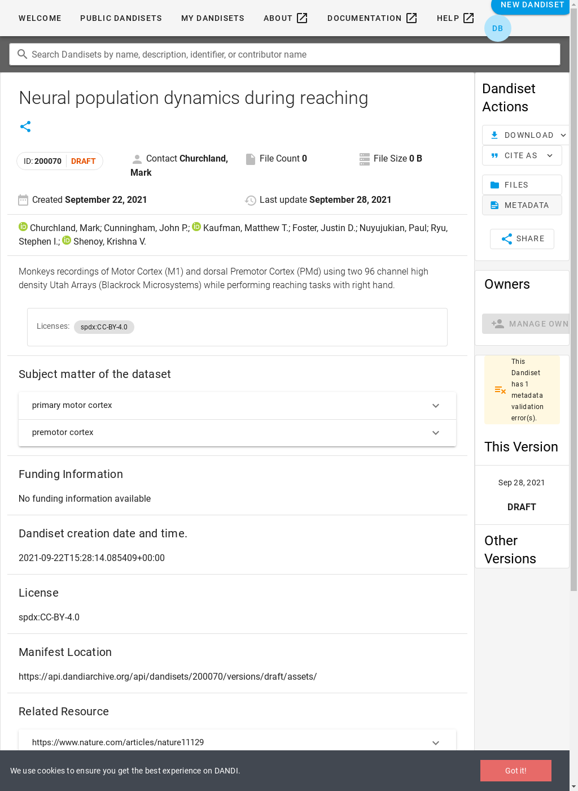 |  |  |

#### Error Messages
<pre>Message: unknown error: Chrome failed to start: exited abnormally
  (unknown error: Devtools port number file contents &lt;&gt; were in an unexpected format)
  (The process started from chrome location /usr/bin/chromium is no longer running, so ChromeDriver is assuming that Chrome has crashed.)
  (Driver info: chromedriver=73.0.3683.75,platform=Linux 4.19.0-0.bpo.9-amd64 x86_64)</pre>
<pre>Message: unknown error: Chrome failed to start: exited abnormally
  (unknown error: DevToolsActivePort file doesn't exist)
  (The process started from chrome location /usr/bin/chromium is no longer running, so ChromeDriver is assuming that Chrome has crashed.)
  (Driver info: chromedriver=73.0.3683.75,platform=Linux 4.19.0-0.bpo.9-amd64 x86_64)</pre>
<pre>Message: unknown error: Chrome failed to start: exited abnormally
  (unknown error: DevToolsActivePort file doesn't exist)
  (The process started from chrome location /usr/bin/chromium is no longer running, so ChromeDriver is assuming that Chrome has crashed.)
  (Driver info: chromedriver=73.0.3683.75,platform=Linux 4.19.0-0.bpo.9-amd64 x86_64)</pre>
### 200071

| t=[See below] [Go to page](https://gui-staging.dandiarchive.org/#/dandiset/200071) | t=[See below] Edit Metadata | t=[See below] [Go to page](https://gui-staging.dandiarchive.org/#/dandiset/200071/draft/files) |
| --- | --- | --- |
| 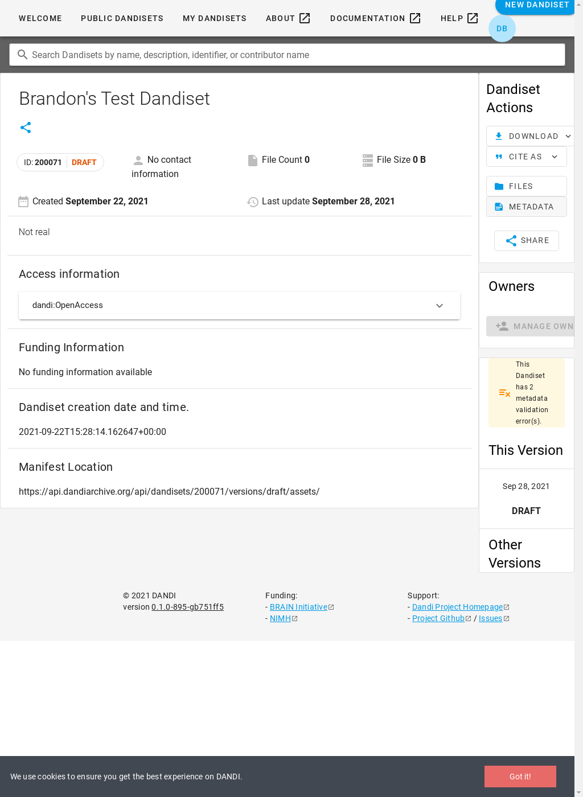 |  |  |

#### Error Messages
<pre>Message: unknown error: Chrome failed to start: exited abnormally
  (unknown error: DevToolsActivePort file doesn't exist)
  (The process started from chrome location /usr/bin/chromium is no longer running, so ChromeDriver is assuming that Chrome has crashed.)
  (Driver info: chromedriver=73.0.3683.75,platform=Linux 4.19.0-0.bpo.9-amd64 x86_64)</pre>
<pre>Message: unknown error: Chrome failed to start: exited abnormally
  (unknown error: DevToolsActivePort file doesn't exist)
  (The process started from chrome location /usr/bin/chromium is no longer running, so ChromeDriver is assuming that Chrome has crashed.)
  (Driver info: chromedriver=73.0.3683.75,platform=Linux 4.19.0-0.bpo.9-amd64 x86_64)</pre>
<pre>Message: unknown error: Chrome failed to start: exited abnormally
  (unknown error: Devtools port number file contents &lt;&gt; were in an unexpected format)
  (The process started from chrome location /usr/bin/chromium is no longer running, so ChromeDriver is assuming that Chrome has crashed.)
  (Driver info: chromedriver=73.0.3683.75,platform=Linux 4.19.0-0.bpo.9-amd64 x86_64)</pre>
### 200072

| t=[See below] [Go to page](https://gui-staging.dandiarchive.org/#/dandiset/200072) | t=[See below] Edit Metadata | t=[See below] [Go to page](https://gui-staging.dandiarchive.org/#/dandiset/200072/draft/files) |
| --- | --- | --- |
| 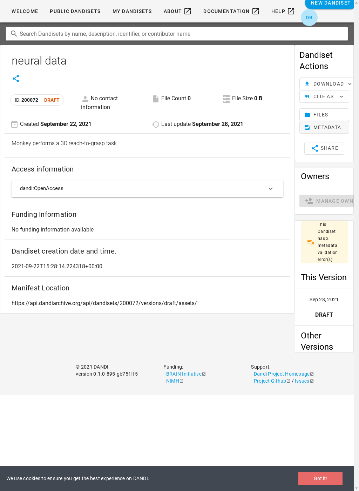 |  |  |

#### Error Messages
<pre>Message: unknown error: Chrome failed to start: exited abnormally
  (unknown error: DevToolsActivePort file doesn't exist)
  (The process started from chrome location /usr/bin/chromium is no longer running, so ChromeDriver is assuming that Chrome has crashed.)
  (Driver info: chromedriver=73.0.3683.75,platform=Linux 4.19.0-0.bpo.9-amd64 x86_64)</pre>
<pre>Message: unknown error: Chrome failed to start: exited abnormally
  (unknown error: DevToolsActivePort file doesn't exist)
  (The process started from chrome location /usr/bin/chromium is no longer running, so ChromeDriver is assuming that Chrome has crashed.)
  (Driver info: chromedriver=73.0.3683.75,platform=Linux 4.19.0-0.bpo.9-amd64 x86_64)</pre>
<pre>Message: unknown error: Chrome failed to start: exited abnormally
  (unknown error: DevToolsActivePort file doesn't exist)
  (The process started from chrome location /usr/bin/chromium is no longer running, so ChromeDriver is assuming that Chrome has crashed.)
  (Driver info: chromedriver=73.0.3683.75,platform=Linux 4.19.0-0.bpo.9-amd64 x86_64)</pre>
### 200105

| t=[See below] [Go to page](https://gui-staging.dandiarchive.org/#/dandiset/200105) | t=[See below] Edit Metadata | t=[See below] [Go to page](https://gui-staging.dandiarchive.org/#/dandiset/200105/draft/files) |
| --- | --- | --- |
|  | 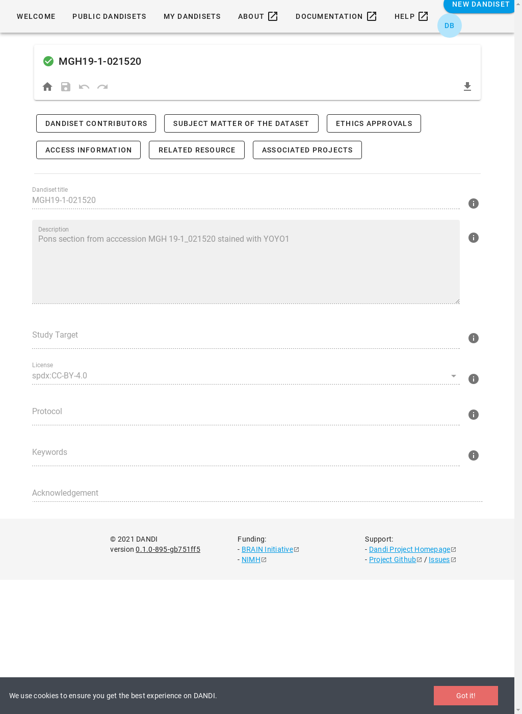 |  |

#### Error Messages
<pre>Message: unknown error: Chrome failed to start: exited abnormally
  (unknown error: Devtools port number file contents &lt;&gt; were in an unexpected format)
  (The process started from chrome location /usr/bin/chromium is no longer running, so ChromeDriver is assuming that Chrome has crashed.)
  (Driver info: chromedriver=73.0.3683.75,platform=Linux 4.19.0-0.bpo.9-amd64 x86_64)</pre>
<pre>Message: unknown error: Chrome failed to start: exited abnormally
  (unknown error: DevToolsActivePort file doesn't exist)
  (The process started from chrome location /usr/bin/chromium is no longer running, so ChromeDriver is assuming that Chrome has crashed.)
  (Driver info: chromedriver=73.0.3683.75,platform=Linux 4.19.0-0.bpo.9-amd64 x86_64)</pre>
<pre>Message: unknown error: Chrome failed to start: exited abnormally
  (unknown error: DevToolsActivePort file doesn't exist)
  (The process started from chrome location /usr/bin/chromium is no longer running, so ChromeDriver is assuming that Chrome has crashed.)
  (Driver info: chromedriver=73.0.3683.75,platform=Linux 4.19.0-0.bpo.9-amd64 x86_64)</pre>
### 200106

| t=[See below] [Go to page](https://gui-staging.dandiarchive.org/#/dandiset/200106) | t=[See below] Edit Metadata | t=[See below] [Go to page](https://gui-staging.dandiarchive.org/#/dandiset/200106/draft/files) |
| --- | --- | --- |
|  |  |  |

#### Error Messages
<pre>Message: unknown error: Chrome failed to start: exited abnormally
  (unknown error: DevToolsActivePort file doesn't exist)
  (The process started from chrome location /usr/bin/chromium is no longer running, so ChromeDriver is assuming that Chrome has crashed.)
  (Driver info: chromedriver=73.0.3683.75,platform=Linux 4.19.0-0.bpo.9-amd64 x86_64)</pre>
<pre>Message: unknown error: Chrome failed to start: exited abnormally
  (unknown error: Devtools port number file contents &lt;&gt; were in an unexpected format)
  (The process started from chrome location /usr/bin/chromium is no longer running, so ChromeDriver is assuming that Chrome has crashed.)
  (Driver info: chromedriver=73.0.3683.75,platform=Linux 4.19.0-0.bpo.9-amd64 x86_64)</pre>
<pre>Message: unknown error: Chrome failed to start: exited abnormally
  (unknown error: DevToolsActivePort file doesn't exist)
  (The process started from chrome location /usr/bin/chromium is no longer running, so ChromeDriver is assuming that Chrome has crashed.)
  (Driver info: chromedriver=73.0.3683.75,platform=Linux 4.19.0-0.bpo.9-amd64 x86_64)</pre>
### 200107

| t=[See below] [Go to page](https://gui-staging.dandiarchive.org/#/dandiset/200107) | t=[See below] Edit Metadata | t=[See below] [Go to page](https://gui-staging.dandiarchive.org/#/dandiset/200107/draft/files) |
| --- | --- | --- |
|  |  |  |

#### Error Messages
<pre>Message: unknown error: Chrome failed to start: exited abnormally
  (unknown error: DevToolsActivePort file doesn't exist)
  (The process started from chrome location /usr/bin/chromium is no longer running, so ChromeDriver is assuming that Chrome has crashed.)
  (Driver info: chromedriver=73.0.3683.75,platform=Linux 4.19.0-0.bpo.9-amd64 x86_64)</pre>
<pre>Message: unknown error: Chrome failed to start: exited abnormally
  (unknown error: DevToolsActivePort file doesn't exist)
  (The process started from chrome location /usr/bin/chromium is no longer running, so ChromeDriver is assuming that Chrome has crashed.)
  (Driver info: chromedriver=73.0.3683.75,platform=Linux 4.19.0-0.bpo.9-amd64 x86_64)</pre>
<pre>Message: unknown error: Chrome failed to start: exited abnormally
  (unknown error: Devtools port number file contents &lt;&gt; were in an unexpected format)
  (The process started from chrome location /usr/bin/chromium is no longer running, so ChromeDriver is assuming that Chrome has crashed.)
  (Driver info: chromedriver=73.0.3683.75,platform=Linux 4.19.0-0.bpo.9-amd64 x86_64)</pre>
### 200108

| t=[See below] [Go to page](https://gui-staging.dandiarchive.org/#/dandiset/200108) | t=[See below] Edit Metadata | t=[See below] [Go to page](https://gui-staging.dandiarchive.org/#/dandiset/200108/draft/files) |
| --- | --- | --- |
| 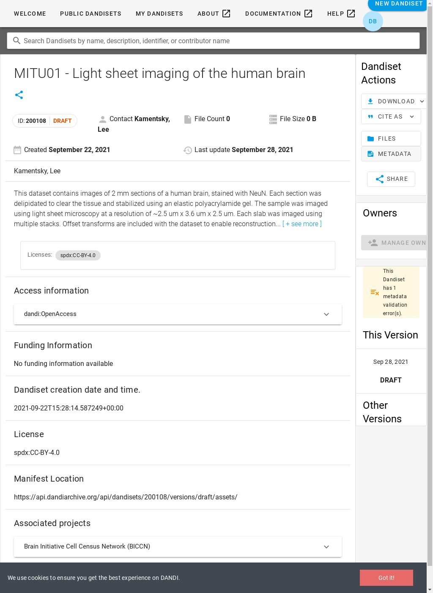 |  |  |

#### Error Messages
<pre>Message: unknown error: Chrome failed to start: exited abnormally
  (unknown error: Devtools port number file contents &lt;&gt; were in an unexpected format)
  (The process started from chrome location /usr/bin/chromium is no longer running, so ChromeDriver is assuming that Chrome has crashed.)
  (Driver info: chromedriver=73.0.3683.75,platform=Linux 4.19.0-0.bpo.9-amd64 x86_64)</pre>
<pre>Message: unknown error: Chrome failed to start: exited abnormally
  (unknown error: Devtools port number file contents &lt;&gt; were in an unexpected format)
  (The process started from chrome location /usr/bin/chromium is no longer running, so ChromeDriver is assuming that Chrome has crashed.)
  (Driver info: chromedriver=73.0.3683.75,platform=Linux 4.19.0-0.bpo.9-amd64 x86_64)</pre>
<pre>Message: unknown error: Chrome failed to start: exited abnormally
  (unknown error: Devtools port number file contents &lt;&gt; were in an unexpected format)
  (The process started from chrome location /usr/bin/chromium is no longer running, so ChromeDriver is assuming that Chrome has crashed.)
  (Driver info: chromedriver=73.0.3683.75,platform=Linux 4.19.0-0.bpo.9-amd64 x86_64)</pre>
### 200109

| t=[See below] [Go to page](https://gui-staging.dandiarchive.org/#/dandiset/200109) | t=[See below] Edit Metadata | t=[See below] [Go to page](https://gui-staging.dandiarchive.org/#/dandiset/200109/draft/files) |
| --- | --- | --- |
| 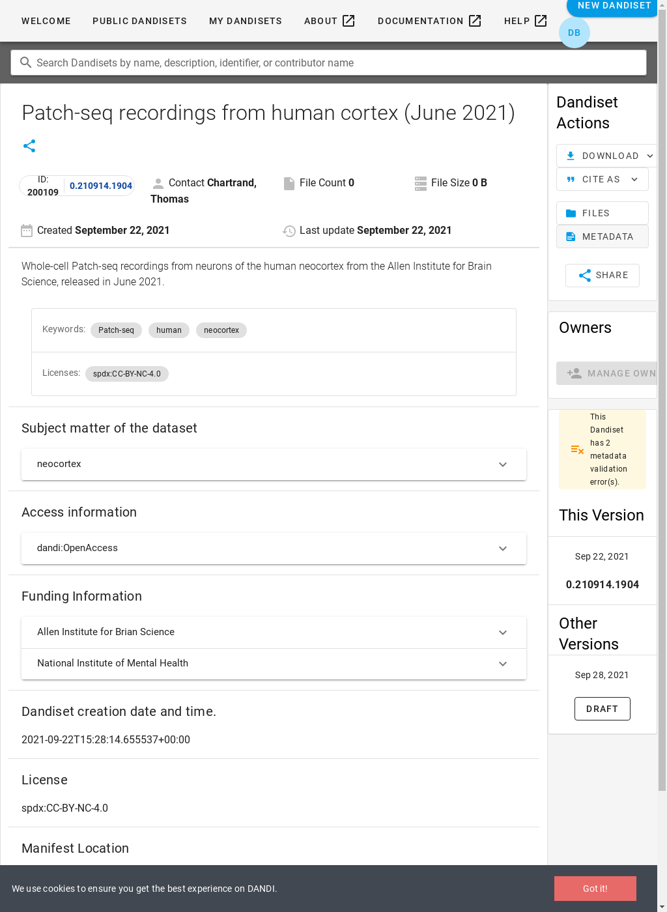 |  |  |

#### Error Messages
<pre>Message: unknown error: Chrome failed to start: exited abnormally
  (unknown error: DevToolsActivePort file doesn't exist)
  (The process started from chrome location /usr/bin/chromium is no longer running, so ChromeDriver is assuming that Chrome has crashed.)
  (Driver info: chromedriver=73.0.3683.75,platform=Linux 4.19.0-0.bpo.9-amd64 x86_64)</pre>
<pre>Message: unknown error: Chrome failed to start: exited abnormally
  (unknown error: Devtools port number file contents &lt;&gt; were in an unexpected format)
  (The process started from chrome location /usr/bin/chromium is no longer running, so ChromeDriver is assuming that Chrome has crashed.)
  (Driver info: chromedriver=73.0.3683.75,platform=Linux 4.19.0-0.bpo.9-amd64 x86_64)</pre>
<pre>Message: unknown error: Chrome failed to start: exited abnormally
  (unknown error: Devtools port number file contents &lt;&gt; were in an unexpected format)
  (The process started from chrome location /usr/bin/chromium is no longer running, so ChromeDriver is assuming that Chrome has crashed.)
  (Driver info: chromedriver=73.0.3683.75,platform=Linux 4.19.0-0.bpo.9-amd64 x86_64)</pre>
### 200110

| t=[See below] [Go to page](https://gui-staging.dandiarchive.org/#/dandiset/200110) | t=[See below] Edit Metadata | t=[See below] [Go to page](https://gui-staging.dandiarchive.org/#/dandiset/200110/draft/files) |
| --- | --- | --- |
|  |  |  |

#### Error Messages
<pre>Message: unknown error: Chrome failed to start: exited abnormally
  (unknown error: Devtools port number file contents &lt;&gt; were in an unexpected format)
  (The process started from chrome location /usr/bin/chromium is no longer running, so ChromeDriver is assuming that Chrome has crashed.)
  (Driver info: chromedriver=73.0.3683.75,platform=Linux 4.19.0-0.bpo.9-amd64 x86_64)</pre>
<pre>Message: unknown error: Chrome failed to start: exited abnormally
  (unknown error: DevToolsActivePort file doesn't exist)
  (The process started from chrome location /usr/bin/chromium is no longer running, so ChromeDriver is assuming that Chrome has crashed.)
  (Driver info: chromedriver=73.0.3683.75,platform=Linux 4.19.0-0.bpo.9-amd64 x86_64)</pre>
<pre>Message: unknown error: Chrome failed to start: exited abnormally
  (unknown error: DevToolsActivePort file doesn't exist)
  (The process started from chrome location /usr/bin/chromium is no longer running, so ChromeDriver is assuming that Chrome has crashed.)
  (Driver info: chromedriver=73.0.3683.75,platform=Linux 4.19.0-0.bpo.9-amd64 x86_64)</pre>
### 200111

| t=[See below] [Go to page](https://gui-staging.dandiarchive.org/#/dandiset/200111) | t=[See below] Edit Metadata | t=[See below] [Go to page](https://gui-staging.dandiarchive.org/#/dandiset/200111/draft/files) |
| --- | --- | --- |
|  |  |  |

#### Error Messages
<pre>Message: unknown error: Chrome failed to start: exited abnormally
  (unknown error: Devtools port number file contents &lt;&gt; were in an unexpected format)
  (The process started from chrome location /usr/bin/chromium is no longer running, so ChromeDriver is assuming that Chrome has crashed.)
  (Driver info: chromedriver=73.0.3683.75,platform=Linux 4.19.0-0.bpo.9-amd64 x86_64)</pre>
<pre>Message: unknown error: Chrome failed to start: exited abnormally
  (unknown error: Devtools port number file contents &lt;&gt; were in an unexpected format)
  (The process started from chrome location /usr/bin/chromium is no longer running, so ChromeDriver is assuming that Chrome has crashed.)
  (Driver info: chromedriver=73.0.3683.75,platform=Linux 4.19.0-0.bpo.9-amd64 x86_64)</pre>
<pre>Message: unknown error: Chrome failed to start: exited abnormally
  (unknown error: DevToolsActivePort file doesn't exist)
  (The process started from chrome location /usr/bin/chromium is no longer running, so ChromeDriver is assuming that Chrome has crashed.)
  (Driver info: chromedriver=73.0.3683.75,platform=Linux 4.19.0-0.bpo.9-amd64 x86_64)</pre>
### 200112

| t=[See below] [Go to page](https://gui-staging.dandiarchive.org/#/dandiset/200112) | t=[See below] Edit Metadata | t=[See below] [Go to page](https://gui-staging.dandiarchive.org/#/dandiset/200112/draft/files) |
| --- | --- | --- |
| 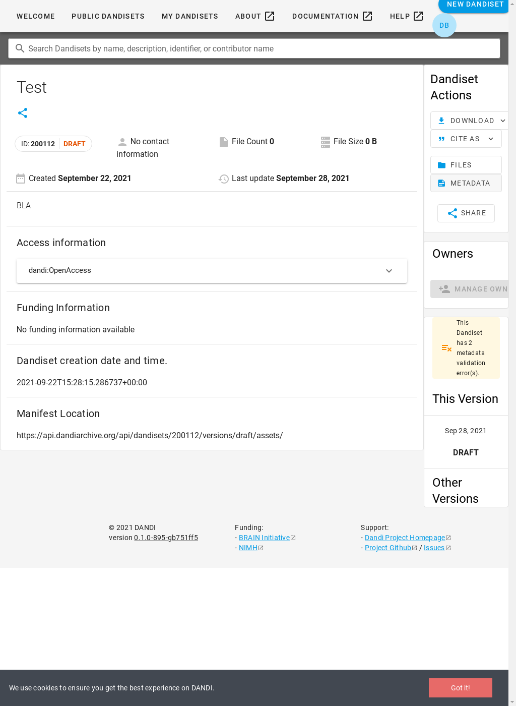 |  |  |

#### Error Messages
<pre>Message: unknown error: Chrome failed to start: exited abnormally
  (unknown error: DevToolsActivePort file doesn't exist)
  (The process started from chrome location /usr/bin/chromium is no longer running, so ChromeDriver is assuming that Chrome has crashed.)
  (Driver info: chromedriver=73.0.3683.75,platform=Linux 4.19.0-0.bpo.9-amd64 x86_64)</pre>
<pre>Message: unknown error: Chrome failed to start: exited abnormally
  (unknown error: DevToolsActivePort file doesn't exist)
  (The process started from chrome location /usr/bin/chromium is no longer running, so ChromeDriver is assuming that Chrome has crashed.)
  (Driver info: chromedriver=73.0.3683.75,platform=Linux 4.19.0-0.bpo.9-amd64 x86_64)</pre>
<pre>Message: unknown error: Chrome failed to start: exited abnormally
  (unknown error: Devtools port number file contents &lt;&gt; were in an unexpected format)
  (The process started from chrome location /usr/bin/chromium is no longer running, so ChromeDriver is assuming that Chrome has crashed.)
  (Driver info: chromedriver=73.0.3683.75,platform=Linux 4.19.0-0.bpo.9-amd64 x86_64)</pre>
### 200113

| t=[See below] [Go to page](https://gui-staging.dandiarchive.org/#/dandiset/200113) | t=[See below] Edit Metadata | t=[See below] [Go to page](https://gui-staging.dandiarchive.org/#/dandiset/200113/draft/files) |
| --- | --- | --- |
| 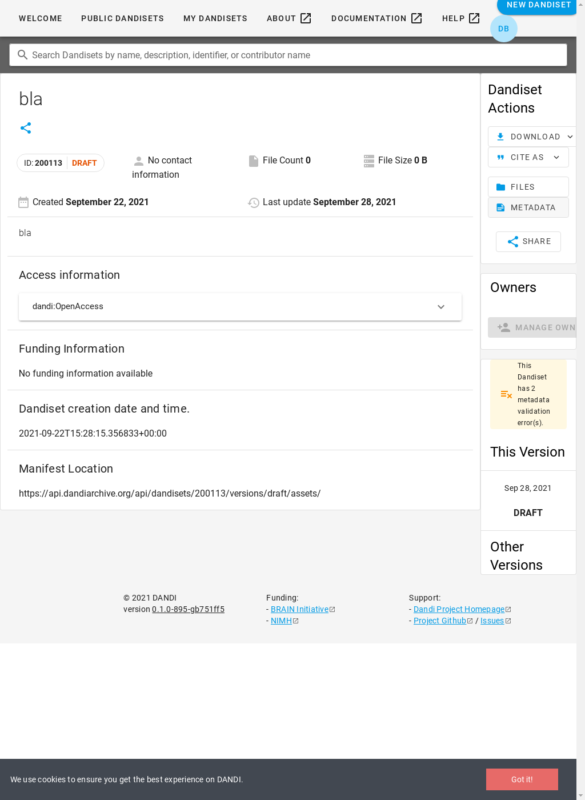 |  |  |

#### Error Messages
<pre>Message: unknown error: Chrome failed to start: exited abnormally
  (unknown error: Devtools port number file contents &lt;&gt; were in an unexpected format)
  (The process started from chrome location /usr/bin/chromium is no longer running, so ChromeDriver is assuming that Chrome has crashed.)
  (Driver info: chromedriver=73.0.3683.75,platform=Linux 4.19.0-0.bpo.9-amd64 x86_64)</pre>
<pre>Message: unknown error: Chrome failed to start: exited abnormally
  (unknown error: DevToolsActivePort file doesn't exist)
  (The process started from chrome location /usr/bin/chromium is no longer running, so ChromeDriver is assuming that Chrome has crashed.)
  (Driver info: chromedriver=73.0.3683.75,platform=Linux 4.19.0-0.bpo.9-amd64 x86_64)</pre>
<pre>Message: unknown error: Chrome failed to start: exited abnormally
  (unknown error: DevToolsActivePort file doesn't exist)
  (The process started from chrome location /usr/bin/chromium is no longer running, so ChromeDriver is assuming that Chrome has crashed.)
  (Driver info: chromedriver=73.0.3683.75,platform=Linux 4.19.0-0.bpo.9-amd64 x86_64)</pre>
### 200114

| t=[See below] [Go to page](https://gui-staging.dandiarchive.org/#/dandiset/200114) | t=[See below] Edit Metadata | t=[See below] [Go to page](https://gui-staging.dandiarchive.org/#/dandiset/200114/draft/files) |
| --- | --- | --- |
| 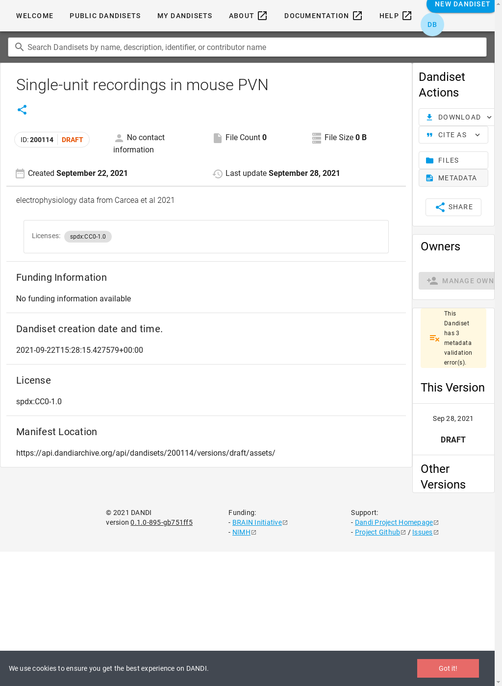 |  |  |

#### Error Messages
<pre>Message: unknown error: Chrome failed to start: exited abnormally
  (unknown error: DevToolsActivePort file doesn't exist)
  (The process started from chrome location /usr/bin/chromium is no longer running, so ChromeDriver is assuming that Chrome has crashed.)
  (Driver info: chromedriver=73.0.3683.75,platform=Linux 4.19.0-0.bpo.9-amd64 x86_64)</pre>
<pre>Message: unknown error: Chrome failed to start: exited abnormally
  (unknown error: DevToolsActivePort file doesn't exist)
  (The process started from chrome location /usr/bin/chromium is no longer running, so ChromeDriver is assuming that Chrome has crashed.)
  (Driver info: chromedriver=73.0.3683.75,platform=Linux 4.19.0-0.bpo.9-amd64 x86_64)</pre>
<pre>Message: unknown error: Chrome failed to start: exited abnormally
  (unknown error: Devtools port number file contents &lt;&gt; were in an unexpected format)
  (The process started from chrome location /usr/bin/chromium is no longer running, so ChromeDriver is assuming that Chrome has crashed.)
  (Driver info: chromedriver=73.0.3683.75,platform=Linux 4.19.0-0.bpo.9-amd64 x86_64)</pre>
### 200115

| t=[See below] [Go to page](https://gui-staging.dandiarchive.org/#/dandiset/200115) | t=[See below] Edit Metadata | t=[See below] [Go to page](https://gui-staging.dandiarchive.org/#/dandiset/200115/draft/files) |
| --- | --- | --- |
|  |  |  |

#### Error Messages
<pre>Message: unknown error: Chrome failed to start: exited abnormally
  (unknown error: Devtools port number file contents &lt;&gt; were in an unexpected format)
  (The process started from chrome location /usr/bin/chromium is no longer running, so ChromeDriver is assuming that Chrome has crashed.)
  (Driver info: chromedriver=73.0.3683.75,platform=Linux 4.19.0-0.bpo.9-amd64 x86_64)</pre>
<pre>Message: unknown error: Chrome failed to start: exited abnormally
  (unknown error: DevToolsActivePort file doesn't exist)
  (The process started from chrome location /usr/bin/chromium is no longer running, so ChromeDriver is assuming that Chrome has crashed.)
  (Driver info: chromedriver=73.0.3683.75,platform=Linux 4.19.0-0.bpo.9-amd64 x86_64)</pre>
<pre>Message: unknown error: Chrome failed to start: exited abnormally
  (unknown error: Devtools port number file contents &lt;&gt; were in an unexpected format)
  (The process started from chrome location /usr/bin/chromium is no longer running, so ChromeDriver is assuming that Chrome has crashed.)
  (Driver info: chromedriver=73.0.3683.75,platform=Linux 4.19.0-0.bpo.9-amd64 x86_64)</pre>
### 200116

| t=[See below] [Go to page](https://gui-staging.dandiarchive.org/#/dandiset/200116) | t=[See below] Edit Metadata | t=[See below] [Go to page](https://gui-staging.dandiarchive.org/#/dandiset/200116/draft/files) |
| --- | --- | --- |
|  | 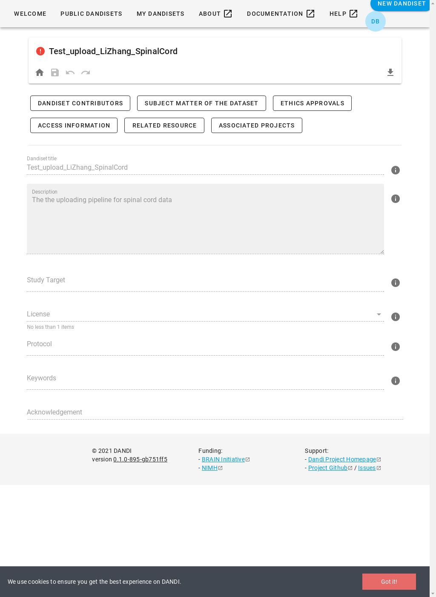 |  |

#### Error Messages
<pre>Message: unknown error: Chrome failed to start: exited abnormally
  (unknown error: DevToolsActivePort file doesn't exist)
  (The process started from chrome location /usr/bin/chromium is no longer running, so ChromeDriver is assuming that Chrome has crashed.)
  (Driver info: chromedriver=73.0.3683.75,platform=Linux 4.19.0-0.bpo.9-amd64 x86_64)</pre>
<pre>Message: unknown error: Chrome failed to start: exited abnormally
  (unknown error: Devtools port number file contents &lt;&gt; were in an unexpected format)
  (The process started from chrome location /usr/bin/chromium is no longer running, so ChromeDriver is assuming that Chrome has crashed.)
  (Driver info: chromedriver=73.0.3683.75,platform=Linux 4.19.0-0.bpo.9-amd64 x86_64)</pre>
<pre>Message: unknown error: Chrome failed to start: exited abnormally
  (unknown error: DevToolsActivePort file doesn't exist)
  (The process started from chrome location /usr/bin/chromium is no longer running, so ChromeDriver is assuming that Chrome has crashed.)
  (Driver info: chromedriver=73.0.3683.75,platform=Linux 4.19.0-0.bpo.9-amd64 x86_64)</pre>
### 200117

| t=[See below] [Go to page](https://gui-staging.dandiarchive.org/#/dandiset/200117) | t=[See below] Edit Metadata | t=[See below] [Go to page](https://gui-staging.dandiarchive.org/#/dandiset/200117/draft/files) |
| --- | --- | --- |
|  | 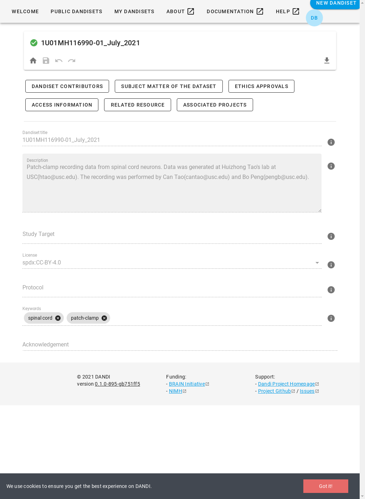 |  |

#### Error Messages
<pre>Message: unknown error: Chrome failed to start: exited abnormally
  (unknown error: DevToolsActivePort file doesn't exist)
  (The process started from chrome location /usr/bin/chromium is no longer running, so ChromeDriver is assuming that Chrome has crashed.)
  (Driver info: chromedriver=73.0.3683.75,platform=Linux 4.19.0-0.bpo.9-amd64 x86_64)</pre>
<pre>Message: unknown error: Chrome failed to start: exited abnormally
  (unknown error: DevToolsActivePort file doesn't exist)
  (The process started from chrome location /usr/bin/chromium is no longer running, so ChromeDriver is assuming that Chrome has crashed.)
  (Driver info: chromedriver=73.0.3683.75,platform=Linux 4.19.0-0.bpo.9-amd64 x86_64)</pre>
<pre>Message: unknown error: Chrome failed to start: exited abnormally
  (unknown error: Devtools port number file contents &lt;&gt; were in an unexpected format)
  (The process started from chrome location /usr/bin/chromium is no longer running, so ChromeDriver is assuming that Chrome has crashed.)
  (Driver info: chromedriver=73.0.3683.75,platform=Linux 4.19.0-0.bpo.9-amd64 x86_64)</pre>
### 200118

| t=[See below] [Go to page](https://gui-staging.dandiarchive.org/#/dandiset/200118) | t=[See below] Edit Metadata | t=[See below] [Go to page](https://gui-staging.dandiarchive.org/#/dandiset/200118/draft/files) |
| --- | --- | --- |
|  |  |  |

#### Error Messages
<pre>Message: unknown error: Chrome failed to start: exited abnormally
  (unknown error: Devtools port number file contents &lt;&gt; were in an unexpected format)
  (The process started from chrome location /usr/bin/chromium is no longer running, so ChromeDriver is assuming that Chrome has crashed.)
  (Driver info: chromedriver=73.0.3683.75,platform=Linux 4.19.0-0.bpo.9-amd64 x86_64)</pre>
<pre>Message: unknown error: Chrome failed to start: exited abnormally
  (unknown error: Devtools port number file contents &lt;&gt; were in an unexpected format)
  (The process started from chrome location /usr/bin/chromium is no longer running, so ChromeDriver is assuming that Chrome has crashed.)
  (Driver info: chromedriver=73.0.3683.75,platform=Linux 4.19.0-0.bpo.9-amd64 x86_64)</pre>
<pre>Message: unknown error: Chrome failed to start: exited abnormally
  (unknown error: DevToolsActivePort file doesn't exist)
  (The process started from chrome location /usr/bin/chromium is no longer running, so ChromeDriver is assuming that Chrome has crashed.)
  (Driver info: chromedriver=73.0.3683.75,platform=Linux 4.19.0-0.bpo.9-amd64 x86_64)</pre>
### 200119

| t=[See below] [Go to page](https://gui-staging.dandiarchive.org/#/dandiset/200119) | t=[See below] Edit Metadata | t=[See below] [Go to page](https://gui-staging.dandiarchive.org/#/dandiset/200119/draft/files) |
| --- | --- | --- |
| 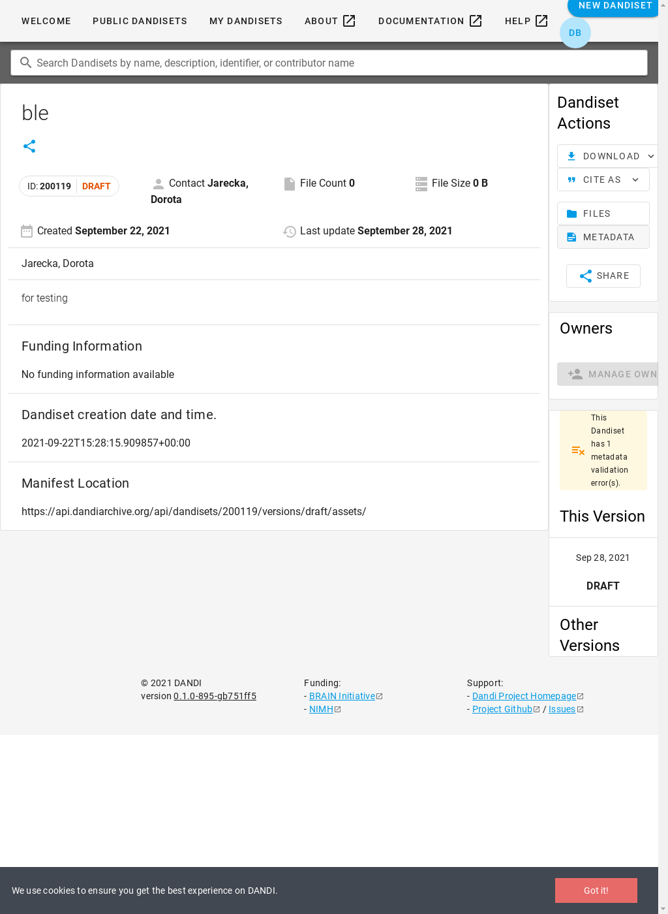 |  |  |

#### Error Messages
<pre>Message: unknown error: Chrome failed to start: exited abnormally
  (unknown error: DevToolsActivePort file doesn't exist)
  (The process started from chrome location /usr/bin/chromium is no longer running, so ChromeDriver is assuming that Chrome has crashed.)
  (Driver info: chromedriver=73.0.3683.75,platform=Linux 4.19.0-0.bpo.9-amd64 x86_64)</pre>
<pre>Message: unknown error: Chrome failed to start: exited abnormally
  (unknown error: Devtools port number file contents &lt;&gt; were in an unexpected format)
  (The process started from chrome location /usr/bin/chromium is no longer running, so ChromeDriver is assuming that Chrome has crashed.)
  (Driver info: chromedriver=73.0.3683.75,platform=Linux 4.19.0-0.bpo.9-amd64 x86_64)</pre>
<pre>Message: unknown error: Chrome failed to start: exited abnormally
  (unknown error: Devtools port number file contents &lt;&gt; were in an unexpected format)
  (The process started from chrome location /usr/bin/chromium is no longer running, so ChromeDriver is assuming that Chrome has crashed.)
  (Driver info: chromedriver=73.0.3683.75,platform=Linux 4.19.0-0.bpo.9-amd64 x86_64)</pre>
### 200120

| t=[See below] [Go to page](https://gui-staging.dandiarchive.org/#/dandiset/200120) | t=[See below] Edit Metadata | t=[See below] [Go to page](https://gui-staging.dandiarchive.org/#/dandiset/200120/draft/files) |
| --- | --- | --- |
|  |  |  |

#### Error Messages
<pre>Message: unknown error: Chrome failed to start: exited abnormally
  (unknown error: Devtools port number file contents &lt;&gt; were in an unexpected format)
  (The process started from chrome location /usr/bin/chromium is no longer running, so ChromeDriver is assuming that Chrome has crashed.)
  (Driver info: chromedriver=73.0.3683.75,platform=Linux 4.19.0-0.bpo.9-amd64 x86_64)</pre>
<pre>Message: unknown error: Chrome failed to start: exited abnormally
  (unknown error: Devtools port number file contents &lt;&gt; were in an unexpected format)
  (The process started from chrome location /usr/bin/chromium is no longer running, so ChromeDriver is assuming that Chrome has crashed.)
  (Driver info: chromedriver=73.0.3683.75,platform=Linux 4.19.0-0.bpo.9-amd64 x86_64)</pre>
<pre>Message: unknown error: Chrome failed to start: exited abnormally
  (unknown error: Devtools port number file contents &lt;&gt; were in an unexpected format)
  (The process started from chrome location /usr/bin/chromium is no longer running, so ChromeDriver is assuming that Chrome has crashed.)
  (Driver info: chromedriver=73.0.3683.75,platform=Linux 4.19.0-0.bpo.9-amd64 x86_64)</pre>
### 200121

| t=[See below] [Go to page](https://gui-staging.dandiarchive.org/#/dandiset/200121) | t=[See below] Edit Metadata | t=[See below] [Go to page](https://gui-staging.dandiarchive.org/#/dandiset/200121/draft/files) |
| --- | --- | --- |
|  | 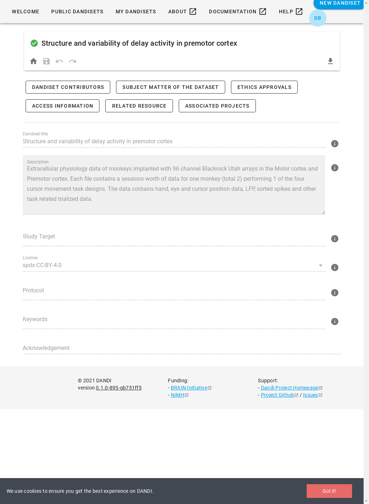 |  |

#### Error Messages
<pre>Message: unknown error: Chrome failed to start: exited abnormally
  (unknown error: DevToolsActivePort file doesn't exist)
  (The process started from chrome location /usr/bin/chromium is no longer running, so ChromeDriver is assuming that Chrome has crashed.)
  (Driver info: chromedriver=73.0.3683.75,platform=Linux 4.19.0-0.bpo.9-amd64 x86_64)</pre>
<pre>Message: unknown error: Chrome failed to start: exited abnormally
  (unknown error: DevToolsActivePort file doesn't exist)
  (The process started from chrome location /usr/bin/chromium is no longer running, so ChromeDriver is assuming that Chrome has crashed.)
  (Driver info: chromedriver=73.0.3683.75,platform=Linux 4.19.0-0.bpo.9-amd64 x86_64)</pre>
<pre>Message: unknown error: Chrome failed to start: exited abnormally
  (unknown error: Devtools port number file contents &lt;&gt; were in an unexpected format)
  (The process started from chrome location /usr/bin/chromium is no longer running, so ChromeDriver is assuming that Chrome has crashed.)
  (Driver info: chromedriver=73.0.3683.75,platform=Linux 4.19.0-0.bpo.9-amd64 x86_64)</pre>
### 200122

| t=[See below] [Go to page](https://gui-staging.dandiarchive.org/#/dandiset/200122) | t=[See below] Edit Metadata | t=[See below] [Go to page](https://gui-staging.dandiarchive.org/#/dandiset/200122/draft/files) |
| --- | --- | --- |
| 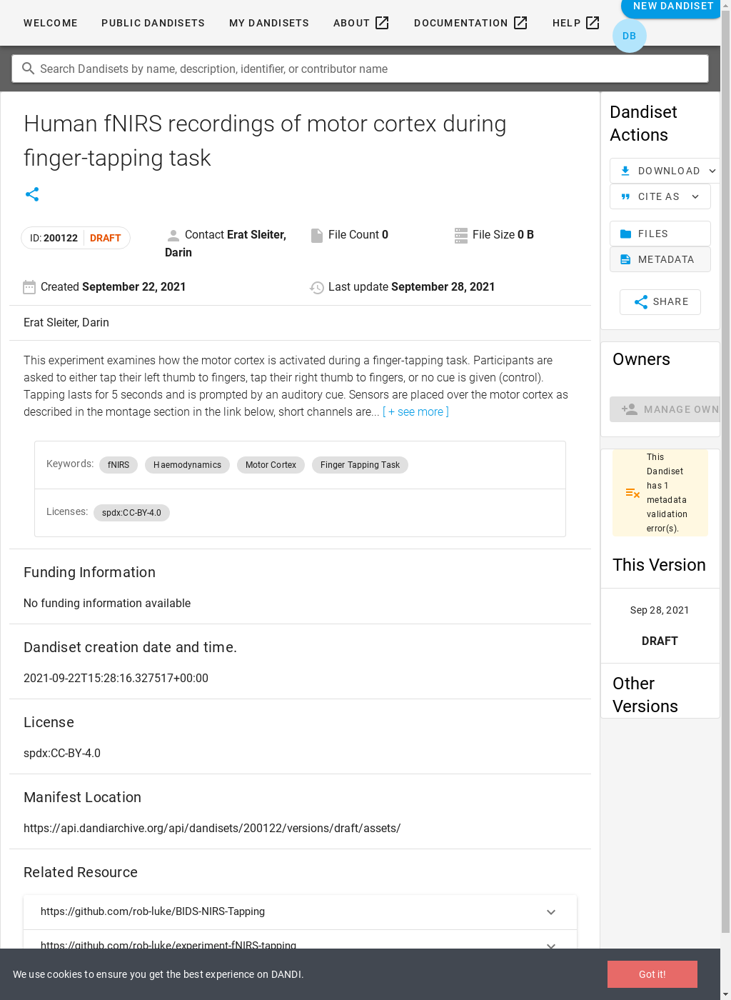 | 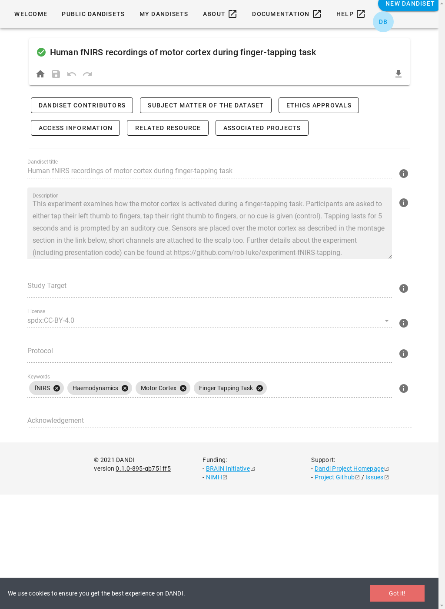 |  |

#### Error Messages
<pre>Message: unknown error: Chrome failed to start: exited abnormally
  (unknown error: DevToolsActivePort file doesn't exist)
  (The process started from chrome location /usr/bin/chromium is no longer running, so ChromeDriver is assuming that Chrome has crashed.)
  (Driver info: chromedriver=73.0.3683.75,platform=Linux 4.19.0-0.bpo.9-amd64 x86_64)</pre>
<pre>Message: unknown error: Chrome failed to start: exited abnormally
  (unknown error: Devtools port number file contents &lt;&gt; were in an unexpected format)
  (The process started from chrome location /usr/bin/chromium is no longer running, so ChromeDriver is assuming that Chrome has crashed.)
  (Driver info: chromedriver=73.0.3683.75,platform=Linux 4.19.0-0.bpo.9-amd64 x86_64)</pre>
<pre>Message: unknown error: Chrome failed to start: exited abnormally
  (unknown error: DevToolsActivePort file doesn't exist)
  (The process started from chrome location /usr/bin/chromium is no longer running, so ChromeDriver is assuming that Chrome has crashed.)
  (Driver info: chromedriver=73.0.3683.75,platform=Linux 4.19.0-0.bpo.9-amd64 x86_64)</pre>
### 200123

| t=[See below] [Go to page](https://gui-staging.dandiarchive.org/#/dandiset/200123) | t=[See below] Edit Metadata | t=[See below] [Go to page](https://gui-staging.dandiarchive.org/#/dandiset/200123/draft/files) |
| --- | --- | --- |
| 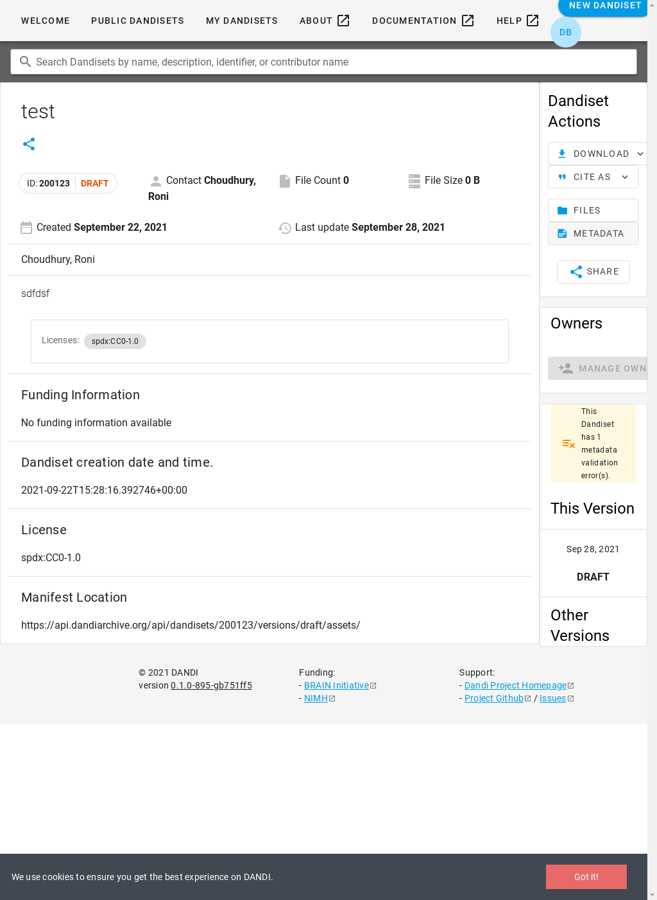 |  |  |

#### Error Messages
<pre>Message: unknown error: Chrome failed to start: exited abnormally
  (unknown error: DevToolsActivePort file doesn't exist)
  (The process started from chrome location /usr/bin/chromium is no longer running, so ChromeDriver is assuming that Chrome has crashed.)
  (Driver info: chromedriver=73.0.3683.75,platform=Linux 4.19.0-0.bpo.9-amd64 x86_64)</pre>
<pre>Message: unknown error: Chrome failed to start: exited abnormally
  (unknown error: Devtools port number file contents &lt;&gt; were in an unexpected format)
  (The process started from chrome location /usr/bin/chromium is no longer running, so ChromeDriver is assuming that Chrome has crashed.)
  (Driver info: chromedriver=73.0.3683.75,platform=Linux 4.19.0-0.bpo.9-amd64 x86_64)</pre>
<pre>Message: unknown error: Chrome failed to start: exited abnormally
  (unknown error: DevToolsActivePort file doesn't exist)
  (The process started from chrome location /usr/bin/chromium is no longer running, so ChromeDriver is assuming that Chrome has crashed.)
  (Driver info: chromedriver=73.0.3683.75,platform=Linux 4.19.0-0.bpo.9-amd64 x86_64)</pre>
### 200124

| t=[See below] [Go to page](https://gui-staging.dandiarchive.org/#/dandiset/200124) | t=[See below] Edit Metadata | t=[See below] [Go to page](https://gui-staging.dandiarchive.org/#/dandiset/200124/draft/files) |
| --- | --- | --- |
|  |  |  |

#### Error Messages
<pre>Message: unknown error: Chrome failed to start: exited abnormally
  (unknown error: Devtools port number file contents &lt;&gt; were in an unexpected format)
  (The process started from chrome location /usr/bin/chromium is no longer running, so ChromeDriver is assuming that Chrome has crashed.)
  (Driver info: chromedriver=73.0.3683.75,platform=Linux 4.19.0-0.bpo.9-amd64 x86_64)</pre>
<pre>Message: unknown error: Chrome failed to start: exited abnormally
  (unknown error: DevToolsActivePort file doesn't exist)
  (The process started from chrome location /usr/bin/chromium is no longer running, so ChromeDriver is assuming that Chrome has crashed.)
  (Driver info: chromedriver=73.0.3683.75,platform=Linux 4.19.0-0.bpo.9-amd64 x86_64)</pre>
<pre>Message: unknown error: Chrome failed to start: exited abnormally
  (unknown error: Devtools port number file contents &lt;&gt; were in an unexpected format)
  (The process started from chrome location /usr/bin/chromium is no longer running, so ChromeDriver is assuming that Chrome has crashed.)
  (Driver info: chromedriver=73.0.3683.75,platform=Linux 4.19.0-0.bpo.9-amd64 x86_64)</pre>
### 200125

| t=[See below] [Go to page](https://gui-staging.dandiarchive.org/#/dandiset/200125) | t=[See below] Edit Metadata | t=[See below] [Go to page](https://gui-staging.dandiarchive.org/#/dandiset/200125/draft/files) |
| --- | --- | --- |
| 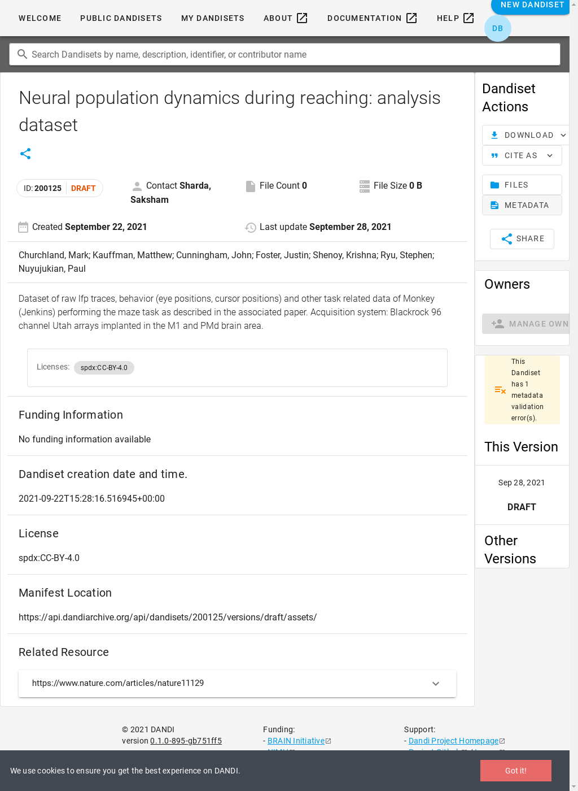 |  |  |

#### Error Messages
<pre>Message: unknown error: Chrome failed to start: exited abnormally
  (unknown error: Devtools port number file contents &lt;&gt; were in an unexpected format)
  (The process started from chrome location /usr/bin/chromium is no longer running, so ChromeDriver is assuming that Chrome has crashed.)
  (Driver info: chromedriver=73.0.3683.75,platform=Linux 4.19.0-0.bpo.9-amd64 x86_64)</pre>
<pre>Message: unknown error: Chrome failed to start: exited abnormally
  (unknown error: DevToolsActivePort file doesn't exist)
  (The process started from chrome location /usr/bin/chromium is no longer running, so ChromeDriver is assuming that Chrome has crashed.)
  (Driver info: chromedriver=73.0.3683.75,platform=Linux 4.19.0-0.bpo.9-amd64 x86_64)</pre>
<pre>Message: unknown error: Chrome failed to start: exited abnormally
  (unknown error: Devtools port number file contents &lt;&gt; were in an unexpected format)
  (The process started from chrome location /usr/bin/chromium is no longer running, so ChromeDriver is assuming that Chrome has crashed.)
  (Driver info: chromedriver=73.0.3683.75,platform=Linux 4.19.0-0.bpo.9-amd64 x86_64)</pre>
### 200126

| t=[See below] [Go to page](https://gui-staging.dandiarchive.org/#/dandiset/200126) | t=[See below] Edit Metadata | t=[See below] [Go to page](https://gui-staging.dandiarchive.org/#/dandiset/200126/draft/files) |
| --- | --- | --- |
| 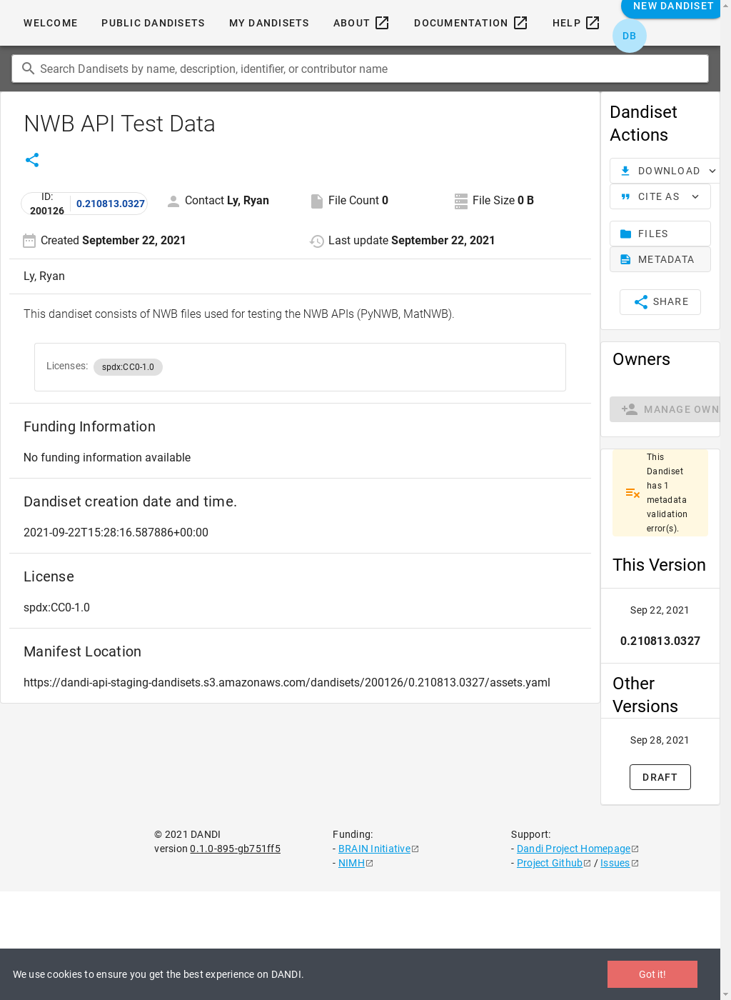 |  |  |

#### Error Messages
<pre>Message: unknown error: Chrome failed to start: exited abnormally
  (unknown error: Devtools port number file contents &lt;&gt; were in an unexpected format)
  (The process started from chrome location /usr/bin/chromium is no longer running, so ChromeDriver is assuming that Chrome has crashed.)
  (Driver info: chromedriver=73.0.3683.75,platform=Linux 4.19.0-0.bpo.9-amd64 x86_64)</pre>
<pre>Message: unknown error: Chrome failed to start: exited abnormally
  (unknown error: Devtools port number file contents &lt;&gt; were in an unexpected format)
  (The process started from chrome location /usr/bin/chromium is no longer running, so ChromeDriver is assuming that Chrome has crashed.)
  (Driver info: chromedriver=73.0.3683.75,platform=Linux 4.19.0-0.bpo.9-amd64 x86_64)</pre>
<pre>Message: unknown error: Chrome failed to start: exited abnormally
  (unknown error: DevToolsActivePort file doesn't exist)
  (The process started from chrome location /usr/bin/chromium is no longer running, so ChromeDriver is assuming that Chrome has crashed.)
  (Driver info: chromedriver=73.0.3683.75,platform=Linux 4.19.0-0.bpo.9-amd64 x86_64)</pre>
### 200127

| t=[See below] [Go to page](https://gui-staging.dandiarchive.org/#/dandiset/200127) | t=[See below] Edit Metadata | t=[See below] [Go to page](https://gui-staging.dandiarchive.org/#/dandiset/200127/draft/files) |
| --- | --- | --- |
| 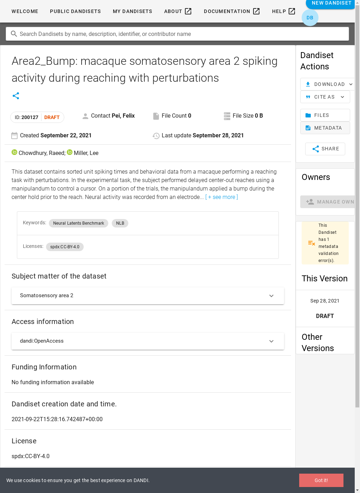 |  |  |

#### Error Messages
<pre>Message: unknown error: Chrome failed to start: exited abnormally
  (unknown error: DevToolsActivePort file doesn't exist)
  (The process started from chrome location /usr/bin/chromium is no longer running, so ChromeDriver is assuming that Chrome has crashed.)
  (Driver info: chromedriver=73.0.3683.75,platform=Linux 4.19.0-0.bpo.9-amd64 x86_64)</pre>
<pre>Message: unknown error: Chrome failed to start: exited abnormally
  (unknown error: Devtools port number file contents &lt;&gt; were in an unexpected format)
  (The process started from chrome location /usr/bin/chromium is no longer running, so ChromeDriver is assuming that Chrome has crashed.)
  (Driver info: chromedriver=73.0.3683.75,platform=Linux 4.19.0-0.bpo.9-amd64 x86_64)</pre>
<pre>Message: unknown error: Chrome failed to start: exited abnormally
  (unknown error: Devtools port number file contents &lt;&gt; were in an unexpected format)
  (The process started from chrome location /usr/bin/chromium is no longer running, so ChromeDriver is assuming that Chrome has crashed.)
  (Driver info: chromedriver=73.0.3683.75,platform=Linux 4.19.0-0.bpo.9-amd64 x86_64)</pre>
### 200128

| t=[See below] [Go to page](https://gui-staging.dandiarchive.org/#/dandiset/200128) | t=[See below] Edit Metadata | t=[See below] [Go to page](https://gui-staging.dandiarchive.org/#/dandiset/200128/draft/files) |
| --- | --- | --- |
|  |  |  |

#### Error Messages
<pre>Message: unknown error: Chrome failed to start: exited abnormally
  (unknown error: DevToolsActivePort file doesn't exist)
  (The process started from chrome location /usr/bin/chromium is no longer running, so ChromeDriver is assuming that Chrome has crashed.)
  (Driver info: chromedriver=73.0.3683.75,platform=Linux 4.19.0-0.bpo.9-amd64 x86_64)</pre>
<pre>Message: unknown error: Chrome failed to start: exited abnormally
  (unknown error: Devtools port number file contents &lt;&gt; were in an unexpected format)
  (The process started from chrome location /usr/bin/chromium is no longer running, so ChromeDriver is assuming that Chrome has crashed.)
  (Driver info: chromedriver=73.0.3683.75,platform=Linux 4.19.0-0.bpo.9-amd64 x86_64)</pre>
<pre>Message: unknown error: Chrome failed to start: exited abnormally
  (unknown error: Devtools port number file contents &lt;&gt; were in an unexpected format)
  (The process started from chrome location /usr/bin/chromium is no longer running, so ChromeDriver is assuming that Chrome has crashed.)
  (Driver info: chromedriver=73.0.3683.75,platform=Linux 4.19.0-0.bpo.9-amd64 x86_64)</pre>
### 200129

| t=[See below] [Go to page](https://gui-staging.dandiarchive.org/#/dandiset/200129) | t=[See below] Edit Metadata | t=[See below] [Go to page](https://gui-staging.dandiarchive.org/#/dandiset/200129/draft/files) |
| --- | --- | --- |
|  | 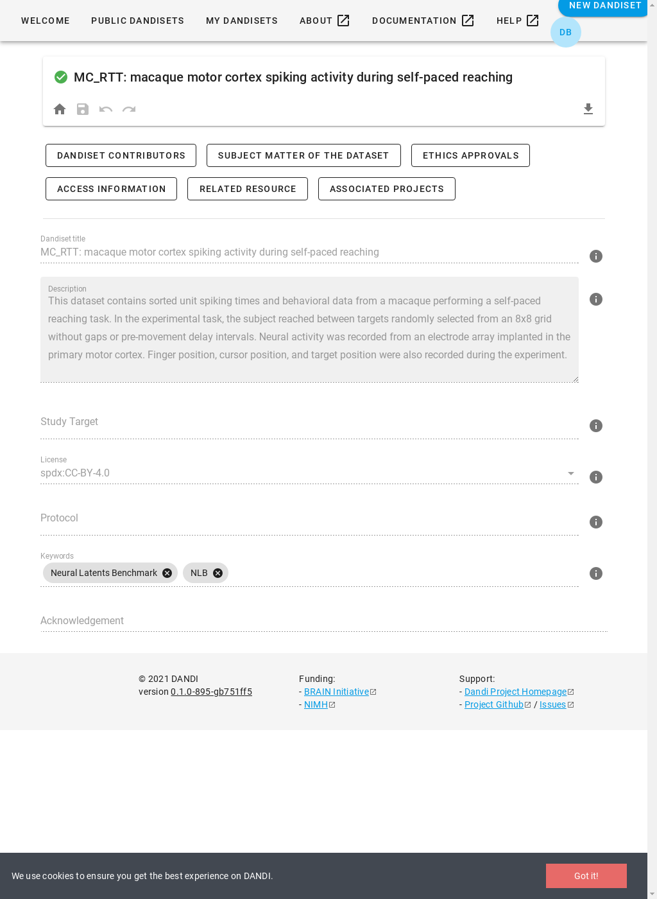 |  |

#### Error Messages
<pre>Message: unknown error: Chrome failed to start: exited abnormally
  (unknown error: Devtools port number file contents &lt;&gt; were in an unexpected format)
  (The process started from chrome location /usr/bin/chromium is no longer running, so ChromeDriver is assuming that Chrome has crashed.)
  (Driver info: chromedriver=73.0.3683.75,platform=Linux 4.19.0-0.bpo.9-amd64 x86_64)</pre>
<pre>Message: unknown error: Chrome failed to start: exited abnormally
  (unknown error: DevToolsActivePort file doesn't exist)
  (The process started from chrome location /usr/bin/chromium is no longer running, so ChromeDriver is assuming that Chrome has crashed.)
  (Driver info: chromedriver=73.0.3683.75,platform=Linux 4.19.0-0.bpo.9-amd64 x86_64)</pre>
<pre>Message: unknown error: Chrome failed to start: exited abnormally
  (unknown error: DevToolsActivePort file doesn't exist)
  (The process started from chrome location /usr/bin/chromium is no longer running, so ChromeDriver is assuming that Chrome has crashed.)
  (Driver info: chromedriver=73.0.3683.75,platform=Linux 4.19.0-0.bpo.9-amd64 x86_64)</pre>
### 200130

| t=[See below] [Go to page](https://gui-staging.dandiarchive.org/#/dandiset/200130) | t=[See below] Edit Metadata | t=[See below] [Go to page](https://gui-staging.dandiarchive.org/#/dandiset/200130/draft/files) |
| --- | --- | --- |
|  | 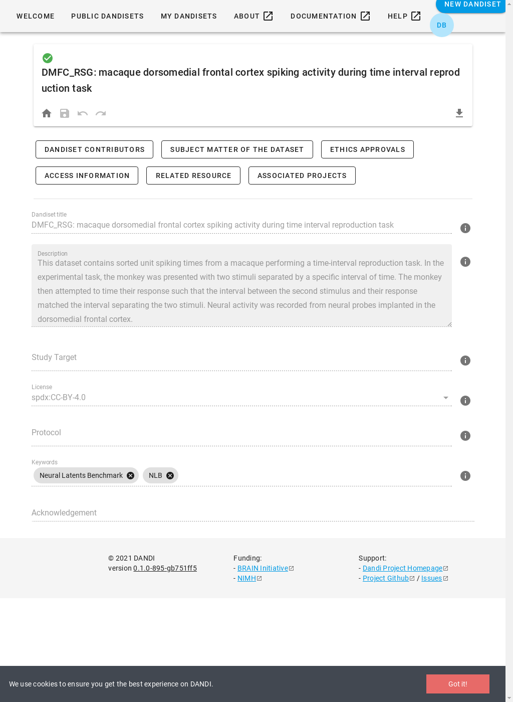 |  |

#### Error Messages
<pre>Message: unknown error: Chrome failed to start: exited abnormally
  (unknown error: Devtools port number file contents &lt;&gt; were in an unexpected format)
  (The process started from chrome location /usr/bin/chromium is no longer running, so ChromeDriver is assuming that Chrome has crashed.)
  (Driver info: chromedriver=73.0.3683.75,platform=Linux 4.19.0-0.bpo.9-amd64 x86_64)</pre>
<pre>Message: unknown error: Chrome failed to start: exited abnormally
  (unknown error: Devtools port number file contents &lt;&gt; were in an unexpected format)
  (The process started from chrome location /usr/bin/chromium is no longer running, so ChromeDriver is assuming that Chrome has crashed.)
  (Driver info: chromedriver=73.0.3683.75,platform=Linux 4.19.0-0.bpo.9-amd64 x86_64)</pre>
<pre>Message: unknown error: Chrome failed to start: exited abnormally
  (unknown error: DevToolsActivePort file doesn't exist)
  (The process started from chrome location /usr/bin/chromium is no longer running, so ChromeDriver is assuming that Chrome has crashed.)
  (Driver info: chromedriver=73.0.3683.75,platform=Linux 4.19.0-0.bpo.9-amd64 x86_64)</pre>
### 200131

| t=[See below] [Go to page](https://gui-staging.dandiarchive.org/#/dandiset/200131) | t=[See below] Edit Metadata | t=[See below] [Go to page](https://gui-staging.dandiarchive.org/#/dandiset/200131/draft/files) |
| --- | --- | --- |
| 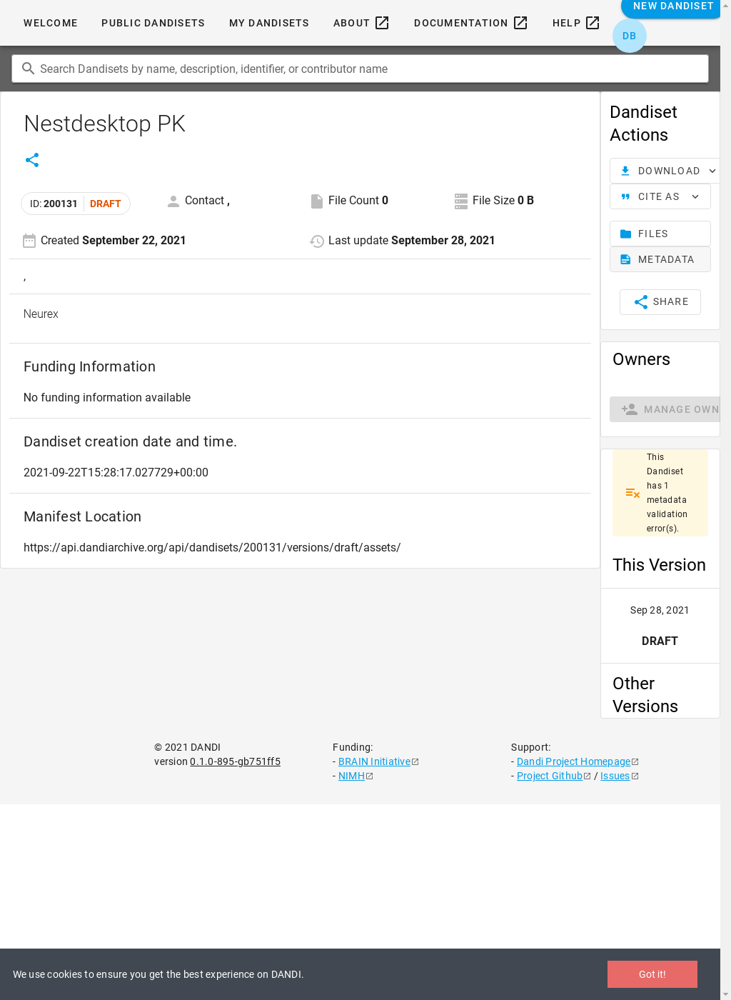 |  |  |

#### Error Messages
<pre>Message: unknown error: Chrome failed to start: exited abnormally
  (unknown error: Devtools port number file contents &lt;&gt; were in an unexpected format)
  (The process started from chrome location /usr/bin/chromium is no longer running, so ChromeDriver is assuming that Chrome has crashed.)
  (Driver info: chromedriver=73.0.3683.75,platform=Linux 4.19.0-0.bpo.9-amd64 x86_64)</pre>
<pre>Message: unknown error: Chrome failed to start: exited abnormally
  (unknown error: DevToolsActivePort file doesn't exist)
  (The process started from chrome location /usr/bin/chromium is no longer running, so ChromeDriver is assuming that Chrome has crashed.)
  (Driver info: chromedriver=73.0.3683.75,platform=Linux 4.19.0-0.bpo.9-amd64 x86_64)</pre>
<pre>Message: unknown error: Chrome failed to start: exited abnormally
  (unknown error: Devtools port number file contents &lt;&gt; were in an unexpected format)
  (The process started from chrome location /usr/bin/chromium is no longer running, so ChromeDriver is assuming that Chrome has crashed.)
  (Driver info: chromedriver=73.0.3683.75,platform=Linux 4.19.0-0.bpo.9-amd64 x86_64)</pre>
### 200132

| t=[See below] [Go to page](https://gui-staging.dandiarchive.org/#/dandiset/200132) | t=[See below] Edit Metadata | t=[See below] [Go to page](https://gui-staging.dandiarchive.org/#/dandiset/200132/draft/files) |
| --- | --- | --- |
| 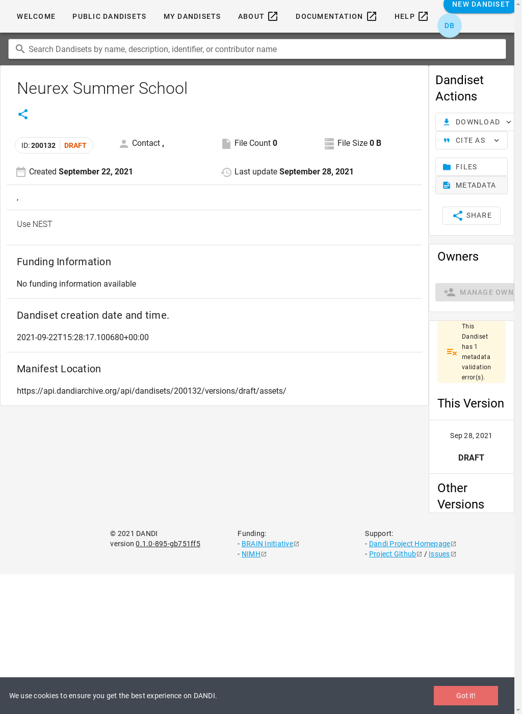 |  |  |

#### Error Messages
<pre>Message: unknown error: Chrome failed to start: exited abnormally
  (unknown error: DevToolsActivePort file doesn't exist)
  (The process started from chrome location /usr/bin/chromium is no longer running, so ChromeDriver is assuming that Chrome has crashed.)
  (Driver info: chromedriver=73.0.3683.75,platform=Linux 4.19.0-0.bpo.9-amd64 x86_64)</pre>
<pre>Message: unknown error: Chrome failed to start: exited abnormally
  (unknown error: DevToolsActivePort file doesn't exist)
  (The process started from chrome location /usr/bin/chromium is no longer running, so ChromeDriver is assuming that Chrome has crashed.)
  (Driver info: chromedriver=73.0.3683.75,platform=Linux 4.19.0-0.bpo.9-amd64 x86_64)</pre>
<pre>Message: unknown error: Chrome failed to start: exited abnormally
  (unknown error: Devtools port number file contents &lt;&gt; were in an unexpected format)
  (The process started from chrome location /usr/bin/chromium is no longer running, so ChromeDriver is assuming that Chrome has crashed.)
  (Driver info: chromedriver=73.0.3683.75,platform=Linux 4.19.0-0.bpo.9-amd64 x86_64)</pre>
### 200133

| t=[See below] [Go to page](https://gui-staging.dandiarchive.org/#/dandiset/200133) | t=[See below] Edit Metadata | t=[See below] [Go to page](https://gui-staging.dandiarchive.org/#/dandiset/200133/draft/files) |
| --- | --- | --- |
|  |  |  |

#### Error Messages
<pre>Message: unknown error: Chrome failed to start: exited abnormally
  (unknown error: Devtools port number file contents &lt;&gt; were in an unexpected format)
  (The process started from chrome location /usr/bin/chromium is no longer running, so ChromeDriver is assuming that Chrome has crashed.)
  (Driver info: chromedriver=73.0.3683.75,platform=Linux 4.19.0-0.bpo.9-amd64 x86_64)</pre>
<pre>Message: unknown error: Chrome failed to start: exited abnormally
  (unknown error: Devtools port number file contents &lt;&gt; were in an unexpected format)
  (The process started from chrome location /usr/bin/chromium is no longer running, so ChromeDriver is assuming that Chrome has crashed.)
  (Driver info: chromedriver=73.0.3683.75,platform=Linux 4.19.0-0.bpo.9-amd64 x86_64)</pre>
<pre>Message: unknown error: Chrome failed to start: exited abnormally
  (unknown error: DevToolsActivePort file doesn't exist)
  (The process started from chrome location /usr/bin/chromium is no longer running, so ChromeDriver is assuming that Chrome has crashed.)
  (Driver info: chromedriver=73.0.3683.75,platform=Linux 4.19.0-0.bpo.9-amd64 x86_64)</pre>
### 200134

| t=[See below] [Go to page](https://gui-staging.dandiarchive.org/#/dandiset/200134) | t=[See below] Edit Metadata | t=[See below] [Go to page](https://gui-staging.dandiarchive.org/#/dandiset/200134/draft/files) |
| --- | --- | --- |
| 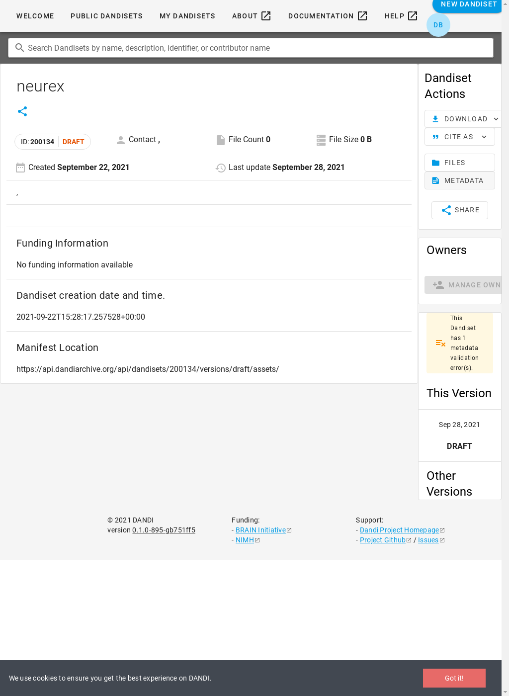 |  |  |

#### Error Messages
<pre>Message: unknown error: Chrome failed to start: exited abnormally
  (unknown error: Devtools port number file contents &lt;&gt; were in an unexpected format)
  (The process started from chrome location /usr/bin/chromium is no longer running, so ChromeDriver is assuming that Chrome has crashed.)
  (Driver info: chromedriver=73.0.3683.75,platform=Linux 4.19.0-0.bpo.9-amd64 x86_64)</pre>
<pre>Message: unknown error: Chrome failed to start: exited abnormally
  (unknown error: Devtools port number file contents &lt;&gt; were in an unexpected format)
  (The process started from chrome location /usr/bin/chromium is no longer running, so ChromeDriver is assuming that Chrome has crashed.)
  (Driver info: chromedriver=73.0.3683.75,platform=Linux 4.19.0-0.bpo.9-amd64 x86_64)</pre>
<pre>Message: unknown error: Chrome failed to start: exited abnormally
  (unknown error: DevToolsActivePort file doesn't exist)
  (The process started from chrome location /usr/bin/chromium is no longer running, so ChromeDriver is assuming that Chrome has crashed.)
  (Driver info: chromedriver=73.0.3683.75,platform=Linux 4.19.0-0.bpo.9-amd64 x86_64)</pre>
### 200135

| t=[See below] [Go to page](https://gui-staging.dandiarchive.org/#/dandiset/200135) | t=[See below] Edit Metadata | t=[See below] [Go to page](https://gui-staging.dandiarchive.org/#/dandiset/200135/draft/files) |
| --- | --- | --- |
|  |  |  |

#### Error Messages
<pre>Message: unknown error: Chrome failed to start: exited abnormally
  (unknown error: DevToolsActivePort file doesn't exist)
  (The process started from chrome location /usr/bin/chromium is no longer running, so ChromeDriver is assuming that Chrome has crashed.)
  (Driver info: chromedriver=73.0.3683.75,platform=Linux 4.19.0-0.bpo.9-amd64 x86_64)</pre>
<pre>Message: unknown error: Chrome failed to start: exited abnormally
  (unknown error: Devtools port number file contents &lt;&gt; were in an unexpected format)
  (The process started from chrome location /usr/bin/chromium is no longer running, so ChromeDriver is assuming that Chrome has crashed.)
  (Driver info: chromedriver=73.0.3683.75,platform=Linux 4.19.0-0.bpo.9-amd64 x86_64)</pre>
<pre>Message: unknown error: Chrome failed to start: exited abnormally
  (unknown error: Devtools port number file contents &lt;&gt; were in an unexpected format)
  (The process started from chrome location /usr/bin/chromium is no longer running, so ChromeDriver is assuming that Chrome has crashed.)
  (Driver info: chromedriver=73.0.3683.75,platform=Linux 4.19.0-0.bpo.9-amd64 x86_64)</pre>
### 200136

| t=[See below] [Go to page](https://gui-staging.dandiarchive.org/#/dandiset/200136) | t=[See below] Edit Metadata | t=[See below] [Go to page](https://gui-staging.dandiarchive.org/#/dandiset/200136/draft/files) |
| --- | --- | --- |
| 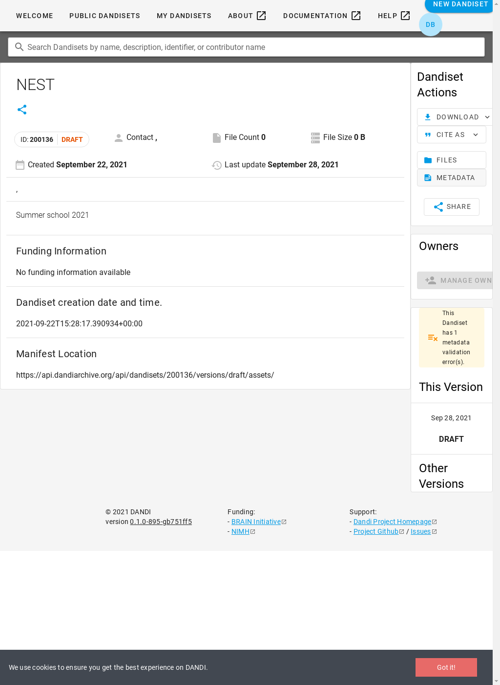 |  |  |

#### Error Messages
<pre>Message: unknown error: Chrome failed to start: exited abnormally
  (unknown error: DevToolsActivePort file doesn't exist)
  (The process started from chrome location /usr/bin/chromium is no longer running, so ChromeDriver is assuming that Chrome has crashed.)
  (Driver info: chromedriver=73.0.3683.75,platform=Linux 4.19.0-0.bpo.9-amd64 x86_64)</pre>
<pre>Message: unknown error: Chrome failed to start: exited abnormally
  (unknown error: Devtools port number file contents &lt;&gt; were in an unexpected format)
  (The process started from chrome location /usr/bin/chromium is no longer running, so ChromeDriver is assuming that Chrome has crashed.)
  (Driver info: chromedriver=73.0.3683.75,platform=Linux 4.19.0-0.bpo.9-amd64 x86_64)</pre>
<pre>Message: unknown error: Chrome failed to start: exited abnormally
  (unknown error: Devtools port number file contents &lt;&gt; were in an unexpected format)
  (The process started from chrome location /usr/bin/chromium is no longer running, so ChromeDriver is assuming that Chrome has crashed.)
  (Driver info: chromedriver=73.0.3683.75,platform=Linux 4.19.0-0.bpo.9-amd64 x86_64)</pre>
### 200137

| t=[See below] [Go to page](https://gui-staging.dandiarchive.org/#/dandiset/200137) | t=[See below] Edit Metadata | t=[See below] [Go to page](https://gui-staging.dandiarchive.org/#/dandiset/200137/draft/files) |
| --- | --- | --- |
| 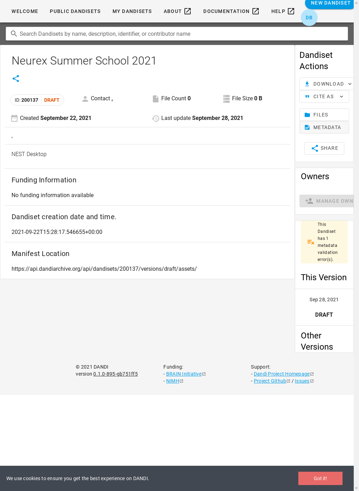 |  |  |

#### Error Messages
<pre>Message: unknown error: Chrome failed to start: exited abnormally
  (unknown error: Devtools port number file contents &lt;&gt; were in an unexpected format)
  (The process started from chrome location /usr/bin/chromium is no longer running, so ChromeDriver is assuming that Chrome has crashed.)
  (Driver info: chromedriver=73.0.3683.75,platform=Linux 4.19.0-0.bpo.9-amd64 x86_64)</pre>
<pre>Message: unknown error: Chrome failed to start: exited abnormally
  (unknown error: Devtools port number file contents &lt;&gt; were in an unexpected format)
  (The process started from chrome location /usr/bin/chromium is no longer running, so ChromeDriver is assuming that Chrome has crashed.)
  (Driver info: chromedriver=73.0.3683.75,platform=Linux 4.19.0-0.bpo.9-amd64 x86_64)</pre>
<pre>Message: unknown error: Chrome failed to start: exited abnormally
  (unknown error: Devtools port number file contents &lt;&gt; were in an unexpected format)
  (The process started from chrome location /usr/bin/chromium is no longer running, so ChromeDriver is assuming that Chrome has crashed.)
  (Driver info: chromedriver=73.0.3683.75,platform=Linux 4.19.0-0.bpo.9-amd64 x86_64)</pre>
### 200138

| t=[See below] [Go to page](https://gui-staging.dandiarchive.org/#/dandiset/200138) | t=[See below] Edit Metadata | t=[See below] [Go to page](https://gui-staging.dandiarchive.org/#/dandiset/200138/draft/files) |
| --- | --- | --- |
| 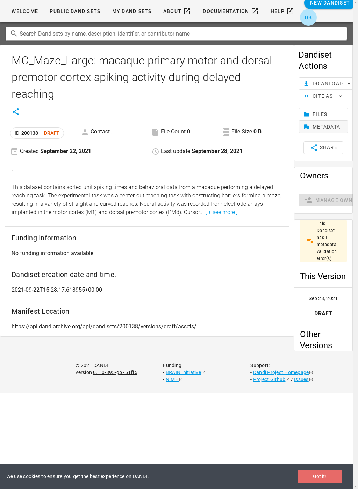 |  |  |

#### Error Messages
<pre>Message: unknown error: Chrome failed to start: exited abnormally
  (unknown error: DevToolsActivePort file doesn't exist)
  (The process started from chrome location /usr/bin/chromium is no longer running, so ChromeDriver is assuming that Chrome has crashed.)
  (Driver info: chromedriver=73.0.3683.75,platform=Linux 4.19.0-0.bpo.9-amd64 x86_64)</pre>
<pre>Message: unknown error: Chrome failed to start: exited abnormally
  (unknown error: Devtools port number file contents &lt;&gt; were in an unexpected format)
  (The process started from chrome location /usr/bin/chromium is no longer running, so ChromeDriver is assuming that Chrome has crashed.)
  (Driver info: chromedriver=73.0.3683.75,platform=Linux 4.19.0-0.bpo.9-amd64 x86_64)</pre>
<pre>Message: unknown error: Chrome failed to start: exited abnormally
  (unknown error: Devtools port number file contents &lt;&gt; were in an unexpected format)
  (The process started from chrome location /usr/bin/chromium is no longer running, so ChromeDriver is assuming that Chrome has crashed.)
  (Driver info: chromedriver=73.0.3683.75,platform=Linux 4.19.0-0.bpo.9-amd64 x86_64)</pre>
### 200139

| t=[See below] [Go to page](https://gui-staging.dandiarchive.org/#/dandiset/200139) | t=[See below] Edit Metadata | t=[See below] [Go to page](https://gui-staging.dandiarchive.org/#/dandiset/200139/draft/files) |
| --- | --- | --- |
|  | 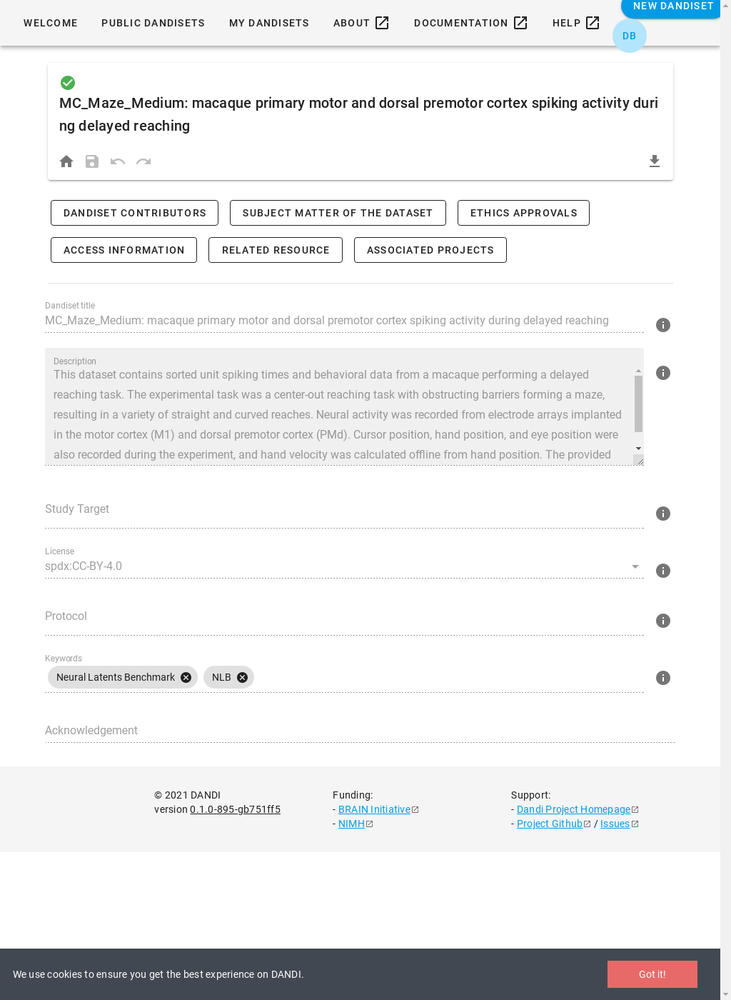 |  |

#### Error Messages
<pre>Message: unknown error: Chrome failed to start: exited abnormally
  (unknown error: DevToolsActivePort file doesn't exist)
  (The process started from chrome location /usr/bin/chromium is no longer running, so ChromeDriver is assuming that Chrome has crashed.)
  (Driver info: chromedriver=73.0.3683.75,platform=Linux 4.19.0-0.bpo.9-amd64 x86_64)</pre>
<pre>Message: unknown error: Chrome failed to start: exited abnormally
  (unknown error: Devtools port number file contents &lt;&gt; were in an unexpected format)
  (The process started from chrome location /usr/bin/chromium is no longer running, so ChromeDriver is assuming that Chrome has crashed.)
  (Driver info: chromedriver=73.0.3683.75,platform=Linux 4.19.0-0.bpo.9-amd64 x86_64)</pre>
<pre>Message: unknown error: Chrome failed to start: exited abnormally
  (unknown error: DevToolsActivePort file doesn't exist)
  (The process started from chrome location /usr/bin/chromium is no longer running, so ChromeDriver is assuming that Chrome has crashed.)
  (Driver info: chromedriver=73.0.3683.75,platform=Linux 4.19.0-0.bpo.9-amd64 x86_64)</pre>
### 200140

| t=[See below] [Go to page](https://gui-staging.dandiarchive.org/#/dandiset/200140) | t=[See below] Edit Metadata | t=[See below] [Go to page](https://gui-staging.dandiarchive.org/#/dandiset/200140/draft/files) |
| --- | --- | --- |
|  | 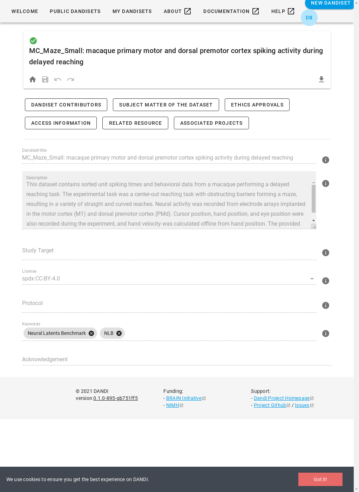 |  |

#### Error Messages
<pre>Message: unknown error: Chrome failed to start: exited abnormally
  (unknown error: Devtools port number file contents &lt;&gt; were in an unexpected format)
  (The process started from chrome location /usr/bin/chromium is no longer running, so ChromeDriver is assuming that Chrome has crashed.)
  (Driver info: chromedriver=73.0.3683.75,platform=Linux 4.19.0-0.bpo.9-amd64 x86_64)</pre>
<pre>Message: unknown error: Chrome failed to start: exited abnormally
  (unknown error: Devtools port number file contents &lt;&gt; were in an unexpected format)
  (The process started from chrome location /usr/bin/chromium is no longer running, so ChromeDriver is assuming that Chrome has crashed.)
  (Driver info: chromedriver=73.0.3683.75,platform=Linux 4.19.0-0.bpo.9-amd64 x86_64)</pre>
<pre>Message: unknown error: Chrome failed to start: exited abnormally
  (unknown error: Devtools port number file contents &lt;&gt; were in an unexpected format)
  (The process started from chrome location /usr/bin/chromium is no longer running, so ChromeDriver is assuming that Chrome has crashed.)
  (Driver info: chromedriver=73.0.3683.75,platform=Linux 4.19.0-0.bpo.9-amd64 x86_64)</pre>
### 200141

| t=[See below] [Go to page](https://gui-staging.dandiarchive.org/#/dandiset/200141) | t=[See below] Edit Metadata | t=[See below] [Go to page](https://gui-staging.dandiarchive.org/#/dandiset/200141/draft/files) |
| --- | --- | --- |
| 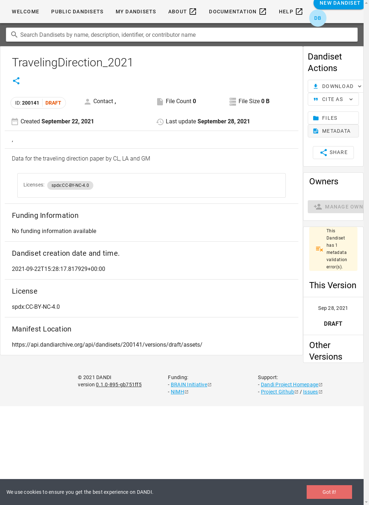 |  |  |

#### Error Messages
<pre>Message: unknown error: Chrome failed to start: exited abnormally
  (unknown error: Devtools port number file contents &lt;&gt; were in an unexpected format)
  (The process started from chrome location /usr/bin/chromium is no longer running, so ChromeDriver is assuming that Chrome has crashed.)
  (Driver info: chromedriver=73.0.3683.75,platform=Linux 4.19.0-0.bpo.9-amd64 x86_64)</pre>
<pre>Message: unknown error: Chrome failed to start: exited abnormally
  (unknown error: DevToolsActivePort file doesn't exist)
  (The process started from chrome location /usr/bin/chromium is no longer running, so ChromeDriver is assuming that Chrome has crashed.)
  (Driver info: chromedriver=73.0.3683.75,platform=Linux 4.19.0-0.bpo.9-amd64 x86_64)</pre>
<pre>Message: unknown error: Chrome failed to start: exited abnormally
  (unknown error: DevToolsActivePort file doesn't exist)
  (The process started from chrome location /usr/bin/chromium is no longer running, so ChromeDriver is assuming that Chrome has crashed.)
  (Driver info: chromedriver=73.0.3683.75,platform=Linux 4.19.0-0.bpo.9-amd64 x86_64)</pre>
