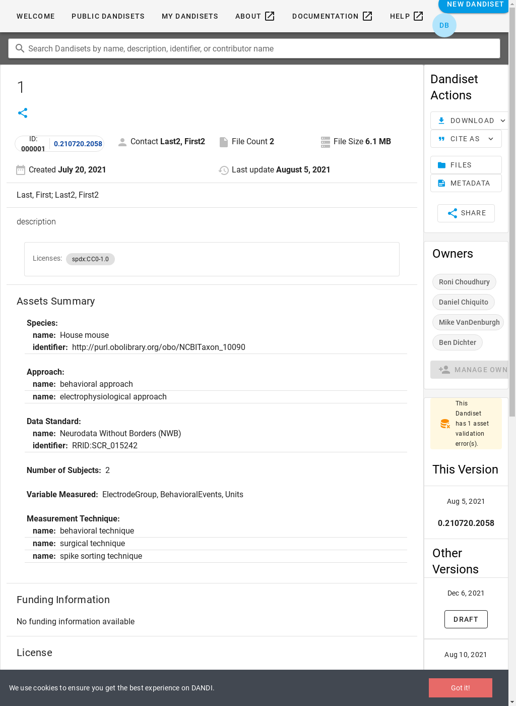
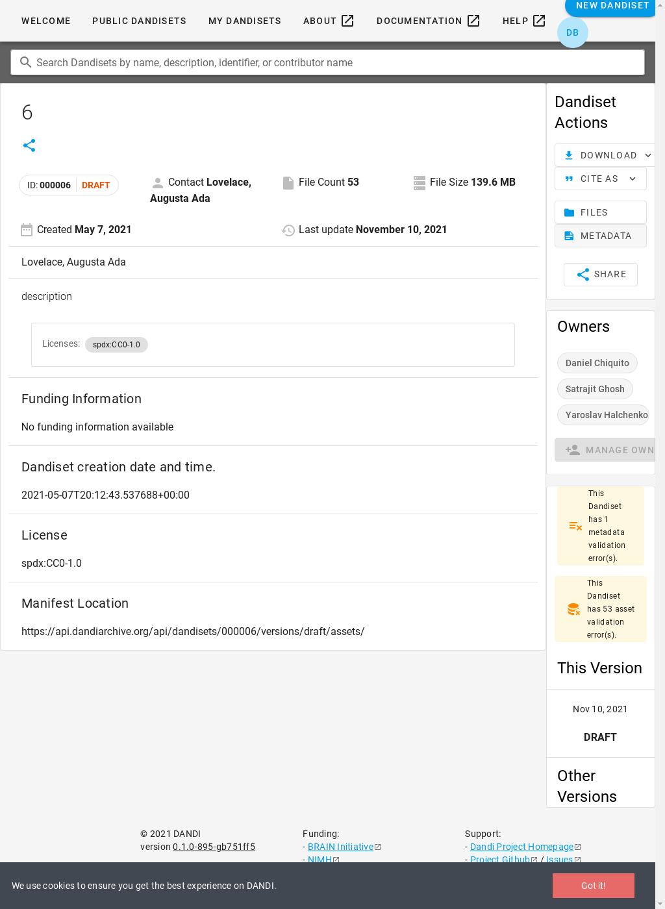
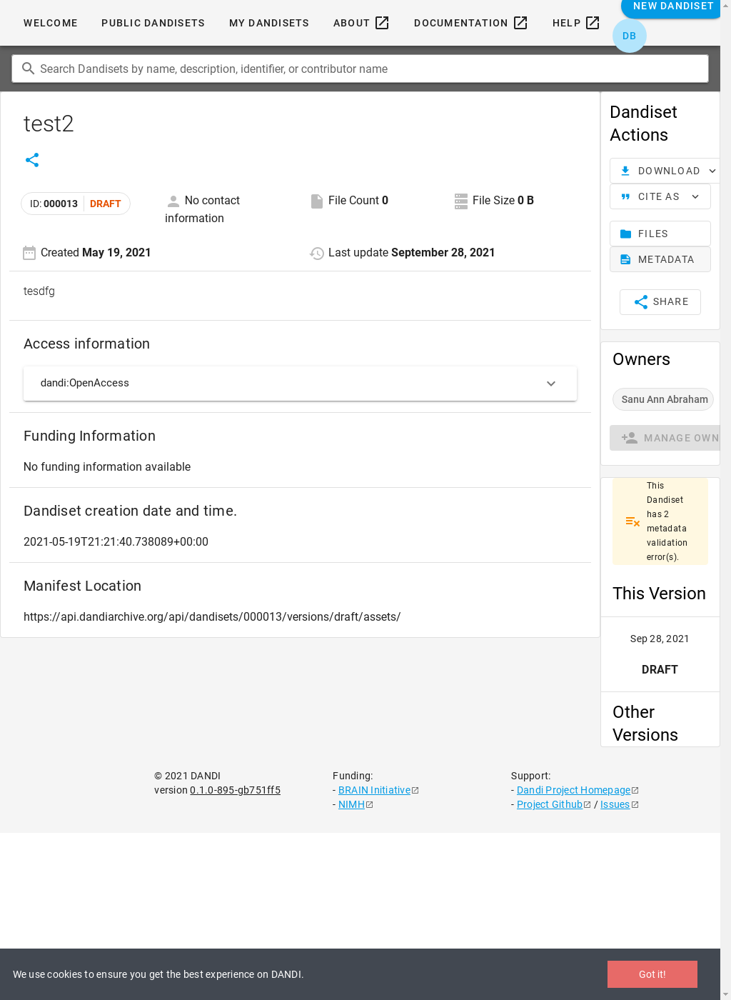
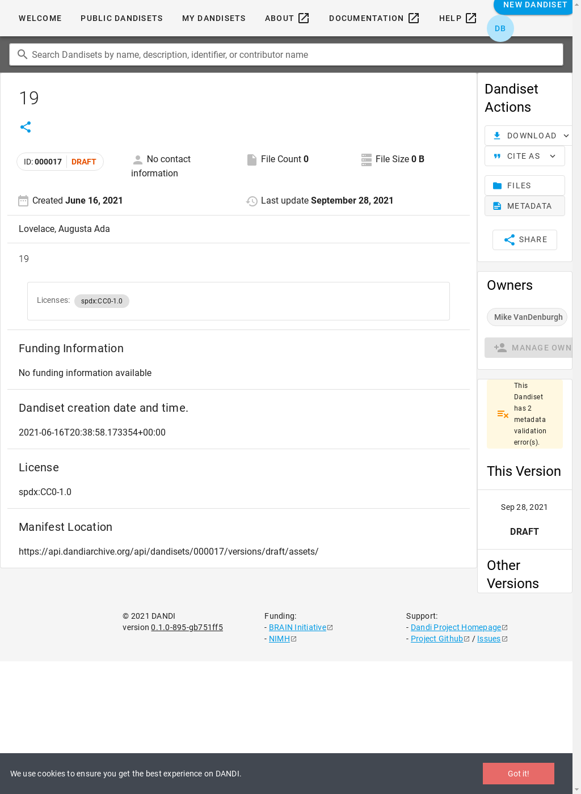
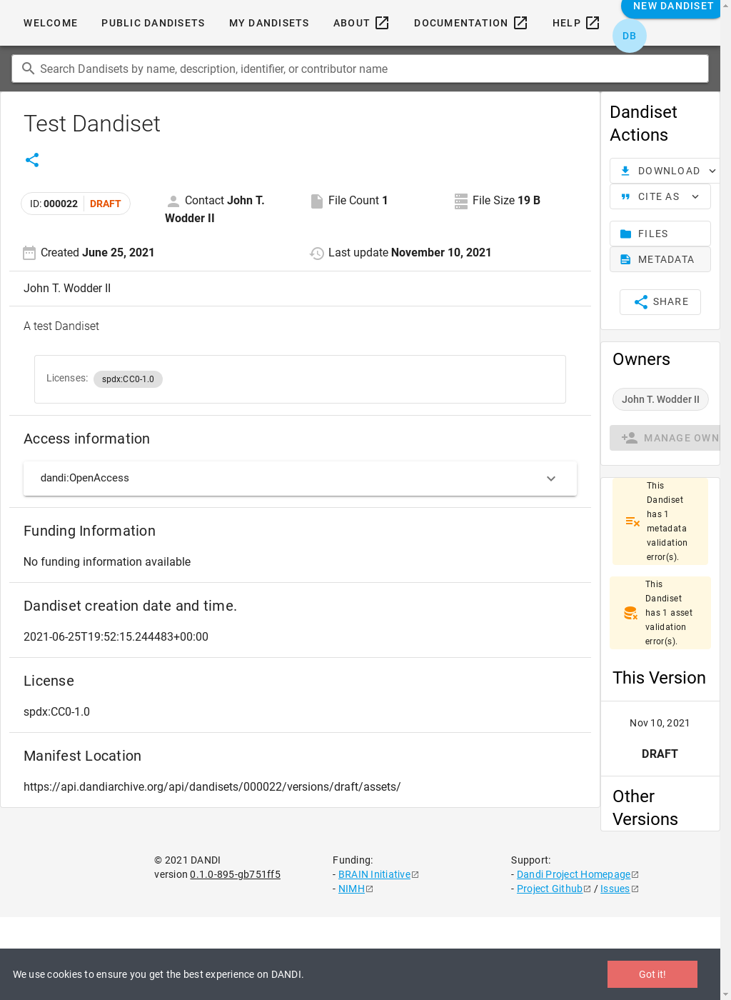
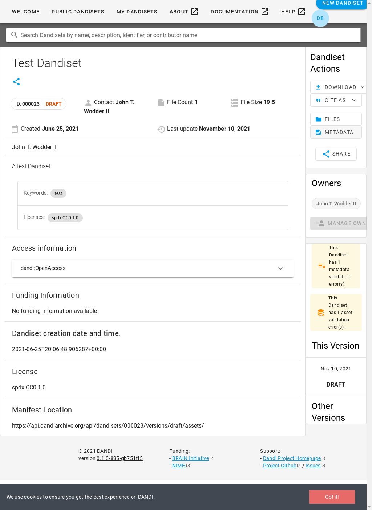

| Page | Min Time | Mean ± StdDev | Max Time | Errors |
| --- | --- | --- | --- | --- |
| landing | 0.04s ([000019](#000019)) | 0.05s ± 0.00s | 0.06s ([000001](#000001)) | — |
| edit-metadata | 0.36s ([000016](#000016)) | 0.77s ± 1.21s | 7.60s ([000032](#000032)) | — |
| view-data | 0.19s ([000027](#000027)) | 0.29s ± 0.15s | 0.85s ([000026](#000026)) | — |

### 000001

| t=0.06 [Go to page](https://gui-staging.dandiarchive.org/#/dandiset/000001) | t=0.74 Edit Metadata | t=0.23 [Go to page](https://gui-staging.dandiarchive.org/#/dandiset/000001/draft/files) |
| --- | --- | --- |
|  |  |  |

### 000002

| t=0.05 [Go to page](https://gui-staging.dandiarchive.org/#/dandiset/000002) | t=0.57 Edit Metadata | t=0.26 [Go to page](https://gui-staging.dandiarchive.org/#/dandiset/000002/draft/files) |
| --- | --- | --- |
|  |  |  |

### 000003

| t=0.05 [Go to page](https://gui-staging.dandiarchive.org/#/dandiset/000003) | t=0.49 Edit Metadata | t=0.33 [Go to page](https://gui-staging.dandiarchive.org/#/dandiset/000003/draft/files) |
| --- | --- | --- |
|  |  |  |

### 000004

| t=0.05 [Go to page](https://gui-staging.dandiarchive.org/#/dandiset/000004) | t=0.48 Edit Metadata | t=0.20 [Go to page](https://gui-staging.dandiarchive.org/#/dandiset/000004/draft/files) |
| --- | --- | --- |
|  |  |  |

### 000005

| t=0.05 [Go to page](https://gui-staging.dandiarchive.org/#/dandiset/000005) | t=0.50 Edit Metadata | t=0.21 [Go to page](https://gui-staging.dandiarchive.org/#/dandiset/000005/draft/files) |
| --- | --- | --- |
|  |  |  |

### 000006

| t=0.05 [Go to page](https://gui-staging.dandiarchive.org/#/dandiset/000006) | t=0.44 Edit Metadata | t=0.24 [Go to page](https://gui-staging.dandiarchive.org/#/dandiset/000006/draft/files) |
| --- | --- | --- |
|  |  |  |

### 000007

| t=0.05 [Go to page](https://gui-staging.dandiarchive.org/#/dandiset/000007) | t=0.50 Edit Metadata | t=0.20 [Go to page](https://gui-staging.dandiarchive.org/#/dandiset/000007/draft/files) |
| --- | --- | --- |
|  |  |  |

### 000008

| t=0.05 [Go to page](https://gui-staging.dandiarchive.org/#/dandiset/000008) | t=0.49 Edit Metadata | t=0.34 [Go to page](https://gui-staging.dandiarchive.org/#/dandiset/000008/draft/files) |
| --- | --- | --- |
|  |  |  |

### 000009

| t=0.04 [Go to page](https://gui-staging.dandiarchive.org/#/dandiset/000009) | t=0.46 Edit Metadata | t=0.19 [Go to page](https://gui-staging.dandiarchive.org/#/dandiset/000009/draft/files) |
| --- | --- | --- |
|  |  |  |

### 000010

| t=0.04 [Go to page](https://gui-staging.dandiarchive.org/#/dandiset/000010) | t=0.47 Edit Metadata | t=0.20 [Go to page](https://gui-staging.dandiarchive.org/#/dandiset/000010/draft/files) |
| --- | --- | --- |
|  |  |  |

### 000011

| t=0.05 [Go to page](https://gui-staging.dandiarchive.org/#/dandiset/000011) | t=0.48 Edit Metadata | t=0.33 [Go to page](https://gui-staging.dandiarchive.org/#/dandiset/000011/draft/files) |
| --- | --- | --- |
|  |  |  |

### 000012

| t=0.05 [Go to page](https://gui-staging.dandiarchive.org/#/dandiset/000012) | t=0.38 Edit Metadata | t=0.20 [Go to page](https://gui-staging.dandiarchive.org/#/dandiset/000012/draft/files) |
| --- | --- | --- |
|  |  |  |

### 000013

| t=0.04 [Go to page](https://gui-staging.dandiarchive.org/#/dandiset/000013) | t=0.48 Edit Metadata | t=0.22 [Go to page](https://gui-staging.dandiarchive.org/#/dandiset/000013/draft/files) |
| --- | --- | --- |
|  |  |  |

### 000014

| t=0.05 [Go to page](https://gui-staging.dandiarchive.org/#/dandiset/000014) | t=0.48 Edit Metadata | t=0.20 [Go to page](https://gui-staging.dandiarchive.org/#/dandiset/000014/draft/files) |
| --- | --- | --- |
|  |  |  |

### 000015

| t=0.04 [Go to page](https://gui-staging.dandiarchive.org/#/dandiset/000015) | t=1.57 Edit Metadata | t=0.26 [Go to page](https://gui-staging.dandiarchive.org/#/dandiset/000015/draft/files) |
| --- | --- | --- |
|  |  |  |

### 000016

| t=0.04 [Go to page](https://gui-staging.dandiarchive.org/#/dandiset/000016) | t=0.36 Edit Metadata | t=0.20 [Go to page](https://gui-staging.dandiarchive.org/#/dandiset/000016/draft/files) |
| --- | --- | --- |
|  |  |  |

### 000017

| t=0.05 [Go to page](https://gui-staging.dandiarchive.org/#/dandiset/000017) | t=0.39 Edit Metadata | t=0.33 [Go to page](https://gui-staging.dandiarchive.org/#/dandiset/000017/draft/files) |
| --- | --- | --- |
|  |  |  |

### 000018

| t=0.05 [Go to page](https://gui-staging.dandiarchive.org/#/dandiset/000018) | t=0.63 Edit Metadata | t=0.22 [Go to page](https://gui-staging.dandiarchive.org/#/dandiset/000018/draft/files) |
| --- | --- | --- |
|  |  |  |

### 000019

| t=0.04 [Go to page](https://gui-staging.dandiarchive.org/#/dandiset/000019) | t=0.63 Edit Metadata | t=0.34 [Go to page](https://gui-staging.dandiarchive.org/#/dandiset/000019/draft/files) |
| --- | --- | --- |
|  |  |  |

### 000020

| t=0.04 [Go to page](https://gui-staging.dandiarchive.org/#/dandiset/000020) | t=0.55 Edit Metadata | t=0.20 [Go to page](https://gui-staging.dandiarchive.org/#/dandiset/000020/draft/files) |
| --- | --- | --- |
|  |  |  |

### 000021

| t=0.05 [Go to page](https://gui-staging.dandiarchive.org/#/dandiset/000021) | t=0.56 Edit Metadata | t=0.20 [Go to page](https://gui-staging.dandiarchive.org/#/dandiset/000021/draft/files) |
| --- | --- | --- |
|  |  |  |

### 000022

| t=0.05 [Go to page](https://gui-staging.dandiarchive.org/#/dandiset/000022) | t=0.55 Edit Metadata | t=0.21 [Go to page](https://gui-staging.dandiarchive.org/#/dandiset/000022/draft/files) |
| --- | --- | --- |
|  |  |  |

### 000023

| t=0.04 [Go to page](https://gui-staging.dandiarchive.org/#/dandiset/000023) | t=0.54 Edit Metadata | t=0.21 [Go to page](https://gui-staging.dandiarchive.org/#/dandiset/000023/draft/files) |
| --- | --- | --- |
|  |  |  |

### 000024

| t=0.04 [Go to page](https://gui-staging.dandiarchive.org/#/dandiset/000024) | t=0.42 Edit Metadata | t=0.50 [Go to page](https://gui-staging.dandiarchive.org/#/dandiset/000024/draft/files) |
| --- | --- | --- |
|  |  |  |

### 000025

| t=0.04 [Go to page](https://gui-staging.dandiarchive.org/#/dandiset/000025) | t=0.46 Edit Metadata | t=0.47 [Go to page](https://gui-staging.dandiarchive.org/#/dandiset/000025/draft/files) |
| --- | --- | --- |
|  |  |  |

### 000026

| t=0.05 [Go to page](https://gui-staging.dandiarchive.org/#/dandiset/000026) | t=0.44 Edit Metadata | t=0.85 [Go to page](https://gui-staging.dandiarchive.org/#/dandiset/000026/draft/files) |
| --- | --- | --- |
|  |  |  |

### 000027

| t=0.04 [Go to page](https://gui-staging.dandiarchive.org/#/dandiset/000027) | t=0.42 Edit Metadata | t=0.19 [Go to page](https://gui-staging.dandiarchive.org/#/dandiset/000027/draft/files) |
| --- | --- | --- |
|  |  |  |

### 000028

| t=0.05 [Go to page](https://gui-staging.dandiarchive.org/#/dandiset/000028) | t=0.48 Edit Metadata | t=0.46 [Go to page](https://gui-staging.dandiarchive.org/#/dandiset/000028/draft/files) |
| --- | --- | --- |
|  |  |  |

### 000029

| t=0.05 [Go to page](https://gui-staging.dandiarchive.org/#/dandiset/000029) | t=0.42 Edit Metadata | t=0.20 [Go to page](https://gui-staging.dandiarchive.org/#/dandiset/000029/draft/files) |
| --- | --- | --- |
|  |  |  |

### 000030

| t=0.05 [Go to page](https://gui-staging.dandiarchive.org/#/dandiset/000030) | t=2.48 Edit Metadata | t=0.31 [Go to page](https://gui-staging.dandiarchive.org/#/dandiset/000030/draft/files) |
| --- | --- | --- |
|  |  |  |

### 000031

| t=0.04 [Go to page](https://gui-staging.dandiarchive.org/#/dandiset/000031) | t=0.45 Edit Metadata | t=0.20 [Go to page](https://gui-staging.dandiarchive.org/#/dandiset/000031/draft/files) |
| --- | --- | --- |
|  |  |  |

### 000032

| t=0.05 [Go to page](https://gui-staging.dandiarchive.org/#/dandiset/000032) | t=7.60 Edit Metadata | t=0.61 [Go to page](https://gui-staging.dandiarchive.org/#/dandiset/000032/draft/files) |
| --- | --- | --- |
|  |  |  |

### 000033

| t=0.05 [Go to page](https://gui-staging.dandiarchive.org/#/dandiset/000033) | t=0.43 Edit Metadata | t=0.61 [Go to page](https://gui-staging.dandiarchive.org/#/dandiset/000033/draft/files) |
| --- | --- | --- |
|  |  |  |

### 000035

| t=0.04 [Go to page](https://gui-staging.dandiarchive.org/#/dandiset/000035) | t=0.47 Edit Metadata | t=0.21 [Go to page](https://gui-staging.dandiarchive.org/#/dandiset/000035/draft/files) |
| --- | --- | --- |
|  |  |  |

### 000036

| t=0.05 [Go to page](https://gui-staging.dandiarchive.org/#/dandiset/000036) | t=0.48 Edit Metadata | t=0.20 [Go to page](https://gui-staging.dandiarchive.org/#/dandiset/000036/draft/files) |
| --- | --- | --- |
|  |  |  |

### 000037

| t=0.04 [Go to page](https://gui-staging.dandiarchive.org/#/dandiset/000037) | t=0.43 Edit Metadata | t=0.21 [Go to page](https://gui-staging.dandiarchive.org/#/dandiset/000037/draft/files) |
| --- | --- | --- |
|  |  |  |

